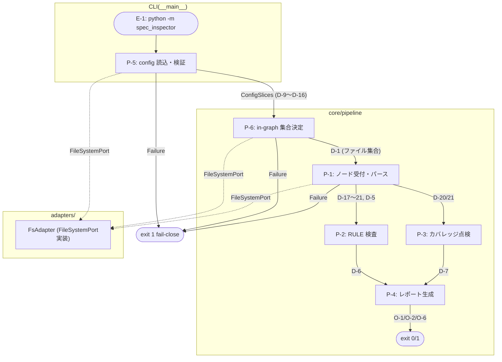
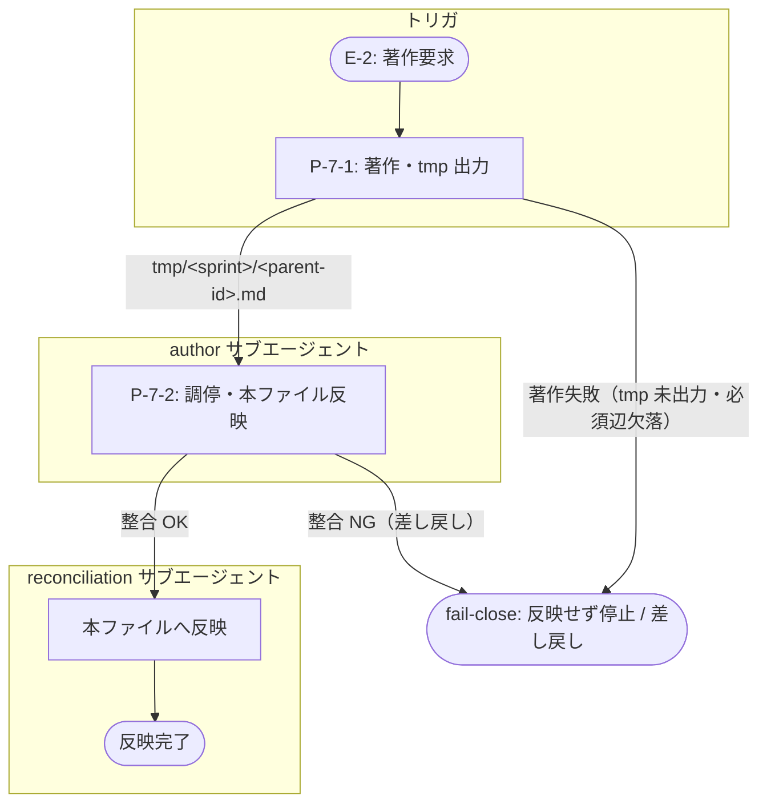

# オーケストレーション（ORC）

> **型**: ORC ／ **必須上流**: E（trigger ✅）
> spec-inspector 検査パイプラインの実行制御設計（doc-system 設計層）。
> スイムレーン flowchart で端から端の実行フローを示す。

## ORC-1: 検査パイプライン実行

<details><summary>⬡ ORC-1 · v0.4.0</summary>

```yaml
id: ORC-1
type: ORC
labels: []
scheduled: ""
edges:
  - to: E-1
    ref_version: "0.5"
  - to: DD-15
    ref_version: "0.1"
  - to: FND-97
    ref_version: "0.1"
```
</details>

> **改訂理由（MINOR バンプ v0.1→v0.2）**: must_link_to ルールを ORC→P から ORC→E に変更（ORC の本質は起動イベントへの参照）。`→ E-1`（ref_version "0.5"）辺を追加。P ノードへの辺は実行する段の列挙として維持。
> **改訂理由（MINOR バンプ v0.2→v0.3）**: DD-15（ORC→E 決定）を反映。`→DD-15`（ref_version "0.1"）バックリファレンス辺を追加。
> **改訂理由（MINOR バンプ v0.3→v0.4）**: FND-97（DD-15 決定「P への参照は本文で表現する」との矛盾）を解消。`→P-5/P-6/P-1/P-2/P-3/P-4` の 6 辺を frontmatter から削除。実行段は本文「フロー」節で列挙済みのため追跡性は損なわれない。`→FND-97` バックリファレンス追加。

**段の目的**: E-1（CLI 実行 `python -m spec_inspector`）をトリガに P-5→P-6→P-1→P-2→P-3→P-4 を直列実行し、O-1（RULE 違反レポート）/ O-2（カバレッジ点検結果）/ O-6（終了コード 0/1）を生成する

**フロー**:
1. P-5（config 読込・検証）→ ConfigSlices（D-9〜D-14/D-16）を生成
2. P-6（in-graph 集合決定）→ D-1（in-graph ファイル集合）を確定
3. P-1（ノード受付・パース）→ 検査ビュー D-17〜D-21・D-5 を生成
4. P-2（RULE 検査 + 抑制フィルタ）→ D-6（発火確定した違反集合）を確定
5. P-3（カバレッジ点検）→ D-7（カバレッジ点検結果）を確定
6. P-4（レポート生成・終了コード決定）→ O-1/O-2/O-6 を出力

**実行順序の不変条件**:
1. P-5（config 読込）が成功してから P-6/P-1 を実行（D-9〜D-16 が確定していないと後段はスライスを使えない）
2. P-6（集合決定）が成功してから P-1 を実行（D-1 が確定していないとファイルパスが定まらない）
3. P-1（パース）が成功してから P-2/P-3 を実行（検査ビュー D-17〜D-21 が必要）
4. P-2/P-3 が完了してから P-4 を実行（D-6/D-7 が必要）

**失敗経路（fail-close）**: 各段は StageOutcome[T]（成功/失敗の Result 型）を返す。Failure の場合は下流の段を一切走らせず、exit code 1 で終了する。違反検出（O-1 が空でない）と段の失敗（パース不能・config 構文エラー等）は区別し、いずれも exit code 1、整合かつ違反なしのみ exit code 0。

## 実行フロー（スイムレーン付き）



## ORC-2: 著作・反映パイプライン実行

<details><summary>⬡ ORC-2 · v0.1.0</summary>

```yaml
id: ORC-2
type: ORC
labels: []
scheduled: ""
edges:
  - to: E-2
    ref_version: "0.3"
  - to: DD-15
    ref_version: "0.1"
  - to: P-7-1
    ref_version: "0.2"
  - to: P-7-2
    ref_version: "0.2"
```
</details>

> **改訂理由（新規 v0.1）**: must_be_linked_from に `E ← ORC`（design・warning・DD-15）が追加され、E-2（著作要求イベント）を参照する ORC が必要になったため新規著作。`→E-2`（ref_version "0.3"・trigger）を必須上流とし、`→DD-15`（ref_version "0.1"）を判断ログへのバックリファレンス、`→P-7-1`/`→P-7-2`（ref_version "0.2"）を実行する段の列挙として持つ。

**段の目的**: E-2（著作要求：サブエージェントへのノード著作委譲）をトリガに P-7-1（著作・tmp 出力）→ P-7-2（調停・本ファイル反映）を直列実行し、`tmp/<sprint>/<parent-id>.md` 経由で本ファイルへ整合済みノードを反映する

**フロー**:
1. P-7-1（著作・tmp 出力）→ 対象 author エージェントが `tmp/<sprint>/<parent-id>.md` に子ノード群を生成
2. P-7-2（調停・本ファイル反映）→ reconciliation が tmp の出力を検証し、整合が取れたもののみ本ファイルへ反映

**実行順序の不変条件**:
1. P-7-1（著作）が成功してから P-7-2（調停）を実行（tmp 出力が存在しないと reconciliation は検証対象を持たない）
2. P-7-2（反映）は P-7-1 の出力が整合検査をパスした場合のみ本ファイルへ書き込む（不整合は反映せず差し戻し）

**失敗経路（fail-close）**: 各段は成功/失敗の Result 型を返す。P-7-1 が著作に失敗（tmp 未出力・必須辺欠落等）した場合は P-7-2 を走らせず停止する。P-7-2 の整合検査で違反（id 重複・辺の到達不能・ref_version ドリフト等）が出た場合は本ファイルへ反映せず、エラーを author へ差し戻して再試行させる。本ファイルへの部分反映は行わない（all-or-nothing）。

## 実行フロー（スイムレーン付き）


