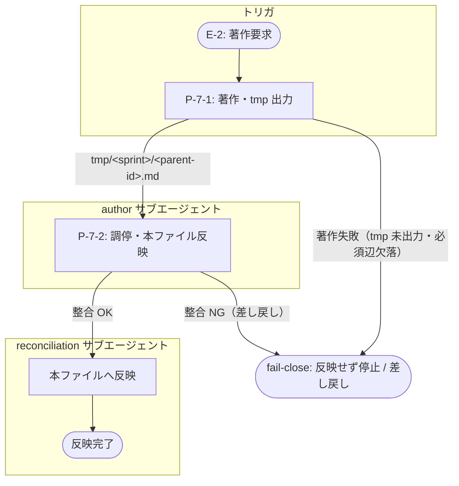

> **改訂理由（新規 v0.1）**: must_be_linked_from に `E ← ORC`（design・warning・DD-15）が追加され、E-2（著作要求イベント）を参照する ORC が必要になったため新規著作。`→E-2`（ref_version "0.3"・trigger）を必須上流とし、`→DD-15`（ref_version "0.1"）を判断ログへのバックリファレンス、`→P-7-1`/`→P-7-2`（ref_version "0.2"）を実行する段の列挙として持つ。

**段の目的**: E-2（著作要求：サブエージェントへのノード著作委譲）をトリガに P-7-1（著作・tmp 出力）→ P-7-2（調停・本ファイル反映）を直列実行し、`tmp/<sprint>/<parent-id>.md` 経由で本ファイルへ整合済みノードを反映する

**フロー**:
1. P-7-1（著作・tmp 出力）→ 対象 author エージェントが `tmp/<sprint>/<parent-id>.md` に子ノード群を生成
2. P-7-2（調停・本ファイル反映）→ reconciliation が tmp の出力を検証し、整合が取れたもののみ本ファイルへ反映

**実行順序の不変条件**:
1. P-7-1（著作）が成功してから P-7-2（調停）を実行（tmp 出力が存在しないと reconciliation は検証対象を持たない）
2. P-7-2（反映）は P-7-1 の出力が整合検査をパスした場合のみ本ファイルへ書き込む（不整合は反映せず差し戻し）

**失敗経路（fail-close）**: 各段は成功/失敗の Result 型を返す。P-7-1 が著作に失敗（tmp 未出力・必須辺欠落等）した場合は P-7-2 を走らせず停止する。P-7-2 の整合検査で違反（id 重複・辺の到達不能・ref_version ドリフト等）が出た場合は本ファイルへ反映せず、エラーを author へ差し戻して再試行させる。本ファイルへの部分反映は行わない（all-or-nothing）。

## 実行フロー（スイムレーン付き）

