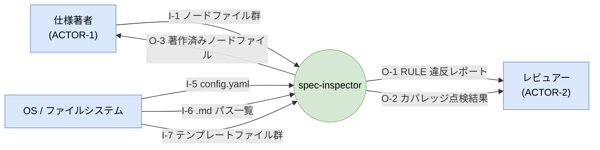
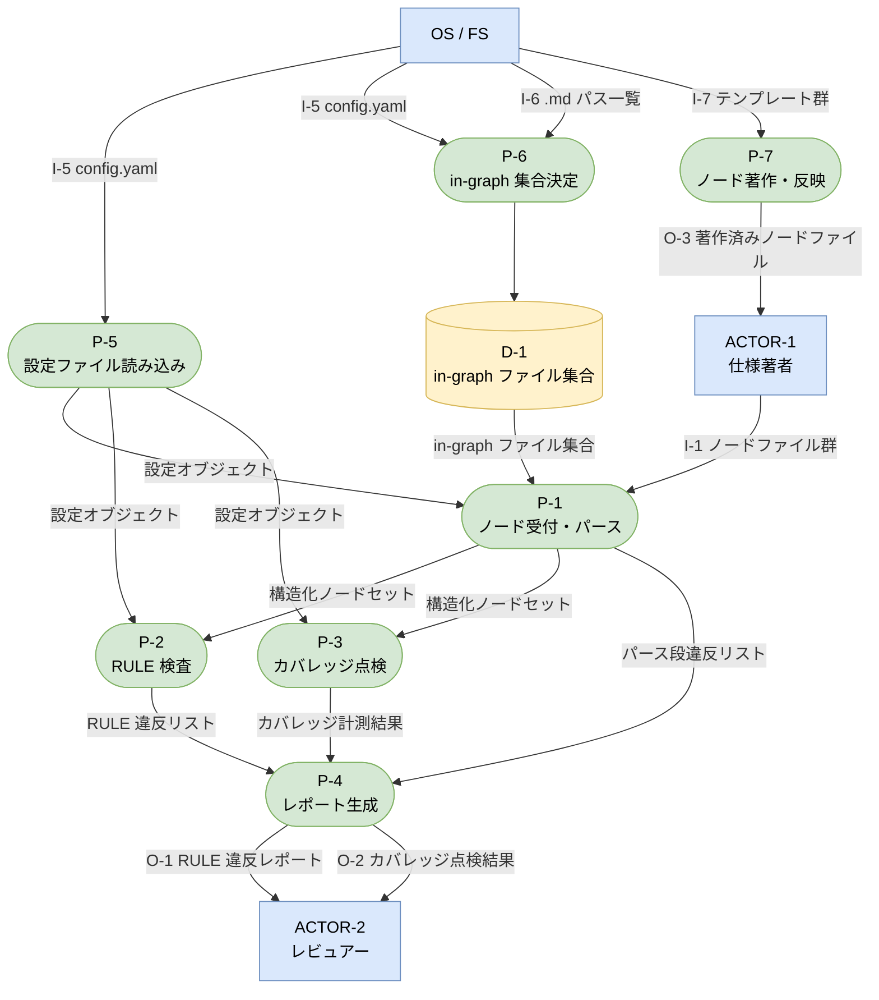
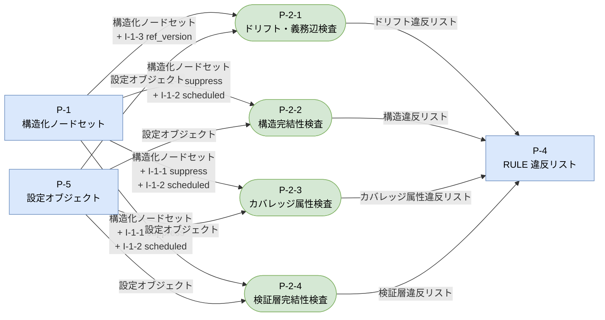
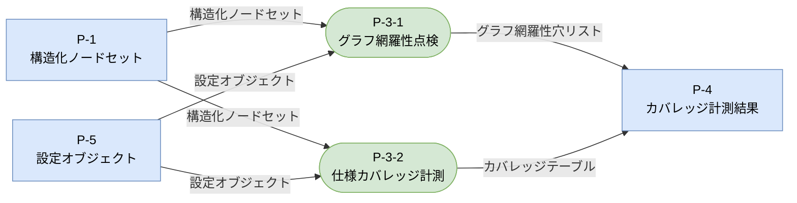
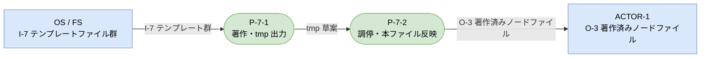

# データフロー図（DFD）

> 分析層ノード（ACTOR / I / O / D / P；`01-actors`・`02-io`・`03-processes`）から導出した DFD。
> **Level 0** コンテキスト図 ＋ **Level 1** プロセス全体図 ＋ **Level 2** 子プロセス分解（P-2 / P-3 / P-7）で構成。
> DFD の主体はプロセスとデータフロー。イベントは DFD ノードではない（PR9 レベリング）。
> 本ファイルは **out-of-graph**（`trace_scope.exclude` 対象・ノードを持たない派生図）。
> 分析層ノードの版が上がったら本図を再生成すること。

---

## Level 0: コンテキスト図

外部エンティティ・系の境界・入出力データフローの全体像。

---

## Level 1: DFD

系内の全プロセスとデータフロー。P-2 / P-3 / P-7 は親プロセス（内部分解は Level 2 で示す）。

> **PR9 レベリング補足**: P-2 / P-3 / P-7 は子プロセスを持つ親プロセス。Level 1 では親プロセスの境界で入出力を示し、子プロセスへの分配は Level 2 で展開する（階層スキップ禁止）。

---

## Level 2: P-2「RULE 検査」の分解

P-2 の境界入力（構造化ノードセット・設定オブジェクト）を 4 子プロセスに分配し、各子が担当する RULE 群を検査して違反リストを返す。

> I-1-1（suppress）・I-1-2（scheduled）・I-1-3（ref_version）は I-1 ノードファイルに埋め込まれたフィールドであり、P-1 のパース段で抽出されて 構造化ノードセットに含まれる。Level 2 ではそれぞれを受け取る子プロセスとのフローとして明示する。

---

## Level 2: P-3「カバレッジ点検」の分解

P-3 の境界入力（構造化ノードセット・設定オブジェクト）を 2 子プロセスに分配し、グラフ網羅性穴とカバレッジテーブルを生成して返す。

---

## Level 2: P-7「ノード著作・反映」の分解

P-7 の境界入力（I-7 テンプレート群）を P-7-1（著作）が受け取り、tmp 草案を P-7-2（調停）へ渡して O-3 を生成する。

---

## データフロー一覧

### 入力（I）・内部データ（D）

| ID | 内容 | 発生源 | L1 消費先 | L2 詳細消費先 |
|---|---|---|---|---|
| I-1 | ノードファイル群（.md + YAML フロントマター） | ACTOR-1 | P-1 | — |
| I-1-1 | suppress 設定（ノード内フィールド） | ACTOR-1 | P-2（経由） | P-2-2 / P-2-3 / P-2-4 |
| I-1-2 | scheduled 設定（ノード内フィールド） | ACTOR-1 | P-2（経由） | P-2-2 / P-2-3 / P-2-4 |
| I-1-3 | ref_version 値（辺内フィールド） | ACTOR-1 | P-2（経由） | P-2-1 |
| I-5 | config.yaml（current_stage・must_link_to・trace_scope 等） | OS/FS | P-5 / P-6 | — |
| I-6 | ディレクトリ走査 .md ファイルパス一覧 | OS/FS | P-6 | — |
| I-7 | 型別著作テンプレートファイル群 | OS/FS（リポジトリ管理） | P-7 | P-7-1 |
| D-1 | in-graph ファイル集合（trace_scope フィルタ適用後） | P-6 | P-1 | — |

### 出力（O）

| ID | 内容 | L1 生成元 | L2 詳細生成元 | 受け手 |
|---|---|---|---|---|
| O-1 | RULE 違反レポート（G# 番号・ノード ID・RULE 番号・メッセージ） | P-4 | — | ACTOR-2 |
| O-2 | カバレッジ点検結果（孤立ノード・未駆動出力・未定義反応一覧） | P-4 | — | ACTOR-2 |
| O-3 | 著作済みノードファイル（doc-system 記法準拠 .md） | P-7 | P-7-2 | ACTOR-1 |

### プロセス概要（P）

| ID | 責務 | 主な入力（L1 視点） | 主な出力（L1 視点） |
|---|---|---|---|
| P-5 | 設定ファイル読み込み | I-5 | 設定オブジェクト → P-1 / P-2 / P-3 |
| P-6 | in-graph 集合決定（trace_scope フィルタ） | I-5, I-6 | D-1 |
| P-1 | ノード受付・パース（RULE-023〜028） | I-1, D-1, 設定オブジェクト | 構造化ノードセット・パース段違反リスト |
| P-2 | RULE 検査（P-2-1〜P-2-4 に委譲） | 構造化ノードセット, 設定オブジェクト | RULE 違反リスト → P-4 |
| P-3 | カバレッジ点検（P-3-1〜P-3-2 に委譲） | 構造化ノードセット, 設定オブジェクト | カバレッジ計測結果 → P-4 |
| P-4 | レポート生成（深刻度順整列・G# 番号付け・終了コード） | 全違反リスト・カバレッジ計測結果 | O-1, O-2 |
| P-7 | ノード著作・反映（P-7-1〜P-7-2 に委譲） | I-7 | O-3 |
