# データフロー図（DFD）

> 分析層ノード（ACTOR / I / O / D / P；`01-actors`・`02-io`・`03-processes`）から導出した DFD。
> **Level 0** コンテキスト図 ＋ **Level 1** プロセス全体図 ＋ **Level 2/3** 子プロセス分解で構成。
> DFD の主体はプロセスとデータフロー。イベントは DFD ノードではない（PR9 レベリング）。
> 本ファイルは派生図（ノードを持たない・out-of-graph・trace_scope.exclude・FND-27）。分析層ノードの版が上がったら本図を再生成すること。
>
> **再生成日: 2026-06-16**（DD-12 分析層全面見直しを反映・本ファイルのみ書き換え）。
>
> **本版で反映した主要構造（DD-12）**:
> - **D ノード範囲＝D-1・D-3〜D-22**（D-2 退役・欠番）。D-3（設定オブジェクト）と D-4（構造化ノードセット）は**プロセス間フローには現れない内部中間生成物**（D-3 は P-5 内部・D-4 は P-1 内部）。外部配布はフィールド/消費スライス単位の D-9〜D-22 が担う（スタンプ結合解消）。
> - **P-5 スライス配布**：config.yaml（I-5）は P-5 のみが読み、フィールド単位スライス D-9〜D-14・D-16 を各プロセスへ配布する（旧「D-3 丸配布」は廃止）。P-6 は走査スコープ設定 **D-16** のみ消費。
> - **P-1 消費スライス配布**：P-1 は D-1（in-graph）・D-9 を消費し、内部で D-4 を生成→消費スライス D-17〜D-21（post-mvp: D-22）を配布する。
> - **P-2-5（抑制・発火フィルタ）に発火制御を一元化**（DD-12(b)）。各検査子 P-2-1〜P-2-4 は「論理違反候補」のみを出力し、suppress/scheduled/activate_stage/always_error の適用は P-2-5 が D-9/D-12/D-14/D-18 を使って一括で行い D-6 を確定する。
> - **I-1-1 / I-1-2 / I-1-3 は退役**（PR1/PR9 違反・系外入力ではなく I-1 内の埋め込みフィールドで P-1 がパースして構造化）。L0/L1/L2 のフロー・ラベルから除去し、D-18（suppress/scheduled）・D-19（ref_version）の属性へ吸収（DD-12(c)）。退役 ID は再利用しない（DD-7）。

---

## Level 0: コンテキスト図

外部エンティティ・系の境界・入出力データフローの全体像。I-1-1/1-2/1-3 は L0 に現れない（系外入力ではない）。

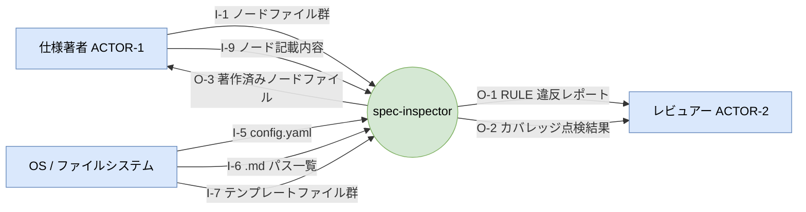

> **post-mvp 注記**: O-4（依存グラフ出力ファイル）・O-5（参照関係複雑度メトリクスレポート）は labels:[post-mvp]・scheduled:sprint-2 のため L0 では省略（`--export-graph`／`--complexity` 指定時のみ ACTOR-2 へ出力）。

---

## Level 1: DFD

系内の全プロセスとデータフロー。P-1〜P-7 は親プロセス（内部分解は Level 2/3）。
プロセス間の中間データは D ノードとして明示する。**config.yaml（I-5）は P-5 のみが読み、フィールド単位スライス D-9〜D-14・D-16 として各プロセスへ配布する**（旧 D-3 丸配布は廃止・FND-21）。**構造化ノードセット（D-4）は P-1 内部生成物で、消費スライス D-17〜D-21 として配布する**。

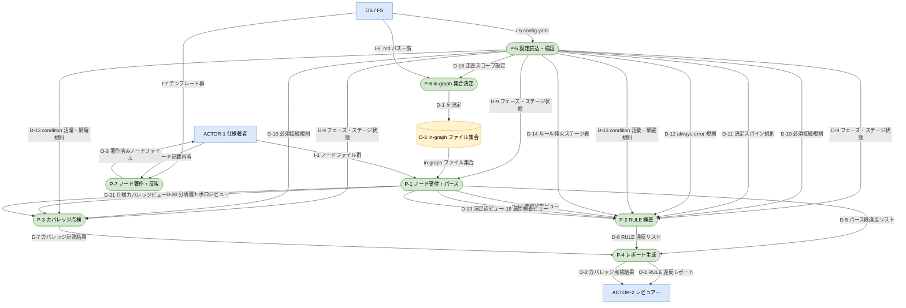

> **PR9 レベリング補足**: P-1〜P-7 は子プロセスを持つ親プロセス。Level 1 では親プロセスの境界で入出力を示し、子プロセスへの分配は Level 2/3 で展開する（階層スキップ禁止）。外部（ACTOR/FS）・データストア（D-1）は L1 境界のみに接続し、リーフへは親 P 経由とする。
>
> **post-mvp 注記**: P-8（依存グラフ出力処理・→O-4）・P-9（参照関係複雑度計算処理・→O-5）は labels:[post-mvp]・scheduled:sprint-2 のため L1 では省略。両者は D-22（グラフトポロジビュー・P-1 が射影）を消費し、P-9 はさらに D-15（ハブ閾値設定・P-5 が配布）を消費する。

---

## Level 2: P-5「設定読込・検証」の分解

config 読込は STS（Source 読込 → Transform 検証 → Sink 分割配布）。さらに分割配布は config セクション群という**データ構造に支配される**ためワーニエ法（繰返し：各セクションを検証して対応 D を組む）。

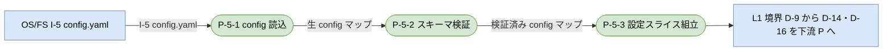

> 検証済み config マップは D-3（設定オブジェクト）に相当する P-5 内部中間生成物。外部配布は P-5-3 が射影するフィールド単位スライス D-9（フェーズ・ステージ状態）・D-10（必須接続規則）・D-11（決定スパイン規則）・D-12（always-error 規則）・D-13（condition 語彙・網羅規則）・D-14（ルール発火ステージ表）・D-16（走査スコープ設定）が担う。post-mvp: D-15（ハブ閾値設定）。

---

## Level 2: P-6「in-graph 集合決定」の分解（include/exclude の選択＝ワーニエ法）

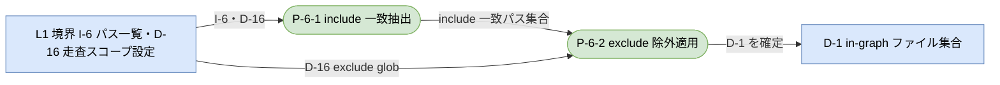

---

## Level 2: P-1「ノード受付・パース」の分解

ファイル集合 → 各ファイル → 各ノードという**データ構造（繰返し）に支配される**入口はワーニエ法、ノード 1 件内のパース工程連鎖は STS（Source 走査 → Transform パース → 検証 → Sink 集合組立 → 射影）。

```mermaid
flowchart LR
  classDef l1ext fill:#dae8fc,stroke:#6c8ebf,color:#000
  classDef proc  fill:#d5e8d4,stroke:#82b366,color:#000

  LD1["D-1 in-graph ファイル集合"]:::l1ext
  LD9["D-9 フェーズ・ステージ状態"]:::l1ext
  LOUT["L1 境界 D-17 から D-21・D-5"]:::l1ext

  P11(["P-1-1 ファイル読込"]):::proc
  P12(["P-1-2 マーカー走査"]):::proc
  P13(["P-1-3 YAML パース"]):::proc
  P14(["P-1-4 スキーマ検証"]):::proc
  P15(["P-1-5 構造化集合組立"]):::proc
  P16(["P-1-6 検査ビュー射影"]):::proc

  LD1  -->|"I-1 各ファイル"| P11
  P11  -->|"ファイル本文"| P12
  P12  -->|"マーカー＋直後ブロック位置"| P13
  P13  -->|"パース済みノード辞書"| P14
  LD9  -->|"scheduled 値ドメイン照合用"| P14
  P14  -->|"検証済みノード＋パース違反候補"| P15
  P15  -->|"D-5 パース段違反リスト"| LOUT
  P15  -->|"構造化ノードセット D-4 内部表現"| P16
  P16  --> LOUT
```

> P-1-6（検査ビュー射影）が D-4 を消費スライス D-17（接続検査ビュー）・D-18（属性検査ビュー）・D-19（決定辺ビュー）・D-20（分析層トポロジビュー）・D-21（仕様カバレッジビュー）へ射影する（post-mvp: D-22）。これによりスタンプ結合を P-1 の出口で解消する。D-4（構造化ノードセット）は P-1 内部の中間生成物として残し、消費先には射影後スライスのみ配る。**退役した I-1-1/1-2/1-3（suppress/scheduled/ref_version）は I-1 内の埋め込みフィールドであり、P-1-3（パース）→P-1-5（集約）で D-4 内部表現の属性となり、P-1-6 が D-18（suppress/scheduled）・D-19（ref_version）スライスへ射影する**（独立フローとして描かない）。

---

## Level 2: P-2「RULE 検査」の分解（子は L3 でさらに分割・発火制御は P-2-5 に一元化）

L1 境界のスライス D を親 P-2 で受け、4 検査子へ分配（階層スキップ解消）。各検査子は「論理違反候補」のみを出力し、新設 P-2-5（抑制・発火フィルタ）が抑制・発火規則を適用して D-6 を確定する。

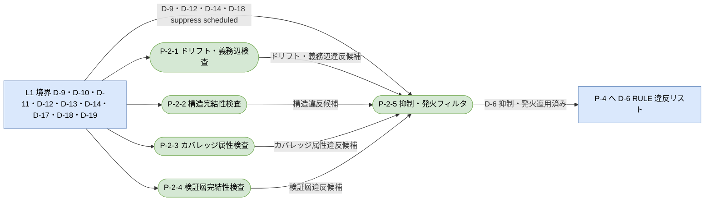

> **新設 P-2-5（抑制・発火フィルタ）**：suppress / scheduled / activate_stage / always_error による抑制・発火制御は旧設計で 4 検査子に重複して埋め込まれていた横断関心事。これを 1 プロセスに集約し（DD-12(b)）、各検査子は「論理違反候補」を出力、P-2-5 が抑制・発火規則（D-12 always-error・D-14 発火ステージ・D-9 フェーズ／ステージ・D-18 内の suppress/scheduled）で濾して D-6 を確定する。これで各検査子が「検出」単一責務になり、抑制ロジックの重複が消える。**旧 L2 図の「+ I-1-1 suppress」「+ I-1-2 scheduled」等のラベルは退役し、D-18 の属性として P-2-5 が一括消費する形に置換した。**

### Level 3: P-2-1「ドリフト・義務辺検査」（RULE 別の選択＝ワーニエ法）

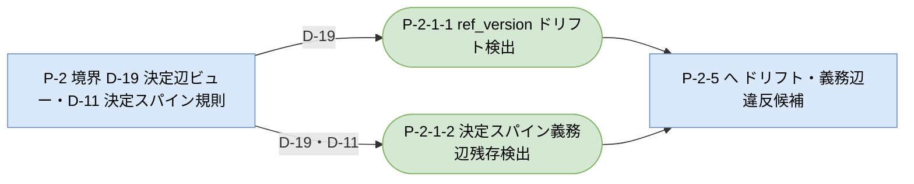

### Level 3: P-2-2「構造完結性検査」（RULE 別の選択＝ワーニエ法）

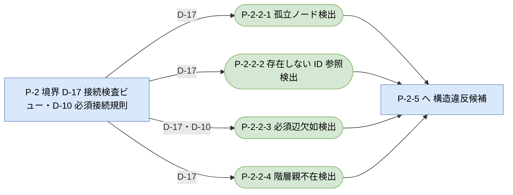

### Level 3: P-2-3「カバレッジ属性検査」（RULE 別の選択＝ワーニエ法）

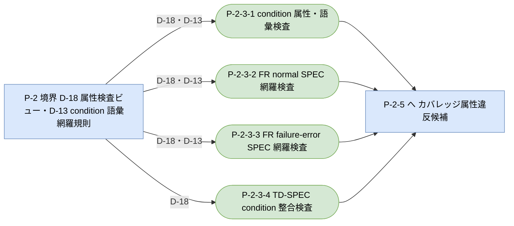

### Level 3: P-2-4「検証層完結性検査」（RULE 別の選択＝ワーニエ法）

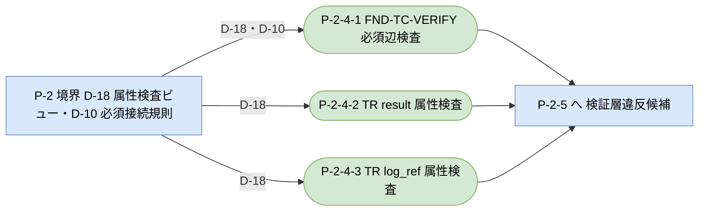

---

## Level 2: P-3「カバレッジ点検」の分解

L1 境界のスライス D を親 P-3 で受け、2 子へ分配。各子は L3 でさらに分割する。

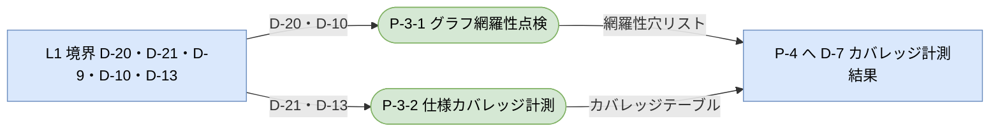

### Level 3: P-3-1「グラフ網羅性点検」（分析層ノード種別＝選択でワーニエ法）

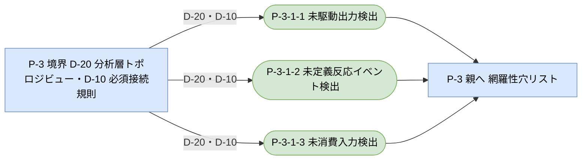

### Level 3: P-3-2「仕様カバレッジ計測」（FR ごとの集計＝繰返しでワーニエ法、各 FR 内は STS 整形連鎖）

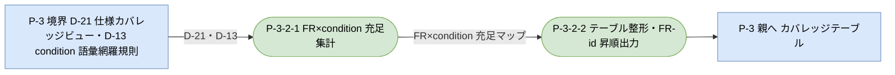

---

## Level 2: P-4「レポート生成」の分解（違反種の合流＝順次でワーニエ法、整形連鎖は STS）

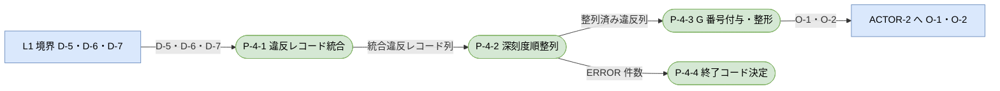

> P-4-4（終了コード決定）は ERROR≥1 で 1、なければ 0（SPEC-25-2/25-3）。カバレッジテーブルの終了コード 0（SPEC-14-1-4）もここで合流。

---

## Level 2: P-7「ノード著作・反映」の分解（P-7-1 をさらに割る）

P-7-1（著作）は STS（テンプレ取得 → 記載内容充填 → tmp 書出）。**テンプレート（I-7）だけでは中身が定まらず、記載内容（I-9）が揃って初めて草案を生成できる**（SPEC-54・FND-23）。P-7-2（調停）は草案を検証し本ファイルへ転記して O-3 を生成する。

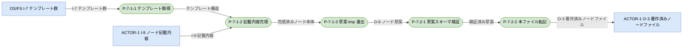

---

## データフロー一覧

### 入力（I）

| ID | 内容 | 発生源 | L1 消費先 | L2/L3 詳細消費先 |
|---|---|---|---|---|
| I-1 | ノードファイル群（.md + YAML フロントマター） | ACTOR-1 | P-1 | P-1-1（読込）→ P-1-3 でパース |
| I-5 | config.yaml | OS/FS | **P-5 のみ**（他 P は D-9〜D-16 経由） | P-5-1 |
| I-6 | ディレクトリ走査 .md ファイルパス一覧 | OS/FS | P-6 | P-6-1 |
| I-7 | 型別著作テンプレートファイル群 | OS/FS（リポジトリ管理） | P-7 | P-7-1-1 |
| I-9 | ノード記載内容（型・親 ID・辺・本文の指定） | ACTOR-1 | P-7 | P-7-1-2 |

> **退役入力（DD-12(c)・→ D 吸収）**: 以下は系外入力ではなく I-1 内の埋め込みフィールドで、P-1 がパースして初めて構造化される（PR1/PR9 違反）。L0/L1/L2 のフロー・ラベルから除去済み。退役 ID は再利用しない（DD-7）。
> - **I-1-1（suppress 設定）** → 退役（→ D-18 属性検査ビューの suppress 属性へ吸収・P-2-5 が消費）。
> - **I-1-2（scheduled 設定）** → 退役（→ D-18 の scheduled 属性へ吸収・P-2-5 が D-9 phases と突合）。
> - **I-1-3（ref_version 値）** → 退役（→ D-19 決定辺ビューの edges.ref_version へ吸収・P-2-1-1/2-1-2 が消費）。

### 内部データ（D）

| ID | 内容 | 生成元 | 消費先 | 表現 |
|---|---|---|---|---|
| D-1 | in-graph ファイル集合（trace_scope フィルタ適用後） | P-6（P-6-2） | P-1（P-1-1） | データストア |
| D-3 | 設定オブジェクト（検証済み config 全 12 セクション） | P-5（P-5-2→5-3 間） | **P-5 内部のみ**（外部配布は D-9〜D-16） | 内部中間生成物（フローに出さない） |
| D-4 | 構造化ノードセット（パース正規化集合・condition/result/log_ref 含む） | P-1（P-1-5） | **P-1 内部のみ**（外部配布は D-17〜D-22） | 内部中間生成物（フローに出さない） |
| D-5 | パース段違反リスト（RULE-023〜029） | P-1（P-1-5） | P-4（P-4-1） | フロー |
| D-6 | RULE 違反リスト（抑制・発火適用済み） | P-2（P-2-5） | P-4（P-4-1） | フロー |
| D-7 | カバレッジ計測結果（網羅性穴＋テーブル） | P-3（P-3-1/3-2） | P-4（P-4-1） | フロー |
| D-8 | ノード草案（tmp） | P-7（P-7-1-3） | P-7（P-7-2-1） | フロー |
| D-9 | フェーズ・ステージ状態（current_phase/current_stage/phases/stages） | P-5（P-5-3） | P-1-4・P-2-5 | フロー（L1 配布: P-1/P-2/P-3） |
| D-10 | 必須接続規則（must_link_to/must_be_linked_from） | P-5（P-5-3） | P-2-2-3・P-2-4-1・P-3-1-1〜3 | フロー（L1 配布: P-2/P-3） |
| D-11 | 決定スパイン規則（decision_spine） | P-5（P-5-3） | P-2-1-2 | フロー（L1 配布: P-2） |
| D-12 | always-error 規則（always_error） | P-5（P-5-3） | P-2-5 | フロー（L1 配布: P-2） |
| D-13 | condition 語彙・網羅規則（condition_vocab/coverage_rules） | P-5（P-5-3） | P-2-3-1〜3・P-3-2-1 | フロー（L1 配布: P-2/P-3） |
| D-14 | ルール発火ステージ表（rule_activation） | P-5（P-5-3） | P-2-5 | フロー（L1 配布: P-2） |
| D-15 | ハブ閾値設定（post-mvp） | P-5（P-5-3） | P-9 | フロー（post-mvp） |
| D-16 | 走査スコープ設定（trace_scope） | P-5（P-5-3） | P-6-1・P-6-2 | フロー（L1 配布: P-6） |
| D-17 | 接続検査ビュー（id/type/edges.to・必須辺素材・階層 ID） | P-1（P-1-6） | P-2-2-1〜4 | フロー（L1 配布: P-2） |
| D-18 | 属性検査ビュー（condition/result/log_ref/suppress/scheduled/辺） | P-1（P-1-6） | P-2-3-1〜4・P-2-4-1〜3・P-2-5 | フロー（L1 配布: P-2） |
| D-19 | 決定辺ビュー（edges.ref_version・参照先バッジ・義務辺） | P-1（P-1-6） | P-2-1-1・P-2-1-2 | フロー（L1 配布: P-2） |
| D-20 | 分析層トポロジビュー（I/O/D/P/E ノードと辺の接続のみ） | P-1（P-1-6） | P-3-1-1〜3 | フロー（L1 配布: P-3） |
| D-21 | 仕様カバレッジビュー（FR/SPEC/TD と condition・refines 辺） | P-1（P-1-6） | P-3-2-1 | フロー（L1 配布: P-3） |
| D-22 | グラフトポロジビュー（全ノード id・edges のみ・post-mvp） | P-1（P-1-6） | P-8・P-9 | フロー（post-mvp） |

> **D-2 は退役 ID**（欠番・FND-8 で「著作済みノードファイル」を O-3 へ再定義）。
> **D-3 / D-4 はプロセス間フローに現れない内部中間生成物**（D-3＝P-5 内部・D-4＝P-1 内部）。外部配布はフィールド/消費スライス単位 D-9〜D-22 が担う（スタンプ結合解消・DD-12）。

### 出力（O）

| ID | 内容 | L1 生成元 | L2 詳細生成元 | 受け手 |
|---|---|---|---|---|
| O-1 | RULE 違反レポート（G# 番号・ノード ID・RULE 番号・メッセージ） | P-4 | P-4-3 | ACTOR-2 |
| O-2 | カバレッジ点検結果（孤立ノード・未駆動出力・未定義反応一覧） | P-4 | P-4-3 | ACTOR-2 |
| O-3 | 著作済みノードファイル（doc-system 記法準拠 .md） | P-7 | P-7-2-2 | ACTOR-1 |
| O-4 | 依存グラフ出力ファイル（dot/JSON・post-mvp） | P-8 | — | ACTOR-2 |
| O-5 | 参照関係複雑度メトリクスレポート（post-mvp） | P-9 | — | ACTOR-2 |

### プロセス概要（P）

| ID | 責務 | 主な入力（L1 視点） | 主な出力（L1 視点） |
|---|---|---|---|
| P-5 | 設定読込・検証（P-5-1〜3 に委譲） | I-5 | D-9〜D-14・D-16（post-mvp: D-15） |
| P-6 | in-graph 集合決定（P-6-1/2 に委譲） | I-6, D-16 | D-1 |
| P-1 | ノード受付・パース（P-1-1〜6 に委譲） | I-1, D-1, D-9 | D-17〜D-21・D-5（post-mvp: D-22）／D-4 は内部生成物 |
| P-2 | RULE 検査（P-2-1〜4 検出＋P-2-5 抑制に委譲） | D-17/18/19・D-9/10/11/12/13/14 | D-6（抑制・発火適用済み） |
| P-3 | カバレッジ点検（P-3-1/3-2 に委譲） | D-20/21・D-9/10/13 | D-7 |
| P-4 | レポート生成（P-4-1〜4 に委譲） | D-5, D-6, D-7 | O-1, O-2 |
| P-7 | ノード著作・反映（P-7-1/7-2 に委譲） | I-7, I-9 | O-3 |
| P-8 | 依存グラフ出力（post-mvp） | D-22 | O-4 |
| P-9 | 参照関係複雑度計算（post-mvp） | D-22, D-15 | O-5 |
