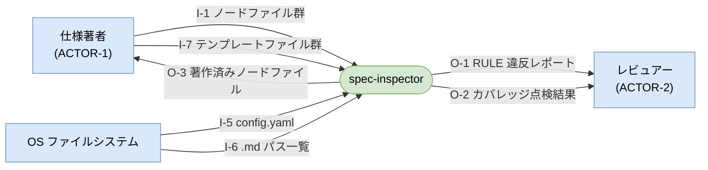
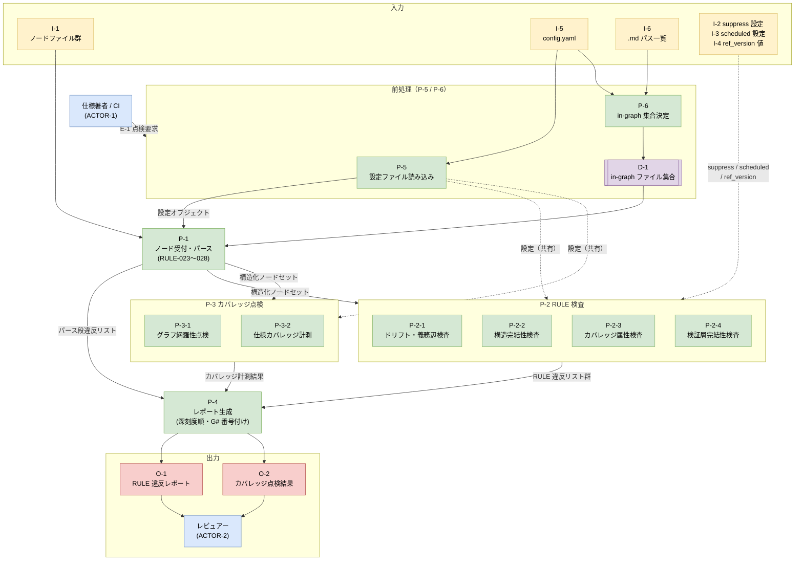
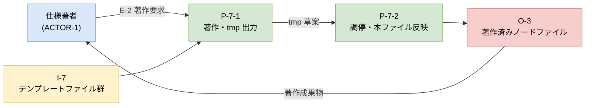

# データフロー図（DFD）

> 分析層ノード（ACTOR / I / O / D / P / E；`01-actors`・`02-io`・`03-processes`・`04-events`）から機械的に導出した DFD。
> E-1（点検フロー）・E-2（著作フロー）の 2 イベントを **Level 0**（コンテキスト）と **Level 1**（プロセス分解）で図示する。
> 本ファイルは **out-of-graph**（`trace_scope.exclude` 対象・ノードを持たない派生図）。
> 分析層ノードの版が上がったら本図を再生成すること。

---

## Level 0: コンテキスト図

外部アクタ・系入出力の全体像。

---

## Level 1: E-1 点検フロー

E-1（点検要求）がトリガする処理チェーン全体。
前処理（P-5/P-6）→ パース（P-1）→ 検査（P-2-x / P-3-x）→ レポート（P-4）の 4 段。

> **注**: I-2（suppress）・I-3（scheduled）・I-4（ref_version）は I-1 ノードファイルのフィールドとして埋め込まれており、
> P-1 のパース後に各 P-2-x が個別に参照する（P-2-1 は I-4、P-2-2/2-3/2-4 は I-2/I-3）。
> 点線矢印は共有参照を示す（データコピーではない）。

---

## Level 1: E-2 著作フロー

E-2（著作要求）がトリガする処理チェーン。
著作（P-7-1）→ 調停（P-7-2）の 2 段。

---

## データフロー一覧

### 入力（I）・内部データ（D）

| ID | 内容 | 発生源 | 消費先 |
|---|---|---|---|
| I-1 | ノードファイル群（.md + YAML フロントマター） | ACTOR-1 | P-1 |
| I-2 | suppress 設定（ノード内フィールド） | ACTOR-1（ノード著作時） | P-2-2 / P-2-3 / P-2-4 |
| I-3 | scheduled 設定（ノード内フィールド） | ACTOR-1（ノード著作時） | P-2-2 / P-2-3 / P-2-4 |
| I-4 | ref_version 値（辺内フィールド） | ACTOR-1（辺定義時） | P-2-1 |
| I-5 | config.yaml（current_stage・must_link_to・trace_scope 等） | OS/FS | P-5 / P-6 |
| I-6 | ディレクトリ走査 .md ファイルパス一覧 | OS/FS | P-6 |
| I-7 | 型別著作テンプレートファイル群 | OS/FS（リポジトリ管理） | P-7-1 |
| D-1 | in-graph ファイル集合（trace_scope フィルタ適用後） | P-6 | P-1 |

### 出力（O）

| ID | 内容 | 生成元 | 受け手 |
|---|---|---|---|
| O-1 | RULE 違反レポート（G# 番号・ノード ID・RULE 番号・メッセージ） | P-4 | ACTOR-2 |
| O-2 | カバレッジ点検結果（孤立ノード・未駆動出力・未定義反応一覧） | P-4 | ACTOR-2 |
| O-3 | 著作済みノードファイル（doc-system 記法準拠 .md） | P-7-2 | ACTOR-1 |

### プロセス概要（P）

| ID | 責務 | 主な入力 | 主な出力 |
|---|---|---|---|
| P-5 | 設定ファイル読み込み | I-5 | 検証済み設定オブジェクト → P-1/P-2/P-3 |
| P-6 | in-graph 集合決定（trace_scope フィルタ） | I-5, I-6 | D-1 |
| P-1 | ノード受付・パース（RULE-023〜028） | I-1, D-1, 設定 | 構造化ノードセット・パース段違反リスト |
| P-2-1 | ドリフト・義務辺検査（RULE-001/002/004/022） | 構造化ノードセット, I-4 | ドリフト違反リスト |
| P-2-2 | 構造完結性検査（RULE-005〜008） | 構造化ノードセット, I-2, I-3 | 構造違反リスト |
| P-2-3 | カバレッジ属性検査（RULE-016〜019） | 構造化ノードセット, I-2, I-3 | カバレッジ属性違反リスト |
| P-2-4 | 検証層完結性検査（RULE-006 verification / 020/021） | 構造化ノードセット, I-2, I-3 | 検証層違反リスト |
| P-3-1 | グラフ網羅性点検（未駆動出力・未定義反応） | 構造化ノードセット | グラフ網羅性穴リスト |
| P-3-2 | 仕様カバレッジ計測（condition 軸集計） | 構造化ノードセット | カバレッジテーブル |
| P-4 | レポート生成（深刻度順整列・G# 番号付け・終了コード） | 全違反リスト・計測結果 | O-1, O-2 |
| P-7-1 | 著作・tmp 出力 | I-7（テンプレート） | tmp 草案 |
| P-7-2 | 調停・本ファイル反映 | tmp 草案 | O-3 |
