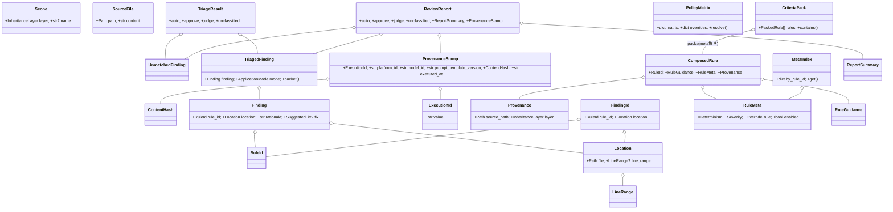
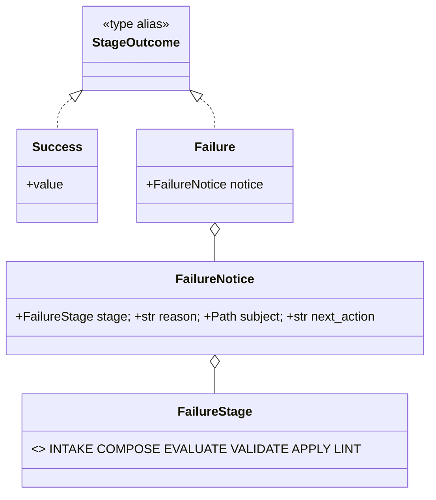
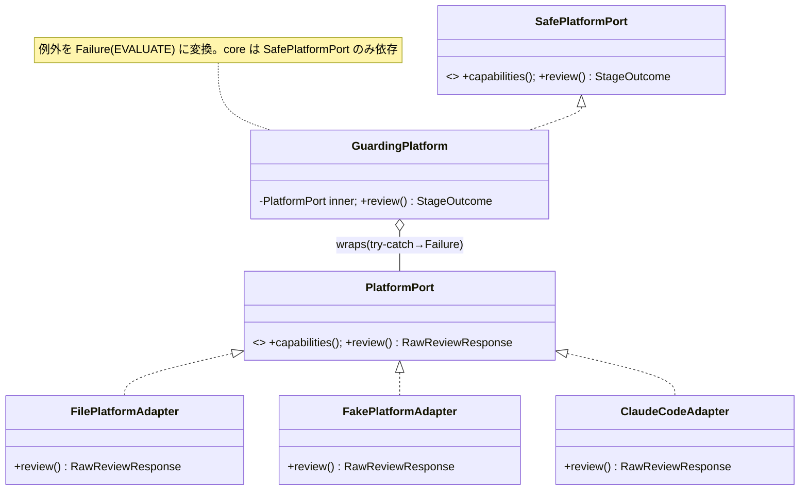

# 設計 01 — クラス設計（データディクショナリ→型安全ドメインモデル）

> [00 データディクショナリ](00-data-dictionary.md) を唯一の入力として、システム内部の**ドメイン型（Python dataclass 中心）**へ写像する。
> 言語/依存方針は [Q5/Q5a](../dashboard.md)：**Python・原則標準ライブラリのみ**（`dataclasses` / `enum` / `typing`）。外部依存を足さない。

## 設計方針（この章の憲法）

1. **命名が命（自己説明的命名・必須）**。型名・フィールド名はドメイン語で、略語禁止（`RuleId`✓ `RID`✗）。`§7 命名規約`を全型に適用。
2. **基本型の濫用を避ける**（primitive obsession を排す）。意味のある値は生 `str`/`int` でなく**値オブジェクト**にする（`RuleId`/`ContentHash`/`FindingId`）。取り違えを**型で**防ぐ。ただし**パスは stdlib `pathlib.Path` を使う**（自前ラッパは作らない・[DD13](decisions.md#dd13--自前-filepath-クラスの要否オーナー指摘)）。
3. **タプルでレコードを表さない**。`(file, line)` のような位置情報は**名前付きの値オブジェクト**（`Location`）にする。`tuple[X, ...]` は**順序不変の集合**としてのみ使う（レコードの代用にしない）。
4. **可能な限りイミュータブル**。導出物（1実行の産物）は全て `@dataclass(frozen=True, slots=True)`。可変なのは**状態（DS1〜DS5）を写すごく一部**だけ。
5. **タイプセーフ**。閉じた語彙は `Enum`。失敗は例外でなく**`Result` 型（`StageOutcome`）**で表し、fail-close（[S3](../requirements/13-stabilization.md)）を型で強制。
6. **生成方法（コンストラクタ / ファクトリ / ビルダー）は型ごとに必ず比較検討**する（`§6`）。既定はコンストラクタ、派生/検証/段階組立があるときだけ昇格。

> 凡例：以下のコードは**実装方針を確定するための設計**（シグネチャと不変条件が主、本文ロジックは `...`）。

---

## 1. 値オブジェクト（基本型・タプル回避）

意味を持つスカラは frozen dataclass で包み、**生成時に検証**する（壊れた値を作らせない＝[S1/S5](../requirements/13-stabilization.md) と整合）。

```python
from __future__ import annotations
from dataclasses import dataclass, field

@dataclass(frozen=True, slots=True)
class RuleId:
    """観点ルールの一意識別子。指摘の紐付け・継承・ポリシー結合キー。"""
    value: str
    def __post_init__(self) -> None:
        if not self.value:
            raise ValueError("RuleId は空にできない")

# ファイルパスは自前ラッパを作らず stdlib の pathlib.Path を使う（DD13）。
# 理由：Path は RuleId 等と別型なので取り違えは起きず、glob/suffix 等の操作が無料・immutable+hashable。
# 唯一の懸念（LLM 返却パスの厳密一致・参照集合判定）は intake で正規化（repo 相対 POSIX）して解決。
from pathlib import Path
def normalize(p: Path) -> Path:
    """境界の1箇所で repo 相対 POSIX へ正規化。突合（参照除外・location.file）はこの Path で行う。"""
    ...

@dataclass(frozen=True, slots=True)
class ContentHash:
    """hash(対象ルールのメタ + 本文)。矛盾キャッシュ(DS2)・警告レジャー(DS4)の照合キー。"""
    value: str

@dataclass(frozen=True, slots=True)
class LineRange:
    """行範囲。(int, int) のタプルを避けて名前付きにする。"""
    start_line: int
    end_line: int
    def __post_init__(self) -> None:
        if self.start_line < 1 or self.end_line < self.start_line:
            raise ValueError("不正な行範囲")

@dataclass(frozen=True, slots=True)
class Location:
    """指摘の所在。file は必須（P3 不変条件）、line_range は任意。"""
    file: Path                              # DD13：正規化済み pathlib.Path（Path は hashable→FindingId も hashable）
    line_range: LineRange | None = None

@dataclass(frozen=True, slots=True)
class Provenance:
    """ルールの由来。衝突報告・差分通知(O-9/Q10)で継承段を示すのに必須。"""
    source_path: Path                       # DD13
    inheritance_layer: "InheritanceLayer"   # §2 Enum
```

> **NewType ではなく frozen dataclass を採る理由**：`RuleId` 等は**検証**（空チェック・正規化）を持たせたい。
> `typing.NewType` は実行時に素通しで検証を載せられない。ゼロ挙動の純識別子に限れば NewType も可だが、本系は基準ファイル由来＝**壊れ得る入力**なので検証付き値オブジェクトを既定にする。

---

## 2. 列挙（Enum＝閉じた語彙のタイプセーフ化）

[00 §0](00-data-dictionary.md) の9語彙はすべて `Enum`。**生文字列比較を一掃**する。順序のある属性は比較できるように `IntEnum` を使う。

```python
from enum import Enum, IntEnum

class DocumentType(Enum):
    CODE = "code"
    SPEC = "spec"
    MINUTES = "minutes"
    # 拡張は基準ファイルの doc_type に追従（未知値は S3 fail-close）

class Severity(IntEnum):           # 順序あり（error > warning > info）→ 方向ゲートで大小比較
    INFO = 1
    WARNING = 2
    ERROR = 3

class Determinism(Enum):
    DETERMINISTIC = "deterministic"
    TRADEOFF = "tradeoff"
    JUDGMENT = "judgment"

class OverrideRule(Enum):
    LOCKED = "locked"
    TIGHTEN_ONLY = "tighten-only"  # 既定
    OPEN = "open"

class ApplicationMode(Enum):
    AUTO_FIX_LOG_ONLY = "auto_fix_log_only"   # 🤖
    AUTO_FIX_SUGGEST = "auto_fix_suggest"     # ✋
    HUMAN_ONLY = "human_only"                 # 💬

class TriageBucket(Enum):
    AUTO = "auto"                 # 🤖
    APPROVE = "approve"           # ✋
    JUDGE = "judge"               # 💬
    UNCLASSIFIED = "unclassified" # ❓

class ReviewDecision(Enum):
    APPROVE = "approve"
    MODIFY = "modify"
    REJECT = "reject"
    OUT_OF_SCOPE = "out_of_scope"

class InheritanceLayer(Enum):
    ORG = "org"
    TEAM = "team"
    PROJECT = "project"

class FixOrigin(Enum):            # 確定fix の生成元（Q21）
    DETERMINISTIC_TOOL = "tool"
    LLM = "llm"
```

> `Scope` は `org | team:<名> | project:<名>` と**パラメータ付き**なので単純 Enum でなく値オブジェクト（`§3`）にする。
> 安全側デフォルト（[S2](../requirements/13-stabilization.md)）：`ApplicationMode` を決められないときは `HUMAN_ONLY` に倒す（`§5 P4`）。

---

## 3. パラメータ付き値オブジェクト（`Scope`）

```python
@dataclass(frozen=True, slots=True)
class Scope:
    """適用スコープ。org は名前なし、team/project は名前付き。"""
    layer: InheritanceLayer
    name: str | None = None
    def __post_init__(self) -> None:
        if self.layer is InheritanceLayer.ORG and self.name is not None:
            raise ValueError("org スコープは名前を持たない")
        if self.layer is not InheritanceLayer.ORG and not self.name:
            raise ValueError("team/project スコープは名前が必須")

    @classmethod
    def org(cls) -> "Scope":              # MVP 既定（ファクトリ：意図を名前で表す）
        return cls(InheritanceLayer.ORG)
```

---

## 4. ドメインモデル（段ごと・すべて frozen な導出物）

### P1 受付・正規化

```python
@dataclass(frozen=True, slots=True)
class SourceFile:
    path: Path                              # DD13：pathlib.Path（正規化済み）
    content: str
    language: str | None = None

@dataclass(frozen=True, slots=True)
class TypeEstimation:                      # PF 出力（=入力・L3/I-15）
    candidate: DocumentType
    confidence: float

@dataclass(frozen=True, slots=True)
class NormalizedIntake:                    # P1 の出力＝後段すべての前提
    target_files: tuple[SourceFile, ...]   # 対象集合（評価する物）
    reference_files: tuple[SourceFile, ...]# 参照集合（評価しない物）
    document_type: DocumentType            # 調停済み確定型
    scope: Scope
```

> `ResolvedDocumentType` は別クラスを作らず `document_type: DocumentType` に畳む。
> **調停はファクトリで**（手動上書き I-2 ＞ 推定 I-15）：

```python
def resolve_document_type(
    manual_override: DocumentType | None,
    estimation: TypeEstimation | None,
) -> DocumentType:
    """I-2 上書きを最優先、無ければ I-15 推定。両方無ければ S3 fail-close（呼び出し側で Result 化）。"""
    ...
```

### P2 基準合成

```python
@dataclass(frozen=True, slots=True)
class RuleMeta:                            # LLM へ渡さない内部メタ
    determinism: Determinism
    severity: Severity
    override: OverrideRule
    enabled: bool

@dataclass(frozen=True, slots=True)
class RuleGuidance:                        # 人 & LLM 共用本文
    summary: str
    checkpoints: tuple[str, ...]
    good_examples: tuple[str, ...]
    bad_examples: tuple[str, ...]

@dataclass(frozen=True, slots=True)
class ComposedRule:                        # 毎回合成される導出ルール
    rule_id: RuleId
    title: str
    guidance: RuleGuidance
    meta: RuleMeta
    provenance: Provenance

@dataclass(frozen=True, slots=True)
class CriteriaPack:                        # PF へ渡す公開項（メタ抜き）
    rules: tuple["PackedRule", ...]
    def contains(self, rule_id: RuleId) -> bool:   # ⑤ rule_id 検証で使う
        ...

@dataclass(frozen=True, slots=True)
class PackedRule:
    rule_id: RuleId
    title: str
    guidance: RuleGuidance

@dataclass(frozen=True, slots=True)
class MetaIndex:                           # id → メタ（機械が使う）
    by_rule_id: dict[RuleId, RuleMeta]     # 注：dict は frozen 外。構築後は読み取り専用運用

@dataclass(frozen=True, slots=True)
class WarningCandidate:
    kind: "WarningKind"                    # 緩め拒否 | 矛盾 | 衝突（Enum・略）
    rule_id: RuleId
    content_hash: ContentHash
    provenance: Provenance
```

### P3 評価

```python
@dataclass(frozen=True, slots=True)
class SuggestedFix:
    description: str
    diff: str

@dataclass(frozen=True, slots=True)
class Finding:                             # PF 生成（=入力）→ 検証後に O-2
    rule_id: RuleId
    location: Location                     # file 必須は Location が保証
    rationale: str
    quote: str | None = None
    suggested_fix: SuggestedFix | None = None

@dataclass(frozen=True, slots=True)
class UnmatchedFinding:                    # O-7 ❓未分類
    description: str
    location: Location
    origin: "UnmatchedOrigin"             # id外れ | 自己申告（Enum）
    suggested_fix: SuggestedFix | None = None
```

### P4 検証・仕分け

```python
@dataclass(frozen=True, slots=True)
class TriagedFinding:
    finding: Finding
    mode: ApplicationMode
    @property
    def bucket(self) -> TriageBucket:      # mode から決定的に導出（状態を持たない）
        return _MODE_TO_BUCKET[self.mode]

@dataclass(frozen=True, slots=True)
class TriageResult:                        # 4区分の束
    auto: tuple[TriagedFinding, ...]
    approve: tuple[TriagedFinding, ...]
    judge: tuple[TriagedFinding, ...]
    unclassified: tuple[UnmatchedFinding, ...]
```

### P5 適用・レポート

```python
@dataclass(frozen=True, slots=True)
class FindingId:                           # revert/コミット粒度（Q3）
    rule_id: RuleId
    location: Location
    @classmethod
    def of(cls, finding: Finding) -> "FindingId":   # 派生ファクトリ
        return cls(finding.rule_id, finding.location)

@dataclass(frozen=True, slots=True)
class ExecutionId:                         # 1レビュー実行の識別子（DD6・design/05・08）
    """版スタンプ(S6)と同素材で再現性に直結。RevertTarget の実行単位キー。"""
    value: str
    @classmethod
    def of(cls, executed_at: str, criteria_hash: ContentHash) -> "ExecutionId":
        return cls(f"{executed_at}-{criteria_hash.value[:12]}")

@dataclass(frozen=True, slots=True)
class ResolvedFix:
    finding_id: FindingId
    origin: FixOrigin
    diff: str

@dataclass(frozen=True, slots=True)
class ProvenanceStamp:                     # S6 版スタンプ
    execution_id: ExecutionId              # DD6（design/08）。ログ/コミット/版を串刺し
    platform_id: str
    model_id: str
    prompt_template_version: str           # 主＝"review:3.1"（DD7・registry.REVIEW_VERSION 単一ソース）
    criteria_content_hash: ContentHash
    executed_at: str                       # ISO8601（microseconds・review_id 衝突回避）

@dataclass(frozen=True, slots=True)
class ReviewReport:                        # O-1（コンテナ）。HTML へレンダ（DD10）。実装＝DD15
    auto: tuple[TriagedFinding, ...]       # 🤖（P1 は未適用／P2 で apply→applied 化）
    approve: tuple[TriagedFinding, ...]    # ✋ 要承認
    judge: tuple[TriagedFinding, ...]      # 💬 要判断
    unclassified: tuple[UnmatchedFinding, ...]  # ❓ 未分類
    summary: "ReportSummary"
    stamp: ProvenanceStamp                 # stamp.execution_id ＝ review_id（HTML に埋込・DS3 フォルダと同 id・DD10/DD14）
    # 注（DD15）：P1 は上記4区分を持つ。P2(apply) で `applied: tuple[ResolvedFix, ...]` を追加する。

@dataclass(frozen=True, slots=True)
class ReportSummary:                       # 件数サマリ（TriageResult から派生）
    auto_count: int
    approve_count: int
    judge_count: int
    unclassified_count: int

@dataclass(frozen=True, slots=True)
class RevertRequest:
    target: "RevertTarget"                 # FindingId | ExecutionId | All（§6 ファクトリ）
```

### DS3/DS4/DS5（状態を写す型・永続層）

状態は永続ストアに置くが、**読み出した1件のスナップショットは frozen** で扱う（書込はリポジトリ層の責務）。

```python
@dataclass(frozen=True, slots=True)
class AppliedCommit:                       # DS3
    execution_id: ExecutionId              # DD6：実行単位 revert のキー
    finding_key: str                       # rule_id@file:start-end（review.finding_key・突合/HTML/feedback と共通）
    commit_ref: str
    applied_at: str

@dataclass(frozen=True, slots=True)
class WarningLedgerEntry:                  # DS4
    rule_id: RuleId
    content_hash: ContentHash
    first_seen: str

@dataclass(frozen=True, slots=True)
class Feedback:                            # DS5
    finding_id: FindingId
    decision: ReviewDecision
    recorded_at: str
```

---

## 5. 失敗を型で表す（`Result` / `StageOutcome`）— S3 fail-close

各段は**例外を投げず**、成功か `FailureNotice` を**値で**返す。これで [S3](../requirements/13-stabilization.md) の fail-close を呼び出し側に型で強制できる（握りつぶし不能）。

```python
from typing import Generic, TypeVar
T = TypeVar("T")

class FailureStage(Enum):
    INTAKE = "intake"; COMPOSE = "compose"; EVALUATE = "evaluate"
    VALIDATE = "validate"; APPLY = "apply"
    LINT = "lint"          # S5 事前 lint（`criteria lint`・合成内パース）も O-14 形式で返す（DD12）
    # revert の「対象なし」は fail-close でなく要求不正（exit2・O-14 stage 不要）

@dataclass(frozen=True, slots=True)
class FailureNotice:                       # O-14
    stage: FailureStage
    reason: str
    subject: Path | None                   # どのファイル/対象（DD13）
    next_action: str                       # 実行可能な次手

@dataclass(frozen=True, slots=True)
class Success(Generic[T]):
    value: T

@dataclass(frozen=True, slots=True)
class Failure:
    notice: FailureNotice

StageOutcome = Success[T] | Failure        # 各段の戻り値。空文書 no-op は Success(EmptyReport)
```

> `match outcome:` で `Success`/`Failure` を**漏れなく分岐**（Python 3.10+ の構造的パターンマッチ）。
> ⑦自動適用は `Success` を受けた時だけ走る＝上流 `Failure` で**書込ゼロ**（[S4](../requirements/13-stabilization.md)）が型で担保される。

---

## 6. 生成方法の検討（コンストラクタ / ファクトリ / ビルダー）★必須判断

**判断軸**（機構＋既定。ケースごとの最終判断は設計レビューで・[PR2](../methods/method-inventory.md)）：

| 軸 | コンストラクタ（既定） | ファクトリ | ビルダー |
|---|---|---|---|
| 全フィールドが同時に揃う | ○ | △ | ✕（段階的） |
| 生成に**派生/検証/パース**が要る | ✕ | ○ | △ |
| **サブタイプ選択**を隠したい | ✕ | ○（registry） | ✕ |
| 多数の任意要素を**複数ソースから段階的に**組む | ✕ | ✕ | ○ |
| 不変条件が**複数フィールド間**にまたがる | △（`__post_init__`） | ○ | ○ |

**適用（型ごとの決定）**

| 型 | 採用 | 根拠 |
|---|---|---|
| 値オブジェクト全般（`RuleId`/`Location`/`LineRange`…） | **コンストラクタ**＋`__post_init__` 検証 | 全フィールド同時・検証は post_init で足りる |
| `Scope` | コンストラクタ＋`Scope.org()` **名前付きファクトリ** | 既定値（org）の意図を名前で表す |
| `DocumentType` 確定 | **ファクトリ関数** `resolve_document_type()` | I-2/I-15 の**調停＝派生**。両欠で fail-close |
| `FindingId` | **ファクトリ** `FindingId.of(finding)` | finding からの**派生キー**（rule_id＋location） |
| `CriteriaPack` / `MetaIndex` | **ファクトリ（Composer の出力）** | 継承マージ・union・矛盾判定を経た**合成結果**（コンストラクタ直書きさせない） |
| `ReviewPrompt` | **ビルダー** `ReviewPromptBuilder` | P3.1.1→…→3.1.5 で役割制約→観点→対象→参照→スキーマを**順に積む** |
| `ReviewReport` | **MVP は直接構築**（P2 でビルダー） | P1 は pipeline が `TriageResult`＋`stamp` から直接組む（DD15）。P2 で applied を段階集約する `ReviewReportBuilder` へ |
| `RevertRequest.target` | **ファクトリ** `RevertTarget.finding()/execution()/all_()` | 直和（FindingId\|ExecutionId\|All）の**安全な構築** |
| `PlatformAdapter` 具体 | **ファクトリ（registry）** `make_adapter(platform_id)` | `ClaudeCodeAdapter`/`FilePlatformAdapter`/`FakePlatformAdapter` の**選択を隠す**（[11](../requirements/11-platform-adapter.md)） |
| **PF 境界ガード** `GuardingPlatform` | **プロキシ**（DD17） | アダプタを包み `review()→StageOutcome`、例外を `Failure(EVALUATE)` 化。core は `SafePlatformPort` に依存 |
| `Result`（`Success`/`Failure`） | **ファクトリ** `ok()/fail()` | 呼び出し側の意図を短く・型推論を効かせる |

**ビルダーはイミュータブルと両立させる**：ビルダー内部は可変だが `build()` は **frozen な最終オブジェクトを1つ返す**。

```python
# MVP（P1）は pipeline が TriageResult＋stamp から ReviewReport を直接構築（DD15）：
report = ReviewReport(
    auto=result.auto, approve=result.approve, judge=result.judge,
    unclassified=unclassified,
    summary=ReportSummary.of(result, unclassified),     # 件数を派生（ファクトリ）
    stamp=stamp,                                         # S6 版スタンプ（execution_id=review_id）
)
# P2（apply）で `applied: tuple[ResolvedFix, ...]` を加える段になったら、別ソースから段階集約する
# ReviewReportBuilder（可変内部→build() で frozen を1つ返す）へ昇格する。
```

```python
class ReviewPromptBuilder:
    """P3.1：役割制約→観点直列化→対象→参照→出力スキーマ を順に積む（順次構造＝ビルダー向き）。"""
    def with_role_constraints(self) -> "ReviewPromptBuilder": ...
    def with_criteria(self, pack: CriteriaPack) -> "ReviewPromptBuilder": ...
    def with_targets(self, files: tuple[SourceFile, ...]) -> "ReviewPromptBuilder": ...
    def with_references(self, files: tuple[SourceFile, ...]) -> "ReviewPromptBuilder": ...
    def with_output_schema(self) -> "ReviewPromptBuilder": ...
    def build(self) -> "ReviewPrompt": ...
```

---

## 7. 命名規約（自己説明的命名・全型に適用）

| 対象 | 規約 | 例（○ / ✗） |
|---|---|---|
| 型名 | PascalCase・ドメイン語の名詞句・**略語禁止** | `ComposedRule` / ✗`CmpRule` `Data` `Info` |
| 識別子の値オブジェクト | **役割で命名**（包んだ基本型でなく） | `RuleId` `ContentHash` / ✗`Str1` `Key` |
| 真偽フィールド | `is_` / `has_` で意図を出す | `is_enabled` `has_reference` / ✗`flag` |
| 列挙メンバ | 意味が読める語（コード値は `.value`） | `ApplicationMode.HUMAN_ONLY` / ✗`MODE_3` |
| コレクション | 複数形・中身が分かる | `target_files` `unclassified` / ✗`list1` `items` |
| ファクトリ | `from_*` / `of` / `resolve_*` / `make_*` / `for_*` | `FindingId.of` `make_adapter` |
| ビルダーのステップ | `with_*` / `add_*`（動詞句） | `with_criteria` `add_applied` |
| 述語/問い合わせ | 動詞句・副作用なし | `pack.contains(rule_id)` |
| 禁止 | `manager` `helper` `util` `data` `info` `tmp` 等の**無情報語** | — |

> **原則**：名前だけ読んで「何の値か・何をするか」が分かること。型で意味を運ぶ（`Location` を渡す関数は座標の取り違えが起き得ない）。

---

## 8. イミュータブル/タイプセーフの徹底ルール

- 全ドメイン型は `@dataclass(frozen=True, slots=True)`（`slots` でメモリ/属性誤りも防ぐ）。
- **コレクションは `tuple[X, ...]`**（不変列）。`list`/`dict` は**ビルダー内部か永続リポジトリ層に隔離**（`MetaIndex.by_rule_id` の dict は構築後 read-only 運用、将来 `MappingProxyType` で封）。
- **タプルでレコードを作らない**：`(rule_id, location)` ではなく `FindingId`。位置は `Location`/`LineRange`。
- **生 `str`/`int` を公開 API の引数にしない**：`def triage(finding: Finding, meta: RuleMeta)`（✗ `def triage(rule_id: str, sev: int)`）。
- **直和は Enum か `X | Y | Z`**：`StageOutcome = Success[T] | Failure`、`RevertTarget = FindingId | ExecutionId | All`。`match` で網羅。
- 安全側デフォルト（[S2](../requirements/13-stabilization.md)）：`determinism` 未宣言/不明 → `ApplicationMode.HUMAN_ONLY`（🤖 を作らない）。

---

## 9. データ辞書 → クラス 対応（トレーサビリティ）

| [00 データ辞書](00-data-dictionary.md) | クラス/型 | 生成方法（§6） |
|---|---|---|
| §0 閉じた語彙 ×9 | `DocumentType`/`Severity`/`Determinism`/`OverrideRule`/`ApplicationMode`/`TriageBucket`/`ReviewDecision`/`InheritanceLayer`/`FixOrigin` | — |
| `Scope` | `Scope`（値オブジェクト） | コンストラクタ＋`org()` |
| `Location`/`LineRange`/`FindingId`/`Provenance`/`ContentHash`/`RuleId`（パスは `pathlib.Path`） | 同名 値オブジェクト | コンストラクタ（`FindingId` はファクトリ） |
| `正規化入力` | `NormalizedIntake` | コンストラクタ |
| `合成ルール`/`メタ`/`観点パック`/`メタ表` | `ComposedRule`/`RuleMeta`/`CriteriaPack`/`MetaIndex` | ファクトリ（Composer） |
| `指摘`/`未分類指摘`/`修正案` | `Finding`/`UnmatchedFinding`/`SuggestedFix` | コンストラクタ |
| `仕分け済`/`仕分け結果` | `TriagedFinding`/`TriageResult` | コンストラクタ |
| `確定fix`/`評価レポート`/`revert要求` | `ResolvedFix`/`ReviewReport`/`RevertRequest` | レポートはビルダー |
| `プロンプト` | `ReviewPrompt` | ビルダー |
| 異常系 `O-14`/`StageOutcome`/`lint結果` | `FailureNotice`/`Success\|Failure`/`CriteriaLintResult` | ファクトリ `ok()/fail()` |
| `版スタンプ` | `ProvenanceStamp` | コンストラクタ |
| DS3/DS4/DS5 | `AppliedCommit`/`WarningLedgerEntry`/`Feedback` | コンストラクタ（永続層が書込） |
| ポート契約 | `ReviewRequest`/`RawReviewResponse`/`PlatformCapabilities`/`PlatformPort`（翻訳・raw）／`SafePlatformPort`（例外を投げない・core 依存先）／`GuardingPlatform`（プロキシ・DD17） | アダプタは registry ファクトリ、ガードは合成ルートで結線 |

> **不変条件の所在**：「`location.file` 必須」は `Location` 型が、「fail-close で書込ゼロ」は `StageOutcome` 型が、
> 「revert 粒度＝finding」は `FindingId` 型が**それぞれ構造で保証**する。ロジックでなく**型に語らせる**のが本設計の狙い。

---

## 10. 等価性とハッシュ（`__eq__` / `__hash__`）— 一致判定の規約

> id 照合・dedup・dict キー・set が随所に出る（`pack.contains(rule_id)`・`MetaIndex.by_rule_id[id]`・警告レジャーの `rule_id×content_hash`・DS2/DS3 の finding 単位）。その**等価とハッシュの規約**を明文化する。

### ひとことで（前提知識ゼロ向け）
- `__eq__`＝**`==` の意味**、`__hash__`＝**dict のキーや set に入れるための数値**。「演算子オーバーロード」とは、自分の型で `==` がどう振る舞うかを自分で決めること。
- **素の Python オブジェクトの `==` は「同じ実体か（メモリ上同一か）」**。だから `RuleId("naming")` を2回作ると別物扱いで `==` が False になり、id 照合や dict キーに使えない。これは困る。
- **`@dataclass(frozen=True)` を付けると Python が自動で `==` と hash を「中身（フィールド）が同じなら等しい」に書き換えてくれる**（Java の `equals()`/`hashCode()` を自動生成するイメージ）。なので `RuleId("naming") == RuleId("naming")` は True、dict キー/set にもそのまま使える。
- **結論：自分で手書きする必要はない**（frozen dataclass が正しくやってくれる）。下はその前提での規約。

### 方針：frozen dataclass の自動生成に乗る（手書きオーバーロードは原則しない）
- `@dataclass(frozen=True)` は **(a) フィールド単位の値等価 `__eq__` と (b) `__hash__`（frozen かつ `eq=True` ⇒ フィールドのタプルから導出）を自動生成**する。**演算子/ハッシュ関数を手書きしない**——生成物が正しく、手書きは取り違え・不変条件破りの温床（`__eq__` と `__hash__` の整合崩れ等）。
- これは **NewType でなく検証付き frozen 値オブジェクトを選んだ理由の一つ**（[§1 注](#1-値オブジェクト基本型タプル回避)）＝**検証＋値等価＋ハッシュ**を一度に得る。
- 結果として `RuleId("naming") == RuleId("naming")` は `True`、かつ dict キー/set 要素として使える（メモリ内ハッシュは Python が field から導出）。

### identity は **`*Id` 値オブジェクト**に切り出す（whole-value eq に依存しない）
- 一致判定は **`RuleId` / `FindingId` / `ExecutionId` / `ContentHash`**（パスは正規化済み `pathlib.Path`）で行う。`pack.contains(rule_id)`・`MetaIndex.by_rule_id[rule_id]`・`seen(rule_id, content_hash)` はこの**値等価**で動く。
- **アグリゲートの同一性は `*Id` に委譲**：`Finding` 全体ではなく `FindingId = rule_id + location` を identity/commit/revert キーにする（[§4 P5](#p5-適用レポート)）。`Finding` 同士の `==` は全フィールド比較になるが**識別には使わない**（rationale/quote が違っても「同じ指摘」と見たい場面は `FindingId.of(finding)` で判定）。

### ハッシュ可能性（dict キー / set 可否）

| 型 | hashable | 用途 |
|---|---|---|
| 識別子・座標の値オブジェクト（`RuleId`/`ContentHash`/`FindingId`/`ExecutionId`/`Location`/`LineRange`/`Scope`/`Provenance`）と `pathlib.Path` | ✅ frozen＋中身も hashable（Path も hashable） | dict キー・set・照合 |
| `tuple[...]` だけを抱える導出物（`CriteriaPack`/`TriageResult`/`ReviewReport` 等） | ✅ tuple は hashable | 値比較・キャッシュ |
| **`dict` を持つ型**（`MetaIndex.by_rule_id`） | ❌ dict は unhashable | **キーにしない**（参照テーブル本体。中の `RuleId` キーは hashable） |

### `ContentHash`（ドメインの意味的同一性）と `__hash__`（実行内最適化）は別物
- `ContentHash` ＝ **メタ＋本文が意味的に同じか**を表す**永続・決定的キー**（`hashlib.sha256`・DS2 矛盾キャッシュ／DS4 警告レジャー・[schema](../schema/README.md)）。
- `__hash__` ＝ コンテナ最適化用の**実行内ハッシュ**（プロセス間で不変を保証しない）。**両者を混同しない**。永続照合は必ず `ContentHash`、メモリ内 dict/set は `__hash__`。

### 例外（custom が要るとき）
- 現設計では**不要**。将来どうしても「id だけで等価」なアグリゲートが要るなら `@dataclass(eq=False)` にして `__eq__`/`__hash__` を `*Id` 委譲で手書きするが、**まず `*Id` 値オブジェクトで表現できないかを先に検討**（[PR1](../methods/method-inventory.md) もので分ける）。可変フィールド（`list`/`dict`）を持つ型は**キー化しない**（[§8](#8-イミュータブルタイプセーフの徹底ルール)）。

---

## 11. クラス図（実装と一致・Mermaid）

> 主要型と関係を3つに分けて図示する。実装（`review_system/`）と1:1で対応（DD6/DD13/DD15/DD17 反映済み）。

### 11.1 ドメイン・コア（値オブジェクト → 評価 → レポート）



### 11.2 失敗の型（Result / fail-close・S3）


> `StageOutcome[T] = Success[T] | Failure`（直和）。各段は例外を投げず `StageOutcome` を返す（S3）。

### 11.3 PF 境界（アダプタ＝翻訳 ＋ ガードプロキシ＝門番・DD17）



> 図の不変条件：**`core` は `SafePlatformPort` だけに依存**（例外を投げない）。アダプタ（翻訳）は `GuardingPlatform`（門番）に包まれ、合成ルート `io/cli` が `GuardingPlatform(make_adapter(...))` と結線する。
