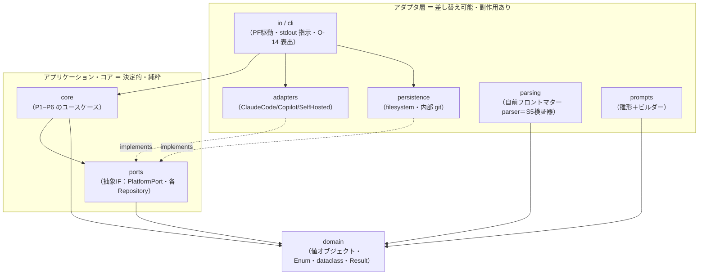

# 設計 02 — モジュール／パッケージ構成と依存方向（凍結セット A）

> [DFD P1–P6](../process/01-dfd-level1.md) と [クラス設計](01-class-design.md) を**コードの境界**に割る。
> 方針：**ヘキサゴナル（ports & adapters）＋依存は内向き**。コア（決定的処理）は PF も IO も知らない。
> 技術前提：[Q5/Q5a](../dashboard.md) Python・**原則標準ライブラリのみ**（`dataclasses`/`enum`/`typing`/`unittest`/`subprocess`）。

## 依存ルール（最重要・1枚）



- **依存は内向きのみ**：`domain` は何にも依存しない。`core` は `domain` と `ports`（抽象）だけに依存。
  **`core` は `adapters`/`persistence`/`cli`/`prompts` を import しない**（PF・IO・保存形式を知らない＝テスト可能・差し替え可能）。
- 具体（PF アダプタ・リポジトリ実装）は `ports` を**実装**する。**結線は合成ルート（cli）だけ**が行う（DI）。
- これで [10 不変条件](../requirements/10-llm-system-boundary.md)（全 LLM 出力をシステムが検証）が**構造**で守れる：コアは `PlatformPort` の戻り値を必ず検証段（⑤）に通す。

## パッケージ構成（案）

```
review_system/
  domain/            # design/01。純粋・no deps
    ids.py           #   RuleId / ContentHash / FindingId …（値オブジェクト。パスは pathlib.Path＝DD13）
    enums.py         #   DocumentType / Severity / Determinism / OverrideRule / ApplicationMode …
    criteria.py      #   ComposedRule / RuleMeta / RuleGuidance / CriteriaPack / MetaIndex
    review.py        #   Finding / Location / UnmatchedFinding / TriagedFinding / TriageResult
    apply.py         #   ResolvedFix / FindingId / ReviewReport / RevertRequest
    result.py        #   Success / Failure / StageOutcome / FailureNotice（S3）
  ports/             # 抽象IF（core が依存する“穴”）
    platform.py      #   PlatformPort（翻訳・raw）／SafePlatformPort（例外を投げない・core 依存先・DD17）＋ PlatformCapabilities
    repositories.py  #   CriteriaRepository(DS1) / WorkspaceRepository(DS3) /
                     #   WarningLedger(DS4) / FeedbackStore(DS5) / ContradictionCache(DS2)
  core/              # P1–P6 のユースケース（決定的・純粋）
    intake.py        #   P1 受付・正規化（型調停・対象/参照集合）
    compose.py       #   P2 基準合成（継承マージ・方向ゲート・本文矛盾・パック/メタ表）
    evaluate.py      #   P3 評価（プロンプト構築呼び・PlatformPort 呼び）
    triage.py        #   P4 rule_id 検証・参照除外・仕分け（S1/S2）
    apply.py         #   P5 修正生成・適用・コミット・revert・レポート組立（S4）
    governance.py    #   P6.5 警告発行（既出判定）
    feedback.py      #   P6.1/6.2 フィードバック収集・観点FB起草
    pipeline.py      #   ①オーケストレーション（段を StageOutcome で直列・fail-close）
  parsing/           # 自前フロントマター parser＝S5 検証器（Q5a）
    frontmatter.py
    lint.py          #   override∈{…}/extends 存在/必須キー（CriteriaLintResult）
  prompts/           # ③ システムプロンプト雛形＋ビルダー
    templates/       #   役割制約・出力スキーマ等（版付き）
    builder.py       #   ReviewPromptBuilder
  adapters/          # PlatformPort 実装（翻訳）＋ ガードプロキシ
    claude_code.py   #   ClaudeCodeAdapter（CLI＋stdout・将来）
    file_platform.py #   FilePlatformAdapter（findings.json を読む＝PF駆動MVPの実体）
    fake.py          #   FakePlatformAdapter（テスト用 record/replay＝E のシーム）
    guard.py         #   GuardingPlatform（プロキシ：例外→Failure(EVALUATE)・DD17）
  persistence/       # Repository 実装（filesystem・内部 git）
    criteria_repo.py #   DS1 ディスカバリ/ロード
    workspace_git.py #   DS3 finding 単位コミット・revert（S4 トランザクション）
    warning_ledger.py#   DS4 / feedback_store.py DS5 / contradiction_cache.py DS2
  io/
    cli.py           #   合成ルート＝結線＋ PF 駆動の stdout 制御プロトコル
    report_render.py #   ReviewReport → 人間可読
    failure_render.py#   FailureNotice(O-14) → CLI 表出＋exit code（D）
tests/               # ④ 証跡（test-strategy のテーラリング先）
```

## DFD プロセス → モジュール 対応

| DFD | モジュール | 依存する port |
|---|---|---|
| P1 受付・正規化 | `core/intake` | PlatformPort(型推定 L3) |
| P2 基準合成 | `core/compose` ＋ `parsing` | CriteriaRepository, ContradictionCache, PlatformPort(矛盾 L2) |
| P3 評価 | `core/evaluate` ＋ `prompts` | PlatformPort(評価 L1) |
| P4 検証・仕分け | `core/triage` | （純粋・port 不要。メタ表/ポリシーは引数） |
| P5 適用・レポート | `core/apply` | WorkspaceRepository(DS3・git) |
| P6 育成・ガバナンス | `core/governance` `core/feedback` | WarningLedger(DS4), FeedbackStore(DS5), PlatformPort(草案 L5/L6) |
| ①オーケストレーション | `core/pipeline` ＋ `io/cli` | 上記すべて（結線は cli） |

## 安定化策（S1–S6）の所在

| S# | どこで実現 |
|---|---|
| S1 LLM 契約検証 | `core/triage`（⑤）＝ `PlatformPort` の戻りを必ず検証→❓未分類 |
| S2 安全側仕分け | `core/triage`（determinism 未宣言→`HUMAN_ONLY`） |
| S3 fail-close | `domain/result` の `StageOutcome` ＋ `core/pipeline` が段ごとに分岐 |
| S4 トランザクション | `persistence/workspace_git`（finding 単位コミット・失敗時書込ゼロ） |
| S5 事前 lint | `parsing/lint`（parser＝検証器） |
| S6 版スタンプ | `io/cli` 合成ルートで採取し `ReviewReport.stamp` に注入 |

## 実行・インポート規約（`sys.path` を触らない理由）

- パッケージ `review_system/` を**正しい package 構造**（各階層に `__init__.py`、**絶対 import** `from review_system.core import ...`）にする。これだけで import は解決し、**`sys.path` 操作は不要**。
- 起動は **`python -m review_system`**（`review_system/__main__.py` に CLI エントリ＝合成ルート）。テストは**リポジトリルートから `python -m unittest`**。どちらも CWD（ルート）が `sys.path[0]` に入るので `review_system` も `tests` も素直に import できる。
- **`sys.path.insert(...)` 等のハックを使わない理由**：
  1. **起動起点依存で壊れる**（どこから実行したかで解決が変わる）＝[13 S3](../requirements/13-stabilization.md) の再現性と逆行。
  2. **import 解決が暗黙化**し、依存方向（`domain ← core ← …`）が grep で追えなくなる＝[依存ルール](#依存ルール最重要1枚)を侵食。
  3. テストが**本物の package を出荷と同じ経路で import** するので seam を歪めない（[④ テスト戦略](README.md)）。
- 配布が要るなら将来 `pyproject.toml` で `pip install -e .`（標準パッケージング）。それまでも `python -m` で完結し**追加依存ゼロ**（[Q5](../dashboard.md)）。`tests/` はルート直下に置き、path hack/`conftest` 不要。

## 決め事（実装の不変条件）
- **`core` は副作用を持たない**：ファイル/ネットワーク/git は port 越し。これで `unittest` が**Fake アダプタ**で全関数決定的に回せる（[④ テスト戦略](README.md)の seam＝E）。
- **境界を跨ぐ値は domain 型のみ**（生 `str`/`dict` を core の公開シグネチャに出さない）。
- **合成ルートは1つ**（`io/cli`）。ここだけが具体を知り、DI で組む。
