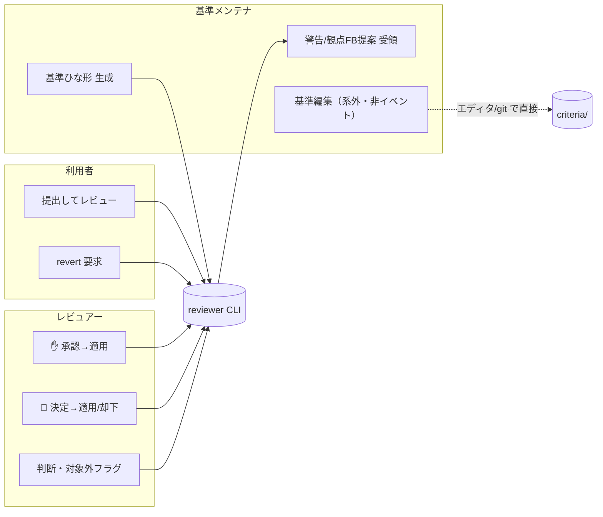

# 設計 03 — 外部アクタ・インターフェース（凍結セット ②）

> 人間アクタ（**利用者 / レビュアー / 基準メンテナ**）とシステムの境界を**CLI のシグネチャ**として固める。PF（LLM）との境界は [04](04-platform-protocol.md)。
> 形式は [DD1](decisions.md#dd1--人間向けインターフェースの形)＝**単一 CLI `reviewer` ＋サブコマンド**。MVP はアクターを区別しない（[dashboard 決定](../dashboard.md)・単一ユーザー）が、**操作（口）は論理的に分けて**おく（将来 RBAC の土台）。
> 出典：[DFD L1](../process/01-dfd-level1.md)・[02 分解](../process/02-decomposition.md)・[05 I/O](../requirements/05-io-overview.md)・[01 クラス](01-class-design.md)。

## アクタ × 操作（レーン）



> `m3 基準編集`は**系外＝非イベント**（[PR3](../methods/method-inventory.md)・[Q15](../dashboard.md)）。CLI の口にしない。検査は合成時に毎回（[04 lint](04-platform-protocol.md)/P2）。

## CLI サーフェス（サブコマンド一覧）

| アクタ | コマンド | 役割（DFD） | 入力 | 出力 / exit |
|---|---|---|---|---|
| 利用者 | `reviewer review <paths…>` | P1→P5 本線 | 対象パス・`--ref`・`--type`・`--scope` | 評価レポート(O-1) / 0 成功・3 fail-close(O-14)・4 lint 不正 |
| 利用者 | `reviewer revert <target>` | P5.4 | `--finding <id>` \| `--exec <id>` \| `--all` | revert 結果(O-6) / 0・2 対象なし |
| レビュアー | `reviewer approve <exec> <finding…>` | P5.2(✋・I-6) | exec_id・finding_id 群 | 適用結果 / 0・3 衝突→人 |
| レビュアー | `reviewer decide <exec> <finding> --as <decision>` | P5.2(💬・I-6) | `approve\|modify\|reject\|out_of_scope`・`--diff` | 適用 or 記録 / 0 |
| レビュアー | `reviewer feedback <exec> <finding> --decision <d>` | P6.1 | `approve\|reject\|out_of_scope` | DS5 追記 / 0 |
| メンテナ | `reviewer criteria feedback-draft [--rule <id>]` | P6.2（オンデマンド・[DD11](decisions.md#dd11--観点fb起草p62-のオンデマンド起動口)） | DS5 傾向（任意で rule 絞り） | O-12 観点FB提案 / 0 ・**MVP保留印** |
| メンテナ | `reviewer criteria lint [paths]` | S5 | 基準/ポリシーのパス（既定＝全件） | lint 結果（O-14 同形式）/ 0 健全・4 不正 |
| メンテナ | `reviewer criteria scaffold --type <t> --scope <s>` | P6.4 | doc_type・scope | 基準ひな形(O-11) / 0 |
| メンテナ | `reviewer warnings [--scope <s>]` | P6.5 表示 | scope フィルタ | 新規＋既知警告(O-9) / 0 |
| 共通 | `reviewer run <paths…>` | PF 駆動入口 | review と同じ | **stdout 制御プロトコル**（[04](04-platform-protocol.md)） |

> `review` は **System 駆動相当の一括実行**（人間/CI が直接叩く）。`run` は **PF 駆動**（Claude が stdout 指示に従う）。中身のツールは共通（[04 DD3](decisions.md#dd3--決定的ツールの公開トランスポート)）。

## シグネチャ（型は [01 クラス設計](01-class-design.md) のドメイン型）

口は CLI（文字列引数）だが、**境界の内側で即ドメイン型へ写像**し、以降生 `str` を流さない（[02 決め事](02-module-architecture.md)）。

```python
# io/cli.py（合成ルート。引数→ドメイン型→core→レンダリング）
def cmd_review(paths: list[str], ref: list[str], type_: str | None, scope: str | None) -> int:
    request = ReviewRequest(                      # ← 文字列をここで値オブジェクト化
        targets=tuple(FilePath(p) for p in paths),
        references=tuple(FilePath(p) for p in ref),
        type_override=DocumentType(type_) if type_ else None,
        scope=parse_scope(scope),                 # 既定 Scope.org()
    )
    outcome: StageOutcome[ReviewReport] = pipeline.run_review(request, deps)  # core
    match outcome:
        case Success(report): render_report(report); return 0     # O-1
        case Failure(notice): render_failure(notice); return EXIT_FAILCLOSE  # O-14
```

```python
def cmd_revert(target: RevertTarget) -> int: ...          # P5.4 / O-6
def cmd_approve(exec_id: ExecutionId, findings: tuple[FindingId, ...]) -> int: ...   # ✋ I-6
def cmd_decide(exec_id: ExecutionId, finding: FindingId, decision: ReviewDecision,
               diff: str | None) -> int: ...               # 💬 I-6
def cmd_feedback(exec_id: ExecutionId, finding: FindingId, decision: ReviewDecision) -> int: ...  # DS5
def cmd_criteria_lint(paths: tuple[FilePath, ...]) -> int: ...   # S5（CriteriaLintResult → O-14 形式）
def cmd_criteria_scaffold(doc_type: DocumentType, scope: Scope) -> int: ...  # O-11
def cmd_warnings(scope: Scope | None) -> int: ...          # O-9（DS4）
```

> **`ReviewRequest` は新規のポート入力型**（[01 §9](01-class-design.md) に「ポート契約」として既出）。`parse_scope` は `org|team:x|project:x` を `Scope` へ（[01 §3](01-class-design.md)）。

## 終了コードと O-14（[13 S3](../requirements/13-stabilization.md) fail-close）

| code | 意味 | 例 |
|---|---|---|
| 0 | 成功（空文書 no-op 含む＝良性 fail-open） | レポート出力・0件レポート |
| 2 | 要求不正（対象なし・revert 対象なし） | 引数ミス |
| 3 | fail-close（O-14） | 基準パース失敗・LLM 障害・スコープ未解決 |
| 4 | lint 不正（S5） | `override` 不正値・extends 切れ |

- どの異常も**黙って空を返さない**：`FailureNotice{stage+reason+subject+next_action}`（O-14）を**stderr へ可読出力**し、上の code を返す（[DD9](decisions.md#dd9--ログ出力先)）。
- **承認/決定の入口は finding_id で参照**（[DD10](decisions.md#dd10--レビュアーの承認決定の入口)）：`review`/`run` のレポートが各 ✋/💬 に `exec_id` と `finding_id`（=`rule_id+location`・[01](01-class-design.md)）を併記し、レビュアーはそれを `approve`/`decide` に渡す。

## 入力台帳との対応（[05 I/O](../requirements/05-io-overview.md) の正準番号に整合）

> ⚠️ 番号は[05 台帳](../requirements/05-io-overview.md)が正準。**参照＝I-13**（I-3 は scope）・**scope＝I-3**（I-5 はポリシー）・**判断/対象外＝I-6/I-7**・**revert＝I-14**（[04-gaps](../process/04-gaps-found.md) で台帳化）。`I-10/I-11` は使わない（I-10＝通知条件・post-MVP、I-11＝削除済み）。

| 操作 | I-#（[05](../requirements/05-io-overview.md)） | O-# |
|---|---|---|
| `review` | I-1 対象・I-13 参照・I-2 型上書き＋I-15 推定・I-3 scope（MVP=org）・I-4/I-5 基準/ポリシー | O-1 レポート・O-2 指摘・O-14 |
| `approve`/`decide` | I-6 指摘への判断（承認/修正/却下） | O-3 適用・O-4 diff・O-5 原案 |
| `revert` | I-14 revert 要求 | O-6 |
| `feedback` | I-6 判断 ＋ I-7 対象外フラグ | — (DS5) |
| `criteria feedback-draft` | （DS5 起点・オンデマンド・[DD11](decisions.md#dd11--観点fb起草p62-のオンデマンド起動口) MVP保留印） | O-12 観点FB提案 |
| `criteria scaffold` | （入力番号なし＝**イベント E8** 起点・doc_type/scope は引数） | O-11 |
| `warnings` | — | O-9 |

> **post-MVP・未結線**（[PR8](../methods/method-inventory.md) フル論理＋MVP印）：I-10 通知条件設定・I-12 時間トリガは MVP では CLI に口を持たない（[05 ③](../requirements/05-io-overview.md)）。
</content>
