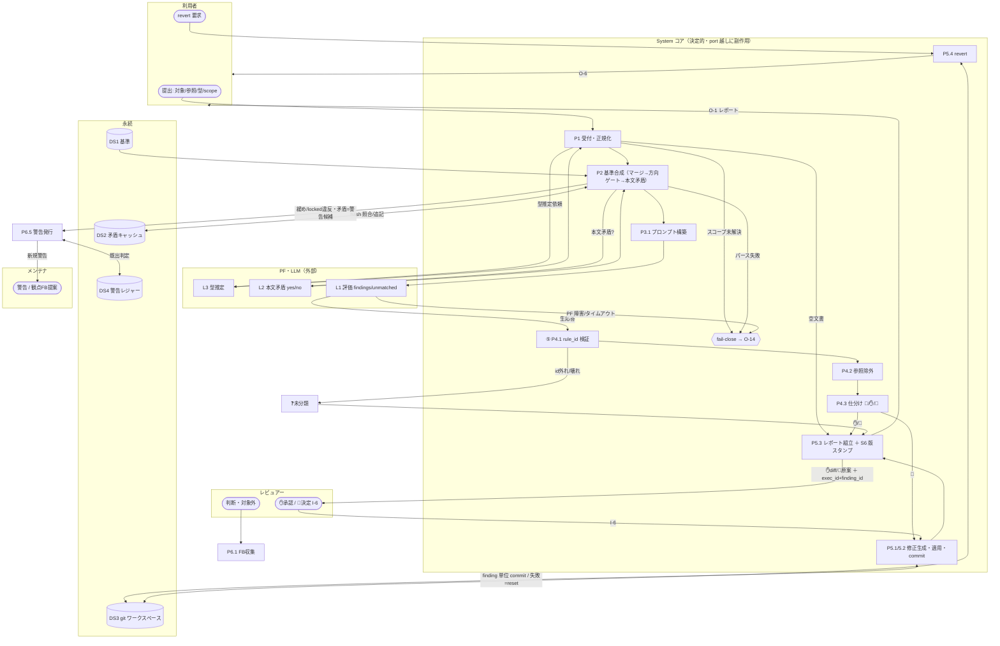

# 設計 06 — オーケストレーション（スイムレーン付フローチャート）（凍結セット ①）

> P1→P6 の端から端を、**アクタ/段の責務をレーンで分けた1枚**にする。[DFD L1](../process/01-dfd-level1.md) の「誰が何を」を実行順序＋fail-close 経路で表現。
> シーケンス図でなく**スイムレーン付フローチャート**（分岐/繰返し/失敗経路を見せたいため・[README](README.md)）。
> 段の戻りは `StageOutcome`（[01 §5](01-class-design.md)）。`Failure` で**下流を走らせない**＝[13 S3/S4](../requirements/13-stabilization.md) を型で担保。
> 実体は `core/pipeline.py`（[02](02-module-architecture.md)）。結線は合成ルート `io/cli`。

## 本線（review）スイムレーン



## 実行順序の不変条件（型で守る）

1. **検証（⑤）→ 参照除外 → 仕分け → 適用** の順は不変（[13 S1](../requirements/13-stabilization.md)）。`apply` は `triage` の `Success` を受けた時だけ走る。
2. **fail-close は横断経路**（[13 S3](../requirements/13-stabilization.md)・[process/00 異常系横断モデル](../process/00-context.md)）：`Failure` はそのまま `io/cli` まで伝播し O-14＋exit3。途中の `apply` には**到達しない**＝DS3 書込ゼロ。
3. **空文書は良性 fail-open**：0件レポート（O-14 を出さない）。
4. **PF 出力は必ずコア検証を通る**（[10](../requirements/10-llm-system-boundary.md)）。PF→`apply` の直行経路は図に存在しない。

```python
# core/pipeline.py（段を StageOutcome で直列・match で漏れなく分岐）
def run_review(req: ReviewRequest, deps: Deps) -> StageOutcome[ReviewReport]:
    match intake(req, deps):                 case Failure() as f: return f
                                             case Success(nz): pass
    match compose(nz, deps):                 case Failure() as f: return f       # パース/スコープ未解決→O-14
                                             case Success(criteria): pass
    raw = deps.platform.review(...)          # L1（失敗は下で degrade/fail-close）
    match evaluate_and_validate(raw, criteria):  # ⑤ 検証→❓未分類退避（S1）
        case Failure() as f: return f
        case Success(findings): pass
    triaged = triage(exclude_reference(findings, nz.references), criteria.meta, deps.policy)
    match apply(req.exec_id, triaged.auto, deps.workspace):   # S4：try/except→rollback
        case Failure() as f: return f                          # 適用失敗→書込ゼロ
        case Success(applied): pass
    return Success(build_report(applied, triaged, stamp(deps)))   # S6
```

## PF 駆動（run）との関係

同じ段列を、`io/cli` が**自分で回す（System 駆動＝`review`）**か、**stdout 指示で Claude に回させる（PF 駆動＝`run`）**かの違い（[04 §4](04-platform-protocol.md)）。順序の不変条件は両モードで保たれる（PF 駆動は stdout が順序を握る）。

## 育成・ガバナンスのループ（非同期・[02 P6](../process/02-decomposition.md)）
- `feedback`（P6.1）→ DS5 蓄積 → しきい値/オンデマンドで `P6.2` 観点FB起草（L5）→ メンテナ。
- 警告（P6.5）は **P2 合成時の警告候補のみ**を DS4 で既出判定（基準編集は系外＝非イベント）。
- これらは本線レビューの価値経路を**遮断しない**（[PR6](../methods/method-inventory.md)）：レビューは警告/FB の有無に関わらず完走する。
</content>
