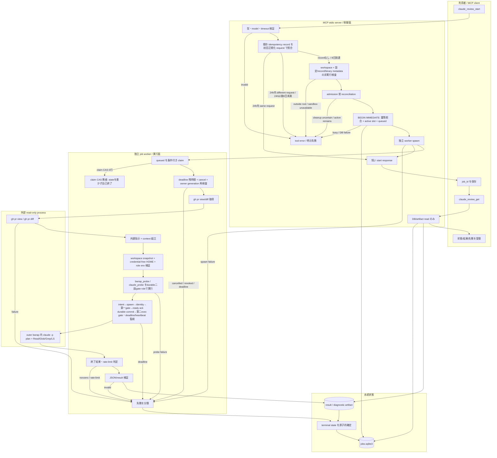

# Issue #217: Claude review MCP 非同期ジョブ設計

## 1. 文書の位置づけ

- 対象: [Issue #217](https://github.com/hiratashinnya/review-system/issues/217)「Claude review MCP: 長時間レビューを非同期ジョブ化する」
- 状態: 実装前設計改訂案（Codex レビュー11所見、Issue comment 4957631132 の5所見と 4958583056 の3所見、outer bubblewrap 実測、2026-07-12 および 2026-07-13 のオーナー決定を反映。未決事項は本書の「選択肢・推奨・決定者/決定タイミング」に分離する）
- 調査日: 2026-07-12
- 範囲: `.codex/mcp/claude_review/` の非同期ジョブ化
- 非目標: Codex MCP クライアントの待機上限変更、Claude/GitHub への書き込み権限追加、レビュー内容そのものの変更、rate-limit 自動再試行・永続 cooldown preflight・新規 latch/backoff の導入、同期 API の削除と移行運用（Issue #221）

本設計の目的は、MCP の1回の `tools/call` を短時間で完了させ、約300秒を超える `claude -p` を MCP サーバープロセスから独立したジョブワーカーで継続できるようにすることである。開始・状態取得・結果取得はいずれも短時間のローカル操作とし、長時間待機を API 内で行わない。

## 2. 現状と設計制約

### 2.1 調査した資産

| 根拠 | 現状 | 設計への制約 |
|---|---|---|
| `.codex/mcp/claude_review/server.py:15-19` | wrapper 版 `0.1.0`、既定 timeout 300秒、モデルは `opus`/`fable`、Claude tool は `Read,Glob,Grep,LS` | モデル既定・fallback と read-only tool 集合を維持する |
| `server.py:190-194,275-292,295-305` | model 省略時は `opus` を選び、`--fallback-model opus` を付ける。入力/PR規模による自動選択 heuristic は存在しない | Issue の「自動モデル選択」が既定値/fallback の意味か、新 heuristic の意味かは一意に決まらない（U-11） |
| `server.py:40-187` | rate-limit 状態を XDG state 配下の JSON に atomic replace で保存し、実行前 cooldown 判定を行う | オーナー決定により非同期経路は無状態とする。既存 JSON を読まず、書かず、移行せず、永続 cooldown preflight を行わない |
| `server.py:71-187,310` | `detect_and_record_rate_limit()` は return code/構造化 error に限定せず stdout+stderr 全文を `RATE_LIMIT_RE` へ渡し、`parse_reset_hint()` は全文中の epoch/ISO/時刻様数字を reset と解釈し得る | 成功レビュー本文中の “rate limit” や時刻が誤検知・誤 reset になる。これは非同期設計に持ち込まない先行是正対象であり、是正と回帰検証を worker core 実装 gate とする |
| `server.py:197-205` | workspace は起動時 root 配下へ realpath で制限 | start 時に同じ検証を完了し、検証済み canonical path だけを永続化する |
| `server.py:226-260` | `gh pr view` は最大60秒、`gh pr diff` は最大120秒。失敗時は Claude を呼ばない。PR context は既定12万文字まで | PR context 取得は長時間化し得るため start API ではなく worker で行う。失敗時 fail-close を維持する |
| `server.py:263-292` | PR の命令を信用しない共通指示を追加し、`plan` mode、read-only tools、JSON 出力、session 非永続で Claude を起動 | prompt assembly とコマンド組立を同期/非同期の共通 worker core に集約し、迂回経路を作らない |
| `server.py:295-330` | `claude_review` が検証、PR取得、Claude実行、結果返却を同期実行 | 約300秒の MCP 呼び出し上限の直接原因。ただし #217 では同期 tool を削除せず、#221 で全利用者の棚卸し・移行完了を確認した後だけ削除する |
| `server.py:343-381` | `claude_review_status` と2 tool の schema のみ公開 | #217 で `start/get/cancel` を追加し、同期 `claude_review` は併存させる。削除 gate と告知・切替順は Issue #221 の責務 |
| `server.py:391-437` | stdio 1行 JSON-RPC、tool 成功/失敗は MCP text content | 新 API も JSON object を文字列化した text content とし、stdio 制御チャネルを汚さない |
| `.codex/mcp/claude_review/README.md:7-19` | Python stdio server と workspace root の設定 | 別常駐サービスを必須にせず、既存起動設定のまま動く構成を優先する |
| `.codex/mcp/claude_review/README.md:7-15` および `.codex/` 配下の調査 | MCP entry は user-local `~/.codex/config.toml` への設定例だけで、repository 内に server 登録設定はない | repository 固有の常駐 service 設定を前提にせず、README の設定例更新を移行対象にする |
| `README.md:28-64` | PR read、workspace 境界、Claude read-only、wrapper 専有 cooldown、prompt injection 防御を明記 | PR/workspace/read-only/injection 防御は非同期経路にも適用する。cooldown は非同期経路へ適用しない |
| `tests/unit/test_claude_review_mcp.py:27-43` | モデル制約と read-only command を検証 | 既存テストを保持し、非同期 command も同じ builder を使う |
| `test_claude_review_mcp.py:45-67,145-176` | PR context と prompt injection 防御を subprocess mock で検証 | 非同期 worker の段境界として同じ期待を検証する |
| `test_claude_review_mcp.py:69-138` | wrapper 専有 cooldown のみ参照することを検証 | 既存挙動の記録であり、非同期経路は wrapper cooldown も外部 Claude hook state も参照しない |
| `test_claude_review_mcp.py:178-201` | timeout と workspace を副作用前に検証 | start は不正入力時に DB・worker・外部 command のいずれも作らない |
| Issue #217 本文（2026-07-12取得） | start は短時間で `job_id`、状態/進捗/結果/失敗を read-only 取得、再起動・排他・保持期間を定義 | 本書の受入条件 |
| WSL2 実測（2026-07-12） | bubblewrap 0.9.0、user namespace 利用可、AppArmor 無効。outer bubblewrap から OAuth 接続でき、`socat` relay は不要 | 対象環境の外側 sandbox は bubblewrap を採用する。`socat` を依存・preflight・relay 設計へ含めない |
| WSL2 外側 namespace 実測（2026-07-12） | workspace は読取り可能、Claude tool から auth config は permission deny、`/etc/passwd` は不可 | workspace 外の物理隔離と workspace 内機微ファイルの permission deny を併用する。片方だけへ縮退しない |
| OAuth 隔離追加検証 | `~/.claude` 全体 mount は設定・hooks・plugins・MCP・memory を持ち込み、レビュー挙動と秘密境界を広げる。最小 bootstrap だけでも Claude と native read tools が同じ mount namespace から読めるなら permission deny 破りに耐えない | credential material は別 process・別 mount namespace の auth broker だけに mountする。Claude namespace には credential path、別名、secret-bearing FD を一切渡さず、実 CLI が broker transport を機械検証できる版だけを対応対象とする |
| 実行環境の現状 | `bwrap` は repository/package が導入を保証していない外部依存 | binary/版/必要 capability を preflight し、欠如・不一致・構成不能なら Claude を起動せず fail-close とする |

### 2.2 設計原則

1. **短い制御面と長い実行面を分離する。** MCP server は検証・永続化・worker spawn・取得だけを行う。
2. **fail-close。** workspace、入力、PR context、sandbox/OAuth 隔離、read-only command のいずれかが不正/不明なら Claude を起動しない。
3. **at-most-once を優先する。** worker 喪失後に同じレビューを自動再実行しない。重複 quota 消費を避ける。
4. **状態遷移を原子的にする。** SQLite transaction と条件付き update で、状態と所有権を同時に確定する。
5. **制御出力を汚さない。** JSON-RPC は stdout、診断は stderr、永続監査は state DB/ログへ分離する。
6. **OS 境界と Claude permission の二重防御にする。** 外側 bubblewrap で workspace 外と OAuth credential を物理隔離し、workspace 内の機微ファイルは Claude permission deny で遮断する。OAuth は別 mount namespace の auth broker だけが保持し、Claude/native read tools の namespace に credential path、hardlink/symlink/bind alias、secret-bearing FD を作らない。どちらかが成立しなければ起動しない。
7. **同期 API も共通実行境界を迂回させない。** 同期 `claude_review` は #221 の移行完了まで残すが、#217 の共通 job admission、active slot、outer bubblewrap、credential-free synthetic HOME、auth broker、固定 deny、全 process lifecycle を非同期 API と同じ経路で必ず通す。#221 が全利用者を棚卸しし、移行完了を確認したことを削除の前提 gate とする。
8. **rate-limit は無状態で終了する。** Claude 実行結果を安全な境界で rate-limit と分類した job を `rate_limited` で終了するだけとし、永続 cooldown preflight、自動再試行、新規 latch、解除時刻不明 backoff を設計しない。
9. **実行環境は親 process から継承しない。** worker、`gh`、bwrap、Claude の各 role は空の環境から版管理された最小 allowlist を構築し、認証・設定・proxy・runtime option の環境変数による迂回を拒否する。
10. **CLI surface は実効値まで証明する。** Claude は `--tools` で固定 tool 境界を指定し、対応 CLI binary digest/version ごとに凍結した実 CLI probe 契約で canonical tool 名、最終 effective tool/settings 集合、broker transport、credential 不可視性を機械検証する。実 CLI が権威ある機械可読結果を出せない版、prompt の自己申告や model の tool 選択に依存する版は対応外とし fail-close する。

## 3. 採用する論理構成

| 構成要素 | 責務 |
|---|---|
| MCP API adapter | schema 検証、job start/get/cancel/status、統一 API envelope、JSON-RPC 応答 |
| Job repository | SQLite による job metadata、状態遷移、実行スロット、保持期限の原子的管理 |
| Worker launcher | 同じ Python entry point の worker mode を MCP server から独立した session で起動し、冪等 start の launch protocol を担う |
| Job worker | job claim、PR context 取得、outer bubblewrap 内の Claude process group 起動/監視、timeout、結果検証、terminal state 保存 |
| Reconciler | admission 前・server 起動時・明示 maintenance で stale owner/process group/artifact を回収し、cleanup lease を取得した場合だけ signal を実行する。全 job process の消滅を確定してから auth job lease と slot を単一 finalize CAS で解放する |
| Review core | workspace/model/prompt/command、`AsyncV1`/`LegacySyncV1` execution profile と、成功 stdout を除外した是正後の rate-limit 判定境界。同期/非同期の両 adapter が共通 Job worker 経由でのみ利用する |
| Sandbox adapter | outer bubblewrap の Claude 専用 mount/pid namespace、job 固有の不変 workspace snapshot、credential-free synthetic HOME、tmpfs、固定 deny/allow policy、CLI version/tool/effective settings/broker transport の capability/preflight。admission 前は設定・record・binary metadata の非実行検査だけを行い、`bwrap`/Claude を実行する probe は claim 後の durable role として起動する |
| Environment builder | role ごとに空の map から最小 env を構築し、親環境、認証/config/proxy/runtime option の暗黙継承を拒否する |
| Auth broker | Claude とは別 process・別 mount namespace で credential root を専有し、対応 CLI の検証済み broker transport にだけ認証済み通信を提供する。DB に generation/active・candidate digest/path/job lease/auth operation を持つ二相状態機械で refresh handoff と明示 rotation を直列化する。job lease は refresh publish、正常/失敗 terminal、spawn loss、cancel を跨いで全 job process 消滅まで保持し、消滅後の単一 finalize CAS だけが解放する |
| Artifact store | 大きな最終結果・制限付き診断 tail を job directory に atomic write |

推奨配置イメージ（実装時のファイル分割は未決）:

```text
${XDG_STATE_HOME:-~/.local/state}/claude-review-mcp/
├── jobs.sqlite3                    # job metadata / process identity / slot
├── auth-broker/                    # broker namespace だけが mount。Claude namespace から不可視、0700
│   ├── generations/<digest>       # immutable credential generation、0600
│   └── candidates/<txn_id>        # 二相 commit 前の immutable candidate、0600
└── jobs/<job_id>/
    ├── result.txt                  # 成功時のみ、0600、atomic replace
    └── diagnostic.json             # 失敗時の制限付き情報、0600
```

prompt、canonical workspace、PR番号等の request は SQLite に保持する。結果本文は MCP text size と DB 肥大化を避けるため artifact とする。state root は `0700`、DB/成果物は `0600`、job id は server 発行の UUID v4 lowercase canonical form に限定し、利用者入力から path を組み立てる前に厳格検証する。symlink を辿った job artifact は拒否する。

## 4. 外部 API

### 4.1 新規 tool: `claude_review_start`

入力は既存 `claude_review` の項目を維持し、冪等再送用 `idempotency_key` を追加する。

```json
{
  "prompt": "設計をレビューしてください",
  "workspace": "/canonical/under/root",
  "model": "opus",
  "pr_number": 217,
  "timeout_s": 1800,
  "idempotency_key": "client-generated-opaque-key"
}
```

- `prompt`: 必須、非空 string
- `workspace`: 任意。既存と同じ root 配下制約
- `model`: 任意。`opus`/`fable`、省略時 `opus`、Claude command の fallback は `opus`
- `pr_number`: 任意、既存と同じ integer|string
- `timeout_s`: **Claude job の実行上限**。MCP call の待機時間ではない
- `idempotency_key`: 任意だが再送可能な client は指定必須。ASCII 1〜128文字の opaque key。server は key と正規化 request hash の組を永続化する

成功 text content（JSON string。4.5 の envelope 内）:

```json
{
  "api_version": "1.0",
  "ok": true,
  "data": {
    "job_id": "550e8400-e29b-41d4-a716-446655440000",
    "state": "queued",
    "created_at": "2026-07-12T10:00:00+09:00",
    "idempotency_expires_at": "...",
    "poll_after_s": 5,
    "replayed": false
  }
}
```

start は次の冪等契約を持つ。オーナー決定 A により、同一 job を再送として返す保証期間は record 作成から24時間であり、成功応答の `idempotency_expires_at` はこの `replay_until` を返す。この値と、後続7日間の key 拒否期間、合計8日後の再利用条件を status/schema/README に公開する。

1. 初回受付では field ごとの **presence bit と raw JSON scalar**（workspace は omitted/explicit を区別）、その raw 値から得た canonical 値、適用した既定値、normalization/security/config version を `IdempotencyInputSnapshot` として保存する。`idempotency_records` と job row の双方に同じ snapshot/hash を保存し、job row 側は record の8日 lifecycle から独立して14日 get 契約を支える。secret や raw prompt を診断/hash log に出さない。
2. `idempotency_key` の文字種・長さを検証した直後、sandbox/auth broker の非実行検査、workspace 再検証、cleanup/reconciliation、active slot 判定など現在状態を変更・観測する mutable preflight **より先に**、read transaction で既存 record を照合する。record があれば replay 比較は、初回 snapshot に保存した field presence、raw scalar、raw→canonical mapping、既定値、normalization versionだけを入力とする純粋関数で行い、filesystem の `realpath`、現在の workspace default/config/capability を読まない。workspace が初回 omitted なら再送も omitted の場合だけ同一、初回 explicit なら保存済み raw string と一致する場合だけ保存済み canonical 値へ写像し、別表記を現在の filesystem で再 canonicalize して同一扱いしない。この replay 経路は worker を spawn せず、cleanup/reconciliation も起動しない。
3. job row と独立した `idempotency_records` に key、初回正規化 request/hash、job id、`created_at`, `replay_until=created_at+24h`, `delete_after=created_at+8d` を保存し、key に unique constraint を置く。`now < replay_until` の同じ key・同じ初回正規化 request は、job/artifact の有無にかかわらず同じ `job_id` と現在 state を `replayed=true` で返し、worker を再 spawn しない。同じ key・異なる request は `idempotency_conflict` とする。
4. `replay_until <= now < delete_after` の同じ key は request の同異にかかわらず `idempotency_key_expired` とし、新 job を作らない。`now >= delete_after` では start 自身が `BEGIN IMMEDIATE` 内で期限到達 record を条件付き削除してから同じ key の新 record/job を作成できる。すなわち、24時間は同一 `job_id`、以後7日間は明示拒否、合計8日後は record 削除・key 再利用可能である。
5. key 省略時は各 call を新規依頼として扱う。通信再送による重複抑止は保証しないことを schema/README に明記する。
6. 初回 start の成功到達条件は、U-10 の推奨Aでは「入力・設定/compatibility record/binary metadata/auth row の**非実行**検査、admission 前 reconciliation、`BEGIN IMMEDIATE` 内の durable insert/active slot と auth job lease の予約、worker launch intent、spawn、worker identity commit、第一 gate 解放、child readiness ack、親による ack durable commit、release authorization commit、第二 external-exec gate 解放」である。admission 前に `claude`, `bwrap` その他の probe executable を起動してはならない。`Popen` 成功や第一 gate writeだけをspawn成功と呼ばない。ack durable commit 前は第二 gate token を生成・送信できず、worker binary を含む対象 executable は実行不能である。ack commit 後に応答不能となった場合は、第二 gate 解放の成否にかかわらず worker を may-have-executed として reconciliation 対象にする。worker が claim 後に起動する `bwrap_probe`/`claude_probe`/`gh`/bwrap/Claude も同じ二段 gate と durable identity を個別に通す。実 probe が不適合なら job を fail-close で終了し、auth job lease と slot は全 process 消滅確認まで保持する。
7. queued commit 後、spawn/応答前に server が死亡しても、同じ key の24時間内再送は既存 row を返すだけで再 spawn しない。spawn 済みなら worker の claim が進み、未 spawn なら reconciliation が `failed/worker_start_lost` にする。曖昧な実行を自動再起動しない。
8. job/artifact cleanup は `idempotency_records` を同時削除しない。idempotency record が8日で削除された後も job row の snapshot と tombstone は保持し、完了から14日未満の `claude_review_get` は同じ job id、state、時刻、`idempotency_expires_at` を返す。結果 artifact 削除後は `expired` と result 不在を返し、`job_not_found` にしてはならない。record の cleanup/compaction は `delete_after` 到達済みだけを対象とし、遅延しても start transaction が同じ条件で削除できるため、8日後の key 再利用を cleanup 実行時刻へ依存させない。

spawn 失敗時は job を `failed/worker_start_failed`, `slot_release_pending=true`, `auth_release_pending=true` に遷移させ、統一 error envelope に `job_id` を含める。launcherが起動した可能性のあるworker trampolineを含む全job-scoped processの不存在を確認したfinalize CASまでauth job leaseとslotを解放しない。MCP server/launcher process自体はjob process集合へ数えない。start 成功応答を返した後の worker 喪失も同じ release protocol を通し、get で job failure として返す。

### 4.2 新規 tool: `claude_review_get`

入力:

```json
{
  "job_id": "550e8400-e29b-41d4-a716-446655440000",
  "include_result": true
}
```

成功 text content（実行中）:

```json
{
  "api_version": "1.0",
  "ok": true,
  "data": {
    "job_id": "550e8400-e29b-41d4-a716-446655440000",
    "state": "running",
    "stage": "invoking_claude",
    "created_at": "...",
    "started_at": "...",
    "updated_at": "...",
    "deadline_at": "...",
    "cleanup_pending": false,
    "model": "opus",
    "pr_number": 217,
    "progress": {"kind": "stage", "message": "Claude review is running"}
  }
}
```

terminal response は `finished_at` と、key を指定した job では `idempotency_expires_at` を含む。`succeeded` かつ `include_result=true` のとき `result` を含む。失敗系は安定した `failure.code` と安全に切り詰めた `failure.message`、rate-limit の場合は当該応答から確実に得られた observation としてのみ `reset_at` を含む。stdout/stderr 全文、prompt、workspace の不必要な詳細は返さない。

未知/期限切れ job id は tool error `job_not_found` とする。存在有無の秘匿が必要な multi-user service ではないが、path traversal を避けるため形式不正も同じ error に正規化する。

### 4.3 新規 tool: `claude_review_cancel`

入力は `job_id` のみとする。cancel は冪等で、terminal job には現在 state を `replayed=true` で返す。

- `queued|running` の最初の cancel: `BEGIN IMMEDIATE` の cancel CAS で `state`, `owner_generation`, `cancel_requested=false` を照合し、`cancelling`, `cancel_requested=true`, `owner_generation=old+1`, `cleanup_target_state=cancelled`, `cleanup_target_code=user_cancelled` として現 owner を一度だけ revoke する。同じ transaction で、あらかじめ durable 登録した cleanup actor identity を参照する `(cleanup_owner_identity_id, cleanup_owner, cleanup_token, cleanup_generation=old+1, cleanup_takeover_epoch, cleanup_expires_at)` を空 lease へ CAS 設定できた actor だけが停止処理を開始する。auth job lease は revoke/clearせず `auth_release_pending=true` として保持する。`queued` で `launch_in_progress=false` かつ全 role/intent が不存在と証明できる場合も terminal outcome を先に記録するだけで、auth lease と slot の解放は同じ全 process 不存在 finalize CAS に統一する。
- 既に `cancelling`: 同時・再送 cancel は **owner generation を変更せず**、現在 state/generation を `replayed=true` で返す。cleanup lease が有効ならその owner に委ね、signal や terminal/finalize CAS を重複実行しない。lease が空、または期限切れに加えて旧 `cleanup_owner_identity_id` の `(boot_id, proc_start, pid/pgid, nonce)` 不在を durable record と OS identity の双方で証明できた場合だけ、期待する旧 token/takeover epoch/progress cursor を条件に同じ `cleanup_generation` の新 owner identity/token、`cleanup_takeover_epoch=old+1` を CAS 取得する。期限切れ、heartbeat stale、PID 不一致のいずれか単独では奪取しない。
- cleanup lease holder は記録済み worker/probe/gh/bwrap/Claude/job-scoped broker process の全 process group identity を照合し、6.4 の順で停止・消滅確認する。lease は token 付き CAS で更新し、各 signal の durable intent/結果、消滅確認、terminal outcome、auth/slot finalize はすべて `cleanup_owner_identity_id/owner/token/generation/takeover_epoch` 一致を条件とする。signal 実行関数はこの完全な `CleanupAuthority` を必須引数とし、worker、launcher、cancel handler、reconciler の例外経路から直接呼べない。lease を失った actor は gate を閉じて以後 signal/state 更新を行わない。全 group の消滅を確認するまで auth job lease と slot を解放しない。
- owner/child の生死が不明、identity mismatch、signal 権限失敗: `cancelling` と slot を保持し、`failure.code=cancel_cleanup_uncertain` を返す。新規 Claude は admission しない。明示 reconciliation で再確認する。
- worker は各 stage 境界と全 subprocess wait loop で cancel flag と `owner_generation` を監視する。cancel/reconciler と worker の terminal CAS は一方だけが成功する。worker の stage/terminal CAS が0行なら所有権喪失として未解放 gate を閉じ、自身は以後 signal を送らず終了する。停止が必要なら現在の cleanup lease holderだけが行い、worker 自身が holder になる場合も先に durable identity 登録と lease CAS を完了しなければならない。

cancel 自体は quota を消費せず、同じ job を再実行しない。

### 4.4 `claude_review_status`

既存の wrapper/Claude/gh の非cooldown情報を維持する。同期/非同期のどちらも無状態なので旧cooldown JSONを読まず、cooldownをadmission/status情報として返さない。次を加える。

- `job_store_schema_version`
- `worker_version`
- active job 数（prompt/result は出さない）
- retention 設定と最終 cleanup 時刻
- idempotency の replay 24時間、expired 拒否7日、record 削除/再利用まで合計8日の policy
- recovery が必要な stale job 数

status は Claude quota を消費せず、job/probe を実行しない。cleanup/reconciliation の副作用を status に持たせない。`bwrap` の検出版、user namespace、credential-free synthetic HOME、auth broker transport、CLI probe attestation の可否は、最後にdurable完了したprobe結果と静的recordの照合結果としてsecret/pathを露出しない形で報告し、status呼出し時に外部 executable を起動しない。

### 4.5 API envelope と MCP error 境界

全非同期 tool の text content は次の JSON object のどちらかに固定する。未知例外の文字列や Python exception を直接返さない。

```json
{"api_version":"1.0","ok":true,"data":{"job_id":"...","state":"running"}}
```

```json
{"api_version":"1.0","ok":false,"error":{"code":"active_job_exists","message":"another review is active","retryable":false,"job_id":null,"details":{}}}
```

- request/schema/idempotency/admission/store unavailable は `ok=false` かつ MCP `isError=true`。
- get で取得した job の `failed/timed_out/rate_limited/cancelled` は API call 自体は成功なので `ok=true`、`data.state` と `data.failure` で表す。
- `failure` は `{code,message,stage,retryable,reset_at,diagnostic_ref}` の固定形とし、該当しない field は `null`。`retryable` は自動再試行指示ではなく、利用者が原因解消後に新しい idempotency key で明示 start できるかだけを表す。
- `details` は code ごとに allowlist 化した scalar のみ。prompt、PR本文/diff、workspace raw path、auth path、stdout/stderr 全文、exception repr を含めない。
- 安定 code は少なくとも `invalid_request`, `idempotency_conflict`, `idempotency_key_expired`, `job_not_found`, `active_job_exists`, `sandbox_unavailable`, `job_store_unavailable`, `worker_start_failed`, `pr_context_failed`, `claude_exit_nonzero`, `invalid_claude_output`, `job_deadline_exceeded`, `worker_lost`, `artifact_missing`, `artifact_corrupt`, `cancel_cleanup_uncertain`, `claude_rate_limit` を持つ。永続 preflight block を行わないため `rate_limit_blocked` は非同期 API に導入しない。

### 4.6 同期 API の共通経路と削除 gate（オーナー決定）

#217 では非同期 `start/get/cancel` を追加しても同期 `claude_review` を削除しない。ただし同期 adapter は旧来の直接 `gh`/`claude` 実行を廃止し、内部で idempotency key なしの共通 job を admission して、その job を同期的に待機・既存形式へ写像する compatibility adapter とする。したがって同期呼出しも、共通 outer bwrap、credential-free synthetic HOME、別namespace auth broker、actual CLI probe、固定 deny、admission/active slot、role 別 identity・二段exec gate・停止/消滅確認を含む worker/gh/bwrap/Claude の全 process lifecycle を必ず通る。active slot 使用中は同期呼出しも `active_job_exists` で fail-close とし、旧直実行へ fallback しない。MCP client timeout で同期 adapter が切断されても job を無管理にせず、共通 lifecycle 上で cancel/reconciliation の対象とする。

共通 security/lifecycle に載せることと legacy の呼出意味論を変えることを分離する。同期 adapter は版管理された `LegacySyncV1` execution profile を明示指定し、#221 の移行完了まで次を凍結する。

- PR context は現行どおり `gh pr view`（上限60秒）成功後に `gh pr diff`（上限120秒）を取得し、どちらかが失敗すれば Claude を起動しない。取得順、文字数上限、prompt assembly の legacy 意味論を維持する。
- 同期入力の `timeout` は現行どおり **Claude subprocess の wait scope だけ**に適用する。PR取得の60/120秒は独立 cap であり、非同期 `AsyncV1` のように PR取得を含む単一 job deadline へ読み替えない。security preflight と cancel cleanup は timeout の外でも slot を保持して完遂する。
- Claude が exit 0 で non-JSON stdout を返した場合、同期 tool は現行どおり raw text を成功結果として返す。`AsyncV1` の JSON validation 方針（U-5）を同期結果へ遡及適用しない。非0終了、空出力、transport failure の既存失敗境界も profile test で凍結する。

`LegacySyncV1` と `AsyncV1` は結果写像と timeout/PR取得 scope だけを分け、outer bwrap、不変 workspace snapshot、`--tools`/actual CLI probe、空から構築する role env、別namespace auth brokerと二相handoff、二段durable launch、active slot、rate-limit 無状態分類、cancel/reconciliation は同じ実装を通る。feature flag off も旧直接実行へ戻さず、この compatibility profile を選ぶだけとする。

#221 で repository 内外を含む全利用者・設定・文書・自動化を棚卸しし、非同期 API への移行と検証が完了し、オーナーが削除を承認したことを削除 PR の前提 gate とする。#221 が決めるのは互換期間と削除時期であり、同期 adapter を共通 job 経路へ載せるかどうかではない。順序は「#217 非同期追加＋同期経路の共通化 → #221 棚卸し・移行・完了確認 → 同期 API 削除」であり、非同期実装完了だけを削除根拠にしない。

## 5. ジョブ状態・段階的 Result

### 5.1 状態と stage

状態は API 契約、stage は coarse-grained progress である。percent は外部 CLI から信頼できる値を得られないため提供しない。

| state | terminal | 意味 |
|---|---:|---|
| `queued` | no | durable 作成済み、worker 未 claim |
| `running` | no | worker が所有し処理中 |
| `cancelling` | no | cancel/reconciliation が外部 process group の停止確認中。active slot は保持 |
| `succeeded` | yes | 検証済み result の atomic 保存完了 |
| `failed` | yes | 入力後段、PR取得、worker喪失、Claude非0終了、結果検証等の失敗 |
| `timed_out` | yes | job deadline を超え、Claude process group の終了処理を完了 |
| `rate_limited` | yes | 是正済み判定境界により当該 Claude 実行の rate-limit を検出。job を無状態に終了し、cooldown/latch を永続化しない |
| `cancelled` | yes | cancel 要求後、外部 process group の不存在を確認済み |
| `expired` | yes | retention cleanup が本文を削除した tombstone（短期保持後に row も削除） |

`running.stage` は `preflight` → `loading_pr_context` → `invoking_claude` → `validating_result` → `persisting_result` の単調な段階とする。各段は `StageOutcome[T, Failure]` 相当を返し、failure は後段を走らせず terminal state へ伝播する。

terminal は結果契約上の終端を表すが、実行枠/auth lease解放済みとは限らない。worker が terminal outcome CAS を成功させた直後は `slot_release_pending=true`, `auth_release_pending=true` のままworkerが終了する。launcher/reconcilerがworker/probe/job-scoped broker childを含む全process groupの消滅とauth recoveryを確認してから、単一`finalize_job_release` CASでauth leaseとslotを同時解放する。get/status は terminal state と `cleanup_pending` を区別して返し、pending 中の新規 start/rotation は `active_job_exists|auth_rotation_busy` とする。

### 5.2 許可する状態遷移

```mermaid
stateDiagram-v2
    [*] --> queued: durable insert
    queued --> running: worker claim
    queued --> failed: spawn/claim/recovery failure
    queued --> cancelling: cancel after worker registration
    queued --> cancelled: cancel before any process exists
    running --> cancelling: cancel / owner lost with child alive
    cancelling --> cancelled: process group absent
    cancelling --> failed: cleanup definitive failure
    cancelling --> timed_out: timeout target + all process absent
    running --> succeeded: result durable
    running --> failed: PR/Claude/parse/worker failure
    running --> timed_out: deadline exceeded + process reaped
    running --> rate_limited: current invocation classified; no persistent cooldown
    succeeded --> failed: artifact integrity downgrade only
    succeeded --> expired: retention cleanup
    failed --> expired: retention cleanup
    timed_out --> expired: retention cleanup
    rate_limited --> expired: retention cleanup
    cancelled --> expired: retention cleanup
    expired --> [*]: tombstone retention elapsed
```



terminal state から実行状態へ戻す遷移はない。唯一の terminal 間遷移は artifact integrity 喪失を真実に合わせる `succeeded -> failed` であり、外部 process を再起動しない。再試行は同じ job の復活ではなく、利用者が明示的に新しい start を行い、新 job_id を得る。

## 6. end-to-end オーケストレーション

### 6.1 スイムレーン flowchart



### 6.2 実行順序の不変条件

1. 入力型、model、timeout、workspace 境界と、設定/compatibility record/binary の path・digest・owner・mode を読む非実行検査に成功するまで、DB 作成、`gh`、`claude`、`bwrap`、worker spawn を行わない。admission 前の検査は file/DB 読取りと純粋計算に限定し、`claude --version`、`bwrap --version`、namespace trial、offline probeを含む外部 executable を一切起動しない。
2. `queued` の durable commit と実行枠予約に成功するまで worker を spawn しない。
3. worker は `queued -> running` の条件付き claim に成功するまで `gh`/`claude` を実行しない。
4. worker は start 時の非実行検査結果だけで実行可能と判断せず、claim 後に `bwrap_probe` と `claude_probe` を独立 durable role として 8.1 の二段 gate で起動する。各 probe と後続外部 process の直前に cancel、owner generation、deadline 残時間、auth/cleanup lease、sandbox capability を再検査する。probe の不明/失敗は fail-close とし、永続 rate-limit preflight は行わない。
5. PR context を要求した job は `gh view` と `gh diff` の両方が成功するまで Claude を起動しない。
6. Claude command は検証済み model、共通 prompt assembler、固定 read-only builder を必ず通す。tool 境界は `--allowedTools` ではなく `--tools Read,Glob,Grep,LS` の canonical 名で指定する。11.4 の compatibility record が exact binary digest/version に対する literal probe argv、機械可読 schema、期待値、broker transport と不可視性の certification attestation を持ち、起動時の実効構成 hash が完全一致するまで起動しない。任意 CLI option の外部入力、未知版、alias、prompt/model 出力を根拠にした推測を許可しない。
7. 成功 state は、Claude 終了成功、rate-limit 非該当、出力検証、result artifact の fsync + atomic replace がすべて成功した後だけ確定する。
8. worker、`bwrap_probe`、`claude_probe`、`gh view`、`gh diff`、bwrap、Claude、job-scoped broker child はすべて8.1の durable launch protocolを通す。launch intent commit 後に trampoline を spawnし、role付き process identity/owner generationをcommitして第一 gateを解放する。child readiness ackを親が durable commitするまでは第二 external-exec gateを物理的に解放できず、対象 executable は実行不能である。その後だけ release authorizationをcommitして第二 gateを解放する。ack commit後は第二 gate writeの成否が不明でも may-have-executed として回収する。bwrap と Claude が同一 group の場合も両 role と包含関係を記録する。
9. timeout/cancel/worker・probe 喪失で signal が必要な場合は、まず owner generation を一度だけ revokeして cleanup target を永続化し、durable owner identity 付き cleanup lease を CAS 取得した holder だけが6.4の停止順で TERM、猶予後 KILL、identity 一致 group の消滅確認を行う。cleanup lease を持たない worker/launcher/reconciler/cancel handler は signal API を呼べない。holder が親なら `waitpid` で reap も完了する。別 process の holder は非子 process を reap できないため、group 消滅確認と init/subreaper による回収確認を区別して記録する。
10. rate-limit は成功 stdout を判定入力にせず、是正済み境界で当該呼出しを `rate_limited` にするだけである。状態ファイルを読書きせず、永続 cooldown preflight、自動再試行、新規 latch、推測 backoff を作らない。
11. worker が行う terminal outcome CAS は `slot_release_pending=true`, `auth_release_pending=true` とし、worker 自身、probe、job-scoped broker childを含む全 job process の消滅確認前は `active_slot` と auth job lease を保持する。launcher/reconciler が全消滅を同一 process-set revision で確認した後、11.3 の auth recovery を解決し、単一 finalize CAS で auth lease と slot を同時解放する。terminal state が見えても pending 中は他 job/rotation を admission しない。
12. stage/terminal CAS が owner generation 不一致等で失敗した worker は成功を報告せず、未解放 gate を閉じて終了する。worker は cleanup lease なしに自身が起動した groupへ signalを送ってはならない。停止が必要な group は既存 holderへ委ねるか、durable worker identityでcleanup leaseをCAS取得できた場合だけ停止する。CAS 失敗を通常処理へ戻る良性 no-op として扱わない。
13. terminal job は自動再実行しない。worker/child 死亡を確証できた場合だけ `failed/worker_lost` にし、生死不明なら `running`/`cancelling` と slot を保持して重複実行を避ける。
14. get/status/retention cleanup は Claude/GitHub/bwrapを呼ばない。get/status は状態を進めず read-only、mutation を伴う reconciliation は server 起動、start admission 前、cancel、明示 maintenance に限定するが、この admission/reconciliation 自体も外部 executable probe を実行しない。必要な実 probe は durable job 作成・claim 後の gated role だけが行う。
15. outer bwrap、credential-free synthetic HOME、別 namespace auth broker、credential path/alias/FD の物理的不在、workspace 内固定 deny のすべてが検証成功するまで Claude を起動しない。OAuth credential を Claude namespace に mountする構成や permission deny だけの構成へ縮退しない。
16. idempotency replay は key の基本検証直後、sandbox/auth broker capability、workspace 再検証、cleanup/reconciliation、active slot 判定より先に既存 record を読む。24時間内の再送判定には初回 record の正規化 request/version を使い、現在の mutable preflight や設定差分を混ぜない。
17. 同期 `claude_review` も compatibility adapter から同じ durable job/admission/worker を呼び、旧 `gh`/Claude 直実行、sandbox/slot/process lifecycle の迂回、busy 時 fallback を禁止する。
18. worker、probe、`gh`、bwrap、Claude、job-scoped broker childは親 `environ` を複製・filter してはならず、role schema に従い空の map から環境を構築する。実行 file は絶対 path、workspace/state/config は検証済み fd または固定 path で渡すが、credential path/fd/valueはbroker外へ渡さない。allowlist 外の key が effective env に1件でもあれば第二 gate を解放しない。
19. job 固有の workspace snapshot が seal 済みになるまで bwrap/Claude を起動しない。deny rule は snapshot 内の現存 entry 列挙ではなく固定相対 pattern から生成し、実行中に source workspace が変わっても snapshot view と deny 集合が変化しないことを保証する。
20. `queued -> running` claim CAS の更新行数0は、別 worker が勝者であることを意味する良性 no-op である。敗者は process identity に exit を記録して外部 command/state/terminal CAS を一切行わず終了し、勝者 job を `failed` その他の terminal state にしてはならない。stage/terminal CAS の0行とは別の分岐にする。
21. 同期/非同期、feature flag on/off、start/get/cancel/status/reconciliation の全経路は旧 cooldown JSON を open/stat/read/write/rename/unlink/migrate/preflight せず、旧 helper も import/call しない。
22. auth job lease は admission から、refresh publish、正常/失敗 terminal、spawn failure/loss、cancel、cleanup takeoverを跨いで保持する。全 job process の消滅と launch intent の quiesce を同じ revision で証明するまで、どの経路も token clear/revokeや別 job/rotationへの再貸与を行わない。
23. signal は durable owner identity と token/takeover epoch を含む有効な cleanup lease holder だけが送る。各 signal 前に lease と target identity を再読し、durable signal intent をCAS記録する。holder不在を証明したsafe takeover後は同じcleanup target/progressから再開し、期限切れだけによるstealや異なるtargetへの書換えを禁止する。
24. admission 前に許可する sandbox/auth 検査は外部 executable を起動しないものだけである。`claude`/`bwrap`を実行するversion/capability/offline/namespace probeは通常実行と同じ durable identity、二段 gate、owner generation、cleanup/auth lease、process absence/finalize protocolの対象にする。

### 6.3 worker 疑似コード

```python
def run_job(job_id: JobId) -> None:
    match repo.claim_queued(job_id, worker_stamp()):
        case Err(conflict):
            # claim CAS 敗者は勝者 job の state/failure/slot を一切更新しない。
            # 自分の worker identity に exit ack だけを残して外部 command なしで終了する。
            record_loser_exit_without_job_transition(job_id, worker_stamp())
            return
        case Ok(job):
            pass

    owned = OwnedProcessGroups(job_id, job.owner_generation)

    def lose_ownership_and_exit(cas_name: str) -> NoReturn:
        # CAS 0行更新後の後段処理・成功応答・別の state CAS・signal を禁止する。
        # gate close/EOF は未exec childを実行不能のまま終了させる操作でありsignalではない。
        owned.close_all_unreleased_exec_gates()
        # 生存し得るgroupは現在のcleanup lease holderが停止する。
        # workerがholderになるには、所有権喪失前に登録済みのdurable worker identityを使い、
        # cleanup targetを変えないlease CASを別途成功させなければならない。
        raise OwnershipLostExit(cas_name)

    def cleanup_and_exit(target_state: str, failure_code: str) -> NoReturn:
        # owner revoke、cleanup target、auth_release_pending、durable cleanup owner identity、
        # cleanup leaseを一つのtransactionで確定する。取得失敗者はsignalしない。
        match repo.begin_cleanup_if_owner(
            job.id,
            job.owner_generation,
            target_state=target_state,
            failure_code=failure_code,
            cleanup_owner_identity=worker_stamp(),
        ):
            case Err(_):
                lose_ownership_and_exit(f"cleanup:{failure_code}")
            case Ok(authority):
                owned.close_all_unreleased_exec_gates()
                authority.stop_external_groups_in_order(
                    roles=(
                        "claude", "bwrap", "gh_diff", "gh_view",
                        "claude_probe", "bwrap_probe", "auth_session",
                    ),
                    signal_sequence=("TERM", "KILL"),
                    verify_lease_and_identity_before_each_signal=True,
                    persist_signal_intent_and_result=True,
                )
                authority.wait_and_reap_owned_children_until_absent()
                authority.record_cleanup_progress(children_absent=True)
                # 自worker groupの不存在は自身では証明できない。terminal/auth lease/slotを触らず終了し、
                # safe takeoverしたlauncher/reconcilerが全process不在後に単一finalize CASを行う。
                raise CleanupOwnerExit(failure_code)

    deadline = monotonic_deadline(job.started_monotonic, job.timeout_s)
    for stage in (
        recheck_cancel_owner_deadline_and_sandbox,
        load_pr_context,
        assemble_untrusted_prompt,
        build_read_only_command,
        build_sealed_snapshot_and_role_environment,
        run_gated_bwrap_probe,
        run_gated_claude_offline_probe,
        run_sandboxed_claude_with_remaining_deadline,
        classify_exit_and_rate_limit,
        validate_result,
        persist_result,
    ):
        remaining = deadline - monotonic_now()
        if remaining <= 0:
            cleanup_and_exit("timed_out", "job_deadline_exceeded")
        if repo.update_stage_if_owner(
            job.id, job.owner_generation, stage.name
        ).updated_rows != 1:
            lose_ownership_and_exit("stage")
        match stage(job, remaining_s=remaining):
            case Ok(value):
                job = job.with_value(value)
            case Err(failure):
                if failure.live_process_may_exist:
                    cleanup_and_exit(failure.target_state, failure.code)
                if failure.kind is FailureKind.CLAUDE_RATE_LIMIT:
                    if repo.finish_rate_limited_if_owner(
                        job.id, job.owner_generation, failure
                    ).updated_rows != 1:
                        lose_ownership_and_exit("terminal:rate_limited")
                    return
                if repo.finish_terminal_if_owner(
                    job.id, job.owner_generation, failure
                ).updated_rows != 1:
                    lose_ownership_and_exit("terminal:failure")
                return

    if repo.finish_succeeded_if_owner(
        job.id, job.owner_generation, job.result_ref
    ).updated_rows != 1:
        lose_ownership_and_exit("terminal:succeeded")
```

`OwnershipLostExit` と `CleanupOwnerExit` は worker entry point の最外層だけが捕捉し、診断を stderr に残した後ただちに process を終了する。通常処理へ復帰してはならない。`OwnershipLostExit` は未解放 gate を閉じるだけで、既に exec した group へ signal を送らない。`CleanupOwnerExit` だけが、durable worker identity に結び付く有効な `CleanupAuthority` の下で子 group を signal/reap できる。現在 worker 自身の group の「消滅確認」は同じ worker には不可能なので、launcher/reconciler が旧 cleanup owner identity の不在を証明して safe takeoverし、worker group、全 role、未完了 intent の不存在を同じ process-set revision で確認する。この間 `active_slot`, `slot_release_pending`, auth job lease, `auth_release_pending` は解放しない。identity mismatch・signal失敗・消滅不明・auth recovery不明のいずれかでは slot/auth lease を推測解放せず、`cancelling`/cleanup uncertain として明示 maintenance を要求する。

### 6.4 cancel/reconciliation の revoke と停止順

process identity は `(launch_id, job_id, role, owner_generation, pid, pgid, proc_start, boot_id, nonce, parent_role, intent_committed_at, identity_committed_at, registration_released_at, ready_acked_at, ready_ack_committed_at, release_authorized_at, external_exec_gate_released_at, exec_observed_at, exit_confirmed_at)` を durable に持つ。role は少なくとも `worker`, `bwrap_probe`, `claude_probe`, `gh_view`, `gh_diff`, `bwrap`, `claude`, `auth_session`, `auth_refresh` とし、1 stage に複数 process があり得るため別 table にする。`ready_ack_committed_at IS NULL` なら第二 gate は未解放であり外部実行不能と証明できる。`ready_ack_committed_at IS NOT NULL` 以後は `release_authorized_at`/第二 gate write の成否が不明でも may-have-executed と分類する。

cleanup actor は job process と同じ identity schemaで `cleanup_controller` roleとして先に durable 登録する。job row は `cleanup_owner_identity_id`, `cleanup_owner`, `cleanup_token`, `cleanup_generation`, `cleanup_takeover_epoch`, `cleanup_expires_at`, `cleanup_heartbeat_at`, `cleanup_target_state`, `cleanup_target_code`, `cleanup_progress_revision` を持つ。さらに `cleanup_signal_actions` に `(cleanup_generation, takeover_epoch, target_launch_id, target_identity_hash, signal_phase, intent_revision, intended_at, attempted_at, result, absence_confirmed_at)` を保存する。signal syscall の直前に lease完全一致とtarget identity一致を再読してintentをCAS commitし、直後に結果を追記する。crashで結果が欠けた場合、safe takeover holderは同じtarget identityがなお生存するときだけ同じsignal phaseを冪等に再試行し、identity不一致ならsignalせず不在/再利用として記録する。

1. cancel/timeout/worker・probe喪失/spawn lossの各入口は、`BEGIN IMMEDIATE` で期待 state/owner generation に対し `cancelling`, `owner_generation=old+1`, 不変な `cleanup_target_state/code`, `auth_release_pending=true` と単一 cleanup lease を commitして旧 owner の stage/launch/terminal 更新権を revoke する。同じ incident で generation とtargetを進める勝者は1 actorだけである。既に `cancelling` なら generation/targetを変えず replayし、完全な `CleanupAuthority` をCAS取得済みのactorだけが以後を行う。auth job lease tokenはここでclear/revokeしない。
2. 第一/第二 gate 未解放 child は両 gate を閉じ、未 exec のまま終了確認する。特に readiness ack 未commitなら第二 gate解放はprotocol上不可能である。以後 worker が旧 generation で新 group を登録・解放する CAS は必ず失敗する。
3. holderは lease/owner identity/token/generation/takeover epochをrenew CASし、現在実行中の外部 group を内側から停止する。Claude が bwrap group に包含される場合は Claude/bwrap group、独立中の `gh_view`/`gh_diff`、`claude_probe`/`bwrap_probe`、job-scoped `auth_refresh`/`auth_session` の順に、各signal intent commit後にidentityを再照合して TERM を送る。cleanup leaseなしのactorがsignal helperを呼んだ場合は型/実行時の両方で拒否する。
4. 外部 group の grace 中も cleanup owner identity とworker identityを監視する。grace後に残る一致groupへ、同じauthorityでKILL intentをcommitしてからKILLし、各pid/pgidの不存在またはidentity変更を記録する。別identityへのPID/PGID再利用はkillしない。holderがcrashした場合、lease期限に加えて旧owner identityの不存在を証明し、旧token/takeover epoch/progress revision一致のtakeover CASに勝った1 actorだけがsignal journalから再開する。旧owner生存中は期限切れでもtakeoverしないため、旧新holderが並行signalする経路を作らない。
5. 最後に worker groupへ同じauthorityでTERM→grace→KILLを行い、workerと全子孫の消滅を確認する。worker自身がcleanup ownerの場合は自分をsignalせず、全childのreapとprogress commit後に終了する。reconcilerは旧worker identity不在をsafe takeover条件として取得し、worker消滅を確認する。MCP server processがholderの場合はserver自体をjob process集合へ数えないが、そのdurable cleanup identityが一致する間だけsignal権を持つ。
6. holderは全process identity/launch intentを走査した`process_set_revision`を保存し、worker/probe/gh/bwrap/Claude/job-scoped broker childの不存在、未解放gateなし、`launch_in_progress=false`を確認する。DB再読時にも同revisionで新規recordがなく、cleanup pathではcleanup authorityが完全一致するときだけ11.3のauth transaction recoveryを解決する。その後単一`finalize_job_release` CASで永続cleanup targetをterminal stateへ写像し、cleanup lease clear、auth job lease clear、`auth_release_pending=false`, `active_slot=NULL`, `slot_release_pending=false`を同時確定する。一つでも不明なら`cancelling`と両lease/slotを保持する。
7. signal前lease CAS、stage/terminal/finalize CAS、cleanup lease更新のいずれかが0行なら、そのactorは後続state更新とsignalを止め、未解放gateを閉じて終了する。別cleanup ownerが所有する可能性のあるgroup、auth lease、slotを推測操作しない。通常終了でsignal不要の場合はcleanup leaseを作らず、worker terminal outcome CASがpendingを立てる。reconcilerは期待terminal state/owner generation/pending flags、cleanup leaseが空、同じprocess-set revisionで全process不在をauthorizationとし、auth recovery後に**同じ**`finalize_job_release`を使う。cleanup pathと通常terminal pathはauthorization predicateだけを分け、lease/slotを解放するmutationを二系統にしない。

## 7. 永続化、排他、同時実行

### 7.1 SQLite schema の要点

`jobs.sqlite3` は Python 標準 `sqlite3` を使用し、schema version を `PRAGMA user_version` と metadata table に記録する。WAL、`foreign_keys=ON`、有限 `busy_timeout` を設定する。主な列:

- identity: `job_id`, `api_version`, `schema_version`
- request: `prompt`, `workspace_canonical`, `workspace_key`, `model`, `pr_number`, `timeout_s`
- idempotency/admission: job row には nullable な `idempotency_record_id`, `idempotency_input_snapshot`, `request_hash`, `idempotency_replay_until`, `idempotency_record_delete_after`, `active_slot`。独立 `idempotency_records` には key、初回の field presence/raw scalar/raw→canonical mapping/既定値を含む同一 snapshot/hash、normalization version、job id、`created_at`, `replay_until`, `delete_after`。record 削除時の job 側参照は `ON DELETE SET NULL` とし、job row の snapshot は消さない。これにより8日後の key 再利用と完了後14日までの job get を独立に満たす
- state: `state`, `stage`, `failure_code`, `failure_message`, `result_ref`, `result_sha256`, `result_size`, `slot_release_pending`, `auth_release_pending`
- ownership: job row には `owner_generation`, `cancel_requested`, `launch_in_progress`, `heartbeat_at`, `cleanup_owner_identity_id`, `cleanup_owner`, `cleanup_token`, `cleanup_generation`, `cleanup_takeover_epoch`, `cleanup_expires_at`, `cleanup_heartbeat_at`, `cleanup_target_state`, `cleanup_target_code`, `cleanup_progress_revision`。別 `process_identities` table に worker/probe/gh/bwrap/Claude/job-scoped broker/cleanup controller role ごとの `launch_id`, `pid`, `pgid`, `nonce`, `proc_start`, `boot_id`, `parent_role`, `intent_committed_at`, `identity_committed_at`, `registration_released_at`, `ready_acked_at`, `ready_ack_committed_at`, `release_authorized_at`, `external_exec_gate_released_at`, `exec_observed_at`, `exit_confirmed_at`。`cleanup_signal_actions` は target identity hash、signal phase、intent/result、absence confirmationをtakeover epochを跨いで保持する
- timestamps: `created_at`, `started_at`, `updated_at`, `deadline_at`, `finished_at`, `expires_at`
- reproducibility: `wrapper_version`, `worker_version`, `prompt_template_version`, `execution_profile`, `config_fingerprint`, `claude_version`, `claude_tool_contract_version`, `effective_tool_set_hash`, `gh_version`, role別 env schema/hash、workspace snapshot identity

auth broker用の`auth_accounts` rowには11.3の`auth_state`, `auth_generation`, `auth_revision`, active/candidate digest・相対path、txn id/kind/phase、job lease owner/token/generation/owner generation/expiry/release pending、rotation request、revoke reasonを持つ。`auth_transactions`はtxn id、source/target generation、各phase時刻と最終outcomeだけを保持し、token値は保持しない。job admissionとauth lease取得は同じSQLiteの同一`BEGIN IMMEDIATE` transactionでjob rowとauth rowを更新する。cancel/terminal/spawn lossはjob ownerをrevokeして`auth_release_pending`を立てるがauth job lease tokenは消さず、全process消滅後の`finalize_job_release`だけがauth rowとjob rowを同時更新するため、「job processが存在するがleaseなし」「slotだけ先に再利用可能」という中間commitを作らない。

account-wide 1 slot の MVP は application の事前 SELECT だけに依存せず、DB 制約で二重 active を不可能にする。

```sql
CHECK (
  (state IN ('queued','running','cancelling') AND active_slot = 'account' AND slot_release_pending = 0) OR
  (state NOT IN ('queued','running','cancelling') AND active_slot = 'account' AND slot_release_pending = 1) OR
  (state NOT IN ('queued','running','cancelling') AND active_slot IS NULL AND slot_release_pending = 0)
);
CREATE UNIQUE INDEX one_active_account_slot
  ON jobs(active_slot) WHERE active_slot IS NOT NULL;
CREATE UNIQUE INDEX one_idempotency_key
  ON idempotency_records(idempotency_key);
```

start はまず read transaction で既存 idempotency record を照合し、4.1 の replay/conflict/expired を mutable preflight より先に返す。record なし、または `now >= delete_after` の場合だけ外部 executable を起動しない mutable preflight と admission 前 reconciliation を行う。その後、有限 `busy_timeout` の接続で `BEGIN IMMEDIATE` を開始し、同じ write transaction 内で (1) key record の再読、(2) `delete_after` 到達済み record の条件付き削除、(3) reconciliation 結果の再確認、(4) active row とauth lease/rotation不在確認、(5) 初回正規化 request を含む idempotency record、`launch_in_progress=true` の queued job、同jobに束縛したauth leaseのinsert/CAS、(6) commit を行う。cleanup/compaction と start が同じ key を競合しても `BEGIN IMMEDIATE` と unique constraint で直列化し、勝者 commit 後に敗者が時刻境界と record を再読する。unique violation は race として `active_job_exists`, `idempotency_conflict`, `idempotency_key_expired` のいずれかへ決定的に写像する。DB busy/commit 不明時は worker を spawn せず `job_store_unavailable` とする。launcher は worker identity 登録後、または spawn 失敗/取消後の child 不在確認後にだけ owner generation 付き CAS で `launch_in_progress=false` にする。worker の terminal outcome CAS は state/failure/result metadata と `slot_release_pending=true`, `auth_release_pending=true` を確定するが `active_slot` と auth job lease を残す。launcher/reconciler が launch quiesce と全 role の消滅を同じ process-set revision で確認し、auth recoveryを一意に解決した後だけ、`finalize_job_release` CASで両方を解放する。

`rate_limit_state_uncertain` のような新規 safety latch、cooldown、解除時刻不明を埋める独自 backoff は metadata に追加しない。既存 `rate-limit.json` は非同期 schema/admission から参照せず、移行もしない。

job claim、process 登録、exec gate 解放、stage update、terminal 遷移はいずれも `WHERE state = expected AND owner_generation = expected AND cancel_requested = false` を付け、更新行数1を成功条件とする。owner nonce も併用し、世代だけを推測しない。stage/terminal CAS の更新行数0は所有権喪失であり、6.3 の停止経路以外へ進まない。時刻の正本は UTC epoch、表示は timezone 付き ISO 8601 とする。冪等境界は `now < replay_until`, `replay_until <= now < delete_after`, `delete_after <= now` の半開区間に固定し、DB transaction 開始時に一度取得した `now` を transaction 全体で使う。

cancel/timeout/worker・probe lossの各 incident で最初に `cancelling` へ入る CAS だけが `owner_generation` を1増やし、不変なcleanup targetを設定する。`cancelling` への同時/再送処理はread/replayとcleanup leaseの取得・更新だけを行い、generation/targetを変えない。cleanup の signal、process absence記録、terminal/auth/slot finalizeは `(state='cancelling', owner_generation=cleanup_generation, cleanup_owner_identity_id, cleanup_owner, cleanup_token, cleanup_takeover_epoch)` の完全一致を必須とし、lease expiry単独ではtokenを取り替えない。通常terminalのpending releaseも、signalを伴わない点以外は同じ全process不存在と`finalize_job_release`条件へ合流する。

### 7.2 排他

- 同一 job: `queued -> running` の compare-and-set により owner は1 workerのみ。
- account-wide: 上記 `active_slot='account'` の partial unique index と `BEGIN IMMEDIATE` で1件に固定する。terminal outcome 後も process 消滅未確認なら slot を保持する。将来 workspace 単位へ変える場合は schema/API version を上げ、`active_slot=workspace_key` へ明示 migration する。
- auth account: active slot と同じ job の auth lease を同一transactionで取得し、refresh publish後もtokenを維持する。全job process消滅後の`finalize_job_release`が両方を同時解放するまで、別job admissionと明示rotationは同じauth rowのCASで拒否する。
- state/artifact: metadata は transaction、artifact は同一 filesystem 内の一時ファイルを fsync 後 atomic replace。
- rate-limit: 排他対象となる永続 cooldown state を持たない。当該 job の terminal CAS だけを直列化する。
- cleanup と get: cleanup は terminal row を transaction で `expired` にしてから artifact を削除する。get は snapshot read し、削除競合なら1回再読する。

**推奨 MVP は account-wide active job 上限1、queue なし（busy を明示応答）** とする。Claude quota/rate-limit は workspace ではなく account に共有され、最も安全で実装・復旧が単純だからである。同一 workspace の同時実行も当然1に制限される。異なる workspace の並列化は、account-wide rate-limit と公平な queue/scheduler の挙動を確認後の拡張とする（U-1）。

## 8. worker 起動、MCP/worker 再起動、復旧

### 8.1 起動と process group 登録

launcher は shell を介さず argv list で同じ配布物の worker mode と job_id だけを渡す。stdin は `/dev/null`、stdout/stderr は MCP stdout へ継承せず診断先へ分離し、close_fds、独立 session を使う。worker は DB に永続化済みの request だけを読み、process argv に prompt や workspace を含めない。

launcher が worker を、worker が `bwrap_probe`/`claude_probe`/`gh`/bwrap/Claude/job-scoped broker childを起動するときは、すべて dedicated process group、第一 registration gate、readiness ack channel、第二 external-exec gate を使い、次の durable launch protocol を role 共通で適用する。`claude --version`、`bwrap --version`、namespace trial、offline capability probeも例外ではない。第二 gate の write end は親だけが持ち、token は readiness ack の durable commit 後に初めて生成するため、ack commit より前の外部実行を物理的に不可能にする。

1. 親は spawn 前に一意な `launch_id` と role、owner generation、期待 parent role を `launch_intents`/`process_identities` へ `intent` として commit する。intent commit 失敗時は spawn しない。
2. child trampoline を新 process group で spawn する。child は空から構築済みの role env と close-on-exec の二つの gate/ack fd だけを受け、第一 gate token を読むまで初期化せず、第二 gate token を読むまで対象 binary を exec しない。親死亡、いずれかの gate EOF、token不正なら対象 binary を execせず `_exit` する。
3. 親は pid/pgid、`/proc/<pid>/stat` start time、boot id、nonce、親 role を intent と照合し、同じ owner generation への identity commit を完了する。commit失敗時は両 gateを閉じ、identity一致 child の未exec終了を確認する。commit成功後だけ第一 gateを解放する。
4. child は第一 token と自己identityを検証し、対象binary絶対path、role env hash、config/tool contract hash、第二 gate fd identityを含む readiness ackを返して第二 gateで停止する。親は ack と intent/identity/hash を照合し、`ready_ack_committed_at` を owner generation付きCASで durable commitする。commit失敗時は第二 gateを閉じ、未exec終了を確認する。ここまでは外部 executable を一度も実行しない。
5. 親は ack durable commit 後に cancel/owner generationを再検査し、`release_authorized_at` を CAS commitしてから一回限りの第二 gate tokenを生成・送信する。childは token と全hash/identityを再検証して対象binaryを execする。親は可能ならpidfd/procで `external_exec_gate_released_at`, `exec_observed_at` を記録する。readiness ack は「exec済み」のackではなく「durable commit後の第二gate待ち」を証明するackである。
6. crash解釈は次に固定する。(a) identity commit前、(b) 第一 gate前、(c) readiness ack受信前、(d) ack受信後そのdurable commit前は、第二 gate tokenが存在せず外部実行不能なので、identity一致 trampoline の未exec終了確認後に未実行として回収できる。(e) ack durable commit後release authorization前も外部実行不能だが、再読してauthorization不存在を証明する。(f) release authorization commit後は第二gate write前crashでも may-have-executed とし、(g) 第二gate write後、exec observation前後は当然 may-have-executed とする。may-have-executed は durable identity一致groupを停止・不存在確認するまで job/slotを解放しない。
7. exec 後は bwrap/Claude とその孫を同じ dedicated group に保つ。bwrap role と Claude role が同じ pgid を共有する場合は同一 identity への role alias と包含関係を保存する。trusted inner launcher も同じ intent→identity→第一gate→ready ack durable commit→第二gate protocol で Claude role を登録し、host 側 `/proc` の descendant/start time と照合する。照合・登録に失敗した実行主体は未解放 gate を閉じて signal を送らず終了し、既に exec した可能性がある group は durable identity 付き cleanup lease holder だけが停止する。追加 daemonize を許さない。
8. worker は probe、`gh` と bwrap/Claude/job-scoped broker child の group leader を wait/reap する。timeout/cancel 時は cleanup lease holder が group 単位で停止し、個別 pid だけを kill して孫を残さない。worker 自身も launcher が登録した dedicated group として reconciler の回収対象にする。

この protocol では `ready_ack_committed_at IS NULL` は、第二 gateを生成・解放できない構造による未実行証明である。一方 ack commit後は第二 gate記録の欠落を未実行証明に使わない。owner generation が revoke された後の ack commit、第二 gate 解放、terminal CAS は失敗し、実行主体は未解放 gate を閉じて signal を送らず終了する。既に exec した group の停止は、durable identity を登録し cleanup lease CAS に成功した `CleanupAuthority` holder だけが行う。worker が第二 gate 解放後に死亡しても reconciler は durable intent/identity と may-have-executed 分類で全 group を回収できる。

MCP server が終了しても worker は継続する。worker は定期 heartbeat と stage 境界を保存する。MCP server の再起動は実行中 worker を殺さず、新しい start は DB の active slot を見て `busy` とする。

### 8.2 admission 前 reconciliation と worker 死亡回収

PID だけでは再利用誤認があるため、`worker_nonce`、heartbeat、OS process identity の組（Linux なら `/proc/<pid>/stat` start time と boot id）を使う。OS identity を portable に取得できない場合は advisory lock ownership を補助証拠にする。

- start は active slot 判定より前に bounded reconciliation を必ず呼ぶ。server 起動時にも行うが、それだけには依存しない。reconciliation 自身は account-wide advisory lock で直列化し、外部 identity probe の後に `BEGIN IMMEDIATE` で再読/CAS する。probe と更新の間に worker heartbeat/identity が変われば更新せず再評価する。
- `queued` が spawn grace を超過したことだけでは未実行証明にしない。`launch_intent` が存在しない、または `ready_ack_committed_at IS NULL` で第二 gate token が生成不能だったことと identity一致 trampoline の不存在を durable record/OS identity の双方で証明できる場合だけ、`failed/worker_start_lost`, `slot_release_pending=true`, `auth_release_pending=true` を確定する。auth lease/slotは全process不存在を同じrevisionで再確認した`finalize_job_release`まで保持し、自動 spawn はしない。
- `queued` でも readiness ack durable commit 後、release authorization/第二 gate write の成否不明、またはその他 may-have-executed に分類される場合は、owner generation を一度だけ revokeして不変target `failed/worker_start_lost` とともに `cancelling` へ CASし、durable owner identity付き単一cleanup lease holderだけがidentity一致groupを6.4の順で停止する。worker/全 child group の消滅と新規 process record 不在を確認するまで `cancelling`、auth job lease、active slotを保持し、確認後だけ単一finalize CASでterminal化と両lease解放を確定する。identity不明・停止失敗・消滅不明なら cleanup uncertain のまま保持し、自動再 spawn しない。
- `running` かつ worker identity 生存、heartbeat 新鮮: そのまま継続。
- `running` かつ worker 死亡を確証、probe/gh/bwrap/Claude の readiness ack 未commitで第二 gate未解放: launch quiesce と全 child 不在を確認して `failed/worker_lost` のpending outcomeを記録する。auth lease/slotはfinalize CASまで保持し、自動再実行しない。
- `running` かつ worker 死亡を確証、記録済み probe/gh/bwrap/Claude/job-scoped broker group が identity 一致で生存: owner generation を revokeし、不変target `failed/worker_lost` とdurable cleanup owner identityを伴って `cancelling` へCASする。cleanup lease取得者だけが6.4の順でTERM→grace→KILL→全group不在確認を行い、確認後だけauth recoveryと単一finalize CASを行う。
- 記録 pgid が別 process へ再利用、identity を読めない、signal/消滅確認失敗: group を推測で kill せず `cancelling`/`worker_cleanup_uncertain` と slot を保持する。新規 admission は `active_job_exists` で fail-close する。
- heartbeat stale だが生死不明: slot を解放せず `running` のまま `progress.warning=worker_unresponsive`。管理者/利用者へ明示し、重複起動しない。
- MCP server のみ再起動: get は上記を表示するだけで mutation しない。reconciliation は server 起動時または専用 maintenance path が行い、status/get と分離する。
- host reboot: boot id 不一致の nonterminal job は全process不在をboot idで証明し、auth transaction recoveryを解決した後のfinalize CASで`failed/host_restarted`とする。Claude の再実行は明示的な新 job のみ。

worker 自身の実装版が job の `worker_version` と一致しない場合は claim せず `failed/worker_version_mismatch` とする。DB schema migration 失敗時は server を起動しても start を受け付けず、get 可能な旧 schema reader を維持できる場合だけ取得を許す。

### 8.3 role 別 environment contract

subprocess API には親の `os.environ` を渡さず、`env={}` から role ごとの schema にある key/value だけを追加する。共通で許可し得るのは固定 locale/timezone、role 固有 synthetic `HOME`/`TMPDIR` と wrapper が発行した非秘密の version/job handle だけである。binary は `PATH` 探索せず preflight 済み絶対 path で起動する。workspace/DB は検証済み fd/mount で各 trusted role に渡せるが、credential path/fd/env value は auth broker 外へ一切渡さない。

| role | 最小 env | 認証/config の渡し方 |
|---|---|---|
| worker | 固定 locale/timezone、job handle | DB/state fd と wrapper 固定 config。親の XDG/HOME/PATH は不使用 |
| `gh` | 固定 locale/timezone、job synthetic HOME/TMPDIR | wrapper が read-only mount した専用 gh config/credential。`GH_*` env は不使用 |
| bwrap | 原則空（必要な固定 localeのみ） | argv と事前open fdだけ。host HOME/config は不使用 |
| Claude | 固定 locale/timezone、credential-free synthetic HOME/TMPDIR | compatibility record で検証済みの非秘密 broker endpoint/transport 設定だけ。credential mount/fd/env は不使用 |

`bwrap_probe` は bwrap row、`claude_probe` は Claude rowと同じか、それより狭いenv schemaを使い、probe専用の追加継承を作らない。job-scoped broker childはbroker専用schemaを使い、Claude/probe側へcredential path/fd/valueを返さない。

全 role で、大小文字を正規化した `*AUTH*`, `*TOKEN*`, `*SECRET*`, `GH_*`, `GITHUB_*`, `CLAUDE_*`（特に `CLAUDE_CONFIG_DIR`, `CLAUDE_ENV_FILE`）、`NODE_OPTIONS`, `NODE_PATH`, `PYTHONPATH`, `LD_*`, `DYLD_*`, `BASH_ENV`, `ENV`, `SHELLOPTS`, `http_proxy`, `https_proxy`, `all_proxy`, `no_proxy` とそれらの大小文字変種を明示 deny する。allowlist と deny が衝突すれば deny を優先する。起動直前に `/proc`/child probe で effective env の key集合と非秘密 value hash をrole schemaへ照合し、未知key、親env由来value、proxy/config/runtime注入を1件でも検出したら gateを解放せず `sandbox_unavailable` とする。環境全体やsecret valueをlogへ出さない。

## 9. timeout、rate-limit、失敗分類

| 条件 | state / code | 挙動 |
|---|---|---|
| start/worker preflight | rate-limit による block なし | 既存 cooldown state を読まず、永続 cooldown preflight をしない |
| Claude 結果が是正済み境界で rate-limit | `rate_limited/claude_rate_limit` | 当該 job を terminal にするだけ。cooldown/reset/latch を永続化せず、自動再試行しない |
| deadline 超過 | `cancelling` → `timed_out/job_deadline_exceeded` | cleanup lease holderだけが process group を terminate/kill/reapし、全process不在後にfinalize |
| `gh view`/`diff` 失敗 | `failed/pr_context_failed` | Claude を起動しない |
| Claude 非0終了 | `failed/claude_exit_nonzero` | stderr/stdout tail と exit code を制限付き保存 |
| Claude JSON 不正 | 推奨 `failed/invalid_claude_output` | raw text fallback との差は U-5 |
| result artifact 保存失敗 | `failed/result_persist_failed` | succeeded にしない |
| DB busy/破損 | start tool error または `failed/job_store_error` | 外部 process を新規起動しない |
| worker/host 喪失 | `failed/worker_lost` / `host_restarted` | 自動再実行しない |
| sandbox capability 喪失 | `failed/sandbox_unavailable` | bwrap/credential-free synthetic HOME/auth broker/probe/deny policy なしの直起動へ縮退しない |
| cancel | `cancelling` → `cancelled/user_cancelled` | group 不在確認まで slot を保持 |

rate-limit の語彙は次の一対一写像だけを許可する。内部 sentinel は `FailureKind.CLAUDE_RATE_LIMIT`、job state は `rate_limited`、public `failure.code` は `claude_rate_limit` である。内部 `rate_limited` code、public `rate_limit`/`rate_limit_blocked`、同じ sentinel の別 state への写像を禁止し、classifier はこの typed outcome だけを返す。rate-limit 以外の Claude 非0終了は `CLAUDE_EXIT_NONZERO` へ分離する。

旧 cooldown JSON の path/helper は全 execution profile と feature flag 分岐から到達不能にする。同期/非同期、flag on/off、status/start/get/cancel、server startup、worker preflight、reconciliation、cleanup のいずれも旧 JSON を `open/stat/read/write/rename/unlink` せず、存在確認すらしない。旧 file が存在・破損・permission denied の各場合で応答/実行結果が同一であることを回帰 gate とする。

`AsyncV1` の `timeout_s` は worker claim transaction で `started_at_epoch` と `deadline_at_epoch=started+timeout_s` を固定してから進む。wall clock は表示用、期限判定は worker 内 monotonic deadline を正本とし、再起動/reconciliation は永続 epoch と現在時刻を安全側に比較する。queued 時間は含めない。`LegacySyncV1` は4.6の独立 scopeを使う。

各 blocking 段は開始前に `remaining = deadline - monotonic_now()` を計算する。`bwrap_probe`、`claude_probe`、`gh view`、`gh diff`、sandbox preflight、Claude wait の個別上限は `min(stage_cap, remaining)` とし、前段で消費した時間を差し引かずに元の `timeout_s` を再利用してはならない。`remaining <= 0` なら次の process を起動せず timeout cleanup target をCAS設定する。Claude 起動後の TERM/KILL grace は実行 deadline の外側にある cleanup budget とし得るが、durable cleanup lease holderだけがsignalを送り、その間auth job leaseとslotを保持する。全process消滅とauth recovery後のfinalize CASだけが`timed_out`にする。cleanup budget も超えた場合は `cancelling/timeout_cleanup_uncertain` のまま fail-close する。

failure message は利用者が対処できる情報を残しつつ、prompt、PR本文、token、環境変数、stdout/stderr 全文を含めない。診断 tail にも byte 上限を設ける。rate-limit 判定は先行是正後の非成功・構造化 error 境界に限定し、成功 stdout/レビュー本文を入力にしない。検出した reset hint は当該 job の observation として返せるが、次回 admission の状態にはしない。

## 10. 取得、保持期間、cleanup

推奨既定値:

- terminal result/diagnostic: 完了から7日
- `expired` tombstone metadata: さらに7日（合計14日で job row 削除）。ただし idempotency record は別 lifecycle
- nonterminal: 自動期限削除しない。stale reconciliation の対象にする
- cleanup: start の admission 前に bounded cleanup（最大件数/時間を制限）し、別途明示 maintenance 起動も可能にする

cleanup が失敗しても既存 job の get は可能とし、容量 hard limit 到達時だけ新規 start を fail-close で拒否する。active job や未確定 artifact は削除しない。**完了から14日未満は job row/tombstone を必ず保持し、`claude_review_get` が job metadata を返すことを API 1.0 契約とする。** 7日後に result/diagnostic を削除しても8〜14日目を含め `job_not_found` にせず `expired` と result 不在を返し、14日境界以後だけ row cleanup 後の `job_not_found` を許す。job/artifact の14日 lifecycle と idempotency record の8日 lifecycle は独立させる。idempotency record は24時間内の replay に同じ job id、24時間以後8日未満に `idempotency_key_expired` を返し、8日到達時に削除して key を再利用可能にする。record 削除後も job row の `IdempotencyInputSnapshot` と期限 field は14日 getに必要な値を保持する。結果返却が MCP payload 上限に近い場合の pagination/file handle API は現要件にないため、MVP は result 最大文字数を設定し、超過時は安全に truncation metadata を返す案を推奨する（U-3）。

### 10.1 idempotency cleanup/compaction

idempotency cleanup は `delete_after <= transaction_now` の record だけを bounded batch で削除する。job row が残る場合は外部キーを `ON DELETE SET NULL` にし、job の get/retention を変えない。SQLite compaction は record の論理削除とは分離し、`VACUUM`/incremental vacuum の成否や実行時刻を key 再利用条件にしない。start は期限到達 record が物理的に残っていても、7.1 の transaction 内削除後に同じ key を再利用できる。

cleanup、compaction、start の境界競合はすべて DB 内の UTC epoch と半開区間で決める。`replay_until` ちょうどは `idempotency_key_expired`、`delete_after` ちょうどは削除・再利用可能である。cleanup が record を読んだ後に start、start が期限前 record を読んだ直後に clock が境界到達、compaction と start が同時実行、旧 job cleanup と record cleanup が逆順になる場合も、write transaction の `transaction_now` と再読結果だけを正本とし、二重 job、誤 conflict、8日後も key が使えない状態を作らない。

### 10.2 artifact/DB crash recovery

result 保存は次の crash-recoverable protocol に固定する。

1. 出力検証後、DB に `stage=persisting_result`, `validated_result_sha256`, `validated_result_size`, `worker_nonce` を commit する。raw result は DB に入れない。
2. job directory 内の新規一時 file を `O_CREAT|O_EXCL|O_NOFOLLOW`, mode `0600` で作り、書込み、file fsync、close、同一 directory 内 rename、directory fsync を行う。
3. `BEGIN IMMEDIATE` で DB の validation digest と final artifact の hash/size/owner/mode を照合し、owner generation 付き CAS で `succeeded`, `result_ref`, `slot_release_pending=true`, `auth_release_pending=true` を commit する。worker process がまだ生存するため `active_slot` とauth job leaseは残す。CAS が0行なら artifact を成功として公開せず、未解放gateを閉じてsignalせず終了する。生存groupの停止はcleanup lease holderだけが行う。
4. crash 後、`persisting_result` で final artifact が digest と一致すれば reconciler が step 3 の outcome を冪等に確定し、workerを含む全job process消滅とauth recovery確認後に`finalize_job_release` CASでauth lease/slotを同時解放する。一時 file のみ、digest 不一致、symlink、mode/owner 不正なら削除または quarantine し `failed/result_persist_interrupted` とする。検証 checkpoint のない artifact から成功を推測しない。
5. `succeeded` row で artifact が欠落/破損した場合、get は本文を返さず `ok=true`, `state=failed`, `failure.code=artifact_missing|artifact_corrupt` 相当の integrity failure を返す。reconciler は監査 event を残して exceptional `succeeded -> failed` integrity downgrade を行う。通常の再実行遷移とは区別し、自動再生成しない。

SQLite は WAL の通常 crash recovery に委ね、open 後 `PRAGMA quick_check`、schema version、必須 index/constraint を検証する。DB/WAL/SHM の欠落、quick_check 失敗、migration 中断、未知 schema では start/cancel/reconciliation の write を停止し `job_store_unavailable` とする。artifact だけから request/job state を再構築せず、外部 process を起動しない。get は整合性を証明できる read-only recovery connection でのみ許し、それも不可なら同 error を返す。migration 前 backup と復元は運用手順として用意するが、自動で「最新らしい」file を選ばない。

## 11. read-only 境界と脅威対策

「read-only」はレビュー対象と外部サービスに対する境界であり、ジョブ制御の state root への書き込みは必要な内部副作用である。

| 境界 | 許可 | 禁止/防御 |
|---|---|---|
| 外側 OS sandbox | canonical workspace の read-only bind、Claude 実行に必要な最小 runtime、credential-free synthetic HOME、非秘密 broker endpoint、tmpfs 書込み先 | workspace 外 host filesystem、OAuth credential path/alias/fd、writable workspace、実 HOME/`~/.claude` 全体 mount、`/etc/passwd` |
| workspace | `Read,Glob,Grep,LS` による参照 | Edit/Write/Bash、workspace 内への結果/ログ保存、root 外 workspace、symlink escape、workspace 内機微ファイル pattern |
| Claude permission | `--permission-mode plan`、固定 tools、JSON 出力、session 非永続、workspace 機微 path の固定 deny。OAuthはnamespaceから物理的に不在 | caller 指定の追加 option/tool、bypass/accept-edits、credential mountをpermission denyだけで保護すること |
| GitHub | `gh pr view` と `gh pr diff` | comment、review、edit、merge、その他 write command |
| prompt | caller prompt と共通防御文、fenced PR evidence | PR title/body/diff の命令としての実行。context は untrusted data |
| local state | wrapper 専有 state root の job/idempotencyとbroker専有auth root | workspaceへの書込み、Claude namespaceからauth rootを参照するmount/path/fd、一般`~/.claude`、他sessionのhook state読取り、world-readable file |
| MCP transport | JSON-RPC のみ stdout | worker/Claude/gh の stdout/stderr 混入 |

worker 起動後も canonical workspace が root 配下であることを再検証し、host sourceをfd基準で走査してjob固有snapshotへ複製/reflinkし、file/dir fsync、tree digest、owner/mode検査後にsealする。Claudeへbindするのはsource workspaceでなくseal済みsnapshotだけとする。snapshot作成中のrename、symlink差替え、size/count上限超過、走査前後metadata不一致は `failed/workspace_changed` とし、Claudeを起動しない。起動後のsource変更はsnapshot viewへ現れず、preflight時点の存在列挙後に機微fileを追加するraceを作らない。snapshotを安全に作れないfilesystemでは実行中変更検知へ暗黙縮退せず fail-close とする。PR context文字数上限とprompt/result/diagnostic/job/snapshot数・容量上限でローカルDoSを抑える。

path型は `WorkspaceRoot`, `SnapshotRoot`, `WorkspaceRelativePath`, `DenyTarget` を別型にする。`WorkspaceRoot`/`SnapshotRoot` はmount anchorであってdeny対象へ暗黙変換できない。`DenyTarget` は検証済みの非空相対pathまたは固定globからだけ構築し、`""`, `.`, `/`, `..`、rootと同値になるpatternを拒否する。deny compilerは `DenyTarget` を `SnapshotRoot` の真の子孫へだけjoinし、型検査とruntime invariantの双方で workspace root 全体の誤denyを防ぐ。

### 11.1 二層 read boundary（オーナー決定）

対象 WSL2 では bubblewrap 0.9.0、user namespace 利用可、AppArmor 無効を実測済みとする。outer bubblewrap は新 mount/user/pid namespace を作り、canonical workspace を read-only bind する。実測上 `socat` relay は不要なので導入せず、ネットワーク namespace/egress 制御を #217 の保証へ追加しない。workspace 外は allowlist した実行 runtime と device/proc の最小集合だけを構成し、host `/etc/passwd` は bind しない。

実 HOME と `~/.claude` 全体は mount しない。OAuth credential root は host 上の auth broker 専用 mount namespace にだけ read-write mountし、broker process 以外の worker/bwrap/Claude namespace へは mount tree、bind mount、hardlink、symlink、magic-link、`/proc/<broker-pid>/root|cwd|fd` のどの別名でも到達させない。broker は Claude と別 uid、`0700` root、`0600` immutable generation fileを使い、token値をDB/logへ保存しない。Claude namespace は broker credential rootを親 mountから継承しない新 mount namespaceとして空 rootから組み立て、credential-free synthetic HOMEとjob tmpfsだけを持つ。

Claude CLI への認証は、11.4 の exact binary version/digest に対して機械検証済みの **broker transport** だけを使う。この transport はClaude namespaceに非秘密の固定endpoint/handleだけを公開し、brokerがnamespace外でOAuth付与・refresh・provider通信を行う。credential file内容、access/refresh token、credentialをopenしたfdをClaudeへ返さず、`SCM_RIGHTS`も禁止する。actual CLIがこの「tokenをClaude processへ渡さないtransport」を提供せず、credential file/env/stdin/memfdのいずれかを要求する版は #217 の対応対象外であり、permission denyで代替せず`sandbox_unavailable/unsupported_claude_auth_transport`とする。

Claude namespaceにはhost procfsをbindしない。actual CLIがprocfsなしで作動することをcertification probeで確認する。procfsを必須とする版は、private PID namespaceのprivate procfs上でも`/proc/self/{environ,fd,fdinfo,mountinfo,maps,mem,root,cwd}`、`/proc/<broker-pid>`、`/proc/thread-self`等のaliasを物理的に隠せることを機械検証できる場合だけ個別compatibility recordで許可し、それ以外は対応外とする。Claude側user namespaceから`mount`, `pivot_root`, `open_by_handle_at`, `name_to_handle_at`, `ptrace`, `process_vm_readv`, `pidfd_getfd`, namespace joinをcapability/seccompで禁止し、broker uid/process/network namespaceへ到達させない。secret-bearing fdは`close_range(..., CLOSE_RANGE_UNSHARE)`後のfd allowlist検査で0件を証明してから第一gateを解放する。

user settings、hooks、plugins、MCP server 設定、auto memory は実 HOME から継承しない。snapshot内の project/local settings・hooks・plugin/MCP config は、Claude 起動前に既知 config path を空の tmpfs file/directory で over-bindして無効化するか、security ownerがfreezeした固定allowlistだけをcredential-free synthetic configへ再構成する。単なるCLI flag依存ではなくmount manifestと起動argvの両方を版fingerprint化する。

固定 deny の唯一の注入元は、wrapper 配布物に同梱して版管理する `fixed-deny-policy` 定数である。caller prompt/env/CLI option、workspace の `.claude/settings*.json`、実 HOME、project plugin/hook/MCP、repository の manifest を入力源にしない。wrapper は job ごとにこの定数と検証済み canonical workspace から次の2成果物を生成し、hash を `config_fingerprint` に記録する。

1. `sandbox-mount-manifest`: seal済み `SnapshotRoot` とsandbox側固定pathの対応を持つ。snapshotはsandbox内 `/review/workspace`、credential-free synthetic HOMEは`/review/home`に固定する。credentialはdeny対象としてmountするのではなくmanifestの**禁止mount集合**に置き、host auth rootのdevice/inode/mount-id、generation path、既知aliasのいずれもClaude側mountinfo/open probeに存在しないことを検証する。workspace denyはpreflight時の現存entry一覧から作らず、固定相対pattern（少なくとも`.env`, `.env.*`, `**/.env`, `**/.env.*`, credential/key/certificate、Claude/project-local auth、既知token store）をtyped `DenyTarget`へcompileし、snapshot上で存在しないpathもruleに残す。manifest構築後にsourceへfileが追加されてもseal済みsnapshotには現れない。root同値、workspace外解決、型/種別不明は構築失敗とする。
2. `claude-deny-settings.json`: synthetic HOME 内の wrapper 所有 `0600` file として生成し、Claude settings の `permissions.deny` 配列へ、manifest の sandbox canonical path ごとに `Read(<path>)`, `Read(<path>/**)`, `Glob(<path>)`, `Glob(<path>/**)`, `Grep(<path>)`, `Grep(<path>/**)`, `LS(<path>)`, `LS(<path>/**)` の8規則を JSON string として入れる。file entry には exact 規則、directory/subtree entry には exact と `/**` 規則を使う。rule の tool 名、括弧、path、glob は wrapper が生成し、文字列連結前に `)`、改行、NUL、曖昧な相対 path を拒否する。Claude version がいずれかの tool rule 構文を受理しない場合、その tool を allow list から除くだけで済ませず job 全体を `sandbox_unavailable` にする。

Claude は `--tools Read,Glob,Grep,LS` と wrapper 生成 settings の両方を受け取る。`--allowedTools` は使用しない。許可 tool の固定は「書込み tool を起動しない」ため、workspace内固定 deny は「許可された読取り toolでもworkspace内機微pathを読ませない」ためであり、物理的に存在しないOAuth credentialの代替境界ではない。settings source は wrapper 生成 user source だけに固定し、project/local source を CLI の settings-source 選択から除外したうえで既知project/local settings pathをouter bwrapの空read-only mountで隠す。有効優先順位は **固定 deny > project 追加 deny > 固定 allow tool > その他設定** とする。project設定は固定denyの削除、exact/subtreeの縮小、allow/askへの上書き、settings sourceの追加をできず、追加できるのはwrapperが別schemaで検証して固定denyとunionするdeny entryだけである。

claim 後の起動直前 preflight は、両 manifest の schema/version/hash、全pathのtyped canonical対応、owner/mode、settings source、固定4 toolそれぞれのexact/subtree deny規則、project設定とのunion後も固定集合が包含されることを検証する。さらに11.4のexact binary compatibility recordとcertification attestationを照合し、`bwrap_probe`/`claude_probe`をdurable identity・二段gate付きroleとして起動して、Claude namespaceのmount table、open fd、private proc、broker endpointにcredential material/path aliasがないことを確認する。欠落、余分なtool、alias、未知field/rule、root誤deny、snapshot不成立、Claude version/digest不一致、effective settingsまたはbroker transportを一意に証明できない場合は後続Claudeの第二exec gateを解放せず`sandbox_unavailable`とする。permission-only、tool削減、project設定優先、credential mount、unsandboxed実行へ縮退しない。

外側 namespace の受入試験は、(a) workspace通常fileを4 tool全てで読める、(b) workspace固定機微pathは4 tool全てのexact/subtree/relative/`..`/symlink/hardlink/`/proc/self/root|cwd|fd` aliasで拒否される、(c) OAuth credentialのcanonical path、全親directory、既知basename、bind/symlink/hardlink、`/proc` aliasを4 tool全てで探索しても `not found` でありpermission deny応答すら返らない、(d) Claude processのmountinfoとfd inventoryにauth rootのmount-id/device/inode、secret-bearing fdが0件、(e) `/etc/passwd` とbroker pid/namespaceが不可視、(f) settings/hooks/plugins/MCP/auto memoryが不在、を機械判定する。canary credentialを各alias候補に配置し、Claude tool event traceとbroker側open監査の双方でcanary readが0件であることを確認する。さらに専用実アカウントでbroker transport経由の初回認証、refresh、次jobの認証を明示実行し、tokenがClaude側event/env/fd/fs/diagnosticに一度も現れないことをgateとする。この実機gateを通るまでfeature flagを有効化しない。

### 11.2 bwrap の現状依存と fail-close

`bwrap` は現時点で repository の Python dependency ではなく、host に存在することを期待する外部 executable である。実装前に無課金で導入・利用できることを確認し、README/diagnostic status に prerequisite と検出結果を記す。`socat` は outer bubblewrap 実測で不要と確認済みであり、必須/任意 dependency、relay、preflight、設定項目、版 stamp のいずれにも含めない。

server 起動時と start admission 前は、設定済み絶対pathのopen/lstat、owner/mode、binary digest、凍結済みcompatibility recordとの照合だけを行い、`bwrap --version`やnamespace trialを実行しない。実行を伴う版検査（基準は実測0.9.0）、user/mount/pid namespace作成、必要mount、credential-free synthetic HOME、private/no proc、tmpfs、auth root禁止mount、設定無効化、固定deny policy検査は、durable job/slot/auth lease作成とworker claim後に`bwrap_probe` roleとしてintent→identity→二段gateを通して行う。probe不在、想定外版、setuid/userns条件不一致、mount/broker/deny policy構築失敗なら後続Claudeを起動しない。probeのtimeout/crash/cancelは通常roleと同じcleanup lease・全process消滅・auth/slot finalize対象とする。PATH fallback、shell解決、sandboxなしの直起動は禁止する。minimum version range は U-8 で owner が freeze する。statusは最後にdurable完了したprobe結果/attestationの時刻とdigestを表示できるが、その場でprobeを起動しない。

### 11.3 OAuth refresh の generation CAS handoff

auth brokerは1 accountにつき次のDB列を正本にする。`auth_state=active|prepared|revoked`, `auth_generation`, `auth_revision`, `active_digest`, `active_relpath`, `candidate_generation`, `candidate_digest`, `candidate_relpath`, `auth_txn_id`, `auth_txn_kind=refresh|rotation`, `auth_txn_phase`, `job_lease_owner`, `job_lease_token`, `job_lease_generation`, `job_lease_owner_generation`, `job_lease_expires_at`, `job_lease_release_pending`, `job_lease_process_set_revision`, `rotation_request_id`, `revoke_reason`である。pathはbroker rootからの検証済み相対pathだけを保存する。ランダムな非秘密CAS用`job_lease_token`はDBに保存するが、OAuth access/refresh token値はDB/logへ保存しない。generation/candidate fileはcontent-addressed immutable fileとし、broker namespace外から不可視にする。

job lease、refresh handoff、明示rotation、late handoffはすべて同じaccount rowを`BEGIN IMMEDIATE`と`auth_revision` CASで直列化する。

1. job admissionは`auth_state=active`、candidateなし、job leaseなしを条件に、`active(N)`のdigestと`job_lease_owner=job_id`, random token, generation N, job owner generation, expiry, `release_pending=false`をactive slot/job rowと同一transactionで取得する。expiryだけでは再取得・clearせず、正常/失敗/spawn loss/cancelの別を問わず、全job processと未完了launch intentの不存在をreconcilerが同じprocess-set revisionで証明した後の`finalize_job_release`だけがleaseをclearできる。Claudeはcredentialを複製せず、brokerはlease tokenに結び付けた認証済みtransportだけを提供する。
2. refreshを観測したbroker、または明示rotation要求は一意な`auth_txn_id`とN+1を割り当てる。refreshは現在のjob lease owner/token/generation/owner generation一致かつ`release_pending=false`を必須とする。通常rotationはjob leaseなし、candidate/txnなしの場合だけ開始し、lease中またはjob finalize中は`auth_rotation_busy`でfail-closeする。cancel/cleanup開始はjob owner generationをrevokeし、同じtransactionでleaseを**clearせず**`release_pending=true`にするため、旧brokerのlate handoff CASは0行となる。rotationが実行中jobやfinalizeを追い越す経路はない。
3. **phase 1 / prepare**: broker namespace内の`candidates/<txn_id>.tmp`を`O_EXCL|O_NOFOLLOW`, `0600`で作成し、allowlist schema検証、file fsync、immutable化、directory fsync後にdigestを計算する。その後DBを`active(N) -> prepared(N,N+1,txn_id,candidate_digest,candidate_relpath,kind,source lease token,revision+1)`へCAS commitする。DB commit前のcandidateはconsumerから参照不能である。
4. **phase 2 / publish**: broker/reconcilerはprepared rowを再読し、candidateのpath/digest/owner/mode、expected N、txn id、refreshならjob lease owner/token/generation/owner generationと`release_pending=false`、rotationならleaseなしとrequest idを再検証する。candidateをcontent-addressed final generation pathへrename（既存同digestは同一内容だけ許可）、generation directoryをfsyncした後、DBを`prepared -> active(N+1)`へCAS commitし、active digest/pathをcandidateへ切替え、candidate/txn列をclearする。**refresh publishはjob leaseをclearせず、同じtoken/ownerの`job_lease_generation`だけをN+1へ進める。** jobの全processがN+1 transportへ切替済みかをowner generation付きで記録し、以後も同leaseの下で実行する。N+1はこのDB commit後だけactiveだが、lease中は別job/rotationへ貸し出さない。ackは`auth_txn_id`のactive履歴と同じlease tokenのN+1を読んだ後だけ返す。
5. 正常/失敗terminal、spawn failure/loss、cancel、host restartの各経路は、まずjob rowを`auth_release_pending=true`にするだけでauth tokenを保持する。cleanup holder/reconcilerが全job process、job-scoped broker child、未完了launch intentの不存在を同じ`process_set_revision`で証明した後、prepared refreshがあれば下表に従いpublish completeまたは`revoked`を先に一意に決める。その結果と期待`auth_revision`, job lease owner/token/generation/owner generation, process-set revisionを条件に、job terminal/cleanup clear/auth lease clear/slot clearを単一`finalize_job_release` transactionでcommitする。CAS敗者は再読して同じ結果をreplayし、別のclear/publish/rotationを試さない。
6. old Nのfile削除はpublish後かつjob lease解放後のpost-commit cleanupであり、DB active pointer、job lease、pending txnのいずれからも参照されないことを再確認してから行う。削除crashはsecret残置として監査・再cleanupするがactive generationを巻き戻さない。refresh/rotation失敗からNを自動再利用する判断は、provider側失効可能性がないと証明できる場合だけ許し、証明不能なら`revoked/refresh_uncertain|rotation_uncertain`へCASする。

crash recoveryは次に固定する。

| crash point / 再読状態 | recovery rule |
|---|---|
| candidate fsync前、またはfsync後DB prepare前 | DBは`active(N)`と同じjob leaseのまま。参照のないcandidateをdigest検証後に削除しNを維持する。provider rotation開始済みか不明ならNを推測維持せず`revoked`にするが、job leaseは全process消滅まで保持する |
| DB `prepared` commit後、final rename前 | candidateが完全一致し、source leaseが同じtoken/owner generationで`release_pending=false`ならphase 2を冪等completeする。cancel/terminalで`release_pending=true`なら旧brokerはpublishせず、全process消滅後のfinalizerだけがcandidateをcompleteできるときはcompleteし、それ以外は`revoked`を選んでからleaseをclearする |
| final rename後、DB `active(N+1)` commit前 | content-addressed final fileとprepared digestが一致しsource authorizationが有効ならDB publishをcompleteする。release pendingならfinalizerがcomplete/revokeを一意に決める。不明なら`revoked`。Nへrollbackせず、leaseを先にclearしない |
| DB publish後、ack前 | `auth_txn_id`履歴とactive N+1、同じtokenでN+1へ進んだjob leaseを同一結果としてreplayしackする。leaseは保持し、late handoffでN+2を作らない |
| terminal/cancel/spawn loss commit後、job process消滅前 | terminal種別にかかわらずjob leaseとslotを保持する。旧owner/late brokerのCASはowner generationまたはrelease pending不一致で0行。cleanupだけを継続する |
| 全process不在確認後、`finalize_job_release` commit前/結果不明 | process-set revision、auth revision、lease token、cleanup authorityを再読し、同じprepared txnをcomplete/revokeした結果にだけ収束する。commit済みならreplay、未commitなら同じCASを再試行し、別rotationを開始しない |
| DB publish後、job lease解放後、old N削除前/途中 | active N+1を維持し、参照なしNだけを再cleanupする。Nへrollbackしない |
| active file欠落/破損、DB commit結果不明、provider rotation成否不明 | `revoked/auth_recovery_uncertain`。全process消滅まではjob leaseを保持し、finalize後も明示再認証まで新job/rotationをadmitしない |

cancelはjob owner generation revokeと同じtransactionでauth job leaseを`release_pending=true`にするが、tokenをrevoke/clearしない。brokerがrefresh開始済みでprovider側rotationの可能性がある場合、旧brokerのlate publishはCAS 0行となり、全process消滅後のfinalizerがprepared candidateを上表どおりcompleteできるときだけN+1へ進め、それ以外はauth全体をrevokedにしてからleaseをclearする。明示rotationはlease clear後だけ開始でき、cancel、normal/failure/spawn-loss finalizer、reconciler、late handoff、rotationのうち期待`auth_revision` CAS勝者だけが状態を進める。敗者はstate/txn historyを再読してreplayまたはfail-closeする。このprotocolと各crash point、lease expiry、同時rotation、全terminal種別、spawn loss、cancel、late handoffの実アカウント試験が通るまでfeature flagを有効化しない。

### 11.4 actual Claude CLI capability probe 契約

対応可否はversion文字列だけでなく、security ownerが凍結した`ClaudeCliCompatibilityRecord`で決める。recordは少なくとも`binary_sha256`, `version_stdout_sha256`, `platform`, `probe_contract_version`, **先頭を検証済みClaude絶対pathとする全要素literalな**`offline_probe_argv[]`, `certification_probe_argv[]`, `output_schema_id/hash`, `expected_tool_names=[Read,Glob,Grep,LS]`, `expected_settings_hash`, `broker_transport_id/version`, `proc_policy`, `bwrap_policy_hash`, `certification_attestation_hash/expiry`を持つ。argvにshell、PATH探索、caller入力、未展開placeholder、任意追加optionを含めない。versionごとに実binaryで取得・レビューしたargvとschema fixtureをrepositoryへfreezeするまでそのversionのrecordは存在しないものとして扱う。本設計時点ではactual CLIの権威あるprobeとtoken非返却broker transportを実機確認していないため、初期supported setは空であり、確認・freezeされるまでfeature flagをonにしてはならない。

- offline probeは実binaryをcredential-free namespace、networkなし、空env、read-only runtime、専用tmpfsで`offline_probe_argv`どおり起動する。stdoutはrecord固有のJSON Schemaに対する単一JSON objectだけを受理し、`cli_version`, `canonical_tools`, `effective_tools`, `settings_sources`, `auth_transport_capabilities`, `requires_proc`, `writes[]`, `network_attempted`を抽出する。stderrは診断だけ、exit 0、未知fieldなし、4 tool完全一致、余分/aliasなし、broker transport一致、credential要求なし、tmpfs外writeなし、network/auth/quota消費なしを期待値とする。
- certification probeはrelease/upgrade時にoperatorが明示実行するactual CLI試験であり、専用test account/quota以外では走らせない。literal `certification_probe_argv` と機械可読tool-event schemaを使い、model本文の自己申告ではなくauthoritative tool invocation/result eventで、4 toolそれぞれのallow canary成功、workspace denyのexact/subtreeと全alias拒否、OAuth credential path/親/basename/aliasが全て`not found`、broker側secret-open監査0件、credential-free env/fd/mount/proc inventory、broker transportによる認証/refresh成功を判定する。provider call回数・最大quota・許可network endpoint・tmpfs write集合をrecordに固定し、workspace/GitHub/state DBへのwriteは0件を要求する。
- per-job preflightはquotaを消費するcertificationを再実行せず、exact binary/version/schema/config/bwrap/broker digestと期限内attestationを非実行照合したうえで、offline probeを`claude_probe` durable roleとして二段gate後に実行する。probe intent/identity/ack/release/exitはjob process tableへ保存し、auth job leaseとactive slotの保護下に置く。いずれかのhash/期待値不一致、schema parse不能、probe timeout/nonzero、auth要求、network試行、side effect逸脱は`sandbox_unavailable/claude_capability_probe_failed`で後続Claudeの第二gate前に終了するが、probe自身を含む全process消滅前にauth lease/slotを解放しない。
- actual CLIに権威あるoffline機械可読introspection、決定的なtool-event trace、token非返却broker transportのいずれかがない版はrecordを作成してはならない。promptで「tool一覧を答えさせる」、`--help`文字列のregex、modelがたまたま4 toolを選ぶこと、permission設定の静的推測を代用せず、**対応外/fail-close**とする。

## 12. ログと版スタンプ

### 12.1 3チャネル

| チャネル | 内容 | 禁止事項 |
|---|---|---|
| 制御（MCP stdout） | 1行 JSON-RPC response のみ | worker log、progress print、Claude/gh stdout/stderr |
| 診断（server/worker stderr） | job_id、stage、failure code、短い運用情報 | prompt/PR本文/result、secret、無制限 raw output |
| 永続監査（DB/artifact） | 状態遷移、時刻、版スタンプ、制限付き failure、result | secret、環境変数全体、無制限 command output |

各 stage の開始・終了・失敗を `job_id`, `stage`, `outcome`, `timestamp`, `worker_nonce`, `owner_generation` で記録する。job event table を append-only にするか current row のみとするかは U-4 だが、復旧と設計レビューの証跡には append-only event を推奨する。

### 12.2 版スタンプ

- `api_version`: `MAJOR.MINOR`。schema/状態/意味変更は MAJOR、後方互換 field 追加は MINOR
- `job_store_schema_version`: SQLite migration 対応整数＋論理 `MAJOR.MINOR`
- `wrapper_version`, `worker_version`
- `prompt_template_version`: PR untrusted 指示を含む共通雛形の `MAJOR.MINOR`
- `config_fingerprint`: timeout/retention/idempotency guarantee/max chars/concurrency/read-only tools/bwrap mount/pid/proc policy/credential-free synthetic HOME/auth broker transport/CLI probe contract/deny policy の canonical JSON hash
- `model_requested`, `fallback_model`
- `claude_version`, `gh_version`
- `workspace_identity`（canonical path の非可逆 hash。API への raw path 露出は抑える）
- `pr_number` と取得時刻。可能なら PR head commit OID

同一入力でも外部 PR/Claude/model は非決定であるため完全再現は保証しない。版スタンプは「何をどの条件で実行したか」の追跡可能性を提供する。

## 13. テスト戦略（将来計画。本文作成時には実行しない）

実装時は `unittest`、全 public 関数単位、subprocess/clock/UUID/filesystem/process identity の fake を基本とする。live `claude -p` は自動テストで呼ばない。実装 commit 後に TD/TC/TR の3点セットと stdout log を残すというプロジェクト規約に従う。

### 13.1 unit

- start schema: 必須 prompt、model、timeout 型/範囲、workspace root/symlink escape
- start 副作用順: 不正入力では DB/spawn/gh/claude/bwrap/probe なし、既存 idempotency record 照合が sandbox/auth broker/workspace mutable preflight・cleanup/reconciliation・active slot より先、初回だけ admission 前 reconciliation、admission前は非実行検査のみ、`BEGIN IMMEDIATE`、queued job/slot/auth lease commit 前に spawn なし
- start 冪等性: 初回のpresence/raw/omitted/raw→canonical mappingだけを使う純粋比較、replay時にfilesystem/config/capabilityを読まない、24時間内same key/same snapshotは同一job id、同期間のdifferent requestはconflict、24時間ちょうどから7日間はrequestにかかわらず`idempotency_key_expired`、合計8日ちょうどでrecord削除・key再利用、job/artifact削除後、commit/worker spawn/responseの各crash window、再送で二重spawnなし
- API: start/get/cancel/status の tool schema、success/error envelope、MCP `isError` 境界、未知/不正 job id、`include_result`
- state machine: 許可遷移を全て成功、terminal outcome 後の slot/auth release pending、全process消滅・auth recovery後の単一finalize CAS、terminal 復活/owner 不一致/二重 claim を拒否
- SQLite: partial unique active slot/idempotency key、同時 `BEGIN IMMEDIATE`、transaction rollback、busy、schema/index mismatch、WAL/quick_check 復旧
- artifact: validation checkpoint、mode/owner、atomic replace、file/directory fsync failure、orphan temp/final、symlink 拒否、DB/artifact crash matrix、削除/get race
- worker: stage 成功列、各stageのfailureで後段未実行、heartbeat、version mismatch、claim CAS敗者は勝者jobをterminal化・更新せず外部commandなしで終了、各stage CASと全terminal CASの0行更新で後段・成功応答・別CAS/signalなし、未解放gate閉鎖、cleanup lease取得時だけprobe/gh/bwrap/Claude groupへsignal、workerを含む全process消滅とauth recoveryまでauth lease/slot保持
- timeout: 全段で減少する残時間、stage cap、残時間0で未起動、cleanup targetの一意CAS、durable cleanup lease holderだけのTERM→grace→KILL→reap/消滅確認、cleanup中auth lease/slot保持
- rate-limit: `FailureKind.CLAUDE_RATE_LIMIT`→`rate_limited`→`claude_rate_limit`の一意写像、是正済みの非成功/構造化error境界、成功本文中の語句/時刻による誤検知回帰、自動再試行・永続preflight・新規latch/backoffがないこと
- legacy cooldown: 同期/非同期、feature flag on/off、status/start/get/cancel/server startup/worker/reconciliation/cleanupのmatrixで旧JSONをopen/stat/read/write/rename/unlinkせず旧helperをimport/callしない。旧fileの存在/破損/permission deniedで結果が不変
- recovery: MCPのみ再起動、worker/gh view/gh diff/bwrap/Claudeのintent前、spawn後identity前、identity後第一gate前、ready ack受信前、ack受信後durable commit前、ack commit後release authorization前、authorization commit後第二gate前、第二gate後exec observation前後、wait中、exit後terminal CAS前の各crashを網羅。ack commit前は外部実行0件、commit後はmay-have-executed回収、worker death + 各child group生存、host boot id変更、PID/PGID reuse、生死不明heartbeat、admission前回収
- cancellation: owner generation revoke と同時 launch/stage/terminalのrace、最初のcancelだけgeneration+1、既にcancellingへの同時cancelはgeneration/target不変replayed、cleanup owner identity/token/expiry/generation/takeover epoch CAS、期限切れだけでstealしない、旧owner identity生存中のtakeover拒否、signal intent後crashからのjournal再開、lease敗者はsignal/state更新0件、全role消滅前auth lease/slot保持、identity mismatchで誤killしないこと
- security: bwrap 0.9.0/userns capability、seal済みworkspace snapshot、存在しないdeny対象とsourceへの実行中追加、WorkspaceRoot/SnapshotRoot/DenyTarget型分離とroot誤deny拒否、workspace外不可、credential-free synthetic HOME/tmpfs、auth broker別process/別mount namespace、credential path/parent/basename/bind/symlink/hardlink/proc aliasとsecret-bearing fdの物理的不在、wrapper同梱固定policyだけを注入元とするmount/deny manifest、exact/subtree rule構文、固定deny優先・projectは追加denyのみ、settings/hooks/plugins/MCP/auto memory無効化、`/etc/passwd`不可、manifest/rule不明時の縮退禁止
- environment: worker/gh/bwrap/Claudeごとに空envからallowlistを構築し、AUTH/GH/GITHUB/CLAUDE_CONFIG_DIR/CLAUDE_ENV_FILE/NODE_OPTIONS/proxy/loader/runtime注入の大小文字変種を拒否。親envへcanaryを入れてもchild effective envに現れない
- OAuth: auth DBのgeneration/revision/active・candidate digest/path/txn/job lease/release pendingを検証し、candidate fsync前後、prepared commit前後、final rename前後、active publish前後、ack前後、全process不在確認/finalize前後、old file削除前後の各crashでcomplete/revokeが一意。refresh publish後も同tokenでlease generationだけ進み、正常/失敗/spawn loss/cancel中はleaseを保持する。job finalize/normal rotation/cancel/late handoffを同時実行してCAS勝者1件、二世代同時active・lease/slot片側早期解放なし、OAuth token値のDB/log/Claude namespace流入なし
- actual CLI probe: compatibility recordのliteral argv、exact binary digest、offline JSON schema/未知field、4 canonical/effective tool完全一致、alias/余分なし、broker transport、proc policy、auth/quota/network/write境界、certification attestation期限を検証する。admission/server起動/statusではexternal probe eventが0件、claim後の`bwrap_probe`/`claude_probe`だけがdurable identityと二段gate後に実行され、権威ある機械可読probe不能版は後続Claude gate前にfail-closeする
- retention: terminalのみexpire、tombstone、bounded cleanup、容量上限、idempotency recordはjobと独立して8日で削除し、job row snapshotにより8〜14日目もgetが`expired` metadataを返す
- idempotency cleanup: 24時間/8日の直前・ちょうど・直後、start対cleanup、start対compaction、cleanup対job削除、cleanup遅延、`ON DELETE SET NULL`、transaction途中のclock境界、同一key同時再利用を検証し、8日後に最大1件だけ新 job が作られること
- tool surface: 非同期3 tool + statusと同期`claude_review`の併存、同期も共通job/admission/outer bwrap/credential-free HOME/auth broker/actual CLI probe/fixed deny/二段gate lifecycleを通り旧直実行へfallbackしないこと、`LegacySyncV1`のPR view 60秒→diff 120秒、Claudeだけのtimeout scope、exit 0 raw non-JSON成功をprofile contract testで凍結し、#221の全利用者移行完了前に同期toolを削除しないこと

### 13.2 別 process を越える test seam と integration

in-memory mock は worker spawn 後の別 interpreter へ伝播しないため、公開 production protocol と process 境界に test seam を置く。

- 一時 `XDG_STATE_HOME` と専用 workspace を唯一の永続先にする。
- `CLAUDE_BIN`, `GH_BIN`, `BWRAP_BIN` は起動時に絶対 path へ解決して config fingerprint と job row に固定する。integration では一時 directory の fake executable を指定し、production では owner/mode/capability gate を通す。同じ code path を使う。
- fake executable は stdin/argv/env の allowlist を JSONL event file へ atomic append し、fixture file/FIFO で `success`, `nonzero`, `rate-limit`, `malformed`, `hang`, `spawn child`, `wait until released` を制御する。prompt/auth 値は event log に書かない。
- MCP server/worker は実際に別 process として起動する。test は job_id と event file/FIFO だけで同期し、Python object/fake clock の共有を仮定しない。
- process identity は real `/proc`, boot id, pid/pgid を使い、worker/group を test harness から signal して death/reuse 相当を作る。どうしても procfs seam が必要なら production build で任意 path を受けず、明示 test-only entry point と一時 root 制約を設ける。
- test harness は終了時に記録 pgid を照合して残存 group を killし、残存を test failure とする。MCP stdout と worker diagnostics は別 pipe/file で採取する。

この seam で stdio MCP server を起動して次を検証する。

1. start が fake Claude の長時間終了を待たず job_id を返す。
2. MCP server を終了/再起動しても worker が完了し、get が結果を返す。
3. fake Claude の成功、非0、rate-limit、malformed JSON、hang を各 terminal state に分類する。
4. 同時 start が既定 concurrency policy に従い、Claude が二重起動しない。
5. worker kill/host identity change を自動再実行せず明示 failure にする。
6. PR context failure では fake Claude の起動記録がない。
7. MCP stdout の全行が有効な JSON-RPC である。
8. server 応答前 kill→同じ idempotency key 再送で worker/Claude が二重起動しない。
9. worker kill 後に admission 前 reconciliation が Claude の孫を含む process group を回収するまで次 job を admission しない。
10. bwrap/credential-free synthetic HOME/auth broker別namespace/tmpfs/deny/probe attestation のいずれかを壊すと unsandboxedまたはcredential mount付きClaudeの起動記録がない。
11. 各 stage で worker を kill し、durable identity がない process、残存 process group、早期 slot 解放、二重実行がいずれもない。
12. cancel CAS と worker terminal CAS を競合させ、敗者からsignal eventが0件、cleanup lease holderだけがgroupを停止し、worker/probe/gh/bwrap/Claude/job-scoped broker childの全消滅確認までauth lease/slotが残る。
13. 各 stage CAS と `succeeded/failed/timed_out/rate_limited` の各 terminal CAS を強制的に0行更新にし、後段event・signalが0件、未解放gateが閉じることを確認する。別cleanup holderが生存groupを停止・reapし、worker groupの外部消滅確認とauth recoveryまでauth lease/active slotが保持される。
14. 同期 `claude_review` と非同期 start を競合させ、partial unique slot が両方へ効くこと、同期側も同じ bwrap/deny manifest と role identity event を残すこと、MCP timeout/切断後も全 group が reconciliation 対象になることを確認する。
15. idempotency の `replay_until`/`delete_after` に fake clock を合わせ、cleanup/compaction/start を別 process で競合させても境界応答が一意で、8日到達後に同じ key の新 job/worker が1組だけ起動する。
16. 各roleの親envへAUTH/GH/CLAUDE/NODE_OPTIONS/proxy canaryを入れてもworker/gh/bwrap/Claudeのeffective envへ現れず、allowlist外keyを注入したfixtureはexec gate前に失敗する。
17. admission前にはbinary metadata/recordだけを照合しexternal eventが0件であることを確認する。claim後にdurable `bwrap_probe`/`claude_probe` identityと二段gateを記録してliteral argvを実行し、対応外binary digest/version、schema不正、tool alias、canonical tool欠落、余分なeffective tool、`--allowedTools`、auth/network/quota/tmpfs外writeを検出すると後続Claudeの第二gateを解放しない。probe crashは全process消滅までlease/slotを保持する。
18. snapshot作成後にsource workspaceへdeny対象fileを追加・置換してもClaude viewへ現れず、存在しなかった固定patternにもdeny ruleがあり、空relative/root同値patternはworkspace root全体をdenyせずpolicy構築失敗になる。
19. 各roleでready ack受信前/受信後commit前に親をkillし、第二gate tokenが未生成でfake外部binary eventが0件であることを確認する。ack durable commit後のrelease authorization前、authorization commit後gate write前、gate write直後にもkillし、前者は未実行証明、後二者はmay-have-executed回収となり、未登録process、二重実行、早期slot解放がない。
20. auth brokerのcandidate write/fsync、DB prepared commit、final rename/dir fsync、DB active publish、ack、全process不在確認、`finalize_job_release`、old generation削除の各境界でkillし、crash matrixどおりcomplete/revokeする。refresh publish後もjob lease tokenが同じでgenerationだけN+1になること、正常/各失敗/spawn loss/cancelの全pathでprocess生存中はleaseが残ることを確認する。明示rotation、cancel、late handoff、finalizerを別processで競合させ、auth revision CAS勝者が1件、N/N+1同時activeと早期再貸与が0件、uncertain時は再認証までfail-closeする。
21. idempotency record削除後の8〜14日目にgetがjob row snapshot由来の期限/stateを返し、result削除済みなら`expired`、14日境界後のrow cleanup後だけ`job_not_found`になる。
22. claim CASを二workerで競合させ、敗者からterminal/state/slot更新eventがなく、勝者だけがPR/Claudeを実行して正常terminal化する。
23. `running -> cancelling`への同時cancelを複数processから発行し、owner generationの増分がちょうど1、全応答が同じgeneration/target、cleanup lease token/owner identityが常に1組であることを確認する。有効lease中/期限切れだがowner identity生存中は他actorのsignalが0件で、owner不在確認後に旧token/takeover epoch/progress一致CASを取得した1actorだけがjournalから停止を再開し、terminal/auth/slot finalizeを行う。
24. credential canaryをbroker rootとhost側のsymlink/hardlink/bind/proc alias候補へ置き、actual CLI certificationのRead/Glob/Grep/LS全組合せでcredential path/親/basenameが`not found`、Claude mount/fd/proc inventoryにsecret参照0件、broker open監査にnative tool由来read 0件であることを確認する。permission denyだけの結果は不合格とする。

### 13.3 manual e2e

- 専用の小さな read-only workspace/PR で start→poll→result を確認する。
- 300秒を超える controlled review で、開始 call は短く返り job が継続することを確認する。
- Codex/MCP server 再起動後に同じ job_id で取得する。
- Claude Opus に本設計の fail-close、process lifetime、重複実行、read-only を重点レビューさせる。
- credential-free synthetic HOME と別namespace auth broker transportだけでOAuth refresh/更新を発生させ、二相publish後に次jobも認証でき、Claude側fs/env/fd/proc/tool eventへcredentialが現れないことを実アカウントで確認する。これはquota/credentialを使う明示実行gateとする。

live smoke は quota を消費するため明示実行のみとし、失敗も TR と log に残す。テスト実行前 commit というプロジェクト規約は、実装フェーズ担当者が守る。

## 14. 移行手順

1. 未決事項 U-1〜U-5、U-7〜U-11 をオーナーが決定し、本設計を freeze する。idempotency lifecycle はオーナー決定 A（24時間 replay、後続7日拒否、合計8日で削除・再利用）で確定済みであり未決へ戻さない。rate-limit の成功 stdout 誤検知は未決仕様ではなく、共通 worker core へ持ち込まない先行是正 gate とする。
2. Claude Opus に設計レビューを依頼し、所見、採否、設計修正を Issue または将来 PR に **Codex AI agent** 由来と明記して記録する。
3. 現行 rate-limit 実装の成功 stdout 全文 regex/reset parse 誤検知を先行是正し、成功レビュー本文中の語句・時刻を rate-limit と判定しない回帰 test を通す。この是正前に非同期 review core を分岐・複製しない。
4. job repository/state machine、独立 idempotency/process identity schema と migration を追加する。既存 `rate-limit.json` は読まず、移動/変換せず、新 schema に cooldown field を作らない。
5. worker mode、二段gate launcher/reconciler、durable cleanup owner/signal journal、全process消滅後のauth/slot finalize CAS、sandbox adapter、別namespace auth brokerと二相auth repositoryを追加する。actual CLI/bwrap probeはadmission前に実行せず、claim後のdurable roleとして追加する。権威ある機械可読probeとtoken非返却broker transportを持たないCLI版は対応外のままにする。
6. `claude_review_start/get/cancel` を tools/list に加え、同期 `claude_review` を共通 durable job の compatibility adapter へ変更して併存させる。同期/非同期の双方が共通 admission/slot/sandbox/process lifecycle を通ることを test gate にする。README に運用・保持・冪等24時間/拒否7日/8日削除・復旧・security、bwrap prerequisite を記載する。
7. fake-only unit/integration を実装し、実装 commit 後に規約どおりテストと TD/TC/TR/log を作成する。
8. feature flag `CLAUDE_REVIEW_MCP_ASYNC_ENABLED`（推奨既定 off）で限定導入し、status で設定を確認可能にする。
9. OAuth refresh/更新を含む実機 gate、manual e2e、300秒超の検証後に flag を on。#217 では同期 `claude_review` を削除しない。
10. Issue #221 で repository 内外の全利用者・設定・文書・自動化を棚卸しし、告知、非同期 API への移行、移行完了検証、オーナー承認を行う。
11. #221 の gate 完了後に限り、後続の削除変更で同期 `claude_review` を削除する。削除と非同期追加を同一変更へまとめない。

DB schema migration は backup→transactional migrate→整合性検査→切替の順とし、失敗時は start を停止する。旧版 binary が新版 DB を誤って書かないよう schema version を fail-close gate にする。

## 15. 代替案と採用根拠

| 案 | 長所 | 短所 | 判断 |
|---|---|---|---|
| A. timeout を300秒超へ増加 | 最小変更 | MCP client 側上限を回避できず Issue の原因に効かない | 不採用 |
| B. MCP server 内 thread/async task | API は簡単 | stdio server 終了で job 消失、再起動復旧が弱い | 不採用 |
| C. job ごとの独立 process + SQLite（本案） | server 再起動を跨ぐ、stdlib 内、原子的状態/排他、外部 daemon 設定不要 | process recovery と schema migration が必要 | **推奨** |
| D. 常駐 scheduler/daemon | queue、公平性、並列制御に強い | service manager 設定と運用が増え、既存 README の単一 stdio 起動から乖離 | MVP 後候補 |
| E. JSON job directory + flock | 既存 rate-limit JSON と親和、可読 | 複数 field/slot/cleanup のtransactionが難しく、crash windowが増える | 小規模 prototype 以外は不採用 |
| F. SQLite queue + 単一 worker | FIFO と account-wide 直列化が明快 | worker 起動競合・idle lifetime・supervisor 復旧が必要 | queue 必須と決まった場合の候補 |
| G. 外部 queue/service | 可用性と監視 | 課金/依存/secret/運用が過大。project-local 要件に不釣合い | 不採用 |
| H. `claude_review` 自体を job_id 返却へ変更 | tool 数を増やさない | 既存の review text 契約を別の意味へ変える | 不採用。#217 は別名の非同期 API を追加して同期 tool と併存し、#221 の移行完了後だけ同期 tool を削除 |

## 16. 未決事項（勝手に確定しない）

| ID | 論点と選択肢 | 推奨 | 決定者 / 決定タイミング |
|---|---|---|---|
| U-1 | 同時実行: (A) account-wide 1・busy、(B) workspace ごと1、(C) FIFO queue | A。本文の partial unique slot はAを前提とするため、変更時は schema を改訂 | repository owner / DB freeze 前 |
| U-2 | job timeout: 既定 (A) 900秒、(B) 1800秒、(C) 3600秒。上限も要決定 | 既定1800秒、上限7200秒 | owner + Claude review / schema freeze 前 |
| U-3 | 大結果: (A) 文字数上限で truncation、(B) page API、(C) artifact path 返却 | MVP はA。path は権限/可搬性問題がある | owner / API 1.0 freeze 前 |
| U-4 | 状態履歴: (A) current row のみ、(B) append-only event table 併設 | B。復旧・監査・integrity downgrade に有効 | implementer + reviewer / DB schema freeze 前 |
| U-5 | Claude stdout が JSON でない場合: (A) raw text 成功、(B) `invalid_claude_output` | B。成功の検証 gate を明確化。同期 API は #217 で併存するが、非同期出力契約は独立に決める | owner + Claude review / core IF freeze 前 |
| U-7 | wrapper 固定 deny に **追加する** workspace pattern と誤 deny 時の安全な表示方法。注入元、manifest、構文、canonicalization、workspace基礎機微path、4読取りtool、優先順位、fail-close は決定済みで変更対象外。OAuth credentialはdeny対象でなくnamespaceから物理的に不在 | project-local は追加 deny の union のみを推奨 | security owner / sandbox policy freeze 前 |
| U-8 | sandbox dependency: bwrap minimum/allowed version、配布/導入手順 | 実測 bwrap 0.9.0 を基準に fail-close。`socat` は論点に含めない | owner + security reviewer / 実装着手前 |
| U-9 | retention: (A) 7日+7日、(B) 30日、(C) config 必須 | A を既定、env で上書き | owner / README・config freeze 前 |
| U-10 | start 成功定義: (A) worker identity commit・第一gate・readiness ack durable commit・release authorization・第二exec gate解放まで待つ、(B) queued commitだけで返す | A。ack durable commit前の外部実行は構造上不能。どちらでも二段durable launch protocol自体は省略せず、idempotency key再送時は再spawnしない | API owner / API freeze 前 |
| U-11 | Issue の「自動モデル選択」: (A) 現行の省略時 `opus` + fallback、(B) prompt/PR規模等の新 heuristic | A。根拠のない heuristic を非同期化へ混ぜない | owner / scope freeze 前 |

次はオーナー決定または最新Codexレビューで確定した実装契約であり、上の未決事項と混ぜず、未決へ戻さない。

- #217 では同期 `claude_review` を残し、#221 の全利用者棚卸し・移行完了・オーナー承認後だけ削除する。
- 同期 `claude_review` は残存中も共通 durable job adapter とし、非同期経路と同じ outer bwrap、credential-free synthetic HOME、別namespace auth broker、actual CLI probe、固定 deny、admission/active slot、worker/probe/gh/bwrap/Claude/job-scoped broker child の全 process lifecycle を必ず通す。
- outer bubblewrap による workspace 外物理隔離と、workspace 内機微ファイル/auth config の permission deny を併用する。
- `~/.claude` 全体も最小credential bootstrapもClaude namespaceへmountしない。credential-free synthetic HOME、tmpfs、別process/別mount namespaceのauth brokerを使い、credential path/alias/fd不可視性とOAuth更新を含む実機検証を実装gateとする。
- 固定 deny は wrapper 同梱 policy のみから mount/deny manifest を生成し、canonical path に対する Read/Glob/Grep/LS の exact/subtree 規則を固定 deny 最優先で適用する。project は追加 deny だけを union でき、構文・manifest・effective settings を証明できなければ fail-close とする。
- rate-limit は job を `rate_limited` で終了するだけの無状態とし、永続 cooldown preflight、自動再試行、新規 uncertain latch、解除時刻不明に対する独自 backoff を導入しない。
- outer bubblewrap 方式に `socat` relay は不要であり、依存や設計へ追加しない。
- idempotency は初回の正規化 request で mutable preflight より先に replay 判定し、record 作成後24時間は同一 job id、以後7日間は `idempotency_key_expired`、合計8日後は record を削除して key を再利用可能にする（オーナー決定 A）。
- Claude tool境界は`--tools`だけを使い、exact binaryごとのliteral argv/schema/期待値を持つactual CLI probeとcertificationでcanonical tool/effective set/broker transport/credential不可視性を証明できなければ対応外としてfail-closeする。admission前は非実行検査だけとし、external probeはclaim後のdurable identity・二段gate roleに限定する。
- worker/gh/bwrap/Claudeは親environmentを継承せず、role別allowlistを空から構築する。AUTH/GH/CLAUDE config/env/NODE_OPTIONS/proxy等の迂回を拒否する。
- worker/probe/gh/bwrap/Claude/job-scoped broker childの全role起動はdurable intent→spawn→identity commit→第一gate→readiness ack→親ack durable commit→release authorization→第二exec gateとする。ack commit前は外部実行不能、ack commit後はgate記録欠落を未実行証明に使わない。
- Claudeはseal済みworkspace snapshotだけを読み、denyは存在列挙に依存せず、root型とdeny target型を分離する。
- OAuth refresh/rotationはbroker DBのgeneration/revision、active/candidate digest/path、txn、job leaseを持つprepare/publish二相状態機械で直列化する。refresh publishは同じlease tokenのgenerationだけを進め、正常/失敗/spawn loss/cancelを跨いで全job process消滅までleaseを保持する。auth recoveryとlease/slot解放は単一finalize CASへ収束し、late handoffや不確実時はauthを失効する。
- signalはdurable owner identity/token/generation/takeover epochが一致するcleanup lease holderだけが実行する。期限切れだけではtakeoverせず、旧owner identity不在証明とsignal journal/progress一致CAS後だけ別holderが再開する。
- 同期adapterは共通security/lifecycle上の`LegacySyncV1`とし、現行PR取得順/cap、Claudeだけのtimeout scope、exit 0 raw non-JSON成功を#221完了まで凍結する。
- idempotency replayは初回presence/raw/omitted/raw→canonical mappingだけの純粋比較とし、job rowにもsnapshotを保存してidempotency record削除後の14日getを支える。
- rate-limitは内部`FailureKind.CLAUDE_RATE_LIMIT`、state`rate_limited`、public code`claude_rate_limit`の一意写像とし、claim CAS敗者は勝者jobをterminal化しない。
- 全profile/feature flag/API/recovery経路は旧cooldown JSONを存在確認も含め一切read/write/preflightしない。

## 17. Codex レビュー所見と反映履歴

### 17.1 前回11所見

| 所見 | 本改訂での処置 | 主な反映先 |
|---|---|---|
| 1. tool境界が`--allowedTools`で、対応CLI version/canonical名/effective setが未証明 | `--allowedTools`を禁止して`--tools Read,Glob,Grep,LS`へ固定。さらに11.4でexact binaryごとのliteral probe argv/schema/期待値とcertificationを必須化し、実CLIが機械検証不能なら対応外 | 2.2, 6.2, 11.1, 11.4, 13, 16 |
| 2. processが親environmentを継承しenv経由で境界を迂回できる | worker/gh/bwrap/Claudeごとに`env={}`から最小allowlistを構築。AUTH/TOKEN/GH/GITHUB/CLAUDE/NODE_OPTIONS/loader/proxy等をdenyし、effective envを起動前照合 | 2.2, 3, 6.2, 8.3, 13, 16 |
| 3. spawnとidentity登録/execのcrash windowで未登録または実行済みprocessを見逃す | intent→spawn→identity→第一gate→readiness ack durable commit→release authorization→第二gateへ改訂。ack commit前は外部実行不能、commit後の不明はmay-have-executedとして回収 | 4.1, 6.2-6.4, 7.1, 8.1-8.2, 13, 16 |
| 4. workspace内denyがpreflight時の存在列挙に依存しroot誤deny型もない | job固有seal済みsnapshotをClaude viewにし、denyを固定patternから存在非依存で生成。WorkspaceRoot/SnapshotRoot/DenyTargetを型分離し空/root同値targetを拒否 | 3, 6.2, 11-11.1, 13, 16 |
| 5. OAuth refreshのnamespace消滅前handoff、CAS、失効/slot順序が未定義 | broker DBにgeneration/revision、active/candidate digest/path、txn、job leaseを持つprepare/publish二相状態機械へ改訂。crash matrixとlease/rotation/late handoff直列化を定義 | 3, 6.2, 11.1, 11.3, 13, 16 |
| 6. 同期compatibility adapterが現行意味論を保持するprofileになっていない | 共通security/lifecycle上に`LegacySyncV1`を定義し、PR view 60秒→diff 120秒、timeoutはClaudeだけ、exit 0 raw non-JSON成功を#221完了まで凍結。flag offも旧直実行へ戻さない | 3, 4.6, 6.2, 9, 13-16 |
| 7. replay workspace同値が現在のfilesystem/defaultへ依存し得る | 初回presence/raw/omitted/raw→canonical mapping/versionをsnapshot化し、それだけを入力にする純粋比較へ固定。別raw表記をre-canonicalizeしない | 4.1, 6.2, 7.1, 13, 16 |
| 8. idempotency recordが8日で消えた後に14日job get契約を満たせない | 同じ`IdempotencyInputSnapshot`と期限をjob rowへ保存。8〜14日目もtombstone metadataを返し、14日境界後だけ`job_not_found`を許可 | 4.1-4.2, 7.1, 10-10.1, 13, 16 |
| 9. rate-limitの内部sentinel/state/public codeが不一致 | `FailureKind.CLAUDE_RATE_LIMIT`→`rate_limited`→`claude_rate_limit`の一対一写像へ統一し、alias/blocked codeを禁止 | 4.5, 5, 6.3, 7.2, 9, 13, 16 |
| 10. claim CAS敗者が共通failure経路から勝者jobをterminal化し得る | flowと疑似コードをclaim-loser no-opへ分離。敗者は自identityのexitだけを残し、job state/failure/slot/外部commandへ触れない | 6.1-6.3, 7.1-7.2, 13, 16 |
| 11. 旧cooldown JSON非参照が全経路の回帰gateになっていない | 同期/非同期、flag on/off、全API、startup/worker/reconciliation/cleanupでopen/stat/read/write/rename/unlink/import/callを禁止し、file状態を変えたmatrix testを必須化 | 2.2, 6.2, 7.1-7.2, 9, 13-16 |

### 17.2 Issue comment 4957631132 の最新5所見

| 所見 | 本改訂での処置 | 主な反映先 |
|---|---|---|
| 1. OAuth credentialがClaude native read toolsと同一namespaceにあり、deny破りで読める | credentialを別process/別mount namespaceのbrokerだけに置き、Claude側にはpath/alias/secret-bearing FDを一切作らない。proc/capability/seccomp境界と4 tool×aliasの不可視性受入試験を追加。broker transportを持たないCLI版は対応外 | 2.2, 3, 6.2, 8.3, 11.1, 11.4, 13 |
| 2. authのDB/FS跨ぎ更新がcrash recovery不能でlease/rotation/late handoffが競合する | generation/revision、active/candidate digest/path、txn、job leaseをDB正本にしたprepare/publish二相状態機械、全crash pointのcomplete/revoke表、同一row CAS直列化を定義 | 3, 11.3, 13 |
| 3. child ack durable commit前に外部実行でき、start成功意味論と矛盾する | 第一registration gateと第二external-exec gateを分離。identity→ready ack→親ack durable commit後だけrelease authorization/第二gateを許し、crash matrixとU-10を統一 | 4.1, 6.2, 6.4, 7.1, 8.1-8.2, 13, 16 |
| 4. actual CLI capability probeのargv/schema/副作用境界が実装可能な契約でない | exact binaryごとのliteral argv、機械可読schema/期待値、offline auth・network・quota・write境界、4 tool/alias/credential不可視性certificationを定義。権威あるprobe不能版はunsupported/fail-close | 2.2, 6.2, 11.4, 13, 16 |
| 5. cancellingへの同時cancelがgenerationを進め、cleanupが重複し得る | 最初のcancelだけgeneration+1、既にcancellingはgeneration/target不変replay。durable owner identity/token/expiry/generation/takeover epochを持つ単一cleanup leaseのCAS取得者だけがsignal/terminal/finalizeを処理し、期限切れだけではtakeoverしない | 4.3, 6.4, 7.1, 13 |

### 17.3 Issue comment 4958583056 の3所見

| 所見 | 本改訂での処置 | 主な反映先 |
|---|---|---|
| 1. auth job leaseがrefresh publishやcancel等で早期解放され、正常/失敗/spawn loss/rotationを含むCAS/recoveryが一意でない | refresh publishは同tokenのlease generationだけをN+1へ進める。全terminal、spawn loss、cancelはrelease pendingに合流し、worker/probe/gh/bwrap/Claude/job-scoped broker childの全消滅とauth transaction recovery後の単一`finalize_job_release` CASだけがauth lease/slotを同時解放する。明示rotationはlease解放後だけ開始可能 | 3, 4.1, 4.3, 6.2-6.4, 7.1-7.2, 8.2, 11.3, 13, 16 |
| 2. cleanup leaseを持たないactorもsignalでき、owner identityと安全なtakeoverが永続化されていない | cleanup ownerのdurable process identity、token/generation/takeover epoch、target/progress、signal intent/result journalを永続化。signal APIは完全な`CleanupAuthority`を必須とし、期限切れに加えて旧owner identity不在と旧progress一致CASを証明した1 actorだけがtakeoverする | 4.3, 6.2-6.4, 7.1, 8.1-8.2, 9, 13, 16 |
| 3. admission前に外部実行するClaude/bwrap probeが二段gateとdurable identityを迂回する | admission/server起動/statusはrecord/binary metadata等の非実行検査だけに限定。`bwrap --version`、namespace trial、Claude offline probeをclaim後の`bwrap_probe`/`claude_probe` durable roleへ移し、通常roleと同じ二段gate、cleanup/auth lease、全process消滅finalizeの対象にした | 3, 4.1, 6.1-6.2, 6.4, 7.1, 8.1-8.2, 11.1-11.4, 13-14, 16 |

## 18. Claude 設計レビューの重点確認項目

1. worker、probe、gh、bwrap、Claude、job-scoped broker childのrole別durable identityと`spawn→identity commit→第一gate→readiness ack→親ack durable commit→release authorization→第二gate`により、admission前とack commit前の外部実行を0にし、commit後の不明groupを全消滅確認まで回収できるか。
2. `queued commit→launch intent→worker spawn→identity→第一gate→ready ack commit→第二gate→claim/応答`の各crash windowとidempotent retryで、未登録実行、実行済み見逃し、二重spawn/job消失がないか。
3. at-most-once と自動復旧を分けた判断が適切か。特に「生死不明」を running のまま止める fail-close が運用可能か。
4. partial unique active slot、auth job lease、`BEGIN IMMEDIATE`、claim/terminal/finalize CAS、admission 前 reconciliation に競合抜けがなく、refresh publishと全terminal/spawn loss/cancel/rotationが一つのauth revision順序へ収束するか。
5. rate-limitのtyped sentinel/state/public codeが一意で、成功stdoutを判定から外し、全profile/flag/API/recovery経路に旧cooldown JSON、自動再試行、新規latch/backoffが混入していないか。
6. outer bwrap、seal済みworkspace snapshot、typed deny、actual CLI probe、空env、credential-free synthetic HOME、別namespace auth broker、二相auth状態機械が、4 tool/alias、refresh/cancel/crash/rotationを含め機能と物理的秘密隔離を同時に満たすか。
7. start/get/cancel の failure/API envelope と cancel/reconciliation の競合が呼出側に一意で、全signalがdurable cleanup owner identity付きlease holderだけから発行され、owner crash後のtakeoverがsignal journalから安全に再開するか。
8. PID reuse、host reboot、MCP 再起動、worker version/schema mismatch の判定材料が十分か。
9. validation checkpoint→artifact fsync/rename/dir fsync→DB success の crash matrixと、DB corrupt/artifact missing の復旧が成功を捏造しないか。
10. `AsyncV1`のtimeout残時間がprobe/gh/bwrap/Claudeの全段で減少する一方、`LegacySyncV1`はPR 60/120秒とClaude timeout scopeを保持し、どちらもcleanup grace中にauth lease/slotを早期解放しないか。
11. 別 process test seam が in-memory mock に依存せず、worker/probe/gh/bwrap/Claude/job-scoped broker childの実process group、cleanup takeover、bwrap fail-close、server再送を決定的に検証できるか。
12. U-1〜U-5、U-7〜U-11の残判断、特にconcurrency、async non-JSON、固定denyに追加する集合、bwrap version gate、retention、start成功定義、自動モデル選択が妥当か。17.1〜17.3の契約と同期`LegacySyncV1`は確定済みなので未決へ戻さない。

## 19. 設計完了条件

- start/get/cancel の外部契約、同期 API 併存、Issue #221 の棚卸し・移行完了後だけ削除する責務境界を owner が承認している。
- state machine、failure taxonomy、retention、read-only boundary が freeze されている。
- U-1〜U-5、U-7〜U-11 が決定または明示的に後続 Issue 化されている。同期共通経路、固定 deny 基礎契約、idempotency A は owner 決定として本文とテスト契約に固定されている。
- Codexレビュー11所見、Issue comment 4957631132の5所見、4958583056の3所見が17節で本文契約・回帰gateへ追跡可能であり、tool/env/two-gate launch/snapshot/credential namespace/auth two-phaseと全process lease/finalize、cleanup owner identity/safe takeover、gated probe、legacy/replay/retention/rate-limit/claim/cooldownの各fail-close境界がfreezeされている。
- Claude Opus 設計レビューの所見と対応が記録されている。
- 実装担当が test plan を TD へ展開できる粒度になっている。
