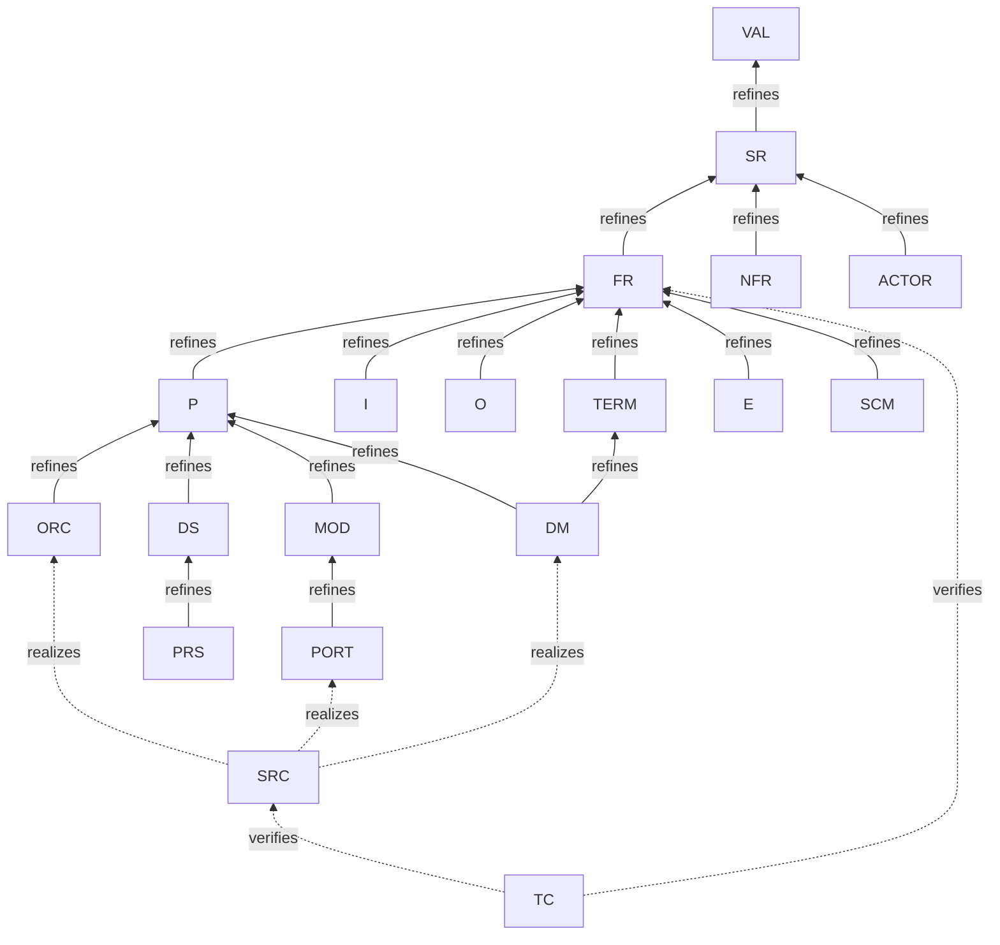

# 接続要否マトリクス

> 各要素型が、どの上流型へ参照辺を張る**必要があるか**を定義する。
> **D2 確定＝全段記載必須**：隣接1段でなく**推移上流すべて**に辺を張る。
> 凡例：**✅ 必須** ／ **○ 任意（該当時）** ／ **— 不要**

---

## 1. リファインメント骨格（直接の親）

全段必須の前提となる「直接の親」辺。これを推移的に辿った全ノードが必須接続先になる。

---

## 2. 接続要否マトリクス（全段記載必須）

行＝この要素（下流）。列の上流型へ辺を張る要否。`refines` 辺は推移閉包すべてが ✅。

| 要素型 ↓ \ 上流 → | VAL | SR | FR | NFR | TERM | P | I/O | E | ORC | DS | MOD | DM | 関係種別 |
|---|---|---|---|---|---|---|---|---|---|---|---|---|---|
| **VAL** | — | — | — | — | — | — | — | — | — | — | — | — | （根） |
| **SR** | ✅ | — | — | — | — | — | — | — | — | — | — | — | refines |
| **FR** | ✅ | ✅ | — | — | — | — | — | — | — | — | — | — | refines |
| **NFR** | ✅ | ✅ | — | — | — | — | — | — | — | — | — | — | refines |
| **TERM** | ✅ | ✅ | ✅ | — | — | — | — | — | — | — | — | — | refines |
| **ACTOR** | ✅ | ✅ | — | — | — | — | — | — | — | — | — | — | refines |
| **I** | ✅ | ✅ | ✅ | — | — | — | — | — | — | — | — | — | refines |
| **O** | ✅ | ✅ | ✅ | — | — | — | — | — | — | — | — | — | refines |
| **P** | ✅ | ✅ | ✅ | — | — | — | ○ | — | — | — | — | — | refines |
| **E** | ✅ | ✅ | ✅ | — | — | — | — | — | — | — | — | — | refines |
| **ORC** | ✅ | ✅ | ✅ | — | — | ✅ | — | ○ | — | — | — | — | refines |
| **DS** | ✅ | ✅ | ✅ | — | — | ✅ | — | — | — | — | — | — | refines |
| **MOD** | ✅ | ✅ | ✅ | — | — | ✅ | — | — | — | — | — | — | refines |
| **DM** | ✅ | ✅ | ✅ | — | ✅ | ✅ | — | — | — | — | — | — | refines |
| **PORT** | ✅ | ✅ | ✅ | — | — | ✅ | — | — | — | — | ✅ | — | refines |
| **PRS** | ✅ | ✅ | ✅ | — | — | ✅ | — | — | — | ✅ | — | — | refines |
| **SCM** | ✅ | ✅ | ✅ | — | ○ | — | — | — | — | — | — | — | refines |
| **SRC** | ⚠️ | ⚠️ | ⚠️ | — | ⚠️ | ⚠️ | — | — | ⚠️ | — | — | ⚠️ | realizes（§4 D3） |
| **TC** | ⚠️ | ⚠️ | ⚠️ | — | — | — | — | — | — | — | — | — | verifies（§4 D3） |

> NFR 列が全て「—」なのは、NFR は**上流ではなく制約**だから。NFR の遵守は
> 個別要素からの `refines` ではなく、**検証ツールが NFR ごとの規則で横断点検**する（[05](05-verification.md)）。
> 例：`NFR-001 stdlib のみ` → import 文を全 SRC で走査。

---

## 3. 横断スパイン（DD / Q / PEND）の接続

意思決定は値連鎖の外。**直接影響する要素のみ**に `affects` 辺を張る（推移なし）。

| 要素型 | 関係種別 | 接続先 | 全段？ |
|---|---|---|---|
| DD / Q / PEND | `affects` | 直接影響する任意の要素（複数可） | ✗ 推移なし・直接影響先のみ |

> `affects` 辺の `status` が**ドリフト検出の核心**：
> `DD(decided)` かつ `affects.status: pending` → 反映漏れ確定。

---

## 4. D3：実装/検証層の全段記載は重い（要確認）

### 論点
全段記載必須を `SRC`（ソース docstring）・`TC`（テスト）まで厳密適用すると、辺が爆発する。

例：`SRC-xxx` が `DM-001` を `realizes` する場合、全段＝
`{DM-001, TERM-…, P-…, FR-…, SR-…, VAL-…}` の **5〜6 辺をソースの docstring に列挙**することになる。
TC はさらに `SRC` 経由でその全段を引き継ぐため、辺数が一段と増える。

### 選択肢

| 案 | SRC/TC の接続 | 端から端のトレース | 辺数 |
|---|---|---|---|
| **A: 全段厳密適用** | SRC は VAL まで全段を列挙 | 各 SRC 単体で完結 | 多（5〜6/要素） |
| **B: 直接先のみ（推奨）** | SRC は `realizes` 先（DM/PORT/ORC）のみ／TC は `verifies` 先（FR/SRC）のみ | 設計層が既に全段を担保しているので、合成で端まで到達 | 少（1〜3/要素） |

### 推奨：B（直接先のみ）
根拠：
- 設計層（DM/PORT/ORC）が**既に VAL まで全段記載済み**なので、SRC は直接先を指すだけで推移到達が保証される。
- 実装層の辺をコード変更のたびに 5〜6 本メンテするのは現実的でない（issue #5 が問題にした"人手で抜ける"を実装層で再生産しかねない）。
- ドリフト検出に必要なのは「SRC → DM が done か」であり、SRC → VAL の有無は設計層の点検で代替できる。

> **要確認**：全段必須の例外を実装/検証層（SRC/TC）に認めるか。
> 認める場合、上表 §2 の ⚠️ セルは「直接先のみ ✅・他は —」に確定する。

---

## 5. 確定事項

| # | 決定 |
|---|---|
| D1 | id は連番（`PREFIX-NNN`）・永続・意味は title が持つ |
| D2 | 全段記載必須（推移上流すべてに辺）— ただし SRC/TC は D3 で要確認 |
