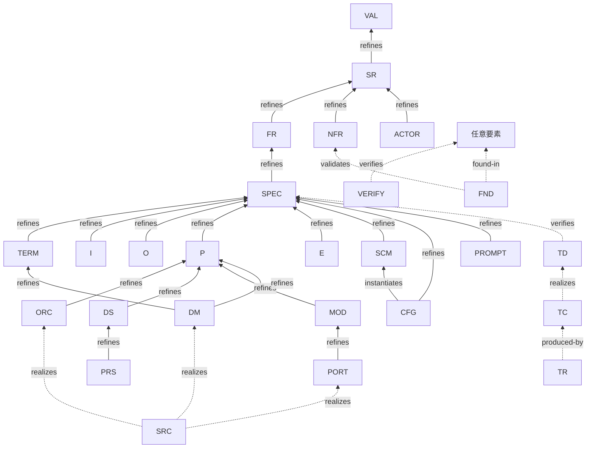

# 接続要否マトリクス

> 各要素型がどの上流型へ参照辺を張る必要があるか、またどの方向への接続が必須かを定義する。
>
> **D2 確定（旧 D2 撤回）**：各ノードは**直接の親（隣接1段）のみ**を指す。
> 全祖先への辺は不要。推移的到達はグラフ走査で計算する。
> ただし実装層（SRC/TC）も同様・直接先のみ（D3）。
>
> **DD-008**：USDM 分割により FR（機能要求）と SPEC（機能仕様・テスタブル粒度）を分離。
> 分析層以降（TERM/I/O/P/E/SCM/CFG/PROMPT）は SPEC を直接の親とする。
>
> 凡例：**✅ 必須** ／ **○ 任意（該当時）** ／ **— 不要** ／ **⚠️ 別規則**

---

## 1. リファインメント骨格（直接の親）



---

## 2. 接続要否マトリクス（直接の親のみ）

行＝この要素型（下流）。列＝直接の上流型。

| 要素型 ↓ \ 上流 → | VAL | SR | FR | SPEC | TERM | P | MOD | DS | SCM | TD | TC | 備考 |
|---|---|---|---|---|---|---|---|---|---|---|---|---|
| **VAL** | — | — | — | — | — | — | — | — | — | — | — | 根 |
| **SR** | ✅ | — | — | — | — | — | — | — | — | — | — | |
| **FR** | — | ✅ | — | — | — | — | — | — | — | — | — | |
| **SPEC** | — | — | ✅ | — | — | — | — | — | — | — | — | SPEC は FR を refines |
| **NFR** | — | ✅ | — | — | — | — | — | — | — | — | — | §4 参照 |
| **TERM** | — | — | — | ✅ | — | — | — | — | — | — | — | |
| **ACTOR** | — | ✅ | — | — | — | — | — | — | — | — | — | §5 参照 |
| **I** | — | — | — | ✅ | — | — | — | — | — | — | — | §5, §7 参照 |
| **O** | — | — | — | ✅ | — | — | — | — | — | — | — | §5, §7 参照 |
| **P** | — | — | — | ✅ | — | — | — | — | — | — | — | §5, §7 参照 |
| **E** | — | — | — | ✅ | — | — | — | — | — | — | — | §5 参照 |
| **ORC** | — | — | — | — | — | ✅ | — | — | — | — | — | E への直接辺不要（E→P→ORC の推移で到達） |
| **DS** | — | — | — | — | — | ✅ | — | — | — | — | — | |
| **MOD** | — | — | — | — | — | ✅ | — | — | — | — | — | |
| **DM** | — | — | — | — | ✅ | ✅ | — | — | — | — | — | TERM と P の両方 |
| **PORT** | — | — | — | — | — | — | ✅ | — | — | — | — | |
| **PRS** | — | — | — | — | — | — | — | ✅ | — | — | — | |
| **SCM** | — | — | — | ✅ | ○ | — | — | — | — | — | — | TERM 列は `see-also`（refines 不可） |
| **CFG** | — | — | — | ✅ | — | — | — | — | ✅ | — | — | SCM へ `instantiates` |
| **PROMPT** | — | — | — | ✅ | — | — | — | — | — | — | — | ORC から `uses` で参照される（PROMPT→ORC 辺は不要） |
| **TD** | — | — | — | ✅ | — | — | — | — | — | — | — | SPEC を `verifies`（RULE-015 の対象辺） |
| **TC** | — | — | — | — | — | — | — | — | — | ✅ | — | TD を `realizes` |
| **TR** | — | — | — | — | — | — | — | — | — | — | ✅ | TC を `produced-by` |

---

## 3. 実装・検証層の接続（D3）

| 要素型 | kind | 接続先（直接先のみ） |
|---|---|---|
| **SRC** | `realizes` | `DM-`・`PORT-`・`ORC-` |
| **TD** | `verifies` | `SPEC-` |
| **TC** | `realizes` | `TD-` |
| **TR** | `produced-by` | `TC-` |
| **VERIFY** | `verifies` | 検証対象の任意要素（直接先のみ） |
| **FND** | `found-in` | 指摘が見つかった要素 |
| **FND** | `validates` | `NFR-` |

---

## 4. NFR の接続規則（§11）

NFR は `refines` 辺の上流にはならない（他の要素が NFR を `refines` することはない）。

| 方向 | kind | 意味 |
|---|---|---|
| NFR → 設計/実装要素 | `constrains` | この NFR が何を制約するか（任意） |
| FND/TC/VERIFY → NFR | `validates` | この NFR が検証されたことの証跡 |

**必須規則（§11）**：すべての `NFR` ノードは少なくとも1本の `validates` 辺を受ける必要がある。
未検証 NFR は検証ツールが検出・報告する。

---

## 5. 直接リンク必須ノード（§10）

以下の要素型は孤立禁止。少なくとも1本の辺（`see-also` を除く）が必要。

| 要素型 | 必須リンクの方向 | 典型的な辺 |
|---|---|---|
| `VAL` | ← 下流から | `SR → VAL (refines)` |
| `ACTOR` | 任意方向 | `ACTOR → I/O` または `P → ACTOR` など |
| `I` | → P（消費） | `P → I (consumes)` |
| `O` | ← P（生成） | `P → O (produces)` |
| `E` | → P（起動） | `E → P (triggers)` |
| `SPEC` | ← TD から | `TD → SPEC (verifies)`（RULE-015） |

---

## 6. 横断スパイン（DD / Q / PEND）

| 要素型 | kind | 接続先 |
|---|---|---|
| DD / Q / PEND | `affects` | 直接影響する任意の要素（複数可） |

> `DD(decided)` の `affects` 辺に `status: pending` が残っている → **反映漏れ確定**。

---

## 7. プロセス間 I/O リンク（§7 確認済）

```
P-001 --produces--> O-001
O-001 <--consumes-- P-002    （P-002 が O-001 を消費）
```

P 同士は直接繋がない。I/O ノードを介して間接的に表現する。

---

## 8. CFG・PROMPT・テスト3層の接続

| 要素型 | kind | 接続先 | 備考 |
|---|---|---|---|
| `CFG` | `instantiates` | `SCM-` | 準拠スキーマ |
| `CFG` | `refines` | `SPEC-` | 設定が実現する機能仕様（直接の SPEC） |
| `PROMPT` | `refines` | `SPEC-` | プロンプトが実現する機能仕様（直接の SPEC） |
| `PROMPT` | `extends` | `PROMPT-` | テンプレート継承（任意） |
| `ORC` | `uses` | `PROMPT-` | どのプロンプトを使うか（ORC 側から参照・任意） |
| `TD` | `verifies` | `SPEC-` | テスト設計がどの仕様を検証するか（カバレッジ辺） |
| `TC` | `realizes` | `TD-` | テストコードがどのテスト設計を実装するか |
| `TR` | `produced-by` | `TC-` | テスト結果がどのテストコードの実行から生成されたか |

---

## 9. 確定事項

| # | 決定 |
|---|---|
| D1 | id は連番（`PREFIX-N[-N...]`）・永続 |
| D2 | **直接の親（隣接1段）のみ必須**。全祖先記載は不要 |
| D3 | SRC/TC は直接先のみ（D2 と同規則） |
| D8 | USDM 分割：FR（機能要求）→ SPEC（機能仕様・テスタブル）→ 分析層以降 |
| D9 | テスト3層：TD（verifies SPEC）→ TC（realizes TD）→ TR（produced-by TC） |
