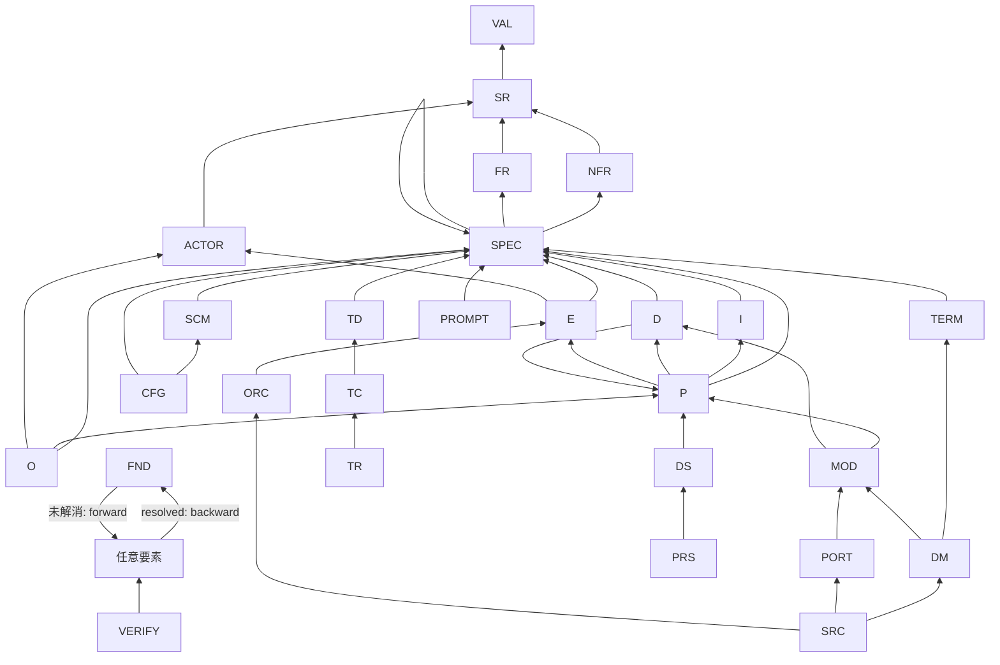

# 接続要否マトリクス

> 各要素型がどの型へ依存辺を張る必要があるか（out）、どの型から受ける必要があるか（in）を整理した文書。
> **必須接続の機械判定の正本は [config.yaml](config.yaml)** の `must_link_to` / `must_be_linked_from`。本書はその全体像を人が読めるよう図解する。
>
> **辺は無名依存辺**（DD-012）：`A → B` ＝「A は B に依存する（B が変われば A を見直す）」。
> kind ラベルは持たない。関係名は `(source 型, target 型)` から読み取る。
>
> **D2 確定**：各ノードは**直接の親（隣接1段）のみ**を指す。全祖先への辺は不要。
> **DD-008**：USDM 分割により FR と SPEC を分離。分析層以降は SPEC を直接の親とする。
> **DD-018**：内部データフローは **D 型**（系外へ出ない）。

---

## 1. リファインメント骨格（依存方向 = 下流から上流へ）



> 矢印はすべて依存辺（無名）。`O → P` は「出力は生成プロセスに依存」、`P → E` は「プロセスはトリガ事象に依存」。
> `decomposes` 辺は廃止（階層は ID パターン `X-N` から推論・DD-014）。
> **FND はライフサイクルで辺の向きが逆転（DD-16）**: 未解消 FND は `FND → 任意要素`（forward 必須）、resolved FND は `任意要素 → FND`（backward 必須・forward 不在期待）。機械判定フィールドは FND YAML の `resolved: true/false`（省略時 false）。

---

## 2. 接続要否マトリクス（依存辺・out）

行＝この要素型（依存元）。列＝依存先の型。**✅ 必須** ／ **○ 任意** ／ **— 不要**。

| 要素型 ↓ \ 依存先 → | VAL | SR | NFR | FR | SPEC | TERM | ACTOR | P | I | D | E | MOD | DS | SCM | TD | TC | 備考 |
|---|---|---|---|---|---|---|---|---|---|---|---|---|---|---|---|---|---|
| **VAL** | — | — | — | — | — | — | — | — | — | — | — | — | — | — | — | — | 根 |
| **SR** | ✅ | — | — | — | — | — | — | — | — | — | — | — | — | — | — | — | |
| **FR** | — | ✅ | — | — | — | — | — | — | — | — | — | — | — | — | — | — | |
| **SPEC** | — | — | ✅ | ✅ | ✅ | — | — | — | — | — | — | — | — | — | — | — | FR / NFR / 別 SPEC（-N 子）のいずれか（OR・DD-5・FND-24） |
| **NFR** | — | ✅ | — | — | — | — | — | — | — | — | — | — | — | — | — | — | §4 |
| **TERM** | — | — | — | — | ✅ | — | — | — | — | — | — | — | — | — | — | — | |
| **ACTOR** | — | ✅ | — | — | — | — | — | — | — | — | — | — | — | — | — | — | |
| **I** | — | — | — | — | ✅ | — | — | — | — | — | — | — | — | — | — | — | P から消費される（in） |
| **O** | — | — | — | — | ✅ | — | ✅ | ✅ | — | — | — | — | — | — | — | — | O→P（生成元）・O→ACTOR（受け手） |
| **D** | — | — | — | — | ✅ | — | — | ✅ | — | — | — | — | — | — | — | — | D→P（生成元）。系外に出ない |
| **P** | — | — | — | — | ✅ | — | — | — | ○ | ○ | ○ | — | — | — | — | — | P→I/D（消費）・P→E（トリガ）は該当時 |
| **E** | — | — | — | — | ✅ | — | ✅ | — | — | — | — | — | — | — | — | — | E→ACTOR（刺激元・DD-020） |
| **ORC** | — | — | — | — | — | — | — | — | — | — | ✅ | — | — | — | — | — | DD-15: 起動イベント E を参照 |
| **DS** | — | — | — | — | — | — | — | ✅ | — | — | — | — | — | — | — | — | |
| **MOD** | — | — | — | — | — | — | — | ✅ | — | ✅ | — | — | — | — | — | — | P または D（OR・FND-96） |
| **DM** | — | — | — | — | — | ✅ | — | — | — | — | — | ✅ | — | — | — | — | TERM と MOD（FND-96） |
| **PORT** | — | — | — | — | — | — | — | — | — | — | — | ✅ | — | — | — | — | |
| **PRS** | — | — | — | — | — | — | — | — | — | — | — | — | ✅ | — | — | — | |
| **SCM** | — | — | — | — | ✅ | — | — | — | — | — | — | — | — | — | — | — | |
| **CFG** | — | — | — | — | ✅ | — | — | — | — | — | — | — | — | ✅ | — | — | SCM と SPEC |
| **PROMPT** | — | — | — | — | ✅ | — | — | — | — | — | — | — | — | — | — | — | ORC から参照される |
| **TD** | — | — | — | — | ✅ | — | — | — | — | — | — | — | — | — | — | — | SPEC を検証 |
| **TC** | — | — | — | — | — | — | — | — | — | — | — | — | — | — | ✅ | — | TD を実装 |
| **TR** | — | — | — | — | — | — | — | — | — | — | — | — | — | — | — | ✅ | TC の実行結果 |

---

## 3. 被依存辺（in）— 受けねばならない辺

| 要素型 | 受けるべき source（OR） | severity | 備考 |
|---|---|---|---|
| **VAL** | SR | error | 価値命題は下流に支えられる |
| **SR** | FR / NFR / ACTOR | warning | いずれかに展開される |
| **FR** | SPEC | warning | テスタブル仕様に分解 |
| **I** | P | error | 消費プロセスを持つ（P→I） |
| **E** | P | error | 起動プロセスを持つ（P→E） |
| **D** | P | error | 消費プロセスを持つ（P→D） |
| **ACTOR** | E / I / O | warning | 事象起動・入力提供・出力受領のいずれか |
| **SPEC** | TD | warning | テスト設計で覆われる |
| **TD** | TC | warning | コードで実装される |
| **TC** | TR | warning | 実行され結果を残す |
| **NFR** | SPEC | warning | SPEC に分解される（DD-5・requirements 以降） |
| **NFR** | FND / TC / VERIFY | warning | 検証証跡を受ける（verification 以降） |

> テスト実施保証の鎖：`SPEC ← TD ← TC ← TR`。TR が証跡（result/log_ref）を強制される（RULE-020/021）。

---

## 4. NFR の接続規則

DD-5（2026-06-13）により、**SPEC は NFR を直接の refines 先にできる**（`must_link_to: SPEC → [FR, NFR, SPEC]`）。各 NFR は requirements ステージから最低 1 本の SPEC 被依存辺が必須（warning）。旧記述「NFR は refines 上流にはならない」は DD-5 で無効化された。

| 方向 | 意味 |
|---|---|
| SPEC → NFR | NFR を仕様に分解（必須・DD-5・requirements ステージ） |
| NFR → 設計/実装要素 | この NFR が何を制約するか（任意・旧 constrains） |
| FND/TC/VERIFY → NFR | この NFR が検証された証跡（§3 の被依存辺・OR・verification ステージ） |

---

## 5. 直接リンク必須ノード（孤立禁止）

完全孤立（in/out 0 本）は RULE-005（always_error）。加えて §2/§3 の必須接続を満たす。

| 要素型 | 必須リンク |
|---|---|
| `VAL` | ← SR（refines・in） |
| `ACTOR` | → SR（out）かつ ← E/I/O（in・OR） |
| `I` | → SPEC（out）かつ ← P（in） |
| `O` | → SPEC・→ P・→ ACTOR（out） |
| `D` | → SPEC・→ P（out）かつ ← P（in） |
| `E` | → SPEC・→ ACTOR（out）かつ ← P（in） |
| `SPEC` | ← TD（in）。`condition` 属性必須（RULE-016） |

---

## 6. 横断スパイン（DD / Q / PEND）— 義務辺モデル

| 要素型 | 辺 | 意味 |
|---|---|---|
| DD / Q / PEND | → 影響する任意要素 | 義務辺（反映が要る対象） |

> **`DD→X` 辺が存在する = RULE-001 ERROR（反映未完了）**。
> 反映完了で **`DD→X` を削除し `X→DD`（依存辺）を追加**する（DD-016）。
> Q→X = RULE-002 WARNING・PEND→X = RULE-022 WARNING。義務辺にも ref_version 必須（DD-015）。

---

## 7. プロセス間 I/O/D リンク（依存方向）

```
P-001 → I-001    （P-001 が I-001 を消費：P は I に依存）
O-001 → P-001    （O-001 は P-001 が生成：O は P に依存）
D-001 → P-001    （D-001 は P-001 が生成：D は P に依存）
P-002 → D-001    （P-002 が D-001 を消費：P は D に依存）
```

- P 同士は直接繋がない。I/O/D ノードを介して間接表現する。
- **系外アクタとやり取りする入出力＝I/O**（O→ACTOR が必須）。
- **プロセス間だけで完結する中間データ＝D**（系外へ出ない・O→ACTOR 不要）。

---

## 8. CFG・PROMPT・テスト3層の接続

| 要素型 | 依存先 | 意味 |
|---|---|---|
| `CFG` | `SCM-` | スキーマを具体化（旧 instantiates） |
| `CFG` | `SPEC-` | 実現する機能仕様 |
| `PROMPT` | `SPEC-` | 実現する機能仕様 |
| `PROMPT` | `PROMPT-` | テンプレート継承（任意・旧 extends） |
| `ORC` | `PROMPT-` | どのプロンプトを使うか（任意・旧 uses） |
| `TD` | `SPEC-` | どの仕様を検証するか |
| `TC` | `TD-` | どのテスト設計を実装するか |
| `TR` | `TC-` | どのテストコードの実行結果か |

---

## 9. 確定事項

| # | 決定 |
|---|---|
| D1 | id は連番（`PREFIX-N[-N...]`）・永続 |
| D2 | 直接の親（隣接1段）のみ必須。全祖先記載は不要 |
| D3 | SRC/TC は直接先のみ |
| D8 | USDM 分割：FR → SPEC → 分析層以降 |
| D9 | テスト3層：TD（→SPEC）→ TC（→TD）→ TR（→TC） |
| D10 | **kind 廃止**：辺は無名依存辺（DD-012） |
| D11 | **依存方向統一**：O→P・P→E・O/E→ACTOR（DD-017） |
| D12 | **D 型新設**：プロセス間内部データフロー（DD-018） |
| D13 | **decomposes 廃止**：階層は ID パターン（DD-014） |
| D14 | **E→ACTOR 必須**：アクタなし事象は FR で表現（DD-020） |
