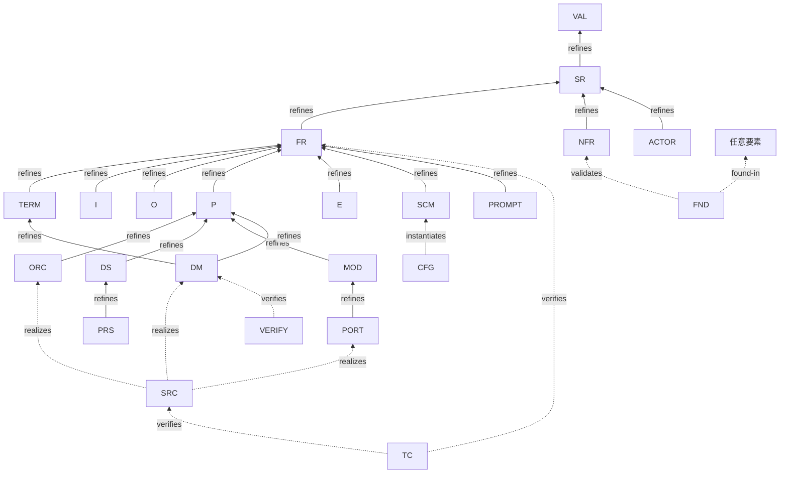

# 接続要否マトリクス

> 各要素型がどの上流型へ参照辺を張る必要があるか、またどの方向への接続が必須かを定義する。
>
> **DD-003 確定**：各ノードは**推移上流すべて**に辺を張る（隣接1段だけでなく全祖先）。
> ただし実装層（SRC/TC）は直接先のみ（D3確定・[02 §8](02-meta-schema.md)）。
>
> 凡例：**✅ 必須** ／ **○ 任意（該当時）** ／ **— 不要** ／ **⚠️ 別規則**

---

## 1. リファインメント骨格（直接の親）

全祖先必須の前提となる「直接の親」。各ノードはこれを推移的に辿った全ノードが必須接続先。



---

## 2. 接続要否マトリクス（refines 辺・全祖先分）

行＝この要素型（下流）。各列への `refines` 辺の要否。

| 要素型 ↓ \ 上流 → | VAL | SR | FR | NFR | TERM | P | ACTOR | I/O | E | ORC | DS | MOD | DM | 備考 |
|---|---|---|---|---|---|---|---|---|---|---|---|---|---|---|
| **VAL** | — | — | — | — | — | — | — | — | — | — | — | — | — | 根 |
| **SR** | ✅ | — | — | — | — | — | — | — | — | — | — | — | — | |
| **FR** | ✅ | ✅ | — | — | — | — | — | — | — | — | — | — | — | |
| **NFR** | ✅ | ✅ | — | — | — | — | — | — | — | — | — | — | — | §4 参照 |
| **TERM** | ✅ | ✅ | ✅ | — | — | — | — | — | — | — | — | — | — | |
| **ACTOR** | ✅ | ✅ | — | — | — | — | — | — | — | — | — | — | — | §5 参照 |
| **I** | ✅ | ✅ | ✅ | — | — | — | — | — | — | — | — | — | — | §5 参照 |
| **O** | ✅ | ✅ | ✅ | — | — | — | — | — | — | — | — | — | — | §5 参照 |
| **P** | ✅ | ✅ | ✅ | — | — | — | — | ○ | — | — | — | — | — | §5, §7 参照 |
| **E** | ✅ | ✅ | ✅ | — | — | — | — | — | — | — | — | — | — | §5 参照 |
| **ORC** | ✅ | ✅ | ✅ | — | — | ✅ | — | — | ○ | — | — | — | — | |
| **DS** | ✅ | ✅ | ✅ | — | — | ✅ | — | — | — | — | — | — | — | |
| **MOD** | ✅ | ✅ | ✅ | — | — | ✅ | — | — | — | — | — | — | — | |
| **DM** | ✅ | ✅ | ✅ | — | ✅ | ✅ | — | — | — | — | — | — | — | |
| **PORT** | ✅ | ✅ | ✅ | — | — | ✅ | — | — | — | — | — | ✅ | — | |
| **PRS** | ✅ | ✅ | ✅ | — | — | ✅ | — | — | — | — | ✅ | — | — | |
| **SCM** | ✅ | ✅ | ✅ | — | ○ | — | — | — | — | — | — | — | — | |
| **CFG** | ✅ | ✅ | ✅ | — | — | — | — | — | — | — | — | — | — | SCM `instantiates` |
| **PROMPT** | ✅ | ✅ | ✅ | — | — | — | — | — | — | ○ | — | — | — | |
| **SRC** | — | — | — | — | — | — | — | — | — | — | — | — | ✅ | realizes のみ（§3） |
| **TC** | — | — | ✅ | — | — | — | — | — | — | — | — | — | — | verifies のみ（§3） |
| **VERIFY** | — | — | — | — | — | — | — | — | — | — | — | — | — | §3, §4 参照 |
| **FND** | — | — | — | — | — | — | — | — | — | — | — | — | — | §4 参照 |

---

## 3. 実装・検証層の接続（D3 確定）

`refines` の全祖先記載は実装・検証層に適用しない。直接先のみ必須。

| 要素型 | 辺の向き | kind | 接続先 | 全祖先？ |
|---|---|---|---|---|
| **SRC** | → | `realizes` | `DM-`・`PORT-`・`ORC-` | ✗ 直接先のみ |
| **TC** | → | `verifies` | `FR-`・SRC | ✗ 直接先のみ |
| **VERIFY** | → | `verifies` | 検証対象の任意要素 | ✗ 直接先のみ |
| **FND** | → | `found-in` | 指摘が見つかった要素 | ✗ 直接先のみ |
| **FND** | → | `validates` | `NFR-` | ✗ 直接先のみ |

---

## 4. NFR の接続規則（§11）

NFR は `refines` 辺の**上流**にはならない。代わりに以下2方向の辺が必要：

| 方向 | kind | 意味 |
|---|---|---|
| NFR **→** 設計/実装要素 | `constrains` | この NFR が何を制約するかを明示 |
| FND/TC/VERIFY **→** NFR | `validates` | この NFR が実際に検証されたことを証明 |

**必須規則（§11）**：すべての `NFR` ノードは、少なくとも1本の `validates` 辺を**受ける**必要がある。
`validates` 辺が存在しない NFR → 検証ツールが未検証として検出・報告する。

---

## 5. 直接リンク必須ノード（§10）

以下の要素型は**孤立を禁止**する。少なくとも1本の辺（種別不問）が必要。

| 要素型 | 必須リンクの方向 | 典型的な辺 |
|---|---|---|
| `VAL` | 下流から ← | `SR → VAL (refines)` |
| `ACTOR` | 任意方向 | `ACTOR → I/O/P` など |
| `I` | → P（下流） | `P → I (consumes)` または `I → P (triggers)` |
| `O` | ← P（上流） | `P → O (produces)` |
| `E` | → P（下流） | `E → P (triggers)` |

> 孤立検出は検証ツールの段階① で実施。`see-also` のみの接続は孤立と見なす（伝播辺が必要）。

---

## 6. 横断スパイン（DD / Q / PEND）

意思決定は値連鎖の外。`affects` 辺は全祖先不要・直接影響先のみ。

| 要素型 | kind | 接続先 | 全祖先？ |
|---|---|---|---|
| DD / Q / PEND | `affects` | 直接影響する任意の要素（複数可） | ✗ 直接影響先のみ |

> `DD(decided)` の `affects` 辺に `status: pending` が残っている → **反映漏れ確定**。

---

## 7. プロセス間 I/O リンク（§7 確認済）

プロセス間のデータ授受は `I` と `O` を結ぶことで表現する。

```
P-001 --produces--> O-001
O-001 (の値) --consumes--> P-002
```

`O-001` が `P-002` の入力になる場合、`P-002` は `O-001` を参照（同一の O ノードを共有）。
プロセス間の依存は `I/O` ノードを介して間接的に表現され、P 同士が直接繋がることはない。

---

## 8. CFG・PROMPT の接続

| 要素型 | 接続 | kind | 備考 |
|---|---|---|---|
| `CFG` | → `SCM-`（準拠スキーマ） | `instantiates` | |
| `CFG` | → `DM-`（型定義）・`PORT-` | `instantiates` | |
| `CFG` | → `FR-`（全祖先） | `refines` | 設定が実現する機能仕様 |
| `PROMPT` | → `FR-`（全祖先） | `refines` | プロンプトが実現する機能 |
| `PROMPT` | → `PROMPT-`（親テンプレート）| `extends` | テンプレート継承 |
| `PROMPT` | → `ORC-` | `refines` | どの段で使われるか（任意） |

---

## 9. 確定事項

| # | 決定 |
|---|---|
| D1 | id は連番（`PREFIX-N[-N...]`）・永続・意味は heading が持つ |
| D2 | 全祖先記載必須（SRC/TC は直接先のみ・D3）|
| D3 | SRC/TC は直接先のみ（設計層が VAL まで担保済みのため） |
