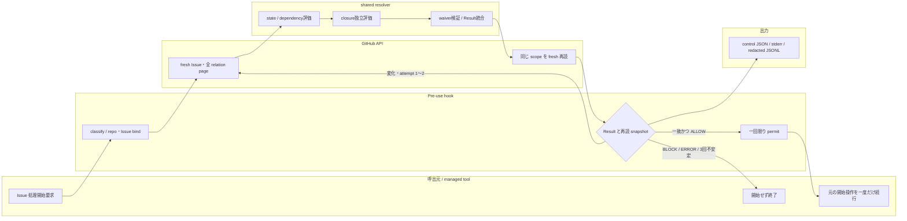
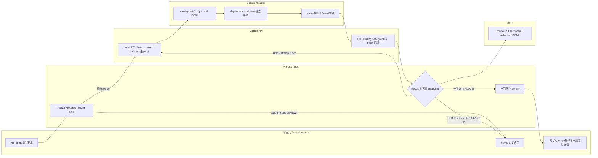

# Blocker gate pre-use policy

- Policy version: `1.0`
- 対象: Issue #295（親 #293、実装 #296〜#299）
- 正本: Issue #294 の「調査後のオーナー決定（現在の正本）」と Issue #295
- Enforcement boundary: managed tool の Issue 処理開始操作および PR merge 相当操作の pre-use hook

## 1. 結論

管理対象操作は、**同じ invocation の中で GitHub の現状態を読み、判定が `ALLOW` の場合に限って元の操作を一度だけ続行する**。`BLOCK` または `ERROR` なら元操作を実行しない。過去の成功、Actions status、cache、定期監査結果を ALLOW 根拠として再利用しない。

依存の正本は GitHub native `blocked-by`、包含の正本は native parent/sub-issue とする。本文の `Blocked by:`、related link、Project Status は判定根拠にしない。PR が default branch への merge で閉じる Issue は、GraphQL `closingIssuesReferences` と、PR の全 commit message を GitHub closing keyword grammar で解析した集合の和集合とする。この closing set を仮想的に `CLOSED/COMPLETED` にして dependency と closure を評価する。default branch 以外への merge、または closing set が空の merge は Issue を閉じないため `ALLOW/NO_CLOSING_EFFECT` 候補となり、Issue link の必須化は本 blocker policy の責務に含めない。

この policy が保証するのは managed path だけである。GitHub UI、hook 外の API、direct push/ref update は unmanaged であり、完全同期や race-free な GitHub 全体の merge 保証は行わない。managed auto-merge の enable/schedule は、検査と merge が別 invocation になるため常に拒否する。

Issue #294 の調査過程にある Actions-only の bounded profile / strict profile は、本 policy により **superseded** された。polling、relation-change event、long-lived green、merge queue、external App は primary gate ではない。GitHub Actions は無料範囲の任意の defense-in-depth に限る。

### 1.1 読み手と二層構成

| 読み手 | 必要な情報 | 参照層 |
|---|---|---|
| #296 resolver / waiver verifier | 型、真理値表、Result、JSON schema、version | frontmatter と機械契約 |
| #297/#298 pre-use hook | classifier、束縛、実行順、一回限り permit、exit | 機械契約と orchestration |
| #299 auditor | asset/version stamp、redacted log、waiver lifecycle、drift | 機械契約と監査契約 |
| repository owner / waiver owner・approver | 保証境界、理由、期限、対象 finding、復旧行動 | 本文と waiver の人向け属性 |
| reviewer / LLM | owner decision、非スコープ、各 AC の trace | 本文 |

frontmatter とコードブロック内 schema は機械が読む正本、本文は人と LLM が意味・運用境界を確認する層である。機械は自由記述の妥当性を推測せず、owner/approver は waiver の必要性と理由を判断する。順序・型・期限・scope・署名・版は機械 gate、例外を認める業務判断は人の責務とする。

## 2. 用語と型

### 2.1 操作分類

classifier の出力は次の閉じた型である。

```text
ManagedOperation =
  | IssueStart { repository, issue_number, operation_fingerprint }
  | PullRequestMerge {
      repository, pr_number, merge_method, transport,
      operation_fingerprint
    }
  | DeniedAutoMerge { repository?, pr_number?, operation_fingerprint }
  | UnknownPotentialManaged { tool_name, operation_fingerprint }

MergeTransport =
  | CliDirect
  | CliWrapped { wrappers }
  | RestPullsMergeEndpoint
  | ConnectorMergeTool
```

- `IssueStart` と `PullRequestMerge` だけを evaluator へ渡す。
- `DeniedAutoMerge` は `BLOCK/AUTO_MERGE_DENIED` とし、元操作を実行しない。
- `UnknownPotentialManaged` は `ERROR/CLASSIFIER_UNKNOWN` とし、元操作を実行しない。
- repository、Issue/PR 番号、merge method を tool schema または command AST から一意に確定できない場合は `UnknownPotentialManaged` とする。shell の表示文字列を推測して補完しない。

classifier は managed hook が受け取った入力について次の表を完全に適用する。merge の可能性がある入力を「非対象」として通過させる型は設けない。

| 入力 | 分類 | 処置 |
|---|---|---|
| `gh pr merge <PR>` / `gh -R owner/repo pr merge <PR>` | `PullRequestMerge/CliDirect` | target/method を束縛して gate |
| allowlist 済み `rtk`、`command`、`builtin`、`exec` で包んだ上記 command | `PullRequestMerge/CliWrapped` | wrapper を順に構文解析し、shell evaluate せず gate |
| `PUT /repos/{owner}/{repo}/pulls/{pull_number}/merge` を送る `gh api` 等 | `PullRequestMerge/RestPullsMergeEndpoint` | 同じ tool invocation を中断・再開できる場合だけ gate。不能なら ERROR |
| schema 既知の `github_merge_pull_request` 等 | `PullRequestMerge/ConnectorMergeTool` | tool-level pre-use で gate。Bash matcher だけなら使用を deny |
| `gh pr merge --auto`、`github_enable_auto_merge`、auto-merge enable/schedule API | `DeniedAutoMerge` | 常に BLOCK |
| GraphQL `mergePullRequest`、未知 alias/wrapper/tool、merge の可能性を否定できない raw API | `UnknownPotentialManaged` | registry/fixture 更新まで ERROR |
| merge と Issue-start のどちらでもないことを閉じた grammar で証明できる操作 | gate 対象外 | blocker gate の ALLOW は発行しない |

GitHub UI、managed hook 外の API client、direct push/ref update は classifier の入力ではなく、別 manifest の `unmanaged_paths` に記録する非保証経路である。managed tool 内で同じ操作が観測された場合は unmanaged として通過させず `UnknownPotentialManaged` とする。

### 2.2 Issue identity と状態 classifier

Issue の同一性は `repository.nameWithOwner`、GitHub node ID、Issue number の三つ組で保持する。三者が既読値と矛盾した場合は `ERROR/IDENTITY_MISMATCH` とする。

```text
IssueClass =
  | OPEN
  | CLOSED_COMPLETED
  | CLOSED_NOT_PLANNED
  | UNKNOWN
```

分類規則は次のとおりである。

| GitHub state | state reason | IssueClass | dependency 上の意味 |
|---|---|---|---|
| `OPEN` | null / reopened | `OPEN` | 未解決 |
| `CLOSED` | `COMPLETED` | `CLOSED_COMPLETED` | 解決済み |
| `CLOSED` | `NOT_PLANNED` | `CLOSED_NOT_PLANNED` | 解決済み。state reason は evidence に保持 |
| その他、欠落、矛盾 | 任意 | `UNKNOWN` | `ERROR/ISSUE_STATE_UNKNOWN` |

PR closing set 内の Issue は post-merge 仮想状態で `CLOSED_COMPLETED` とする。物理 state は変更しない。GitHub が closed と返す blocker は state reason にかかわらず解決済みとし、open blocker だけを dependency violation とする。waiver は後述の限定条件でのみ使用できる。

### 2.3 Relation の意味

| relation | 意味 | 判定での用途 |
|---|---|---|
| native `blocked-by` | 実行順依存 | direct/transitive dependency evaluator の唯一の正本 |
| native parent/sub-issue | work item の包含 | closure invariant evaluator の唯一の正本 |
| related / Issue・PR 本文 / Project fields | 参照・表示 | verdict には使用しない。drift は #299 が監査 |

同一 repository 内 relation のみ policy `1.0` の managed 対象とする。cross-repository node、transfer 後の repository 不一致、削除・非可視 node は `ERROR/CROSS_REPOSITORY_UNSUPPORTED` または `ERROR/RELATION_TARGET_UNREADABLE` とする。`404` を「relation なし」に読み替えない。

## 3. データ取得契約

### 3.1 API と pagination

- Issue 本体、native blocked-by、parent、sub-issue は GitHub REST API を使用し、`X-GitHub-Api-Version: 2026-03-10` を固定する。
- PR、default branch、head SHA、base branch、closing Issues、全 commit は GitHub GraphQL API を使用する。REST による同値の再束縛を併用してよいが、意味を変更してはならない。
- list/connection は `per_page=100` または `first=100` で全 page/cursor を完走する。`Link rel=next` または `hasNextPage=true` が残る状態で評価へ進まない。
- GraphQL top-level error、partial `errors`、null connection、同一 cursor/page の再訪、順序中の identity 矛盾は `ERROR` とする。
- 1 invocation 当たり最大 10,000 unique Issue nodes、dependency/parent depth 最大 100 とする。超過は `ERROR/GRAPH_LIMIT_EXCEEDED` であり、途中までの graph を ALLOW に使わない。
- timeout、`403`、`404`（存在確認済み resource を含む）、`410`、`429`、`5xx`、invalid JSON は `ERROR` とする。`429`/`5xx` は `Retry-After` が 30 秒以下の場合だけ最大2回再試行できる。全3 attempt 失敗、30秒超、header 不正なら `ERROR/API_UNAVAILABLE` とする。
- invocation 外 cache、前回の graph、前回の green status へ fallback しない。

### 3.2 parent/sub-issue の整合性

parent は Issue 本体の `parent_issue_url` と parent endpoint、children は sub-issues endpoint を全 page 読む。`child.parent == parent` と `parent.subIssues contains child` の双方向が一致しない場合は、一度だけ対象 relation を fresh read し直す。再度不一致なら `ERROR/RELATION_INCONSISTENT` とする。

訪問中 node への再入、self relation、parent cycle、dependency cycle は `ERROR/GRAPH_CYCLE` とする。cycle 内 node が closing set に含まれていても ALLOW にしない。

## 4. PR closing set policy

### 4.1 前提

PR は `OPEN`、draft でなければならない。違反はそれぞれ `BLOCK/PR_NOT_OPEN`、`BLOCK/PR_DRAFT` とする。base branch が fresh read した repository default branch と一致しない場合、GitHub の automatic closure はこの invocation では起きないため closing set を空とし、blocker/closure finding がない `ALLOW/NO_CLOSING_EFFECT` 候補として扱う。non-default merge 自体を blocker policy で禁止しない。

最初に次を同一 invocation へ束縛する。

```text
PrBinding = {
  repository_node_id,
  pr_node_id,
  pr_number,
  state,
  is_draft,
  head_oid,
  base_ref_name,
  default_branch,
  merge_method,
  operation_fingerprint,
  policy_version
}
```

全取得後は次も同じ invocation の評価 snapshot に束縛する。

```text
EvaluatedSnapshot = {
  pr_binding,
  graphql_closing_set,
  commit_closing_set,
  closing_set,
  issue_state_fingerprint,
  dependency_fingerprint,
  closure_fingerprint,
  policy_blob_sha,
  waiver_blob_shas
}
```

fingerprint は canonical identity、state/state reason、全 relation edge、全 page 完了 marker を canonical JSON にして SHA-256 を取る。closing set だけを束縛して graph の変化を無視してはならない。

### 4.2 GraphQL set と commit-only set

`GraphqlClosingSet` は `PullRequest.closingIssuesReferences` の全 cursor を完走して得た集合である。PR body の closing keyword と GitHub の manual linked Issue はこの集合に委ね、PR body を独自 parser で再解釈しない。

default branch を base とする場合だけ、`CommitClosingSet` は PR の `commits` connection を全 cursor 取得し、各 commit の**省略されていない完全な message**を次の grammar で解析した集合である。

```ebnf
keyword   = "close" | "closes" | "closed"
          | "fix" | "fixes" | "fixed"
          | "resolve" | "resolves" | "resolved" ;  (* ASCII case-insensitive *)
reference = "#" positive_integer
          | owner "/" repository "#" positive_integer
          | "https://github.com/" owner "/" repository "/issues/" positive_integer ;
clause    = keyword, 1*WSP, reference ;
```

- keyword は ASCII word boundary で始まり、reference の直後は whitespace、句読点、行末のいずれかでなければならない。
- `#0`、leading sign、小数、範囲、変数、短縮 URL、`pull/` URL、GitHub 以外の URL は reference ではない。
- keyword の直後の非空白 token が `#`、`owner/repository#`、`https://github.com/.../issues/` で始まるにもかかわらず grammar を満たさない場合は `ERROR/CLOSING_KEYWORD_PARSE` とする。単なる自然文の “fixes performance” は closing clause ではなく error にしない。
- parser は全出現を収集する。同じ Issue の重複は canonical identity で除去する。
- unqualified `#N` は対象 PR と同じ repository に束縛する。qualified reference が別 repository を指す場合は `ERROR/CROSS_REPOSITORY_UNSUPPORTED` とする。
- commit message が欠落、切り詰め、decode不能、pagination 未完走なら `ERROR/COMMIT_SET_INCOMPLETE` とする。

最終集合は次で固定する。差分は曖昧ではなく取得経路の違いとして保持する。

```text
ClosingSet = canonicalize(GraphqlClosingSet union CommitClosingSet)
```

これにより default branch 到達時の commit-message-only closure を漏らさない。merge command が squash/merge message の subject/body を指定できる場合も、元 operation object の完全な値を同じ grammar で解析し `CommitClosingSet` に加える。解析前の値を shell 展開しない。JSON evidence には `graphql_closing_set`、`commit_closing_set`、`closing_set` を別々に出す。

closing set が空なら dependency/closure の root は空であり、`ALLOW/NO_CLOSING_EFFECT` 候補とする。この policy は「すべての PR が Issue を閉じる」という別の tracking 規則を暗黙に追加しない。default branch 以外では commit closing keyword がその merge 自体で Issue を閉じないため解析結果を closing set に加えず、後に default branch へ到達させる PR invocation が全 commit を再評価する。

### 4.3 same-PR virtual close

`ClosingSet` の全 Issue を仮想的に `CLOSED_COMPLETED` としてから評価する。この変換は集合全体へ一括適用し、Issue ごとに順番に適用してはならない。

- A が B に blocked-by され、A と B が同じ closing set にあれば、B は仮想解決済みであり blocker ではない。
- parent P と全 open descendant が同じ closing set にあれば、post-merge closure invariant を満たす。
- parent P だけが closing set にあり open descendant が残れば `BLOCK/CLOSURE_OPEN_DESCENDANT` とする。
- same-PR virtual close を適用しても cycle、unknown state、incomplete read は `ERROR` のままである。

## 5. dependency と closure の規則

### 5.1 dependency evaluator

Issue mode の root は対象 Issue、PR mode の root は closing set の全 Issue とする。各 root から native blocked-by を深さ優先で辿り、経路を canonical node 列で保存する。

1. 仮想状態を含む `CLOSED_COMPLETED` / `CLOSED_NOT_PLANNED` blocker はその枝を解決済みとして終了する。closed node より上流の relation は target の未解決 blocker path に含めない。
2. `OPEN` blocker は `BLOCK/OPEN_BLOCKER` である。さらに blocked-by を辿り、transitive path と cycle を収集する。
3. `UNKNOWN` は `ERROR/ISSUE_STATE_UNKNOWN` とする。
4. direct と transitive finding をすべて返す。1件見つけて取得を打ち切らない。途中の API error があれば BLOCK ではなく ERROR を最終 verdict とする。

Issue-start 対象自体が `OPEN` でなければ `BLOCK/TARGET_ISSUE_NOT_OPEN` とする。

### 5.2 closure invariant evaluator

closure は dependency と独立に評価し、最後に同じ Result へ統合する。

```text
Invariant: CLOSED(parent) implies every direct and transitive sub-issue is CLOSED.
```

ここで `CLOSED` は物理 `CLOSED_COMPLETED` / `CLOSED_NOT_PLANNED` と PR mode の virtual `CLOSED_COMPLETED` の両方を含む。descendant の `OPEN` は violation である。

- Issue mode の scope は対象 Issue、その全 ancestor、対象 Issue の全 descendant とする。
- PR mode の scope は closing set 各 Issue、その全 ancestor、closing set 各 Issue の全 descendant の和集合とする。
- scope 内の closed parent に open descendant があれば `BLOCK/CLOSURE_OPEN_DESCENDANT` とする。
- open parent に open child がいる通常の未完状態は violation ではない。
- relation の片方向不一致、cycle、unreadable descendant は ERROR とする。

### 5.3 統合優先順位

dependency/closure の全 stage を完走し、次の優先順位で統合する。

```text
ERROR > BLOCK > ALLOW
```

一つでも ERROR finding があれば ERROR、一つでも未waive BLOCK finding があれば BLOCK、それ以外は ALLOW である。ERROR を BLOCK または空集合へ変換しない。

## 6. waiver contract

### 6.1 保存場所と schema

waiver は current default branch の `.github/blocker-gate/waivers/<id>.yml` に置く repository file だけを認める。Issue/PR コメント、Project field、環境変数、ローカルファイル、CLI flag は waiver にならない。approver allowlist と policy parameters の正本は `.github/blocker-gate/policy.yml` とする。

```yaml
schema: blocker-gate-waiver/v1
id: BW-20260801-001
policy_version: "1.0"
repository: hiratashinnya/review-system
owner: owner-login
reason: "期限内に先行検証を行う必要があるため"
requested_by: login
approved_by: owner-login
approved_at: "2026-08-01T00:00:00Z"
expires_at: "2026-08-08T00:00:00Z"
scope:
  mode: issue-start           # issue-start | pr-merge
  subject:
    type: issue               # issue | pull_request。mode と一致必須
    number: 123
  finding_fingerprints:
    - sha256:0123456789abcdef0123456789abcdef0123456789abcdef0123456789abcdef
```

`.github/blocker-gate/policy.yml` は少なくとも次を持つ。

```yaml
schema: blocker-gate-policy/v1
policy_version: "1.0"
approver_allowlist:
  - owner-login
max_waiver_lifetime_hours: 168
protected_default_branch: main
```

unknown key、duplicate key、YAML anchor/alias/tag、複数 document、非UTF-8、schema/type不一致は `ERROR/WAIVER_SCHEMA_INVALID` とする。時刻は UTC の RFC 3339 `Z`、`expires_at > approved_at`、有効期間は168時間以下でなければならない。

| field | type / constraint | 読み手と判定 |
|---|---|---|
| `schema` / `policy_version` | 固定 enum / `MAJOR.MINOR` | #296 が互換性を機械判定 |
| `id` | `^BW-[0-9]{8}-[0-9]{3,}$`、repository内一意 | #296/#299 が識別・重複検出 |
| `repository` | canonical `owner/name` | #296 が invocation と完全一致 |
| `owner` / `requested_by` | GitHub login | 人の説明責任、#299 lifecycle |
| `reason` | 1〜1000文字、制御文字なし | owner/approver が妥当性判断、機械は形式だけ検証 |
| `approved_by` / `approved_at` | allowlist login / UTC時刻 | #296 が signer・時刻と照合 |
| `expires_at` | UTC時刻、承認後かつ最大期間内 | #296 が invocation時刻で判定、#299 が失効処理 |
| `scope.mode` / `scope.subject` | closed enum / exact target | #296 が対象外への転用を拒否 |
| `scope.finding_fingerprints` | 1件以上、unique SHA-256 | #296 が exact finding だけを waive |

### 6.2 finding fingerprint

waiver は finding を正規化した次の UTF-8 JSON（key sort、余分な空白なし）に対する SHA-256 と完全一致した場合だけ適用する。

```json
{"code":"OPEN_BLOCKER","mode":"issue-start","path":["hiratashinnya/review-system#123","hiratashinnya/review-system#120"],"subject":"hiratashinnya/review-system#123"}
```

対象にできる code は `OPEN_BLOCKER` だけである。closure violation、対象 closed、auto-merge、classifier/API/parse/pagination/cycle/identity/permission ERROR は waive できない。新しい finding または path 変化は別 fingerprint となり、既存 waiver を適用しない。

`owner` は waiver の理由・scope・期限・失効処理に説明責任を持つ人、`approved_by` は例外を許可する人である。policy `1.0` では両者とも GitHub login を用い、`approved_by` は allowlist 必須とする。単独 owner repository では同一 login を許容するが、機械 verifier はその判断を推測せず schema と allowlist だけを検証する。`reason` の妥当性とリスク受容は owner/approver がレビューし、#296 は文字列の存在・長さ・禁止制御文字だけを機械検証する。

### 6.3 真正性検証

#296 の verifier は read-only で、invocation ごとに次を全て確認する。

1. repository の current default branch と head commit を fresh read する。
2. policy file と waiver file をその head tree から読み、blob SHA を記録する。
3. waiver file を最後に追加・変更した commit が current default branch head の ancestor であることを GitHub compare/history API で確認する。
4. その commit の GitHub `verification.verified` が true であり、verified signer の GitHub login が `approved_by` と一致し、policy file の `approver_allowlist` に含まれることを確認する。
5. default branch に deletion と non-fast-forward を禁止する active repository rule が適用されていることを確認する。保護状態を取得できない、ruleset が inactive、bypass で履歴同一性を確認できない場合は waiver を適用しない。
6. repository、owner、mode、subject、policy version、fingerprint、時刻を現在の invocation と照合する。`approved_at <= now < expires_at` のときだけ有効とする。

検証不能、不正、期限切れ waiver は finding を消さない。schema/真正性が壊れた waiver file が対象 scope に存在する場合は `ERROR/WAIVER_INVALID`、単に対応 waiver がない場合は元の BLOCK とする。waiver は verdict を ALLOW にできるが、JSON へ元 finding、waiver ID、blob SHA、approval commit、expires_at を必ず残す。

#296 は作成・変更・承認・削除・失効処理を行わない。#299 が waiver の PR-based lifecycle、期限切れ file の削除、allowlist 変更、ruleset drift、通知を担当する。

## 7. End-to-end orchestration

### 7.1 Issue-start swimlane



### 7.2 PR-merge swimlane



各 stage は `StageResult<T> = Ok<T> | Block<Findings> | Error<Findings>` を返す。`Ok` の値だけが次 stage の input 型を構築でき、`ExecutionPermit` は最終照合済み `ALLOW` からだけ生成できる。merge executor は `ExecutionPermit` と元の operation object を同時に要求する。

### 7.3 実行順序の不変条件

1. classifier が閉じた型を返す前に対象 API または元操作を呼ばない。
2. repository/Issue/PR を一意に bind できるまで resolver と副作用へ進まない。
3. 全 page/cursor と全 commit message を取得し終えるまで graph 評価へ進まない。
4. IssueClass、identity、relation の検証を通らない node を graph へ入れない。
5. PR mode は closing set 全体の virtual close を一括適用してから dependency/closure を評価する。
6. dependency と closure は独立に完走し、ERROR優先で一つの Result に統合する。
7. waiver は finding 作成後にだけ検証し、ERROR や非対象 code を消さない。
8. `ALLOW` は repository、target、PR head、base、default branch、policy version、operation fingerprint に束縛した一回限りの値である。
9. ALLOW 候補後、元操作の直前に同じ API scope を全 page fresh read し、`EvaluatedSnapshot` を再構築する。PR state/head/base/default/closing set、Issue state、dependency/closure relation、policy/waiver blob のどれかが変われば候補を破棄し、同じ invocation で最初から再評価する。
10. 初回評価に加えて再評価は最大2回、合計3 attempt とする。3回目の最終再読でも変化した場合は `ERROR/REEVALUATION_LIMIT` とし、元操作を実行しない。API retry 回数とは別に数える。
11. 同じ hook invocation が発行した未使用の `ExecutionPermit` がある場合だけ元操作を一度続行する。permit の永続化・再利用・別 operation への転用を禁止する。
12. BLOCK/ERROR、hook未登録・無効・untrusted・未発火では、managed Issue の worktree/委譲/branch/commit/push/PR作成、および managed merge API を実行しない。
13. ALLOW 後の GitHub 側 merge eligibility failure は merge executor の失敗として記録し、gate ALLOW を成功 merge と表示しない。

## 8. 疑似コード

### 8.1 Issue-start

```text
run_issue_start(raw_operation):
  classified = classify(raw_operation)
  match classified:
    IssueStart(op) -> continue
    DeniedAutoMerge(_) -> return block(AUTO_MERGE_DENIED)
    UnknownPotentialManaged(_) -> return error(CLASSIFIER_UNKNOWN)
    _ -> return error(MODE_MISMATCH)

  binding = bind_issue(op) ? else ERROR
  for attempt in 1..3:
    snapshot = read_issue_graph_all_pages(binding) ? else ERROR
    states = classify_all(snapshot)                 ? else ERROR
    dependency = evaluate_dependency(
        roots=[binding.issue], virtual_closed={})
    closure = evaluate_closure(
        scope=ancestors_and_descendants(binding.issue), virtual_closed={})
    verdict = verify_waivers_and_reduce(dependency + closure, binding)
    if verdict != ALLOW:
      emit_three_channels(verdict)
      return deny_without_side_effect(verdict)

    rebound = rebuild_issue_snapshot_from_fresh_reads(
        binding, graph_scope, policy, waivers) ? else ERROR
    if canonical_fingerprint(rebound) != canonical_fingerprint(snapshot):
      if attempt < 3: continue
      return deny_without_side_effect(error(REEVALUATION_LIMIT))

    permit = one_shot_permit(binding, op.fingerprint)
    emit_three_channels(ALLOW)
    return continue_original_operation_once(permit, raw_operation)
```

### 8.2 PR merge

```text
run_pr_merge(raw_operation):
  classified = classify(raw_operation)
  match classified:
    PullRequestMerge(op) -> continue
    DeniedAutoMerge(_) -> return block(AUTO_MERGE_DENIED)
    UnknownPotentialManaged(_) -> return error(CLASSIFIER_UNKNOWN)
    _ -> return error(MODE_MISMATCH)

  for attempt in 1..3:
    binding = bind_pr_and_default_branch(op) ? else ERROR
    require binding.state == OPEN             ? else BLOCK
    require binding.is_draft == false         ? else BLOCK

    if binding.base_ref_name == binding.default_branch:
      gql_set = read_closing_issues_all_cursors(binding)   ? else ERROR
      commits = read_all_pr_commits_full_messages(binding) ? else ERROR
      commit_set = parse_closing_keywords(commits, op)     ? else ERROR
      closing_set = canonicalize(gql_set union commit_set)
    else:
      gql_set = {}; commit_set = {}; closing_set = {}

    snapshot = read_graph_all_pages(closing_set) ? else ERROR
    states = classify_all(snapshot)               ? else ERROR
    virtual = states.with_all(closing_set, CLOSED_COMPLETED)
    dependency = evaluate_dependency(closing_set, virtual)
    closure = evaluate_closure(
        union(ancestors_and_descendants(each closing issue)), virtual)
    verdict = verify_waivers_and_reduce(dependency + closure, binding)
    if verdict != ALLOW:
      emit_three_channels(verdict)
      return deny_without_merge(verdict)

    evaluated = bind_snapshot(binding, gql_set, commit_set,
                              closing_set, snapshot, policy, waivers)
    rebound = rebuild_same_snapshot_from_fresh_reads(op) ? else ERROR
    if rebound != evaluated:
      if attempt < 3: continue
      return deny_without_merge(error(REEVALUATION_LIMIT))

    permit = one_shot_permit(evaluated, op.fingerprint)
    emit_three_channels(ALLOW)
    return execute_original_merge_once(permit, raw_operation)
```

## 9. fail-close 真理値表

### 9.1 dependency / data integrity

| 条件（virtual state 適用後） | waiver | Result | 元操作 |
|---|---|---|---|
| blocker なし | 不要 | dependency finding なし | 他 evaluator で決定 |
| direct `OPEN` blocker | なし | `BLOCK/OPEN_BLOCKER` | 拒否 |
| open blocker の先に transitive `OPEN` blocker | なし | 各 path を `BLOCK/OPEN_BLOCKER` | 拒否 |
| direct/transitive `OPEN` blocker | 全 finding に有効な exact waiver | `ALLOW/WAIVER_APPLIED` 候補 | 他 finding で決定 |
| `CLOSED_COMPLETED` / `CLOSED_NOT_PLANNED` blocker | 不要 | その枝を解決済み | 上流へは辿らない |
| blocker が same-PR closing set 内 | 不要 | virtual closed、finding なし | 他 finding で決定 |
| direct/transitive dependency cycle / self edge | 適用不可 | `ERROR/GRAPH_CYCLE` | 拒否 |
| related link だけが存在 | 適用不可 | dependency finding なし | verdict に使用しない |
| cross-repository relation/reference | 適用不可 | `ERROR/CROSS_REPOSITORY_UNSUPPORTED` | 拒否 |
| transfer 後に repository/node/number が不一致 | 適用不可 | `ERROR/IDENTITY_MISMATCH` | 拒否 |
| deleted・非可視・404 relation target | 適用不可 | `ERROR/RELATION_TARGET_UNREADABLE` | 拒否 |
| `hasNextPage` / `Link next` が残る、cursor再訪、page欠落 | 適用不可 | `ERROR/PAGINATION_INCOMPLETE` | 拒否 |
| GraphQL partial errors / null connection / incomplete commit message | 適用不可 | `ERROR/API_PARTIAL_RESPONSE` または `ERROR/COMMIT_SET_INCOMPLETE` | 拒否 |
| API timeout/429/5xx/retry枯渇 | 適用不可 | `ERROR/API_UNAVAILABLE` | 拒否 |
| 403・権限不足 | 適用不可 | `ERROR/API_PERMISSION` | 拒否 |
| state/reason/identity/responseが未知・矛盾 | 適用不可 | `ERROR/ISSUE_STATE_UNKNOWN` 等 | 拒否 |
| BLOCK と ERROR が混在 | 任意 | `ERROR` | 拒否 |

### 9.2 parent/sub-issue closure invariant

| parent の post-operation 状態 | descendant の post-operation 状態 | Result |
|---|---|---|
| `OPEN` | `OPEN` / closed 混在 | closure finding なし。包含は依存に変換しない |
| 物理 `CLOSED` | 全 descendant が `CLOSED` | closure finding なし |
| 物理 `CLOSED` | direct/transitive descendant が `OPEN` | `BLOCK/CLOSURE_OPEN_DESCENDANT` |
| same PR で parent を virtual close | 全 open descendant も same PR で virtual close | closure finding なし |
| same PR で parent を virtual close | open descendant が closing set 外に残る | `BLOCK/CLOSURE_OPEN_DESCENDANT` |
| parent は closing set 外で `OPEN`、childだけ virtual close | child closed。closure finding なし |
| parent/sub-issue relation が片方向のみ | 任意 | fresh再読後も不一致なら `ERROR/RELATION_INCONSISTENT` |
| parent cycle/self edge | 任意 | `ERROR/GRAPH_CYCLE` |
| ancestor/descendant がcross-repo、transfer/deleted/非可視 | 任意 | 対応する `ERROR` |
| descendant pagination/partial/API/permission が未完 | 任意 | 対応する `ERROR` |

closure finding は waiver 対象外である。Issue-start では current state、PR-merge では closing set 一括 virtual close 後の state を用い、dependency Result と独立に算出する。

### 9.3 PR 固有

| 条件 | Result | merge API |
|---|---|---|
| open・非draft・default base、closing setあり、評価OK、再読一致 | `ALLOW/NO_VIOLATION` | 同じ invocation で一度だけ呼ぶ |
| non-default base | `ALLOW/NO_CLOSING_EFFECT` 候補 | 同じ再読/permit規則を満たす時だけ呼ぶ |
| default base だが closing set が空 | `ALLOW/NO_CLOSING_EFFECT` 候補 | 同上 |
| commit-only closing keyword が正しくparseできる | union後に通常評価 | ALLOW時だけ呼ぶ |
| closing referenceらしいがgrammar不正 | `ERROR/CLOSING_KEYWORD_PARSE` | 呼ばない |
| auto-merge enable/schedule | `BLOCK/AUTO_MERGE_DENIED` | enable APIを呼ばない |
| unknown alias/tool/connector または target不明 | `ERROR/CLASSIFIER_UNKNOWN` | 呼ばない |
| 再読で snapshot 変化、次 attempt で安定 | 新snapshotで再評価 | 古いALLOWでは呼ばない |
| 3 attemptすべてで snapshot 変化 | `ERROR/REEVALUATION_LIMIT` | 呼ばない |
| GitHub UI / hook外API / direct push | unmanaged | 本policyの保証なし |

良性 no-op は、重複 node/reference の canonicalize と、全 page を正常完走して意味的に確定した空 closing set の `NO_CLOSING_EFFECT` だけである。必要 connection の null/欠落、unknown、partial、not found を空集合へ変換しない。

## 10. Result、exit、reason、JSON

### 10.1 Result と exit code

| Result | exit | 意味 |
|---|---:|---|
| `ALLOW` | `0` | 同じ invocation の束縛済み元操作だけ続行可 |
| `BLOCK` | `10` | policy 違反。入力/関係を修正して新 invocation が必要 |
| `ERROR` | `20` | 判定不能・実装/外部障害。原因解消後に新 invocation が必要 |

hook 自体の crash/timeout も caller が `ERROR` と同じ deny として扱う。exit code 不明または control JSON 不在/不正を ALLOW にしない。

### 10.2 reason code

Policy `1.0` の reason code は次を正本とする。

```text
ALLOW:  NO_VIOLATION, NO_CLOSING_EFFECT, WAIVER_APPLIED
BLOCK:  OPEN_BLOCKER, CLOSURE_OPEN_DESCENDANT,
        TARGET_ISSUE_NOT_OPEN, PR_NOT_OPEN, PR_DRAFT,
        AUTO_MERGE_DENIED
ERROR:  CLASSIFIER_UNKNOWN, TARGET_AMBIGUOUS, MODE_MISMATCH,
        API_UNAVAILABLE, API_PERMISSION, API_PARTIAL_RESPONSE,
        PAGINATION_INCOMPLETE,
        GRAPH_LIMIT_EXCEEDED, GRAPH_CYCLE, IDENTITY_MISMATCH,
        ISSUE_STATE_UNKNOWN, RELATION_INCONSISTENT,
        RELATION_TARGET_UNREADABLE, CROSS_REPOSITORY_UNSUPPORTED,
        CLOSING_KEYWORD_PARSE, COMMIT_SET_INCOMPLETE,
        WAIVER_SCHEMA_INVALID, WAIVER_INVALID,
        REEVALUATION_LIMIT, HOOK_INTEGRITY_ERROR, INTERNAL_ERROR
```

新しい reason の追加、削除、意味変更は policy version 規則に従う。未知 reason を受信した caller は ERROR とする。

### 10.3 control JSON

stdout は UTF-8 JSON を一件だけ出す。title/body/commit message/token は含めない。

```json
{
  "schema": "blocker-gate-result/v1",
  "policy_version": "1.0",
  "classifier_version": "1.0",
  "invocation_id": "123e4567-e89b-12d3-a456-426614174000",
  "mode": "pr-merge",
  "result": "BLOCK",
  "exit_code": 10,
  "primary_reason": "OPEN_BLOCKER",
  "reasons": ["OPEN_BLOCKER"],
  "repository": "hiratashinnya/review-system",
  "subject": {"type": "pull_request", "number": 123},
  "binding": {
    "head_oid": "0123456789abcdef0123456789abcdef01234567",
    "base_ref_name": "main",
    "default_branch": "main",
    "operation_fingerprint": "sha256:0000000000000000000000000000000000000000000000000000000000000000",
    "snapshot_fingerprint": "sha256:1111111111111111111111111111111111111111111111111111111111111111",
    "attempt": 1
  },
  "graphql_closing_set": ["hiratashinnya/review-system#120"],
  "commit_closing_set": [],
  "closing_set": ["hiratashinnya/review-system#120"],
  "findings": [{
    "code": "OPEN_BLOCKER",
    "subject": "hiratashinnya/review-system#120",
    "path": ["hiratashinnya/review-system#120", "hiratashinnya/review-system#119"],
    "fingerprint": "sha256:2222222222222222222222222222222222222222222222222222222222222222",
    "waiver_id": null
  }],
  "fetched_at": "2026-08-01T00:00:00Z",
  "completed_at": "2026-08-01T00:00:01Z",
  "pages_complete": true,
  "permit_issued": false
}
```

- collection は canonical identity の辞書順、finding は `(code, subject, path)` 順にして再現可能にする。
- `primary_reason` は ERROR finding の先頭、なければ未waive BLOCK finding の先頭、なければ `WAIVER_APPLIED`、closing set が空なら `NO_CLOSING_EFFECT`、最後に `NO_VIOLATION` とする。
- Issue mode では PR 固有 binding/closing fields を `null` または空配列で出し、key 自体は省略しない。
- secrets、Authorization header、raw body、raw commit message、waiver reason 全文を出力しない。

### 10.4 機械 JSON Schema

次が `blocker-gate-result/v1` の規範 schema である。#296 は同じ内容を runtime asset として提供し、contract test で本文の version と一致させる。`reason` の enum は 10.2 の集合を完全に転記し、未知値を受理しない。

```json
{
  "$schema": "https://json-schema.org/draft/2020-12/schema",
  "$id": "https://github.com/hiratashinnya/review-system/schemas/blocker-gate-result-v1.json",
  "title": "blocker-gate-result/v1",
  "type": "object",
  "additionalProperties": false,
  "required": [
    "schema", "policy_version", "classifier_version", "invocation_id",
    "mode", "result", "exit_code", "primary_reason", "reasons",
    "repository", "subject", "binding", "graphql_closing_set",
    "commit_closing_set", "closing_set", "findings", "fetched_at",
    "completed_at", "pages_complete", "permit_issued"
  ],
  "properties": {
    "schema": {"const": "blocker-gate-result/v1"},
    "policy_version": {"type": "string", "pattern": "^[1-9][0-9]*\\.[0-9]+$"},
    "classifier_version": {"type": "string", "pattern": "^[1-9][0-9]*\\.[0-9]+$"},
    "invocation_id": {"type": "string", "format": "uuid"},
    "mode": {"enum": ["issue-start", "pr-merge"]},
    "result": {"enum": ["ALLOW", "BLOCK", "ERROR"]},
    "exit_code": {"enum": [0, 10, 20]},
    "primary_reason": {"$ref": "#/$defs/reason"},
    "reasons": {
      "type": "array", "minItems": 1, "uniqueItems": true,
      "items": {"$ref": "#/$defs/reason"}
    },
    "repository": {"type": "string", "pattern": "^[^/]+/[^/]+$"},
    "subject": {
      "type": "object", "additionalProperties": false,
      "required": ["type", "number"],
      "properties": {
        "type": {"enum": ["issue", "pull_request"]},
        "number": {"type": "integer", "minimum": 1}
      }
    },
    "binding": {
      "type": "object", "additionalProperties": false,
      "required": [
        "head_oid", "base_ref_name", "default_branch",
        "operation_fingerprint", "snapshot_fingerprint", "attempt"
      ],
      "properties": {
        "head_oid": {"type": ["string", "null"], "pattern": "^[0-9a-f]{40,64}$"},
        "base_ref_name": {"type": ["string", "null"]},
        "default_branch": {"type": ["string", "null"]},
        "operation_fingerprint": {"$ref": "#/$defs/fingerprint"},
        "snapshot_fingerprint": {"$ref": "#/$defs/fingerprint"},
        "attempt": {"type": "integer", "minimum": 1, "maximum": 3}
      }
    },
    "graphql_closing_set": {"$ref": "#/$defs/issueSet"},
    "commit_closing_set": {"$ref": "#/$defs/issueSet"},
    "closing_set": {"$ref": "#/$defs/issueSet"},
    "findings": {
      "type": "array",
      "items": {
        "type": "object", "additionalProperties": false,
        "required": ["code", "subject", "path", "fingerprint", "waiver_id"],
        "properties": {
          "code": {"$ref": "#/$defs/reason"},
          "subject": {"$ref": "#/$defs/issueRef"},
          "path": {"type": "array", "items": {"$ref": "#/$defs/issueRef"}},
          "fingerprint": {"$ref": "#/$defs/fingerprint"},
          "waiver_id": {"type": ["string", "null"], "pattern": "^BW-[0-9]{8}-[0-9]{3,}$"}
        }
      }
    },
    "fetched_at": {"type": "string", "format": "date-time"},
    "completed_at": {"type": "string", "format": "date-time"},
    "pages_complete": {"type": "boolean"},
    "permit_issued": {"type": "boolean"}
  },
  "$defs": {
    "issueRef": {"type": "string", "pattern": "^[^/]+/[^/#]+#[1-9][0-9]*$"},
    "issueSet": {
      "type": "array", "uniqueItems": true,
      "items": {"$ref": "#/$defs/issueRef"}
    },
    "fingerprint": {"type": "string", "pattern": "^sha256:[0-9a-f]{64}$"},
    "reason": {
      "enum": [
        "NO_VIOLATION", "NO_CLOSING_EFFECT", "WAIVER_APPLIED",
        "OPEN_BLOCKER", "CLOSURE_OPEN_DESCENDANT",
        "TARGET_ISSUE_NOT_OPEN", "PR_NOT_OPEN", "PR_DRAFT",
        "AUTO_MERGE_DENIED", "CLASSIFIER_UNKNOWN", "TARGET_AMBIGUOUS",
        "MODE_MISMATCH", "API_UNAVAILABLE", "API_PERMISSION",
        "API_PARTIAL_RESPONSE", "PAGINATION_INCOMPLETE",
        "GRAPH_LIMIT_EXCEEDED", "GRAPH_CYCLE", "IDENTITY_MISMATCH",
        "ISSUE_STATE_UNKNOWN", "RELATION_INCONSISTENT",
        "RELATION_TARGET_UNREADABLE", "CROSS_REPOSITORY_UNSUPPORTED",
        "CLOSING_KEYWORD_PARSE", "COMMIT_SET_INCOMPLETE",
        "WAIVER_SCHEMA_INVALID", "WAIVER_INVALID", "REEVALUATION_LIMIT",
        "HOOK_INTEGRITY_ERROR", "INTERNAL_ERROR"
      ]
    }
  },
  "allOf": [
    {"if": {"properties": {"result": {"const": "ALLOW"}}},
     "then": {"properties": {"exit_code": {"const": 0}, "permit_issued": {"const": true}}}},
    {"if": {"properties": {"result": {"const": "BLOCK"}}},
     "then": {"properties": {"exit_code": {"const": 10}, "permit_issued": {"const": false}}}},
    {"if": {"properties": {"result": {"const": "ERROR"}}},
     "then": {"properties": {"exit_code": {"const": 20}, "permit_issued": {"const": false}}}}
  ]
}
```

## 11. ログ3チャネルと版

| channel | 宛先 | 内容 | 制御への使用 |
|---|---|---|---|
| control | stdout + exit code | 上記 JSON 一件 | caller が唯一使用 |
| diagnostic | stderr | 日本語の要約、blocker番号/title/URL、path、再実行前の next action | 使用しない |
| persistent audit | repository外の権限制限済み JSONL | control JSON、hook event ID、asset hash、API request ID、merge未実行/response、redacted fingerprint | #299 の照合に使用。過去ログを現在の ALLOW根拠にはしない |

永続先は `${XDG_STATE_HOME}/review-system/blocker-gate/audit.jsonl`、`XDG_STATE_HOME` が未設定なら `${HOME}/.local/state/review-system/blocker-gate/audit.jsonl` とする。directory は mode `0700`、file は `0600` とし、symlink・owner不一致・permission過剰を `ERROR/HOOK_INTEGRITY_ERROR` として pre-use 段で拒否する。raw command、token、header、Issue/PR本文、commit message、waiver reason は保存せず、operation/body/reason は SHA-256 fingerprint または定型 reason code だけを残す。

pre-use decision record を append/fsync できなければ permit を発行しない。元操作の完了 record は post-use adapter が同じ `invocation_id` で追記する。元操作後の書込み失敗は既に起きた副作用を取り消せないため stderr と次回 runtime self-check へ監査欠損を残し、#299 が owner action として扱う。欠損した過去 record を後続 invocation の ALLOW 根拠にはしない。

各 stage の start/end/error を `invocation_id` で串刺しし、`policy_version`、`classifier_version`、resolver build commit、hook asset hash、policy/waiver blob SHA、repository、target、head/base/default、取得時刻を版 stamp として残す。

version は `MAJOR.MINOR` である。

- `MAJOR`: JSON/schema/type、Result/exit、reason意味、評価順、relation/state/closure/waiver semantics の変更。caller/resolver/hook の対応改修と同時更新が必要。
- `MINOR`: 型や判定意味を変えない文言、diagnostic、fixture、runbook、allowlist内容の更新。対応 logic の改修を要求しない。
- patch 版は使わない。policyとclassifierの未知 MAJOR、または manifest と実行 asset の版不一致は `ERROR/HOOK_INTEGRITY_ERROR` とする。

## 12. 保証境界と残存 race

primary 保証は「managed tool が認識済み操作を送る直前に hook が発火し、fresh read で ALLOW を得た同一 operation だけを続行する」ことに限定する。

複数 GitHub endpoint に transaction snapshot はなく、最終 read と GitHub が merge を受理する間に relation/state が変わる TOCTOU window は残る。本 policy は完全同期・原子性・race-free を主張しない。PR/head/base/default/closing set と全評価 graph の再読・最大2回の再評価は stale operation を狭めるが、全 relation を merge transaction と原子的に固定しない。この残存 race はオーナーが受容した境界である。

次は primary ALLOW 根拠ではない。

- GitHub Actions の過去/現在 status
- schedule/polling/手動再実行
- relation-change event
- Project Status、Issue本文、コメント
- long-lived green、cache
- organization移管、merge queue、external App

Actions の任意監査が失敗または未実行でも runtime pre-use gate を fail-open しない。逆に Actions green でも runtime gate の BLOCK/ERROR を上書きしない。

managed path で新しい alias/wrapper/API/MCP/connector が発見された場合、classifier と hook interception の fixture が追加されるまでその経路を使用可能にしない。Bash matcher が捕捉できない tool は tool-level pre-use interception を実装し、実装できない場合は managed tool registry で deny する。

## 13. #296〜#299 Acceptance criteria 一対一 trace

この PR は設計契約だけを確定し、fixture 実装と live hook 検証は次表の各 Issue へ移管する。各行は対応 Issue 本文の checkbox と同じ順番であり、複数 AC を一つの曖昧な「実装済み」へまとめない。

### 13.1 Issue #296

| ID | Issue AC | policy 節 | #296 validation evidence |
|---|---|---|---|
| 296-AC01 | Issue/PR 両 mode が同じ core evaluator | 5、7、8 | 両 adapter が同一 dependency/closure 関数を呼ぶ spy/unit test |
| 296-AC02 | direct、open/closed、transitive、cycle、pagination、partial、API、permission fixture | 3、5、9.1 | 条件ごとの resolver fixture と期待 Result/reason |
| 296-AC03 | API等の異常を allow にしない | 3、5.3、9.1 | 各異常が exit 20、permit false の contract test |
| 296-AC04 | parent/open child、same-PR child close、手動 parent早期close | 4.3、5.2、9.2 | closure evaluator の独立 unit fixture |
| 296-AC05 | waiver verifier は read-only、schema/期限/対象/承認/署名検証 | 6 | valid/invalid/expired/wrong-scope/unsigned fixture と write spy zero |
| 296-AC06 | waiver lifecycle を行わず #299 と分離 | 6.3 | public API に create/update/delete がないことと filesystem/API write spy zero |
| 296-AC07 | #273 型 graph で未解決課題を列挙 | 5、9.1、9.2 | #273 anonymized graph fixture の全 finding/path snapshot |
| 296-AC08 | ambiguous/error を allow に変換しない | 5.3、10 | ERROR優先 property/contract test |
| 296-AC09 | output schema と policy version 固定 | frontmatter、10、11 | JSON Schema validation、version mismatch test |
| 296-AC10 | repository tool と GitHub標準APIのみ | 3、12 | dependency inventory に外部SaaSなし、offline fixture + standard API integration |

### 13.2 Issue #297

| ID | Issue AC | policy 節 | #297 validation evidence |
|---|---|---|---|
| 297-AC01 | managed entrypoint inventory | 2.1、12 | Codex/Claude/issue-pipeline entrypoint manifest corpus |
| 297-AC02 | target不明・unknown entrypoint fail-close | 2.1、8.1、10 | classifier fixture が ERROR/permit false |
| 297-AC03 | open/closed blocker、API/permission、pagination、cycle を開始直前検証 | 3、5、7.1 | pre-use e2e fixture と API spy ordering |
| 297-AC04 | BLOCK/ERRORで永続変更・委譲・branch作成なし | 7.3、8.1 | worktree/delegation/git/API spy が全て未呼出し |
| 297-AC05 | blocker解消後の新 invocation で開始可 | 3、7.1 | state変更前 BLOCK、変更後 fresh invocation ALLOW fixture |
| 297-AC06 | gate省略の managed path を検出/構造上不可能 | 2.1、7.3、12 | entrypoint全件がhookを通る reachability test |
| 297-AC07 | #299前・waiverなし/検証不能を bypassしない | 6、10 | waiver absence/invalid/error fixture |
| 297-AC08 | target/version/time/reasonを記録 | 10、11 | stdout/stderr/JSONL schema snapshot |
| 297-AC09 | hook trusted/enabled/fired を文書化・検証 | 7.3、11、12 | 実環境 probe と HOOK_INTEGRITY_ERROR negative fixture |
| 297-AC10 | Claude/Codex asset parity | 11、12 | manifest/hash/behavior parity test |

### 13.3 Issue #298

| ID | Issue AC | policy 節 | #298 validation evidence |
|---|---|---|---|
| 298-AC01 | direct/wrapped CLI、`gh -R`、REST、connector分類 | 2.1 | 各 transport の closed-classifier corpus |
| 298-AC02 | auto-merge enable/schedule deny | 2.1、9.3 | CLI/REST/connector全 fixtureがBLOCK、API spy zero |
| 298-AC03 | unknown merge相当、target不明、interception不能 fail-close | 2.1、12 | unknown alias/tool/schemaとuninterceptable connector fixture |
| 298-AC04 | bypass/alias corpusとconnector tool-name fixture | 2.1 | allowlist/denylist table-driven test |
| 298-AC05 | 毎回fresh readし直前relation変更を検出 | 3、7.2、7.3 | invocation間・attempt間 relation change fixture |
| 298-AC06 | PR/head/base/default再束縛、stale ALLOW不使用 | 4.1、7.3、8.2 | 各 binding field change と permit失効 test |
| 298-AC07 | closing set、same-PR multiple close、commit-only、default/non-default | 4、9.3 | GraphQL/commit union、empty set、base別 fixture |
| 298-AC08 | direct/transitive blocker、cycle、API/permission、pagination | 5、9.1 | PR mode resolver integration fixture |
| 298-AC09 | parent/open child と same-PR child close | 4.3、5.2、9.2 | post-merge virtual closure fixture |
| 298-AC10 | ALLOWなしでmanaged mergeへ到達不能 | 7.3、8.2 | executor が `ExecutionPermit` を型/実行時に必須とする test |
| 298-AC11 | BLOCK/ERRORでmerge API未呼出し | 7.2、8.2 | transport別 merge spy zero と audit record |
| 298-AC12 | Result/exit/reason/log/next actionが#295と一致 | 10、11 | schema/exit/stderr golden contract test |
| 298-AC13 | hook trusted/enabled/fired とClaude/Codex parity実環境確認 | 11、12 | 両 harness の actual-fire trace とasset hash |
| 298-AC14 | Actionsなしでprimary e2e成立 | 1、12 | Actionsを無効化した managed merge e2e |
| 298-AC15 | managed/unmanaged boundary文書化 | 2.1、12 | registry/readme と誤った保証表示がない review fixture |
| 298-AC16 | GitHub Free内 | 1、12 | paid dependencyなしのdependency/license/config audit |

### 13.4 Issue #299

| ID | Issue AC | policy 節 | #299 validation evidence |
|---|---|---|---|
| 299-AC01 | Claude/Codex hook asset/登録/matcher/enabled/trust/fire監査 | 11、12 | schedule/manual/runtime self-check report |
| 299-AC02 | asset hash/policy/Result/classifier version不一致検出 | 10、11 | version/hash drift injection fixture |
| 299-AC03 | manifestにdirect/wrapped/REST/MCP/connector | 2.1 | manifest completeness test |
| 299-AC04 | new alias/wrapper/tool/APIを検出し更新までfail-close | 2.1、12 | unknown path discovery + deny fixture |
| 299-AC05 | managed auto-merge拒否を監査 | 2.1、9.3 | deny corpusとoperation log照合 |
| 299-AC06 | managed mergeと直前gate log/binding/Result一対一 | 7.2、10、11 | invocation_id correlation・重複/欠損検出 test |
| 299-AC07 | BLOCK/ERROR後のmerge未実行 | 7.3、11 | decision record とGitHub operation record差分監査 |
| 299-AC08 | cycle、closed parent+open child、body/Project drift一覧 | 2.3、5、9、12 | native relation正本とのreconciliation report |
| 299-AC09 | 安全な表示同期または未同期理由 | 2.3、12 | write scopeを限定したsync result/skip reason log |
| 299-AC10 | waiver owner/reason/expiry/scope/approval/signatureと失効 | 6 | create/approve/expire/delete lifecycle e2e |
| 299-AC11 | #299前はbypass無効、DAG非循環 | 6、7.3 | no-waiver behavior とIssue dependency DAG audit |
| 299-AC12 | schedule失敗/古いgreen非採用、runtime不明時fail-close | 1、3、12 | stale status/schedule failure/self-check error fixture |
| 299-AC13 | 通知/復旧/誤検知/inventory更新runbook | 11、12 | tabletop exercise とowner action記録 |
| 299-AC14 | GitHub Free内 | 1、12 | paid serviceなしのworkflow/dependency audit |

#296 は policy semantics の実装、#297/#298 は enforcement adapter、#299 は lifecycle と drift backstop である。#299 は #297/#298 の runtime pre-use gate を置換しない。

## 14. Acceptance checklist

- [x] relation 種別と正本を一意に定義した
- [x] Issue/PR flow、swimlane、疑似コード、真理値表を定義した
- [x] GraphQL closing set と全commit parser の union、commit-only、same-PR virtual close を定義した
- [x] direct/transitive blocker、closed classifier、cycle、pagination、API/permission/parse の結果を定義した
- [x] parent/sub-issue closure と same-PR child close を定義した
- [x] classifier を閉じた型にし、unknown/auto-mergeを fail-close にした
- [x] fresh binding、全snapshot再読・上限付き再評価、一回限り ALLOW、check→副作用の順序を固定した
- [x] Result、exit、reason、JSON、ログ3チャネル、`MAJOR.MINOR` を固定した
- [x] waiver schema、protected main history、approver allowlist、#296/#299責務を固定した
- [x] Actions optional、unmanaged boundary、TOCTOU非保証を明記した
- [x] #296〜#299 へ一対一 trace した
- [x] 旧 bounded/strict 案を superseded と明記し、未決の設計判断を残していない
