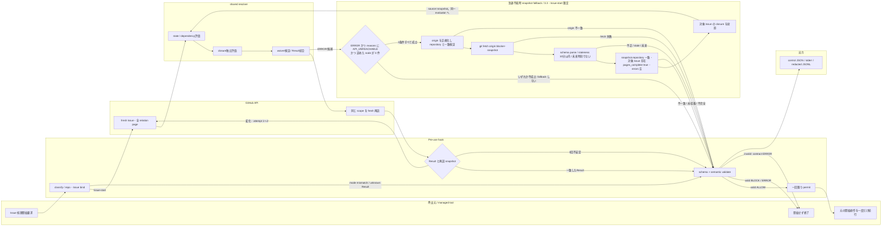
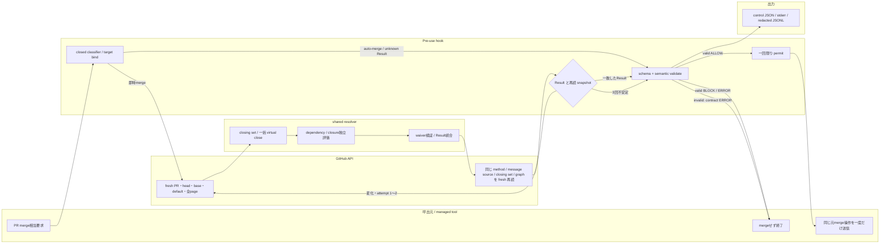

# Blocker gate pre-use policy

- Policy version: `1.2`（`1.1` からの差分は Issue #363 による 3.3「材料」の trigger 記述修正——実際の主たる起動元が外部 cron であることを明記し、GitHub 純正 `schedule` だけで5分間隔が保証されると誤読できる表現を除いた。`1.0` からの差分は Issue #345 の `API_UNREACHABLE` 追加と 3.3 の snapshot fallback。いずれも11章の規則により MINOR）
- 対象: Issue #295（親 #293、実装 #296〜#299）
- 正本: Issue #294 の「調査後のオーナー決定（現在の正本）」と Issue #295
- Enforcement boundary: managed tool の Issue 処理開始操作および PR merge 相当操作の pre-use hook

## 1. 結論

管理対象操作は、**同じ invocation の中で GitHub の現状態を読み、判定が `ALLOW` の場合に限って元の操作を一度だけ続行する**。`BLOCK` または `ERROR` なら元操作を実行しない。過去の成功、Actions status、cache、定期監査結果を ALLOW 根拠として再利用しない。

唯一の限定的な例外は 3.3 の到達不能環境 snapshot fallback（Issue #345・Issue-start mode 限定）である。**到達できる所では従来どおり fresh read**であり、GitHub API へ到達できない実行環境でのみ、上限付き staleness の snapshot を使い、期限切れは fail-close する。この例外は「読めないときは通す」ではない——判定材料の鮮度に上限を設けた上で、材料が無い・古い・壊れているときは従来どおり拒否する。

依存の正本は GitHub native `blocked-by`、包含の正本は native parent/sub-issue とする。本文の `Blocked by:`、related link、Project Status は判定根拠にしない。PR が default branch への merge で閉じる Issue は、GraphQL `closingIssuesReferences` と、merge/rebase/squashの各methodでdefault branchへ実際に届くmessageだけをGitHub closing keyword grammarで解析した集合の和集合とする。この closing set を仮想的に `CLOSED/COMPLETED` にして dependency と closure を評価する。default branch 以外への merge、または closing set が空の merge は Issue を閉じないため `ALLOW/NO_CLOSING_EFFECT` 候補となり、Issue link の必須化は本 blocker policy の責務に含めない。

この policy が保証するのは managed path だけである。GitHub UI、hook 外の API、direct push/ref update は unmanaged であり、完全同期や race-free な GitHub 全体の merge 保証は行わない。managed auto-merge の enable/schedule は、検査と merge が別 invocation になるため常に拒否する。

Issue #294 の調査過程にある Actions-only の bounded profile / strict profile は、本 policy により **superseded** された。polling、relation-change event、long-lived green、merge queue、external App は primary gate ではない。GitHub Actions は無料範囲の任意の defense-in-depth に限る。

### 1.1 読み手と二層構成

| 読み手 | 必要な情報 | 参照層 |
|---|---|---|
| #296 resolver / waiver verifier | 型、真理値表、Result、JSON schema、version | frontmatter と機械契約 |
| #297/#298 pre-use hook | classifier、束縛、実行順、一回限り permit、exit | 機械契約と orchestration |
| #299 auditor | asset/version stamp、redacted log、waiver lifecycle、drift | 機械契約と監査契約 |
| repository owner / waiver owner・approver | 保証境界、理由、期限、対象 finding、復旧行動 | 本文と waiver の人向け属性 |
| reviewer / LLM | owner decision、非スコープ、各 AC の trace | 本文 |

frontmatter とコードブロック内 schema は機械が読む正本、本文は人と LLM が意味・運用境界を確認する層である。機械は自由記述の妥当性を推測せず、owner/approver は waiver の必要性と理由を判断する。順序・型・期限・scope・署名・版は機械 gate、例外を認める業務判断は人の責務とする。

## 2. 用語と型

### 2.1 操作分類

classifier の出力は次の閉じた型である。

```text
ManagedOperation =
  | IssueStart { repository, issue_number, operation_fingerprint }
  | PullRequestMerge {
      repository, pr_number, merge_method, transport,
      operation_fingerprint
    }
  | DeniedAutoMerge { repository?, pr_number?, operation_fingerprint }
  | UnknownPotentialManaged { tool_name, operation_fingerprint }

MergeTransport =
  | CliDirect
  | CliWrapped { wrappers }
  | RestPullsMergeEndpoint
  | ConnectorMergeTool
```

- `IssueStart` と `PullRequestMerge` だけを evaluator へ渡す。
- `DeniedAutoMerge` は `BLOCK/AUTO_MERGE_DENIED` とし、元操作を実行しない。
- `UnknownPotentialManaged` は `ERROR/CLASSIFIER_UNKNOWN` とし、元操作を実行しない。
- repository、Issue/PR 番号、merge method を tool schema または command AST から一意に確定できない場合は `UnknownPotentialManaged` とする。shell の表示文字列を推測して補完しない。

classifier は managed hook が受け取った入力について次の表を完全に適用する。merge の可能性がある入力を「非対象」として通過させる型は設けない。

| 入力 | 分類 | 処置 |
|---|---|---|
| `gh pr merge <PR>` / `gh -R owner/repo pr merge <PR>` | `PullRequestMerge/CliDirect` | target/method を束縛して gate |
| allowlist 済み `rtk`、`command`、`builtin`、`exec` で包んだ上記 command | `PullRequestMerge/CliWrapped` | wrapper を順に構文解析し、shell evaluate せず gate |
| `PUT /repos/{owner}/{repo}/pulls/{pull_number}/merge` を送る `gh api` 等 | `PullRequestMerge/RestPullsMergeEndpoint` | 同じ tool invocation を中断・再開できる場合だけ gate。不能なら ERROR |
| schema 既知の `github_merge_pull_request` 等 | `PullRequestMerge/ConnectorMergeTool` | tool-level pre-use で gate。Bash matcher だけなら使用を deny |
| `gh pr merge --auto`、`github_enable_auto_merge`、auto-merge enable/schedule API | `DeniedAutoMerge` | 常に BLOCK |
| GraphQL `mergePullRequest`、未知 alias/wrapper/tool、merge の可能性を否定できない raw API | `UnknownPotentialManaged` | registry/fixture 更新まで ERROR |
| merge と Issue-start のどちらでもないことを閉じた grammar で証明できる操作 | gate 対象外 | blocker gate の ALLOW は発行しない |

GitHub UI、managed hook 外の API client、direct push/ref update は classifier の入力ではなく、別 manifest の `unmanaged_paths` に記録する非保証経路である。managed tool 内で同じ操作が観測された場合は unmanaged として通過させず `UnknownPotentialManaged` とする。

### 2.2 Issue identity と状態 classifier

Issue の同一性は `repository.nameWithOwner`、GitHub node ID、Issue number の三つ組で保持する。三者が既読値と矛盾した場合は `ERROR/IDENTITY_MISMATCH` とする。

```text
IssueClass =
  | OPEN
  | CLOSED_COMPLETED
  | CLOSED_NOT_PLANNED
  | UNKNOWN
```

分類規則は次のとおりである。

| GitHub state | state reason | IssueClass | dependency 上の意味 |
|---|---|---|---|
| `OPEN` | null / reopened | `OPEN` | 未解決 |
| `CLOSED` | `COMPLETED` | `CLOSED_COMPLETED` | 解決済み |
| `CLOSED` | `NOT_PLANNED` | `CLOSED_NOT_PLANNED` | 解決済み。state reason は evidence に保持 |
| その他、欠落、矛盾 | 任意 | `UNKNOWN` | `ERROR/ISSUE_STATE_UNKNOWN` |

PR closing set 内の Issue は post-merge 仮想状態で `CLOSED_COMPLETED` とする。物理 state は変更しない。GitHub が closed と返す blocker は state reason にかかわらず解決済みとし、open blocker だけを dependency violation とする。waiver は後述の限定条件でのみ使用できる。

### 2.3 Relation の意味

| relation | 意味 | 判定での用途 |
|---|---|---|
| native `blocked-by` | 実行順依存 | direct/transitive dependency evaluator の唯一の正本 |
| native parent/sub-issue | work item の包含 | closure invariant evaluator の唯一の正本 |
| related / Issue・PR 本文 / Project fields | 参照・表示 | verdict には使用しない。drift は #299 が監査 |

同一 repository 内 relation のみ policy `1.2` の managed 対象とする。cross-repository node、transfer 後の repository 不一致、削除・非可視 node は `ERROR/CROSS_REPOSITORY_UNSUPPORTED` または `ERROR/RELATION_TARGET_UNREADABLE` とする。`404` を「relation なし」に読み替えない。

## 3. データ取得契約

### 3.1 API と pagination

- Issue 本体、native blocked-by、parent、sub-issue は GitHub REST API を使用し、`X-GitHub-Api-Version: 2026-03-10` を固定する。
- PR、default branch、head SHA、base branch、closing Issuesと、選択merge methodが要求するcommit count/message sourceは GitHub GraphQL API を使用する。repository merge-message設定はRESTをfresh readする。REST/GraphQLによる同値の再束縛を併用してよいが、意味を変更してはならない。
- list/connection は `per_page=100` または `first=100` で全 page/cursor を完走する。`Link rel=next` または `hasNextPage=true` が残る状態で評価へ進まない。
- GraphQL top-level error、partial `errors`、null connection、同一 cursor/page の再訪、順序中の identity 矛盾は `ERROR` とする。
- 1 invocation 当たり最大 10,000 unique Issue nodes、dependency/parent depth 最大 100 とする。超過は `ERROR/GRAPH_LIMIT_EXCEEDED` であり、途中までの graph を ALLOW に使わない。
- timeout、`403`、`404`（存在確認済み resource を含む）、`410`、`429`、`5xx`、invalid JSON は `ERROR` とする。`429`/`5xx` は `Retry-After` が 30 秒以下の場合だけ最大2回再試行できる。全3 attempt 失敗、30秒超、header 不正なら `ERROR/API_UNAVAILABLE` とする。`401`/`403` は GitHub provenance（`X-GitHub-Request-Id`）の有無で `ERROR/API_PERMISSION` と `ERROR/API_UNREACHABLE` に分ける（10.2）。
- invocation 外 cache、前回の graph、前回の green status へ fallback しない。唯一の例外は 3.3 の到達不能時 snapshot fallback であり、そこでも上限付き staleness を超えた材料は使用しない。

### 3.2 parent/sub-issue の整合性

parent は Issue 本体の `parent_issue_url` と parent endpoint、children は sub-issues endpoint を全 page 読む。`child.parent == parent` と `parent.subIssues contains child` の双方向が一致しない場合は、一度だけ対象 relation を fresh read し直す。再度不一致なら `ERROR/RELATION_INCONSISTENT` とする。

訪問中 node への再入、self relation、parent cycle、dependency cycle は `ERROR/GRAPH_CYCLE` とする。cycle 内 node が closing set に含まれていても ALLOW にしない。

### 3.3 到達不能環境の snapshot fallback（Issue #345［A］・Issue-start mode 限定）

実行環境によっては、client（`urllib` / `gh`）を替えても Issue 系 endpoint に到達できないことがある（実測: Claude Code on the web の GitHub 専用 proxy が endpoint 単位で遮断する）。この環境では 3.1 の fresh read が構造的に成立せず、blocker の有無にかかわらず常に fail-close する。

**#293 の「invocation ごとに fresh read」方針は、この1点に限って次へ改訂する**（他の方針・waiver 仕様・判定ロジックは変えない）。

> 到達できる所では従来どおり invocation ごとの fresh read。**到達できない所でのみ**、上限付き staleness の snapshot を使い、期限切れは fail-close する。

- **API 優先**: 常に 3.1 の fresh read を先に行う。fallback を試みるのは、次の**すべて**を満たす invocation だけである。
  1. verdict が `ERROR` である。
  2. `reasons` に `API_UNREACHABLE` を含む（`primary_reason` ではなく membership で見る。到達不能環境の実測形は `["API_UNREACHABLE", "RELATION_TARGET_UNREADABLE"]` であり、canonical sort の先頭は別 reason になる）。
  3. **その invocation が GitHub の応答を一度も観測していない**＝収集できた node が 0 件である。1 node でも読めていれば、その環境は到達できている＝ stale な材料を使う理由がない。読めた node があるのに 1 node の一過性 timeout で fallback すると、本来 fail-close だった invocation が最大 10 分 stale な材料で ALLOW になりうる。
  `API_PERMISSION`、`API_UNAVAILABLE`、その他の ERROR/BLOCK は fallback しない（到達できているなら stale な材料を使う理由がない）。node が 0 件であることは**積極的に確認**する——確認できない形（field 欠落・型不正）では fallback を開かない。
- **材料**: repository の孤立ブランチ `blocker-snapshot` の `snapshot.json`（`blocker-gate-repository-snapshot/v1`）。GitHub Actions が GraphQL から全 Issue と `blockedBy`/`subIssues`/`parent` を一括取得し、単一 commit を force-push する。main と履歴を共有しないため既定ブランチを汚さない。**この Actions の主たる起動元は外部 cron サービス（cron-job.org）であり、5分間隔で GitHub の `workflow_dispatch` REST API を叩く**（Issue #363・オーナー確定・2026-08-12）。`.github/workflows/blocker-snapshot.yml` にも残る GitHub 純正の `schedule: "*/5 * * * *"` は保険にすぎない——実測（Issue #363 本文）では 74〜104 分間隔でしか発火せず、`*/5` という cron 式を「5分ごとに動く」保証と読むのは誤りである。運用手順（cron-job.org のジョブ設定・PAT 作成条件・疎通確認）は `docs/methods/blocker-snapshot-external-cron-ops.md` を見る。
- **取得**: gate が `git fetch` で読む。invocation 外 cache・ローカル生成物は材料にしない。
- **staleness 上限**: `generated_at` から 10 分。超過、未来時刻、時刻の解釈不能はいずれも fail-close する。
- **identity 束縛**: 次の二つを**両方**要求する。片方でも欠けると identity が snapshot の自己申告だけに閉じる。
  - **origin の一致**: fetch する前に `git remote get-url origin` を canonical `owner/name` へ正規化し、invocation の repository と完全一致することを確認する。正規化は Codex 経路の repository 導出と同一とする。不一致・解釈不能は fail-close する。
  - **snapshot 内容の一致**: snapshot の `repository` field が invocation の repository と完全一致しなければ fail-close する。対象 Issue が snapshot に無い場合は `ERROR/RELATION_TARGET_UNREADABLE` であり「blocker なし」と読み替えない。
- **fail-close の非緩和**: snapshot が無い・fetch できない・JSON が壊れている・`pages_complete=false`・`errors` が非空のいずれでも ALLOW にしない。repository 全体を1 snapshot にするため `pages_complete`/`errors` は global であり、ある Issue の収集失敗が無関係な Issue まで fail-close させる。これは fail-close 側の過剰であり意図した挙動とする。
- **評価**: snapshot から対象 Issue の closure（`blocked_by` ∪ `children` ∪ `parent` の到達集合）を射影し、3.1 経由と同一の evaluator（5章）へ渡す。判定ロジックは分岐させない。
- **証跡**: どちらの経路で判定したかを invocation ごとに evidence へ残す（`source: "api" | "snapshot"`、snapshot 経路では `snapshot_generated_at`）。

**policy version の扱い（オーナー確定・2026-08-12・Issue #363）**: 本節「材料」の trigger 記述修正により policy version は `1.1` → **`1.2`** とする。根拠は 11章の版規則であり、変更は「主たる起動元は外部 cron である」という**運用事実の文言修正のみ**——判定意味・Result/exit/reason・relation/state/closure/waiver semantics のいずれも変更していない。11章は「型や判定意味を変えない文言…の更新」を MINOR の内側に明記している。同時に更新した対象は `blocker_gate/model.py` の `POLICY_VERSION` 定数、本文中の版表記（frontmatter・冒頭の Policy version 行・6.1 の waiver/policy.yml 例・10.3 の control JSON 例）、`tests/fixtures/blocker_gate/policy.yml`・`waiver_valid.yml`・`waiver_expired.yml`・`schema_only_waiver.yml` の `policy_version`、および対応 test fixture である。`.github/blocker-gate/policy.yml` と実運用 waiver file は本 repository に未作成のため対象外。`tests/fixtures/blocker_gate/waiver_unknown_key.yml` は unknown-key 検査（`_keys()`）が `policy_version` 比較より先に働く fixture であり、その検査経路を変えないために意図的に `1.0` のまま据え置く。

cascade は上記のコード・文書・fixture に加え、**実際に外部へ公開される成果物**である `blocker-snapshot` 孤立ブランチの `snapshot.json`（`blocker_gate snapshot` 生成時点の `POLICY_VERSION` を `policy_version` field に埋め込む）も対象に含む。この成果物だけは Actions workflow の次回実行でしか更新できないため、bump を merge した直後から次回実行が完了するまでの窓では、公開済み snapshot が旧版の `policy_version` を含んだまま残る。この窓で到達不能環境の Issue-start gate が snapshot を読むと、`blocker_gate/snapshot.py` の `parse_repository_snapshot` が `raw["policy_version"] != POLICY_VERSION` を検出して `SNAPSHOT_POLICY_VERSION_MISMATCH` により fail-close する——`generated_at` は新しく見えても、である。診断手順は `docs/methods/blocker-snapshot-external-cron-ops.md` §4.2 に記載する。

#### 3.3.1 信頼モデル（この経路が gate の意図を弱めないこと）

snapshot は **repository に push できる者が内容を差し替えうる入力**である。「blocker は無い」と偽った snapshot を置けば、到達不能環境の invocation は ALLOW になる。それでもこの経路は gate の保証を弱めない。理由は次のとおり。

- **偽造には「invocation の repository そのもの」への push 権限が要る。** この論拠は、材料の出所が対象 repository に固定されている場合にだけ成立する。したがって gate は fetch の前に `origin` を正規化して invocation の repository と一致することを要求する（3.3 の identity 束縛）。この検証が無いと、`origin` を自分の管理下の repository へ向けられる者が、対象 repository を名乗る snapshot を配るだけで ALLOW を作れてしまい、本項の論拠が崩れる。origin を束縛した上でなら、push 権限がある者はそもそも **blocker Issue 自体を close できる**し、hook/gate の asset（`issue_start/`・`blocker_gate/`・`.claude/hooks/`）も書き換えられるので、snapshot 経路は攻撃者が既に持っていない能力を新たに与えない。保証境界の性質は 12章および Issue #129 が明示している static gate の限界と同じで、「hook 外の経路・asset 改変までは防がない」という既存の前提の内側に収まる。
- **正常運用での書き手は Actions workflow だけ**である（`.github/workflows/blocker-snapshot.yml`・`contents: write`）。人手での push を運用上想定しない。
- **偽造が効く窓は狭い。** staleness 上限 10 分を超えた snapshot は使われないため、置いたまま無期限に効かせることはできない。加えて閉じた schema での parse、`repository` の完全一致、対象 Issue の存在確認、`pages_complete`/`errors` の検査をすべて通す必要がある。
- **API へ到達できる環境ではこの入力自体が読まれない**（`API_UNREACHABLE` かつ node を1件も読めなかったときだけ fallback する）。到達できている環境では 1 node の一過性失敗があっても snapshot は読まれないため、既存経路の信頼モデルは一切変わらない。

一方、**この経路が新たに導入しないもの**も明示しておく。判定材料の取得にエージェントの裁量を経由させる方式（Issue #345 の選択肢⑥）は採っていないため、「LLM が判定材料を作れる」という信頼モデルの変更は発生していない。材料は Actions が GitHub API から機械的に生成し、gate は生の JSON を閉じた parser で読むだけである。

#### 3.3.2 snapshot 入力の版照合規則（§10.5-5 とは別規定・Issue #362）

到達不能環境の fallback で読む snapshot 入力には次の2つの schema があり、**いずれも `policy_version` の完全一致**（文字列としての exact match。`MAJOR.MINOR` の major だけを見ない）を要求する。不一致は fail-close とする。

| schema | 生成 | 読取・版照合の実装 | 不一致時の扱い |
|---|---|---|---|
| `blocker-gate-repository-snapshot/v1` | Actions（`blocker-snapshot.yml`） | `blocker_gate/snapshot.py::parse_repository_snapshot` が `raw["policy_version"] != POLICY_VERSION` を検査し、内部 reason `SNAPSHOT_POLICY_VERSION_MISMATCH` を持つ `RepositorySnapshotError` を送出する | `issue_start/gate.py::evaluate_issue_start` がこの `RepositorySnapshotError` を捕捉し `IssueStartError("ISSUE_START_SNAPSHOT_INVALID", exc.reason)` へラップする。外部スキーマ `issue-start-evidence/1` に現れる最終 `reason` は **`ISSUE_START_SNAPSHOT_INVALID`** であり、内部 reason `SNAPSHOT_POLICY_VERSION_MISMATCH` は `detail` 側に残るだけである（fail-close の実例は 3.3「policy version の扱い」を見る） |
| `blocker-gate-snapshot/v1` | `project_issue_snapshot` による射影（同ファイル） | `blocker_gate/resolver.py::parse_snapshot` が同じ完全一致検査（`raw["policy_version"] != POLICY_VERSION`）を行い `ValueError` を送出する | `blocker_gate/resolver.py::evaluate_snapshot` がこの `ValueError` を捕捉し、呼出元 evaluator へは渡さず、外部スキーマ `blocker-gate-result/v1` に現れる最終 `reason: **RESULT_CONTRACT_INVALID**` として ERROR 化する |

**§10.5-5 との違い**：§10.5-5（10章「必須 semantic validation」の共通不変条件5）は `blocker-gate-result/v1`——gate が**出力**する control JSON——についての規定であり、そこでの「policy/classifier major 一致」は caller 側が gate の出力を受理する際の互換性判定である。本節は gate が**入力として読み取る**2つの snapshot schema についての規則であり、対象（出力 vs 入力）・照合粒度（major 一致 vs 完全一致）のいずれも異なる別規定である。読み違えないこと。

**版を上げる際の deploy 含意**：`policy_version` を上げる更新を merge した直後の窓で何が起きるかは、3.3「policy version の扱い」の cascade 段落（`blocker-snapshot` 孤立ブランチが Actions 次回実行まで旧版のまま残る／`SNAPSHOT_POLICY_VERSION_MISMATCH` で fail-close する／診断手順は `docs/methods/blocker-snapshot-external-cron-ops.md` §4.2）を見る。本節はその窓が生じる原因である snapshot 入力の版照合規則（上表）を定義するだけで、窓の挙動自体は 3.3 を正本とし、ここでは重複記述しない。

**§11 との関係**：本節（§3.3.2）の追加は、`blocker_gate/snapshot.py::parse_repository_snapshot` と `blocker_gate/resolver.py::parse_snapshot` が既に実装済みだった `policy_version` 完全一致検査の挙動を文書化しただけであり、`policy_version` を上げていない。これは 11章「MINOR 更新であっても `policy_version` は上げる」という一般則の例外ではない——Issue #362 でオーナーが「この追加は既存実装済み挙動の文書化に留まり bump 不要」と明示決定した個別ケースである。

## 4. PR closing set policy

### 4.1 前提

PR は `OPEN`、draft でなければならない。違反はそれぞれ `BLOCK/PR_NOT_OPEN`、`BLOCK/PR_DRAFT` とする。base branch が fresh read した repository default branch と一致しない場合、GitHub の automatic closure はこの invocation では起きないため closing set を空とし、blocker/closure finding がない `ALLOW/NO_CLOSING_EFFECT` 候補として扱う。non-default merge 自体を blocker policy で禁止しない。

最初に次を同一 invocation へ束縛する。

```text
PrBinding = {
  repository_node_id,
  pr_node_id,
  pr_number,
  state,
  is_draft,
  head_oid,
  base_ref_name,
  default_branch,
  merge_method,
  intercepted_commit_title_fingerprint?,
  intercepted_commit_message_fingerprint?,
  operation_fingerprint,
  policy_version
}
```

全取得後は次も同じ invocation の評価 snapshot に束縛する。

```text
EvaluatedSnapshot = {
  pr_binding,
  graphql_closing_set,
  delivered_message_closing_set,
  closing_set,
  message_source_fingerprint,
  delivered_message_fingerprint,
  repository_merge_settings_fingerprint,
  issue_state_fingerprint,
  dependency_fingerprint,
  closure_fingerprint,
  policy_blob_sha,
  waiver_blob_shas
}
```

fingerprint は canonical identity、state/state reason、全 relation edge、全 page 完了 marker を canonical JSON にして SHA-256 を取る。closing set だけを束縛して graph の変化を無視してはならない。

`message_source_fingerprint`はmethod、override指定有無/hash、fresh PR fields、methodが読むrepository settings、ordered source commit OID/parent/tree/message hashを含む。`delivered_message_fingerprint`はそのsourceから構築した実到達title/body列を含む。sourceと結果の両方を最終再読で比較する。

`repository_merge_settings_fingerprint`はrepository node ID、API versionとmethodに必要なsetting名/valueをcanonical JSON化したSHA-256である。`merge`ではoverrideの有無にかかわらず`merge_commit_title`/`merge_commit_message`を含めて必須、`squash`ではsubject/bodyのどちらかをdefault生成する場合に`squash_merge_commit_title`/`squash_merge_commit_message`を含めて必須、`rebase`ではnull固定とする。

### 4.2 Relation set と merge method別 delivered-message set

`GraphqlClosingSet` は `PullRequest.closingIssuesReferences` の全 cursor を完走して得た集合である。PR body の closing keyword と GitHub の manual linked Issue はこの集合に委ね、PR body を独自 parser で二重解釈しない。この relation set は merge method に依存しないが、default branch 以外を base とする invocation では automatic closure が発生しないため空集合として扱う。

commit-message-only closure は、PR branch に存在する全 commit message ではなく、選択した merge method により**今回 default branch へ実際に到達する commit message**だけを解析する。これを `DeliveredMessageSet`、そこから得る Issue 集合を `DeliveredMessageClosingSet` とする。

classifier は `merge` / `rebase` / `squash` を閉じた `merge_method` として束縛する。未知、欠落、transport間の矛盾は `ERROR/MERGE_METHOD_UNKNOWN` とする。merge APIへ送られる subject/body override は raw operation object から取り出し、その完全な値を invocation 内に保持する。永続ログには SHA-256 だけを残す。

method省略を`merge`へ正規化できるのは、interceptしたtransportのversioned schemaがそのdefaultを明示し、#298 fixtureでoutbound payloadとの一致を確認した場合だけである。CLIの対話選択、repository設定、aliasからmethodを推測しない。

enumとmethod semanticsの外部正本はGitHub公式の[REST repository endpoints](https://docs.github.com/en/rest/repos/repos)と[Pull request merges](https://docs.github.com/en/pull-requests/reference/pull-request-merges)である。API version、enum、formatter semanticsのdriftは内容を推測せずERRORにする。

#### merge commit

- default branch へ到達するのは、PR の全個別 commit message と新しい merge commit message である。
- 各attemptでrepositoryの`merge_commit_title`と`merge_commit_message`、PR number/title/body/head label、全個別commitの完全なmessageをfresh readする。二つのsettingはoverrideの有無にかかわらず全enumを検証し、repository node ID/API versionと共にsettings fingerprintへ束縛する。
- intercepted `commit_title` / `commit_message` または各transportの同値fieldがあれば、その完全な値を対応componentの正本とする。指定の有無自体もoperation fingerprintへ含める。動的展開、切詰め、transportからoutbound payloadへの写像不明は`ERROR/MERGE_OVERRIDE_AMBIGUOUS`とする。
- overrideがないcomponentは次のenum表だけで再構築する。unknown/null/partial enum、API error、formatter driftは`ERROR/MERGE_SETTINGS_AMBIGUOUS`とする。

| setting | enum | override未指定時のcomponent |
|---|---|---|
| `merge_commit_title` | `PR_TITLE` | fresh PR title |
| `merge_commit_title` | `MERGE_MESSAGE` | classic title `Merge pull request #<number> from <head-label>`をversioned formatterで生成 |
| `merge_commit_message` | `PR_TITLE` | fresh PR title |
| `merge_commit_message` | `PR_BODY` | fresh PR body。GitHubのnull bodyは空文字列 |
| `merge_commit_message` | `BLANK` | 空文字列 |

```text
effective_title = intercepted_title ?? title_from(merge_commit_title)
effective_body  = intercepted_body  ?? body_from(merge_commit_message)
merge_commit_message =
  effective_title                              if effective_body == ""
  effective_title + "\n\n" + effective_body   otherwise
```

classic titleのhead-label表記、改行、Unicode/改行正規化をbyte単位で#298 fixtureへ固定する。一意に再構築できない場合は`ERROR/MERGE_MESSAGE_AMBIGUOUS`とし、全個別commit messageだけで判定を続けない。

#### rebase merge

- default branch へ到達するのは、順序を維持してrebaseされた個別commitの完全なmessageだけである。synthetic merge/squash messageとrepository message settingは存在せず、settings fingerprintはnullでなければならない。
- GitHubはcommitterとSHAを更新するが、delivered messageは採用されたsource commitの完全なmessageである。もともとemptyのcommitはdropされるため、各commit/first-parentのtree OIDをfresh readし、treeが同一のcommitをmessage setから除外する。
- parent/tree/message/orderがpartial、source commitが複数parent、originally-empty判定不能、GitHubが提示するrebase eligibilityとsnapshotが矛盾、またはversioned fixtureで説明できないdrop/rewriteがあり得る場合は`ERROR/REBASE_MESSAGE_AMBIGUOUS`とする。
- rebaseで意味を持たないsubject/body overrideが存在する、またはtransportがそのfieldを無視するか送るかを一意に証明できない場合は`ERROR/MERGE_OVERRIDE_AMBIGUOUS`とする。無視してALLOWしない。

#### squash merge

- default branch へ到達するのは一つのsquash commit messageだけであり、個別 commit messageを無条件に union してはならない。
- intercepted subject/body が指定されていれば指定部分をそのまま束縛する。片方だけ未指定なら、未指定部分だけを以下のfresh repository設定とPR情報から再構築する。
- overrideの完全な値・指定有無・outbound payloadへの写像を一意に束縛できなければ`ERROR/MERGE_OVERRIDE_AMBIGUOUS`とする。
- repository の `squash_merge_commit_title`、`squash_merge_commit_message`、PR title/body/numberと、選択設定が要求するcommit件数・完全なmessageを同じattemptでfresh readする。
- title設定 `PR_TITLE` はfresh PR title、`COMMIT_OR_PR_TITLE` は1 commitならそのcommit title、複数commitならfresh PR titleを選ぶ。
- body設定 `PR_BODY` はfresh PR body、`COMMIT_MESSAGES` はGitHub default formatterで順序付き全commit messageを構成し、`BLANK` は空文字列とする。
- unknown enum、null/partial setting、設定とtransportの矛盾は`ERROR/MERGE_SETTINGS_AMBIGUOUS`、truncated入力、#298 fixtureで固定したformatter versionからのdrift、再構築非一意は`ERROR/MERGE_MESSAGE_AMBIGUOUS`とする。推測値、ローカルgit log、前回設定へfallbackしない。

merge/squash default formatterは、GitHubへ送るpayloadまたはGitHubが生成するmessageとbyte単位で同じsubject/bodyを一意に作る純粋関数として#298でfixture化する。fixtureが未成立のmethod/transportはmanaged mergeに使用可能にせずfail-closeする。

`DeliveredMessageSet` の各**省略されていない完全な message**を次の grammar で解析する。

```ebnf
keyword   = "close" | "closes" | "closed"
          | "fix" | "fixes" | "fixed"
          | "resolve" | "resolves" | "resolved" ;  (* ASCII case-insensitive *)
reference = "#" positive_integer
          | owner "/" repository "#" positive_integer
          | "https://github.com/" owner "/" repository "/issues/" positive_integer ;
clause    = keyword, 1*WSP, reference ;
```

- keyword は ASCII word boundary で始まり、reference の直後は whitespace、句読点、行末のいずれかでなければならない。
- `#0`、leading sign、小数、範囲、変数、短縮 URL、`pull/` URL、GitHub 以外の URL は reference ではない。
- keyword の直後の非空白 token が `#`、`owner/repository#`、`https://github.com/.../issues/` で始まるにもかかわらず grammar を満たさない場合は `ERROR/CLOSING_KEYWORD_PARSE` とする。単なる自然文の “fixes performance” は closing clause ではなく error にしない。
- parser は全出現を収集する。同じ Issue の重複は canonical identity で除去する。
- unqualified `#N` は対象 PR と同じ repository に束縛する。qualified reference が別 repository を指す場合は `ERROR/CROSS_REPOSITORY_UNSUPPORTED` とする。
- source commitまたは生成messageが欠落、切り詰め、decode不能、pagination未完走なら `ERROR/MESSAGE_SOURCE_INCOMPLETE` とする。

最終集合は次で固定する。差分は曖昧ではなく取得経路の違いとして保持する。

```text
ClosingSet = canonicalize(GraphqlClosingSet union DeliveredMessageClosingSet)
```

GraphQL relation setとmessage由来setの重複はcanonical identityで除去するが、evidenceには `graphql_closing_set`、`delivered_message_closing_set`、`closing_set` を別々に出す。manual link/PR body由来relationを個別commit messageへ置換せず、commit-message-only closureをGraphQLだけで取得できるとも仮定しない。

closing set が空なら dependency/closure の root は空であり、`ALLOW/NO_CLOSING_EFFECT` 候補とする。この policy は「すべての PR が Issue を閉じる」という別の tracking 規則を暗黙に追加しない。default branch 以外ではmessage解析をclosing setに加えず、後にdefault branchへ到達させるPR invocationが、その時選択されたmerge methodのdelivered messageをfreshに再評価する。

### 4.3 merge method 真理値表

| merge method | default branchへ届くmessage | closing message解析 | fail-close条件 |
|---|---|---|---|
| `merge` + title/body override両方 | 全個別commit + overrideで作るmerge commit | 両方を解析。fresh settings fingerprintも束縛 | override/payload不一致、unknown/partial settings |
| `merge` + override片側/なし | 全個別commit + overrideと`merge_commit_title`/`merge_commit_message`全enumから再構築したmerge commit | 両方を解析 | settings/formatter/overrideを一意に再構築不能 |
| `rebase` | originally-emptyを除いたrebase後の個別commit | fresh order/tree/parentで採用commitを決め、その完全なmessageを解析 | source partial、multi-parent、drop/rewrite不明、override存在。settings fingerprintはnull |
| `squash` + subject/body明示 | 明示値から成る単一squash commit | その一つだけ解析 | outbound payloadとの不一致、片側defaultを再構築不能 |
| `squash` + subject/body片側/両方省略 | fresh repo設定+PR情報から再構築した単一squash commit | 再構築した一つだけ解析。default使用時settings fingerprint必須 | unknown設定、partial入力、formatter drift、再構築非一意 |
| 任意method + GraphQL relation | PR body closing keyword/manual linkの`GraphqlClosingSet` | message setとは別にunion | cursor未完、partial/null、cross-repo |
| non-default base | 今回のautomatic closure対象なし | 両setを空にする | metadata不明ならERROR。空自体は`NO_CLOSING_EFFECT` |

### 4.4 same-PR virtual close

`ClosingSet` の全 Issue を仮想的に `CLOSED_COMPLETED` としてから評価する。この変換は集合全体へ一括適用し、Issue ごとに順番に適用してはならない。

- A が B に blocked-by され、A と B が同じ closing set にあれば、B は仮想解決済みであり blocker ではない。
- parent P と全 open descendant が同じ closing set にあれば、post-merge closure invariant を満たす。
- parent P だけが closing set にあり open descendant が残れば `BLOCK/CLOSURE_OPEN_DESCENDANT` とする。
- same-PR virtual close を適用しても cycle、unknown state、incomplete read は `ERROR` のままである。

## 5. dependency と closure の規則

### 5.1 dependency evaluator

Issue mode の root は対象 Issue、PR mode の root は closing set の全 Issue とする。各 root から native blocked-by を深さ優先で辿り、経路を canonical node 列で保存する。

1. 仮想状態を含む `CLOSED_COMPLETED` / `CLOSED_NOT_PLANNED` blocker はその枝を解決済みとして終了する。closed node より上流の relation は target の未解決 blocker path に含めない。
2. `OPEN` blocker は `BLOCK/OPEN_BLOCKER` である。さらに blocked-by を辿り、transitive path と cycle を収集する。
3. `UNKNOWN` は `ERROR/ISSUE_STATE_UNKNOWN` とする。
4. direct と transitive finding をすべて返す。1件見つけて取得を打ち切らない。途中の API error があれば BLOCK ではなく ERROR を最終 verdict とする。

Issue-start 対象自体が `OPEN` でなければ `BLOCK/TARGET_ISSUE_NOT_OPEN` とする。

### 5.2 closure invariant evaluator

closure は dependency と独立に評価し、最後に同じ Result へ統合する。

```text
Invariant: CLOSED(parent) implies every direct and transitive sub-issue is CLOSED.
```

ここで `CLOSED` は物理 `CLOSED_COMPLETED` / `CLOSED_NOT_PLANNED` と PR mode の virtual `CLOSED_COMPLETED` の両方を含む。descendant の `OPEN` は violation である。

- Issue mode の scope は対象 Issue、その全 ancestor、対象 Issue の全 descendant とする。
- PR mode の scope は closing set 各 Issue、その全 ancestor、closing set 各 Issue の全 descendant の和集合とする。
- scope 内の closed parent に open descendant があれば `BLOCK/CLOSURE_OPEN_DESCENDANT` とする。
- open parent に open child がいる通常の未完状態は violation ではない。
- relation の片方向不一致、cycle、unreadable descendant は ERROR とする。

### 5.3 統合優先順位

dependency/closure の全 stage を完走し、次の優先順位で統合する。

```text
ERROR > BLOCK > ALLOW
```

一つでも ERROR finding があれば ERROR、一つでも未waive BLOCK finding があれば BLOCK、それ以外は ALLOW である。ERROR を BLOCK または空集合へ変換しない。

## 6. waiver contract

### 6.1 保存場所と schema

waiver は current default branch の `.github/blocker-gate/waivers/<id>.yml` に置く repository file だけを認める。Issue/PR コメント、Project field、環境変数、ローカルファイル、CLI flag は waiver にならない。approver allowlist と policy parameters の正本は `.github/blocker-gate/policy.yml` とする。

```yaml
schema: blocker-gate-waiver/v1
id: BW-20260801-001
policy_version: "1.2"
repository: hiratashinnya/review-system
owner: owner-login
reason: "期限内に先行検証を行う必要があるため"
requested_by: login
approved_by: owner-login
approved_at: "2026-08-01T00:00:00Z"
expires_at: "2026-08-08T00:00:00Z"
scope:
  mode: issue-start           # issue-start | pr-merge
  subject:
    type: issue               # issue | pull_request。mode と一致必須
    number: 123
  finding_fingerprints:
    - sha256:0123456789abcdef0123456789abcdef0123456789abcdef0123456789abcdef
```

`.github/blocker-gate/policy.yml` は少なくとも次を持つ。

```yaml
schema: blocker-gate-policy/v1
policy_version: "1.2"
approver_allowlist:
  - owner-login
max_waiver_lifetime_hours: 168
protected_default_branch: main
```

unknown key、duplicate key、YAML anchor/alias/tag、複数 document、非UTF-8、schema/type不一致は `ERROR/WAIVER_SCHEMA_INVALID` とする。時刻は UTC の RFC 3339 `Z`、`expires_at > approved_at`、有効期間は168時間以下でなければならない。

| field | type / constraint | 読み手と判定 |
|---|---|---|
| `schema` / `policy_version` | 固定 enum / `MAJOR.MINOR` | #296 が互換性を機械判定 |
| `id` | `^BW-[0-9]{8}-[0-9]{3,}$`、repository内一意 | #296/#299 が識別・重複検出 |
| `repository` | canonical `owner/name` | #296 が invocation と完全一致 |
| `owner` / `requested_by` | GitHub login | 人の説明責任、#299 lifecycle |
| `reason` | 1〜1000文字、制御文字なし | owner/approver が妥当性判断、機械は形式だけ検証 |
| `approved_by` / `approved_at` | allowlist login / UTC時刻 | #296 が signer・時刻と照合 |
| `expires_at` | UTC時刻、承認後かつ最大期間内 | #296 が invocation時刻で判定、#299 が失効処理 |
| `scope.mode` / `scope.subject` | closed enum / exact target | #296 が対象外への転用を拒否 |
| `scope.finding_fingerprints` | 1件以上、unique SHA-256 | #296 が exact finding だけを waive |

### 6.2 finding fingerprint

waiver は finding を正規化した次の UTF-8 JSON（key sort、余分な空白なし）に対する SHA-256 と完全一致した場合だけ適用する。

```json
{"code":"OPEN_BLOCKER","mode":"issue-start","path":["hiratashinnya/review-system#123","hiratashinnya/review-system#120"],"subject":"hiratashinnya/review-system#123"}
```

対象にできる code は `OPEN_BLOCKER` だけである。closure violation、対象 closed、auto-merge、classifier/API/parse/pagination/cycle/identity/permission ERROR は waive できない。新しい finding または path 変化は別 fingerprint となり、既存 waiver を適用しない。

`owner` は waiver の理由・scope・期限・失効処理に説明責任を持つ人、`approved_by` は例外を許可する人である。policy `1.2` では両者とも GitHub login を用い、`approved_by` は allowlist 必須とする。単独 owner repository では同一 login を許容するが、機械 verifier はその判断を推測せず schema と allowlist だけを検証する。`reason` の妥当性とリスク受容は owner/approver がレビューし、#296 は文字列の存在・長さ・禁止制御文字だけを機械検証する。

### 6.3 真正性検証

#296 の verifier は read-only で、invocation ごとに次を全て確認する。

1. repository の current default branch と head commit を fresh read する。
2. policy file と waiver file をその head tree から読み、blob SHA を記録する。
3. waiver file を最後に追加・変更した commit が current default branch head の ancestor であることを GitHub compare/history API で確認する。
4. その commit の GitHub `verification.verified` が true であり、verified signer の GitHub login が `approved_by` と一致し、policy file の `approver_allowlist` に含まれることを確認する。
5. default branch に deletion と non-fast-forward を禁止する active repository rule が適用されていることを確認する。保護状態を取得できない、ruleset が inactive、bypass で履歴同一性を確認できない場合は waiver を適用しない。
6. repository、owner、mode、subject、policy version、fingerprint、時刻を現在の invocation と照合する。`approved_at <= now < expires_at` のときだけ有効とする。

検証不能、不正、期限切れ waiver は finding を消さない。schema/真正性が壊れた waiver file が対象 scope に存在する場合は `ERROR/WAIVER_INVALID`、単に対応 waiver がない場合は元の BLOCK とする。waiver は verdict を ALLOW にできるが、JSON へ元 finding、waiver ID、blob SHA、approval commit、expires_at を必ず残す。

#296 は作成・変更・承認・削除・失効処理を行わない。#299 が waiver の PR-based lifecycle、期限切れ file の削除、allowlist 変更、ruleset drift、通知を担当する。

## 7. End-to-end orchestration

### 7.1 Issue-start swimlane



fallback 経路の失敗はすべて `ERROR` のまま元操作を拒否する（ALLOW へ倒す枝は存在しない）。`ISF5` から先は API 経路と同一の evaluator を通し、判定ロジックを分岐させない。evidence には `source: "snapshot"` と `snapshot_generated_at` を残す。

### 7.2 PR-merge swimlane



各 stage は `StageResult<T> = Ok<T> | Block<Findings> | Error<Findings>` を返す。`Ok` の値だけが次 stage の input 型を構築でき、`ExecutionPermit` は最終照合済み `ALLOW` からだけ生成できる。merge executor は `ExecutionPermit` と元の operation object を同時に要求する。

### 7.3 実行順序の不変条件

1. classifier が閉じた型を返す前に対象 API または元操作を呼ばない。
2. repository/Issue/PR を一意に bind できるまで resolver と副作用へ進まない。
3. 全 page/cursor と、選択merge methodが要求する全message sourceを取得し、default branchへ届くmessageを一意に構築し終えるまで graph 評価へ進まない。
4. IssueClass、identity、relation の検証を通らない node を graph へ入れない。
5. PR mode は closing set 全体の virtual close を一括適用してから dependency/closure を評価する。
6. dependency と closure は独立に完走し、ERROR優先で一つの Result に統合する。
7. waiver は finding 作成後にだけ検証し、ERROR や非対象 code を消さない。
8. `ALLOW` は repository、target、PR head、base、default branch、merge method、delivered-message/settings fingerprint、policy version、operation fingerprint に束縛した一回限りの値である。
9. ALLOW 候補後、元操作の直前に同じ API scope を全 page fresh read し、`EvaluatedSnapshot` を再構築する。PR state/head/base/default/merge method、subject/body override、repository merge/squash-message設定、rebase source order/parent/tree/message、delivered message/closing set、Issue state、dependency/closure relation、policy/waiver blob のどれかが変われば候補を破棄し、同じ invocation で最初から再評価する。
10. 初回評価に加えて再評価は最大2回、合計3 attempt とする。3回目の最終再読でも変化した場合は `ERROR/REEVALUATION_LIMIT` とし、元操作を実行しない。API retry 回数とは別に数える。
11. Result候補はJSON Schemaとsemantic validatorの両方を通す。どちらかが失敗したpayloadをpermit、診断上のtarget、ALLOWとして使用しない。
12. 同じ hook invocationの`ValidatedGateResult(ALLOW)`から発行した未使用の`ExecutionPermit`がある場合だけ元操作を一度続行する。permit の永続化・再利用・別 operation への転用を禁止する。
13. BLOCK/ERROR、hook未登録・無効・untrusted・未発火では、managed Issue の worktree/委譲/branch/commit/push/PR作成、および managed merge API を実行しない。
14. ALLOW 後の GitHub 側 merge eligibility failure は merge executor の失敗として記録し、gate ALLOW を成功 merge と表示しない。

## 8. 疑似コード

以下の `? else ERROR` / `? else BLOCK` は省略記法であり、直接returnを意味しない。実装は必ずcandidate Resultを構築し、JSON Schemaとsemantic validatorを通し、validated BLOCK/ERRORだけをemitして元操作をdenyする。

### 8.1 Issue-start

```text
run_issue_start(raw_operation):
  classified = classify(raw_operation)
  match classified:
    IssueStart(op) -> continue
    DeniedAutoMerge(_) ->
      return deny(validate_or_contract_error(
          build_result(block(AUTO_MERGE_DENIED), permit_issued=false)))
    UnknownPotentialManaged(_) ->
      return deny(validate_or_contract_error(
          build_result(error(CLASSIFIER_UNKNOWN), permit_issued=false)))
    _ ->
      return deny(validate_or_contract_error(
          build_result(error(MODE_MISMATCH), permit_issued=false)))

  binding = bind_issue(op) ? else ERROR
  for attempt in 1..3:
    snapshot = read_issue_graph_all_pages(binding) ? else ERROR
    source = "api"; snapshot_generated_at = null

    # 3.3 到達不能環境の snapshot fallback（Issue-start 限定）。
    # 引き金は3条件の AND。1 node でも読めていれば到達できている
    # とみなし、fallback せず ERROR のまま拒否する。
    interim = verify_waivers_and_reduce(
        evaluate_dependency_and_closure(snapshot, binding), binding)
    if interim.verdict == ERROR
       and API_UNREACHABLE in interim.reasons
       and is_empty_map(snapshot.nodes):
      # origin は fetch より前に検証する。ここを欠くと identity 束縛が
      # repository snapshot の自己申告 field だけになる（3.3.1）。
      require canonical_repo(git_remote_get_url("origin"))
              == binding.repository            ? else ERROR
      git_fetch("origin", "blocker-snapshot")  ? else ERROR
      repo_snapshot = parse_repository_snapshot(
          git_show("origin/blocker-snapshot:snapshot.json")) ? else ERROR
      require 0 <= now - repo_snapshot.generated_at <= 10min ? else ERROR
      require repo_snapshot.repository == binding.repository ? else ERROR
      snapshot = project_issue_closure(
          repo_snapshot, binding.issue)        ? else ERROR
      source = "snapshot"
      snapshot_generated_at = repo_snapshot.generated_at
      # pages_complete=false / errors 非空はここでも ALLOW にならない
      # （以降は API 経路と同一 evaluator が fail-close させる）。
      # 後段の再読(rebound)は、到達不能環境では API を引けないので
      # 同じ fetch 済み snapshot からの再射影となり、定義上一致する。

    states = classify_all(snapshot)                 ? else ERROR
    dependency = evaluate_dependency(
        roots=[binding.issue], virtual_closed={})
    closure = evaluate_closure(
        scope=ancestors_and_descendants(binding.issue), virtual_closed={})
    verdict = verify_waivers_and_reduce(dependency + closure, binding)
    if verdict != ALLOW:
      candidate = build_result(verdict, permit_issued=false)
      validated = validate_or_contract_error(candidate)
      emit_three_channels(validated)
      return deny_without_side_effect(validated)

    rebound = rebuild_issue_snapshot_from_fresh_reads(
        binding, graph_scope, policy, waivers) ? else ERROR
    if canonical_fingerprint(rebound) != canonical_fingerprint(snapshot):
      if attempt < 3: continue
      candidate = build_result(
          error(REEVALUATION_LIMIT), permit_issued=false)
      return deny_without_side_effect(
          validate_or_contract_error(candidate))

    candidate = build_result(ALLOW, permit_issued=true)
    validated = validate_or_contract_error(candidate)
    require validated.result == ALLOW ? else deny
    permit = one_shot_permit(validated, binding, op.fingerprint)
    emit_three_channels(validated)
    return continue_original_operation_once(permit, raw_operation)
```

### 8.2 PR merge

```text
run_pr_merge(raw_operation):
  classified = classify(raw_operation)
  match classified:
    PullRequestMerge(op) -> continue
    DeniedAutoMerge(_) ->
      return deny(validate_or_contract_error(
          build_result(block(AUTO_MERGE_DENIED), permit_issued=false)))
    UnknownPotentialManaged(_) ->
      return deny(validate_or_contract_error(
          build_result(error(CLASSIFIER_UNKNOWN), permit_issued=false)))
    _ ->
      return deny(validate_or_contract_error(
          build_result(error(MODE_MISMATCH), permit_issued=false)))

  for attempt in 1..3:
    binding = bind_pr_and_default_branch(op) ? else ERROR
    require binding.state == OPEN             ? else BLOCK
    require binding.is_draft == false         ? else BLOCK

    if binding.base_ref_name == binding.default_branch:
      gql_set = read_closing_issues_all_cursors(binding) ? else ERROR
      message_sources = read_required_message_sources_by_method(
          binding.merge_method, op, binding) ? else ERROR
      delivered_messages = derive_delivered_messages_by_method(
          binding.merge_method, op, message_sources) ? else ERROR
      message_set = parse_closing_keywords(delivered_messages) ? else ERROR
      closing_set = canonicalize(gql_set union message_set)
    else:
      gql_set = {}; message_set = {}; closing_set = {}

    snapshot = read_graph_all_pages(closing_set) ? else ERROR
    states = classify_all(snapshot)               ? else ERROR
    virtual = states.with_all(closing_set, CLOSED_COMPLETED)
    dependency = evaluate_dependency(closing_set, virtual)
    closure = evaluate_closure(
        union(ancestors_and_descendants(each closing issue)), virtual)
    verdict = verify_waivers_and_reduce(dependency + closure, binding)
    if verdict != ALLOW:
      candidate = build_result(verdict, permit_issued=false)
      validated = validate_or_contract_error(candidate)
      emit_three_channels(validated)
      return deny_without_merge(validated)

    evaluated = bind_snapshot(binding, gql_set, message_set,
                              closing_set, snapshot, policy, waivers)
    rebound = rebuild_same_snapshot_from_fresh_reads(op) ? else ERROR
    if rebound != evaluated:
      if attempt < 3: continue
      candidate = build_result(
          error(REEVALUATION_LIMIT), permit_issued=false)
      return deny_without_merge(validate_or_contract_error(candidate))

    candidate = build_result(ALLOW, permit_issued=true)
    validated = validate_or_contract_error(candidate)
    require validated.result == ALLOW ? else deny
    permit = one_shot_permit(validated, evaluated, op.fingerprint)
    emit_three_channels(validated)
    return execute_original_merge_once(permit, raw_operation)
```

## 9. fail-close 真理値表

### 9.1 dependency / data integrity

| 条件（virtual state 適用後） | waiver | Result | 元操作 |
|---|---|---|---|
| blocker なし | 不要 | dependency finding なし | 他 evaluator で決定 |
| direct `OPEN` blocker | なし | `BLOCK/OPEN_BLOCKER` | 拒否 |
| open blocker の先に transitive `OPEN` blocker | なし | 各 path を `BLOCK/OPEN_BLOCKER` | 拒否 |
| direct/transitive `OPEN` blocker | 全 finding に有効な exact waiver | `ALLOW/WAIVER_APPLIED` 候補 | 他 finding で決定 |
| `CLOSED_COMPLETED` / `CLOSED_NOT_PLANNED` blocker | 不要 | その枝を解決済み | 上流へは辿らない |
| blocker が same-PR closing set 内 | 不要 | virtual closed、finding なし | 他 finding で決定 |
| direct/transitive dependency cycle / self edge | 適用不可 | `ERROR/GRAPH_CYCLE` | 拒否 |
| related link だけが存在 | 適用不可 | dependency finding なし | verdict に使用しない |
| cross-repository relation/reference | 適用不可 | `ERROR/CROSS_REPOSITORY_UNSUPPORTED` | 拒否 |
| transfer 後に repository/node/number が不一致 | 適用不可 | `ERROR/IDENTITY_MISMATCH` | 拒否 |
| deleted・非可視・404 relation target | 適用不可 | `ERROR/RELATION_TARGET_UNREADABLE` | 拒否 |
| `hasNextPage` / `Link next` が残る、cursor再訪、page欠落 | 適用不可 | `ERROR/PAGINATION_INCOMPLETE` | 拒否 |
| GraphQL partial errors / null connection / incomplete delivered-message source | 適用不可 | `ERROR/API_PARTIAL_RESPONSE` または `ERROR/MESSAGE_SOURCE_INCOMPLETE` | 拒否 |
| API 429/5xx/retry枯渇 | 適用不可 | `ERROR/API_UNAVAILABLE` | 拒否 |
| GitHub 由来の 401/403・権限不足（`X-GitHub-Request-Id` あり） | 適用不可 | `ERROR/API_PERMISSION` | 拒否 |
| GitHub へ届かない拒否（proxy 生成 403 等・`X-GitHub-Request-Id` なし）、tunnel/DNS/接続 failure、timeout | 適用不可 | `ERROR/API_UNREACHABLE`。§3.3 の snapshot fallback を持つ経路だけがその fallback を試み、失敗すれば ERROR のまま | 拒否 |
| state/reason/identity/responseが未知・矛盾 | 適用不可 | `ERROR/ISSUE_STATE_UNKNOWN` 等 | 拒否 |
| BLOCK と ERROR が混在 | 任意 | `ERROR` | 拒否 |

### 9.2 parent/sub-issue closure invariant

| parent の post-operation 状態 | descendant の post-operation 状態 | Result |
|---|---|---|
| `OPEN` | `OPEN` / closed 混在 | closure finding なし。包含は依存に変換しない |
| 物理 `CLOSED` | 全 descendant が `CLOSED` | closure finding なし |
| 物理 `CLOSED` | direct/transitive descendant が `OPEN` | `BLOCK/CLOSURE_OPEN_DESCENDANT` |
| same PR で parent を virtual close | 全 open descendant も same PR で virtual close | closure finding なし |
| same PR で parent を virtual close | open descendant が closing set 外に残る | `BLOCK/CLOSURE_OPEN_DESCENDANT` |
| parent は closing set 外で `OPEN`、childだけ virtual close | child closed。closure finding なし |
| parent/sub-issue relation が片方向のみ | 任意 | fresh再読後も不一致なら `ERROR/RELATION_INCONSISTENT` |
| parent cycle/self edge | 任意 | `ERROR/GRAPH_CYCLE` |
| ancestor/descendant がcross-repo、transfer/deleted/非可視 | 任意 | 対応する `ERROR` |
| descendant pagination/partial/API/permission が未完 | 任意 | 対応する `ERROR` |

closure finding は waiver 対象外である。Issue-start では current state、PR-merge では closing set 一括 virtual close 後の state を用い、dependency Result と独立に算出する。

### 9.3 PR 固有

| 条件 | Result | merge API |
|---|---|---|
| open・非draft・default base、closing setあり、評価OK、再読一致 | `ALLOW/NO_VIOLATION` | 同じ invocation で一度だけ呼ぶ |
| non-default base | `ALLOW/NO_CLOSING_EFFECT` 候補 | 同じ再読/permit規則を満たす時だけ呼ぶ |
| default base だが closing set が空 | `ALLOW/NO_CLOSING_EFFECT` 候補 | 同上 |
| method別 delivered message のclosing keywordが正しくparseできる | relation setとのunion後に通常評価 | ALLOW時だけ呼ぶ |
| squashで個別commitにだけkeywordがありsquash messageへ入らない | message closing setへ加えない | GraphQL set等の他findingで決定 |
| merge/rebaseで個別commit messageがdefaultへ届く | method表どおりmessage closing setへ加える | 通常評価 |
| method/setting/override/messageを一意に束縛不能 | 対応する`MERGE_*_AMBIGUOUS` | 呼ばない |
| rebaseの採用commit/messageを一意に決定不能 | `ERROR/REBASE_MESSAGE_AMBIGUOUS` | 呼ばない |
| closing referenceらしいがgrammar不正 | `ERROR/CLOSING_KEYWORD_PARSE` | 呼ばない |
| auto-merge enable/schedule | `BLOCK/AUTO_MERGE_DENIED` | enable APIを呼ばない |
| unknown alias/tool/connector または target不明 | `ERROR/CLASSIFIER_UNKNOWN` | 呼ばない |
| 再読で snapshot 変化、次 attempt で安定 | 新snapshotで再評価 | 古いALLOWでは呼ばない |
| 3 attemptすべてで snapshot 変化 | `ERROR/REEVALUATION_LIMIT` | 呼ばない |
| GitHub UI / hook外API / direct push | unmanaged | 本policyの保証なし |

良性 no-op は、重複 node/reference の canonicalize と、全 page を正常完走して意味的に確定した空 closing set の `NO_CLOSING_EFFECT` だけである。必要 connection の null/欠落、unknown、partial、not found を空集合へ変換しない。

## 10. Result、exit、reason、JSON

### 10.1 Result と exit code

| Result | exit | 意味 |
|---|---:|---|
| `ALLOW` | `0` | 同じ invocation の束縛済み元操作だけ続行可 |
| `BLOCK` | `10` | policy 違反。入力/関係を修正して新 invocation が必要 |
| `ERROR` | `20` | 判定不能・実装/外部障害。原因解消後に新 invocation が必要 |

hook 自体の crash/timeout も caller が `ERROR` と同じ deny として扱う。exit code 不明または control JSON 不在/不正を ALLOW にしない。

### 10.2 reason code

Policy `1.2` の reason code は次を正本とする。

```text
ALLOW:  NO_VIOLATION, NO_CLOSING_EFFECT, WAIVER_APPLIED
BLOCK:  OPEN_BLOCKER, CLOSURE_OPEN_DESCENDANT,
        TARGET_ISSUE_NOT_OPEN, PR_NOT_OPEN, PR_DRAFT,
        AUTO_MERGE_DENIED
ERROR:  CLASSIFIER_UNKNOWN, TARGET_AMBIGUOUS, MODE_MISMATCH,
        API_UNAVAILABLE, API_PERMISSION, API_UNREACHABLE,
        API_PARTIAL_RESPONSE,
        PAGINATION_INCOMPLETE,
        GRAPH_LIMIT_EXCEEDED, GRAPH_CYCLE, IDENTITY_MISMATCH,
        ISSUE_STATE_UNKNOWN, RELATION_INCONSISTENT,
        RELATION_TARGET_UNREADABLE, CROSS_REPOSITORY_UNSUPPORTED,
        MERGE_METHOD_UNKNOWN, MERGE_SETTINGS_AMBIGUOUS,
        MERGE_OVERRIDE_AMBIGUOUS, MERGE_MESSAGE_AMBIGUOUS,
        REBASE_MESSAGE_AMBIGUOUS, MESSAGE_SOURCE_INCOMPLETE,
        CLOSING_KEYWORD_PARSE,
        WAIVER_SCHEMA_INVALID, WAIVER_INVALID,
        REEVALUATION_LIMIT, RESULT_CONTRACT_INVALID,
        HOOK_INTEGRITY_ERROR, INTERNAL_ERROR
```

新しい reason の追加、削除、意味変更は policy version 規則に従う。未知 reason を受信した caller は ERROR とする。

`API_UNREACHABLE` は Issue #345［B］で追加した。`API_PERMISSION`（GitHub が下した 401/403 の認可拒否）と、**GitHub まで応答が届いていない拒否**（手前の proxy が生成した 403、tunnel/DNS/接続 failure、timeout）を分離する。切り分けは vendor 固有の文言ではなく provenance で行い、`X-GitHub-Request-Id` を欠く 401/403 を `API_UNREACHABLE` とする（GitHub API の応答は成功・失敗を問わずこの header を持つため、欠落は「GitHub が判断していない」ことの証拠になる）。rate limit 由来の 403 は `X-RateLimit-Remaining` 自体が GitHub provenance なので従来どおり `API_UNAVAILABLE` を優先する。

**policy version の扱い（オーナー確定・2026-08-12）**: 本追加により policy version は `1.0` → **`1.1`** とする。根拠は 11章の版規則であり、`API_UNREACHABLE` の追加は **ERROR 区分内側への reason 追加**（既存 caller は未知 reason を ERROR として扱うため対応ロジックの改修が不要）＝ MINOR に当たる。`API_PERMISSION` の外延が狭まる点も verdict 区分（ALLOW/BLOCK/ERROR）をまたがないため MINOR の内側に収まる。同時に更新する対象は `blocker_gate/model.py` の `POLICY_VERSION` 定数、本文中の版表記、`.github/blocker-gate/policy.yml` と waiver file の `policy_version`、および test fixture である（`blocker_gate/waiver.py` は waiver・policy file・実行 asset の三者が `policy_version` で完全一致することを要求する）。

この判断は「今回どうするか」ではなく**規則そのもの**を 11章で一意にしたので、次に reason を追加する者が同じ論点を再度判断させられることはない。

### 10.3 control JSON

stdout は UTF-8 JSON を一件だけ出す。title/body/commit message/token は含めない。

```json
{
  "schema": "blocker-gate-result/v1",
  "policy_version": "1.2",
  "classifier_version": "1.0",
  "invocation_id": "123e4567-e89b-12d3-a456-426614174000",
  "mode": "pr-merge",
  "result": "BLOCK",
  "exit_code": 10,
  "primary_reason": "OPEN_BLOCKER",
  "reasons": ["OPEN_BLOCKER"],
  "repository": "hiratashinnya/review-system",
  "subject": {"type": "pull_request", "number": 123},
  "binding": {
    "head_oid": "0123456789abcdef0123456789abcdef01234567",
    "base_ref_name": "main",
    "default_branch": "main",
    "merge_method": "squash",
    "intercepted_commit_title_fingerprint": null,
    "intercepted_commit_message_fingerprint": null,
    "message_source_fingerprint": "sha256:5555555555555555555555555555555555555555555555555555555555555555",
    "delivered_message_fingerprint": "sha256:3333333333333333333333333333333333333333333333333333333333333333",
    "repository_merge_settings_fingerprint": "sha256:4444444444444444444444444444444444444444444444444444444444444444",
    "operation_fingerprint": "sha256:0000000000000000000000000000000000000000000000000000000000000000",
    "snapshot_fingerprint": "sha256:1111111111111111111111111111111111111111111111111111111111111111",
    "attempt": 1
  },
  "graphql_closing_set": ["hiratashinnya/review-system#120"],
  "delivered_message_closing_set": [],
  "closing_set": ["hiratashinnya/review-system#120"],
  "findings": [{
    "code": "OPEN_BLOCKER",
    "subject": "hiratashinnya/review-system#120",
    "path": ["hiratashinnya/review-system#120", "hiratashinnya/review-system#119"],
    "fingerprint": "sha256:2222222222222222222222222222222222222222222222222222222222222222",
    "waiver_id": null
  }],
  "fetched_at": "2026-08-01T00:00:00Z",
  "completed_at": "2026-08-01T00:00:01Z",
  "pages_complete": true,
  "permit_issued": false
}
```

- collection は canonical identity の辞書順、finding は `(code, subject, path)` 順にして再現可能にする。
- `primary_reason` はERRORならERROR reasonのcanonical先頭、BLOCKなら未waive BLOCK reasonのcanonical先頭とする。ALLOWは10.5の相関に従い、`WAIVER_APPLIED`、`NO_CLOSING_EFFECT`、`NO_VIOLATION`のいずれか一つだけを`reasons`と`primary_reason`の両方へ設定する。
- Issue mode では PR 固有 binding/closing fields を `null` または空配列で出し、key 自体は省略しない。
- secrets、Authorization header、raw body、raw commit message、waiver reason 全文を出力しない。

### 10.4 機械 JSON Schema

次が `blocker-gate-result/v1` の規範 schema である。#296 は同じ内容を runtime asset として提供し、contract test で本文の version と一致させる。`reason` の enum は 10.2 の集合を完全に転記し、未知値を受理しない。

```json
{
  "$schema": "https://json-schema.org/draft/2020-12/schema",
  "$id": "https://github.com/hiratashinnya/review-system/schemas/blocker-gate-result-v1.json",
  "title": "blocker-gate-result/v1",
  "type": "object",
  "additionalProperties": false,
  "required": [
    "schema", "policy_version", "classifier_version", "invocation_id",
    "mode", "result", "exit_code", "primary_reason", "reasons",
    "repository", "subject", "binding", "graphql_closing_set",
    "delivered_message_closing_set", "closing_set", "findings", "fetched_at",
    "completed_at", "pages_complete", "permit_issued"
  ],
  "properties": {
    "schema": {"const": "blocker-gate-result/v1"},
    "policy_version": {"type": "string", "pattern": "^[1-9][0-9]*\\.[0-9]+$"},
    "classifier_version": {"type": "string", "pattern": "^[1-9][0-9]*\\.[0-9]+$"},
    "invocation_id": {"type": "string", "format": "uuid"},
    "mode": {"enum": ["issue-start", "pr-merge"]},
    "result": {"enum": ["ALLOW", "BLOCK", "ERROR"]},
    "exit_code": {"enum": [0, 10, 20]},
    "primary_reason": {"$ref": "#/$defs/reason"},
    "reasons": {
      "type": "array", "minItems": 1, "uniqueItems": true,
      "items": {"$ref": "#/$defs/reason"}
    },
    "repository": {
      "oneOf": [
        {"type": "string", "pattern": "^[^/]+/[^/]+$"},
        {"type": "null"}
      ]
    },
    "subject": {
      "oneOf": [
        {
          "type": "object", "additionalProperties": false,
          "required": ["type", "number"],
          "properties": {
            "type": {"enum": ["issue", "pull_request"]},
            "number": {"type": "integer", "minimum": 1}
          }
        },
        {"type": "null"}
      ]
    },
    "binding": {
      "type": "object", "additionalProperties": false,
      "required": [
        "head_oid", "base_ref_name", "default_branch", "merge_method",
        "intercepted_commit_title_fingerprint",
        "intercepted_commit_message_fingerprint",
        "message_source_fingerprint", "delivered_message_fingerprint",
        "repository_merge_settings_fingerprint",
        "operation_fingerprint", "snapshot_fingerprint", "attempt"
      ],
      "properties": {
        "head_oid": {"type": ["string", "null"], "pattern": "^[0-9a-f]{40,64}$"},
        "base_ref_name": {"type": ["string", "null"]},
        "default_branch": {"type": ["string", "null"]},
        "merge_method": {"enum": ["merge", "rebase", "squash", null]},
        "intercepted_commit_title_fingerprint": {
          "oneOf": [{"$ref": "#/$defs/fingerprint"}, {"type": "null"}]
        },
        "intercepted_commit_message_fingerprint": {
          "oneOf": [{"$ref": "#/$defs/fingerprint"}, {"type": "null"}]
        },
        "message_source_fingerprint": {
          "oneOf": [{"$ref": "#/$defs/fingerprint"}, {"type": "null"}]
        },
        "delivered_message_fingerprint": {
          "oneOf": [{"$ref": "#/$defs/fingerprint"}, {"type": "null"}]
        },
        "repository_merge_settings_fingerprint": {
          "oneOf": [{"$ref": "#/$defs/fingerprint"}, {"type": "null"}]
        },
        "operation_fingerprint": {"$ref": "#/$defs/fingerprint"},
        "snapshot_fingerprint": {
          "oneOf": [{"$ref": "#/$defs/fingerprint"}, {"type": "null"}]
        },
        "attempt": {"type": "integer", "minimum": 1, "maximum": 3}
      }
    },
    "graphql_closing_set": {"$ref": "#/$defs/issueSet"},
    "delivered_message_closing_set": {"$ref": "#/$defs/issueSet"},
    "closing_set": {"$ref": "#/$defs/issueSet"},
    "findings": {
      "type": "array",
      "items": {
        "type": "object", "additionalProperties": false,
        "required": ["code", "subject", "path", "fingerprint", "waiver_id"],
        "properties": {
          "code": {"$ref": "#/$defs/findingCode"},
          "subject": {"$ref": "#/$defs/issueRef"},
          "path": {"type": "array", "items": {"$ref": "#/$defs/issueRef"}},
          "fingerprint": {"$ref": "#/$defs/fingerprint"},
          "waiver_id": {"type": ["string", "null"], "pattern": "^BW-[0-9]{8}-[0-9]{3,}$"},
          "waiver_evidence": {
            "type": "object", "additionalProperties": false,
            "required": [
              "waiver_id", "policy_blob_sha", "waiver_blob_sha",
              "approval_commit", "expires_at"
            ],
            "properties": {
              "waiver_id": {"type": "string", "pattern": "^BW-[0-9]{8}-[0-9]{3,}$"},
              "policy_blob_sha": {"$ref": "#/$defs/fingerprint"},
              "waiver_blob_sha": {"$ref": "#/$defs/fingerprint"},
              "approval_commit": {"type": "string", "pattern": "^[0-9a-f]{40,64}$"},
              "expires_at": {"type": "string", "format": "date-time"}
            }
          }
        }
      }
    },
    "fetched_at": {"type": "string", "format": "date-time"},
    "completed_at": {"type": "string", "format": "date-time"},
    "pages_complete": {"type": "boolean"},
    "permit_issued": {"type": "boolean"}
  },
  "$defs": {
    "issueRef": {"type": "string", "pattern": "^[^/]+/[^/#]+#[1-9][0-9]*$"},
    "issueSet": {
      "type": "array", "uniqueItems": true,
      "items": {"$ref": "#/$defs/issueRef"}
    },
    "fingerprint": {"type": "string", "pattern": "^sha256:[0-9a-f]{64}$"},
    "allowReason": {
      "enum": ["NO_VIOLATION", "NO_CLOSING_EFFECT", "WAIVER_APPLIED"]
    },
    "blockReason": {
      "enum": [
        "OPEN_BLOCKER", "CLOSURE_OPEN_DESCENDANT",
        "TARGET_ISSUE_NOT_OPEN", "PR_NOT_OPEN", "PR_DRAFT",
        "AUTO_MERGE_DENIED"
      ]
    },
    "errorReason": {
      "enum": [
        "CLASSIFIER_UNKNOWN", "TARGET_AMBIGUOUS", "MODE_MISMATCH",
        "API_UNAVAILABLE", "API_PERMISSION", "API_UNREACHABLE",
        "API_PARTIAL_RESPONSE",
        "PAGINATION_INCOMPLETE", "GRAPH_LIMIT_EXCEEDED", "GRAPH_CYCLE",
        "IDENTITY_MISMATCH", "ISSUE_STATE_UNKNOWN", "RELATION_INCONSISTENT",
        "RELATION_TARGET_UNREADABLE", "CROSS_REPOSITORY_UNSUPPORTED",
        "MERGE_METHOD_UNKNOWN", "MERGE_SETTINGS_AMBIGUOUS",
        "MERGE_OVERRIDE_AMBIGUOUS", "MERGE_MESSAGE_AMBIGUOUS",
        "REBASE_MESSAGE_AMBIGUOUS", "MESSAGE_SOURCE_INCOMPLETE",
        "CLOSING_KEYWORD_PARSE",
        "WAIVER_SCHEMA_INVALID", "WAIVER_INVALID", "REEVALUATION_LIMIT",
        "RESULT_CONTRACT_INVALID", "HOOK_INTEGRITY_ERROR", "INTERNAL_ERROR"
      ]
    },
    "reason": {
      "anyOf": [
        {"$ref": "#/$defs/allowReason"},
        {"$ref": "#/$defs/blockReason"},
        {"$ref": "#/$defs/errorReason"}
      ]
    },
    "findingCode": {
      "anyOf": [
        {"$ref": "#/$defs/blockReason"},
        {"$ref": "#/$defs/errorReason"}
      ]
    }
  },
  "allOf": [
    {"if": {"properties": {"result": {"const": "ALLOW"}}},
     "then": {"properties": {
       "exit_code": {"const": 0},
       "permit_issued": {"const": true},
       "pages_complete": {"const": true},
       "primary_reason": {"$ref": "#/$defs/allowReason"},
       "reasons": {"items": {"$ref": "#/$defs/allowReason"}}
     }}},
    {"if": {"properties": {"result": {"const": "BLOCK"}}},
     "then": {"properties": {
       "exit_code": {"const": 10},
       "permit_issued": {"const": false},
       "pages_complete": {"const": true},
       "primary_reason": {"$ref": "#/$defs/blockReason"},
       "reasons": {"items": {"$ref": "#/$defs/blockReason"}}
     }}},
    {"if": {"properties": {"result": {"const": "ERROR"}}},
     "then": {"properties": {
       "exit_code": {"const": 20},
       "permit_issued": {"const": false},
       "primary_reason": {"$ref": "#/$defs/errorReason"},
       "reasons": {
         "items": {"anyOf": [
           {"$ref": "#/$defs/blockReason"},
           {"$ref": "#/$defs/errorReason"}
         ]},
         "contains": {"$ref": "#/$defs/errorReason"}
       }
     }}}
  ]
}
```

### 10.5 必須 semantic validation

JSON Schema PASSだけでは、closing setの和集合、findingとwaiver、Resultとpermitの相関を証明できない。resolver/library境界とCLI stdoutを受け取るhook境界の両方で、schema検証の直後に `validate_result_semantics()` を必須実行する。統合済みResultを検証して`ValidatedGateResult` 型へ変換し、この型だけをhook decision・監査・`ExecutionPermit`生成へ渡す。

共通不変条件:

1. process exit、`result`、`exit_code`が10.1の同じ組である。
2. `primary_reason`は`reasons`に含まれ、10.2のResult区分と一致する。未知reason、重複、規定外の混在を拒否する。
3. `closing_set`はcanonicalizeした `graphql_closing_set union delivered_message_closing_set` と完全一致する。各集合はsort済み・uniqueでなければならない。
4. PR modeではrepository/subject/merge method/head/base/default/operation fingerprintが束縛済みで、default baseならmessage-source/delivered-message fingerprint、最終snapshot fingerprint、attemptを持つ。repository settings fingerprintは`merge`で常に必須、`squash`でsubject/bodyのいずれかをdefault生成した場合に必須、`rebase`でnull固定とする。この相関とoverride指定有無をoperation fingerprintに照合する。Issue modeのPR固有値は規定どおりnull/空である。
5. `fetched_at <= completed_at`、attempt 1〜3、policy/classifier major一致、全fingerprint形式を検証する。

Result別不変条件:

| Result | 必須相関 |
|---|---|
| `ALLOW` | exit `0`、`pages_complete=true`、`permit_issued=true`。reasonは一つだけで、waived findingありなら`WAIVER_APPLIED`、findingなし・PR closing set空なら`NO_CLOSING_EFFECT`、それ以外は`NO_VIOLATION`。ERROR findingと未waive BLOCK findingは0件。findingを残す場合は`OPEN_BLOCKER`かつ有効waiver ID/blob/approval evidenceと完全一致するものだけ。 |
| `BLOCK` | exit `10`、`pages_complete=true`、`permit_issued=false`、ALLOW/ERROR reasonとERROR findingは0件。少なくとも一つの未waive BLOCK findingを持つ。ただしclassifierがgraph取得前に確定する`AUTO_MERGE_DENIED`だけはfindingなしを許す。 |
| `ERROR` | exit `20`、`permit_issued=false`、少なくとも一つのERROR reasonを持ちprimaryもERROR。途中で得たBLOCK finding/reasonをevidenceとして併記できるがALLOW reasonは0件。required readの未完を表すAPI/permission/partial/pagination/message-source errorがあれば`pages_complete=false`。 |

`permit_issued=true`というpayload fieldだけでは副作用権限にならない。schema/semantic validation済みの`ValidatedGateResult(ALLOW)`と同じinvocationのoperation objectから、callerが非永続の`ExecutionPermit`を生成した時だけ実際のpermitが存在する。BLOCKの`AUTO_MERGE_DENIED`は取得すべきpageが0件なので`pages_complete=true`とする。

schemaまたはsemantic validation失敗時、callerは受信したResultを利用せず `ERROR/RESULT_CONTRACT_INVALID` として元操作を拒否する。壊れたpayloadからpermit、repository、target、next actionを推測しない。callerが生成する最小のtrusted audit recordへvalidation stage、受信payloadのSHA-256、schema/policy versionだけを残し、raw payloadは残さない。このfail-close変換自体は不正payloadを再度同じschemaへ通す再帰経路にしない。

#296はschema validatorとsemantic validatorのunit/contract testを持ち、#297/#298はstdout欠落、exit不一致、ALLOW+`pages_complete=false`、ALLOW+ERROR finding、ALLOW+未waive BLOCK、BLOCK+permit、ERROR+ALLOW reason、closing set union不一致をadapter境界のnegative fixtureにする。

## 11. ログ3チャネルと版

| channel | 宛先 | 内容 | 制御への使用 |
|---|---|---|---|
| control | stdout + exit code | 上記 JSON 一件 | caller が唯一使用 |
| diagnostic | stderr | 日本語の要約、blocker番号/title/URL、path、再実行前の next action | 使用しない |
| persistent audit | repository外の権限制限済み JSONL | control JSON、hook event ID、asset hash、API request ID、merge未実行/response、redacted fingerprint | #299 の照合に使用。過去ログを現在の ALLOW根拠にはしない |

永続先は `${XDG_STATE_HOME}/review-system/blocker-gate/audit.jsonl`、`XDG_STATE_HOME` が未設定なら `${HOME}/.local/state/review-system/blocker-gate/audit.jsonl` とする。directory は mode `0700`、file は `0600` とし、symlink・owner不一致・permission過剰を `ERROR/HOOK_INTEGRITY_ERROR` として pre-use 段で拒否する。raw command、token、header、Issue/PR本文、commit message、waiver reason は保存せず、operation/body/reason は SHA-256 fingerprint または定型 reason code だけを残す。

pre-use decision record を append/fsync できなければ permit を発行しない。元操作の完了 record は post-use adapter が同じ `invocation_id` で追記する。元操作後の書込み失敗は既に起きた副作用を取り消せないため stderr と次回 runtime self-check へ監査欠損を残し、#299 が owner action として扱う。欠損した過去 record を後続 invocation の ALLOW 根拠にはしない。

各 stage の start/end/error を `invocation_id` で串刺しし、`policy_version`、`classifier_version`、resolver build commit、hook asset hash、policy/waiver blob SHA、repository、target、head/base/default/method、override/message-source/delivered-message/settings fingerprint、取得時刻を版 stamp として残す。

version は `MAJOR.MINOR` である。

- `MAJOR`: JSON/schema/type、Result/exit、評価順、relation/state/closure/waiver semantics の変更。**reason の削除**、および **verdict 区分（ALLOW / BLOCK / ERROR）をまたぐ reason の意味変更**もここに含む。caller/resolver/hook の対応改修と同時更新が必要。
- `MINOR`: 型や判定意味を変えない文言、diagnostic、fixture、runbook、allowlist内容の更新。**ERROR 区分内での reason の追加**もここに含む——既存 caller は未知 reason を ERROR として扱う（10.2）ため、追加された reason を知らないままでも verdict・exit code・元操作の可否が変わらず、対応ロジックの改修を要求しないからである。同一 verdict 区分に留まる reason の意味の細分化（ある reason の外延が狭まり、狭まった分を新 reason が引き受ける）も同じ理由で MINOR とする。
- patch 版は使わない。policyとclassifierの未知 MAJOR、または manifest と実行 asset の版不一致は `ERROR/HOOK_INTEGRITY_ERROR` とする。

MINOR 更新であっても `policy_version` は上げる（据え置かない）。`blocker_gate/waiver.py` は waiver file・`.github/blocker-gate/policy.yml`・実行 asset の `policy_version` が三者とも完全一致することを要求するため、版を上げるときはこの3か所と test fixture を同時に更新する。適用例＝Issue #345 の `API_UNREACHABLE` 追加（`1.0` → `1.1`・10.2）、Issue #363 の 3.3「材料」trigger 記述修正（`1.1` → `1.2`・3.3）。

本文中の版リテラル（本節・§2.3・§10.2 冒頭等）が実際の bump に追従しているかどうかは、現時点では人手更新に依存し機械検査されていない（Issue #363 で §10.2・§2.3 双方に取り残しが見つかった）。再発防止のための機械検査はトラッキング Issue #365・調査設計 Issue #366・実装 Issue #367 に分割して起票済みであり、本 PR の範囲には含まない。

## 12. 保証境界と残存 race

primary 保証は「managed tool が認識済み操作を送る直前に hook が発火し、fresh read で ALLOW を得た同一 operation だけを続行する」ことに限定する。

複数 GitHub endpoint に transaction snapshot はなく、最終 read と GitHub が merge を受理する間に relation/state が変わる TOCTOU window は残る。本 policy は完全同期・原子性・race-free を主張しない。PR/head/base/default/method、override、message source、merge/squash settings、delivered message/closing setと全評価 graph の再読・最大2回の再評価は stale operation を狭めるが、これらを merge transaction と原子的に固定しない。この残存 race はオーナーが受容した境界である。

次は primary ALLOW 根拠ではない。

- GitHub Actions の過去/現在 status
- schedule/polling/手動再実行
- relation-change event
- Project Status、Issue本文、コメント
- long-lived green、cache
- organization移管、merge queue、external App

Actions の任意監査が失敗または未実行でも runtime pre-use gate を fail-open しない。逆に Actions green でも runtime gate の BLOCK/ERROR を上書きしない。

managed path で新しい alias/wrapper/API/MCP/connector が発見された場合、classifier と hook interception の fixture が追加されるまでその経路を使用可能にしない。Bash matcher が捕捉できない tool は tool-level pre-use interception を実装し、実装できない場合は managed tool registry で deny する。

## 13. #296〜#299 Acceptance criteria 一対一 trace

この PR は設計契約だけを確定し、fixture 実装と live hook 検証は次表の各 Issue へ移管する。各行は対応 Issue 本文の checkbox と同じ順番であり、複数 AC を一つの曖昧な「実装済み」へまとめない。

### 13.1 Issue #296

| ID | Issue AC | policy 節 | #296 validation evidence |
|---|---|---|---|
| 296-AC01 | Issue/PR 両 mode が同じ core evaluator | 5、7、8 | 両 adapter が同一 dependency/closure 関数を呼ぶ spy/unit test |
| 296-AC02 | direct、open/closed、transitive、cycle、pagination、partial、API、permission fixture | 3、5、9.1 | 条件ごとの resolver fixture と期待 Result/reason |
| 296-AC03 | API等の異常を allow にしない | 3、5.3、9.1 | 各異常が exit 20、permit false の contract test |
| 296-AC04 | parent/open child、same-PR child close、手動 parent早期close | 4.4、5.2、9.2 | closure evaluator の独立 unit fixture |
| 296-AC05 | waiver verifier は read-only、schema/期限/対象/承認/署名検証 | 6 | valid/invalid/expired/wrong-scope/unsigned fixture と write spy zero |
| 296-AC06 | waiver lifecycle を行わず #299 と分離 | 6.3 | public API に create/update/delete がないことと filesystem/API write spy zero |
| 296-AC07 | #273 型 graph で未解決課題を列挙 | 5、9.1、9.2 | #273 anonymized graph fixture の全 finding/path snapshot |
| 296-AC08 | ambiguous/error を allow に変換しない | 5.3、10 | ERROR優先 property/contract test |
| 296-AC09 | output schema と policy version 固定 | frontmatter、10、11 | JSON Schema、semantic validatorの正負contract、version mismatch test |
| 296-AC10 | repository tool と GitHub標準APIのみ | 3、12 | dependency inventory に外部SaaSなし、offline fixture + standard API integration |

### 13.2 Issue #297

| ID | Issue AC | policy 節 | #297 validation evidence |
|---|---|---|---|
| 297-AC01 | managed entrypoint inventory | 2.1、12 | Codex/Claude/issue-pipeline entrypoint manifest corpus |
| 297-AC02 | target不明・unknown entrypoint fail-close | 2.1、8.1、10 | classifier fixture が ERROR/permit false |
| 297-AC03 | open/closed blocker、API/permission、pagination、cycle を開始直前検証 | 3、5、7.1 | pre-use e2e fixture と API spy ordering |
| 297-AC04 | BLOCK/ERRORで永続変更・委譲・branch作成なし | 7.3、8.1 | worktree/delegation/git/API spy が全て未呼出し |
| 297-AC05 | blocker解消後の新 invocation で開始可 | 3、7.1 | state変更前 BLOCK、変更後 fresh invocation ALLOW fixture |
| 297-AC06 | gate省略の managed path を検出/構造上不可能 | 2.1、7.3、12 | entrypoint全件がhookを通る reachability test |
| 297-AC07 | #299前・waiverなし/検証不能を bypassしない | 6、10 | waiver absence/invalid/error fixture |
| 297-AC08 | target/version/time/reasonを記録 | 10、11 | stdout/stderr/JSONL schema snapshot |
| 297-AC09 | hook trusted/enabled/fired を文書化・検証 | 7.3、11、12 | 実環境 probe と HOOK_INTEGRITY_ERROR negative fixture |
| 297-AC10 | Claude/Codex asset parity | 11、12 | manifest/hash/behavior parity test |

### 13.3 Issue #298

| ID | Issue AC | policy 節 | #298 validation evidence |
|---|---|---|---|
| 298-AC01 | direct/wrapped CLI、`gh -R`、REST、connector分類 | 2.1 | 各 transport の closed-classifier corpus |
| 298-AC02 | auto-merge enable/schedule deny | 2.1、9.3 | CLI/REST/connector全 fixtureがBLOCK、API spy zero |
| 298-AC03 | unknown merge相当、target不明、interception不能 fail-close | 2.1、12 | unknown alias/tool/schemaとuninterceptable connector fixture |
| 298-AC04 | bypass/alias corpusとconnector tool-name fixture | 2.1 | allowlist/denylist table-driven test |
| 298-AC05 | 毎回fresh readし直前relation変更を検出 | 3、7.2、7.3 | invocation間・attempt間 relation change fixture |
| 298-AC06 | PR/head/base/default再束縛、stale ALLOW不使用 | 4.1、7.3、8.2 | merge method/override/repo merge・squash設定/rebase order・parent・treeを含む各binding field changeとpermit失効 test |
| 298-AC07 | closing set、same-PR multiple close、commit-only、default/non-default | 4、9.3 | merge title 2 enum × body 3 enum・片側/両override・formatter drift、rebase original-empty/multi-parent/override/partial、squash明示値/各default設定/再構築不能、GraphQL relation union、empty set、base別 fixture |
| 298-AC08 | direct/transitive blocker、cycle、API/permission、pagination | 5、9.1 | PR mode resolver integration fixture |
| 298-AC09 | parent/open child と same-PR child close | 4.4、5.2、9.2 | post-merge virtual closure fixture |
| 298-AC10 | ALLOWなしでmanaged mergeへ到達不能 | 7.3、8.2 | executor が `ExecutionPermit` を型/実行時に必須とする test |
| 298-AC11 | BLOCK/ERRORでmerge API未呼出し | 7.2、8.2 | transport別 merge spy zero と audit record |
| 298-AC12 | Result/exit/reason/log/next actionが#295と一致 | 10、11 | schema/semantic/exit/stderr goldenと不正ALLOW/BLOCK/ERROR negative contract test |
| 298-AC13 | hook trusted/enabled/fired とClaude/Codex parity実環境確認 | 11、12 | 両 harness の actual-fire trace とasset hash |
| 298-AC14 | Actionsなしでprimary e2e成立 | 1、12 | Actionsを無効化した managed merge e2e |
| 298-AC15 | managed/unmanaged boundary文書化 | 2.1、12 | registry/readme と誤った保証表示がない review fixture |
| 298-AC16 | GitHub Free内 | 1、12 | paid dependencyなしのdependency/license/config audit |

### 13.4 Issue #299

| ID | Issue AC | policy 節 | #299 validation evidence |
|---|---|---|---|
| 299-AC01 | Claude/Codex hook asset/登録/matcher/enabled/trust/fire監査 | 11、12 | schedule/manual/runtime self-check report |
| 299-AC02 | asset hash/policy/Result/classifier version不一致検出 | 10、11 | version/hash drift injection fixture |
| 299-AC03 | manifestにdirect/wrapped/REST/MCP/connector | 2.1 | manifest completeness test |
| 299-AC04 | new alias/wrapper/tool/APIを検出し更新までfail-close | 2.1、12 | unknown path discovery + deny fixture |
| 299-AC05 | managed auto-merge拒否を監査 | 2.1、9.3 | deny corpusとoperation log照合 |
| 299-AC06 | managed mergeと直前gate log/binding/Result一対一 | 7.2、10、11 | invocation_id correlation・重複/欠損検出 test |
| 299-AC07 | BLOCK/ERROR後のmerge未実行 | 7.3、11 | decision record とGitHub operation record差分監査 |
| 299-AC08 | cycle、closed parent+open child、body/Project drift一覧 | 2.3、5、9、12 | native relation正本とのreconciliation report |
| 299-AC09 | 安全な表示同期または未同期理由 | 2.3、12 | write scopeを限定したsync result/skip reason log |
| 299-AC10 | waiver owner/reason/expiry/scope/approval/signatureと失効 | 6 | create/approve/expire/delete lifecycle e2e |
| 299-AC11 | #299前はbypass無効、DAG非循環 | 6、7.3 | no-waiver behavior とIssue dependency DAG audit |
| 299-AC12 | schedule失敗/古いgreen非採用、runtime不明時fail-close | 1、3、12 | stale status/schedule failure/self-check error fixture |
| 299-AC13 | 通知/復旧/誤検知/inventory更新runbook | 11、12 | tabletop exercise とowner action記録 |
| 299-AC14 | GitHub Free内 | 1、12 | paid serviceなしのworkflow/dependency audit |

#296 は policy semantics の実装、#297/#298 は enforcement adapter、#299 は lifecycle と drift backstop である。#299 は #297/#298 の runtime pre-use gate を置換しない。

## 14. Acceptance checklist

- [x] relation 種別と正本を一意に定義した
- [x] Issue/PR flow、swimlane、疑似コード、真理値表を定義した
- [x] GraphQL relation set とmerge method別delivered-message setのunion、commit-only、same-PR virtual close を定義した
- [x] direct/transitive blocker、closed classifier、cycle、pagination、API/permission/parse の結果を定義した
- [x] parent/sub-issue closure と same-PR child close を定義した
- [x] classifier を閉じた型にし、unknown/auto-mergeを fail-close にした
- [x] fresh binding、全snapshot再読・上限付き再評価、一回限り ALLOW、check→副作用の順序を固定した
- [x] Result、exit、reason、JSON、ログ3チャネル、`MAJOR.MINOR` を固定した
- [x] JSON Schemaと必須semantic validatorでALLOW/BLOCK/ERRORの相関をfail-closeした
- [x] waiver schema、protected main history、approver allowlist、#296/#299責務を固定した
- [x] Actions optional、unmanaged boundary、TOCTOU非保証を明記した
- [x] #296〜#299 へ一対一 trace した
- [x] 旧 bounded/strict 案を superseded と明記し、未決の設計判断を残していない
