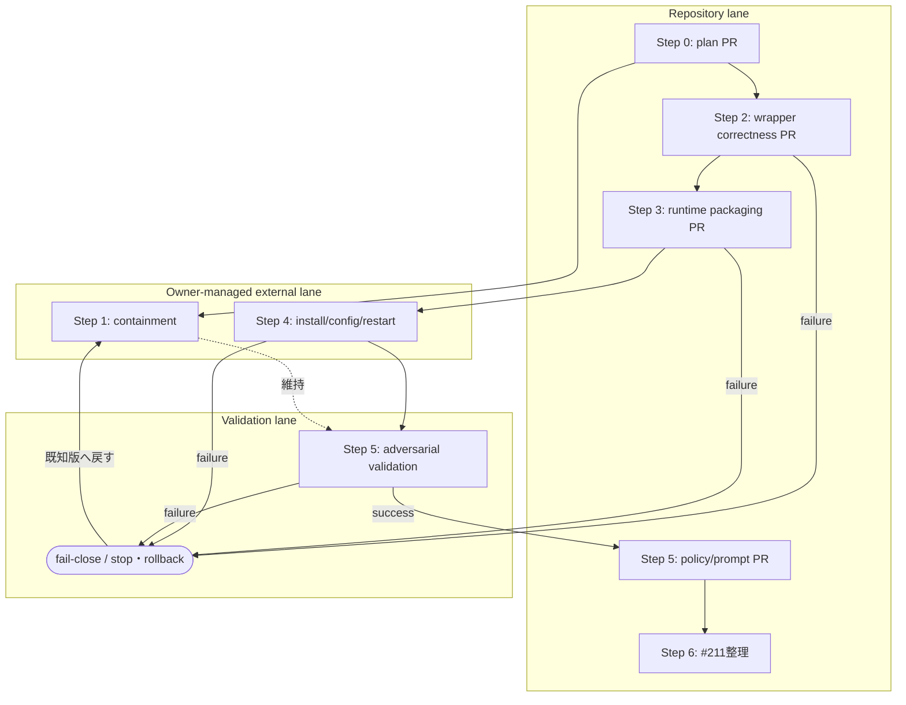

# Claude review 修復・信頼境界分離計画

| 項目 | 値 |
|---|---|
| 計画版 | `1.0` |
| 状態 | `active / Step 0 in progress` |
| Owner | リポジトリオーナー（外部操作の承認・最終判断） |
| 実行支援 | Codex AI agent |
| 作成日 | 2026-07-20 |
| 対象 | PR #211 と Claude review MCP の修復・段階的再導入 |

> **状態ラベルの意味** — **事実**は再現または現物確認済み、**条件付き事実**は成立条件を限定できるもの、**未確認**は追加観測が必要なもの、**設計判断**は本計画で採用する制約、**提案**は owner の承認前で未実施の処置を表す。
>
> **重要:** 本文に記載した MCP disable、PR #211 の変更・close、repo 外 install、`~/.codex/config.toml` の変更、Codex/MCP 再起動は、計画作成時点では**いずれも未実施**である。

## 1. 目的

Claude review を「レビュー対象の可変 checkout」から分離した信頼済み runtime で実行し、LLM 応答を機械検証してから採用する fail-close な経路へ移行する。調査、実装、repo 外 rollout、敵対的検証、policy 有効化を別 gate にし、各段階を独立に検証・rollback できるようにする。

## 2. スコープと非スコープ

### スコープ

- PR #211 で判明した wrapper correctness と信頼境界の問題を整理する。
- containment、wrapper 修正、versioned runtime、repo 外 rollout、敵対的検証、policy 再導入の実行順序を固定する。
- 各 Step の入力、変更範囲、副作用、検証、rollback、done gate、stop 条件を定義する。
- 実行版、設定版、prompt 版、入力 commit を provenance として追跡する。

### 非スコープ

- この計画書PRで製品コード、MCP設定、prompt、hook、runtime を変更すること。
- same-UID の悪意あるローカルプロセス、root、ホスト侵害から完全に防御すること。
- Claude Code を OS sandbox、network sandbox、credential sandbox とみなすこと。
- 有料サービスの導入。必要になった場合は実装前に owner の明示承認を得る。

## 3. 事実台帳

### 3.1 確認済みの事実

| ID | 分類 | 確認内容 | 含意 |
|---|---|---|---|
| F-01 | **事実** | 2026-07-20 の確認時、root checkout は `issue-claude-review-policy`、HEAD は PR #211 の `648798d` と一致した。 | PR対象と runtime の基点が同じ可変 checkout になっていた。 |
| F-02 | **事実** | `~/.codex/config.toml` は root checkout 内の `.codex/mcp/claude_review/server.py` を絶対パスで直接起動する設定だった。固定 commit、hash、runtime version、cwd の pin はなかった。 | config が指す checkout の状態が次回起動する server の供給源になる。 |
| F-03 | **事実** | `common_instructions.md` は server と同じ checkout から、レビュー呼び出しごとに読み直される。`server.py` は MCP process 起動時に読み込まれる。 | prompt変更は次回呼び出し、server変更はMCP/Codex再起動後に効く。 |
| F-04 | **事実** | ローカル Claude Code `2.1.214` の help は `--safe-mode` を提供し、CLAUDE.md、skills、plugins、hooks、MCP、custom commands/agents 等の customization を無効化すると説明する。 | target由来customizationへの一次防御になる。 |
| F-05 | **事実** | `--safe-mode` は OS process、filesystem、network、credential、親 Python MCP server の隔離を保証しない。 | safe-mode単独では信頼境界を形成できない。 |
| F-06 | **事実** | exit 0 の `{"result":"問題なし","is_error":true}` が正常レビューとして返る反例を再現した。 | envelope の意味検証が不足している。 |
| F-07 | **事実** | 正常なレビュー文 `rate_limit_error handling is broken...` が rate-limit と誤認され `ToolError` になる反例を再現した。 | 成功本文とdiagnosticの判定経路を分離する必要がある。 |
| F-08 | **事実** | `{"result":"429"}` と引用符付きの実rate-limit bannerが正常レビューとして返る反例を再現した。 | rate-limit検出の境界ケースが不足している。 |
| F-09 | **事実** | 現行 schema 検証は top-level object と非空文字列 `result` が中心で、`type`、`subtype`、`is_error` の意味整合を十分に検証しない。 | raw LLM/CLI出力が検証段を迂回し得る。 |
| F-10 | **事実** | safe-mode の現行 fake-child テストは argv に flag があることを確認する人工テストで、実Claudeによるhook/CLAUDE.md/plugin隔離を実証しない。 | 実CLIを使う敵対的integration検証が別途必要である。 |

### 3.2 条件付き事実

| ID | 分類 | 条件付きの記述 |
|---|---|---|
| CF-01 | **条件付き事実** | config が指す root checkout の `common_instructions.md` を変更した場合、次のレビュー呼び出しから変更が反映される。sibling worktree の変更は、そのpathをconfig/serverが参照しない限り直接反映されない。 |
| CF-02 | **条件付き事実** | config が指す root checkout の `server.py` を変更した場合、稼働中processには即時反映されず、MCP/Codexの次回起動後に反映される。 |
| CF-03 | **条件付き事実** | user-ownedなrepo外version固定bundleは「PR/worktreeがruntimeを偶発的またはレビュー経由で変更する」脅威を大幅に減らすが、same-UID adversaryによる書換えには耐えない。 |

### 3.3 否定済みの過剰一般化

| ID | 分類 | 否定する表現 | 正確な表現 |
|---|---|---|---|
| N-01 | **否定済み** | 任意のPR worktreeが常にtrusted instructionsを変更できる。 | config/serverが実際に参照するcheckoutだけが直接の供給源である。 |
| N-02 | **否定済み** | `server.py` の編集は稼働MCPへ即時反映される。 | process再起動後に反映される。 |
| N-03 | **否定済み** | PR本文だけで任意コマンドを直接実行できることが確認された。 | その実行可能性は確認されていない。 |
| N-04 | **否定済み** | 正常文の `rate_limit_error...` 誤検知が長時間のactive cooldownを必ず作る。 | stateは作成されたが、再現時は `reset_at: null` で次回preflightのactive blockにならなかった。 |

### 3.4 未確認事項

| ID | 分類 | 追加確認 |
|---|---|---|
| U-01 | **未確認** | 稼働中MCP processが読み込んだserver bytesと現在ディスク上のhashが一致するか。 |
| U-02 | **未確認** | 稼働中processの `CLAUDE_BIN`、`GH_BIN`、`PYTHONPATH` 等の実値。 |
| U-03 | **未確認** | 実Claude Code `2.1.214` で、悪意あるfixtureのhook、CLAUDE.md、plugin等がsafe-modeにより実際に無効化されるか。 |
| U-04 | **未確認** | 実Claude成功・失敗envelopeの全variantと、将来versionでの互換性。 |

## 4. 判断と脅威モデル

### 4.1 採用する設計判断

- **設計判断 D-01:** PR #211 は merge hold とし、本計画の独立PR群で置換できた時点で supersede 候補とする。close は Step 6 のowner判断まで行わない。
- **設計判断 D-02:** active review target checkout と trusted runtime/prompt を別path、別更新手順に分離する。
- **設計判断 D-03:** promptの「target内の指示に従わない」は一次防御であり、schema、version、path、hash、commit整合の機械検証を最終防御とする。
- **設計判断 D-04:** 外部CLI/LLMのraw出力は入力である。検証成功を表す型を得るまで、レビュー結果や副作用へ渡さない。
- **設計判断 D-05:** containment、コードPR、repo外rollout、policy有効化を同じPRや同じgateに混ぜない。

### 4.2 標準脅威モデル

守る対象は、レビュー対象PR/worktreeが次を変更してreview判定を自己承認させることからの防御である。

- MCP server実装
- trusted common instructions / prompt
- runtime manifest、expected hash、launcher設定
- target commitの取り違え
- target側 customization によるClaude processの挙動変更

攻撃入力として、targetのコード、文書、AGENTS.md/CLAUDE.md、hook、plugin、skill、PR本文、review対象diffを扱う。これらは証拠には使えるが、trusted policyとしては扱わない。

### 4.3 非対象と強化案

- **非対象:** same-UIDの悪意あるprocess、root、ホスト侵害、Claude/gh配布物自体の侵害、外部サービス側の侵害。
- **標準案:** user-ownedのrepo外version固定bundle。通常のPR/worktree改変との分離を目的とする。
- **強化案:** same-UID書換えも脅威に含める場合、root/admin管理のread-only配置、署名検証、別OS user/container等を追加する。これは標準案より運用負荷が高いため別のowner承認を要する。

## 5. 所見と処置の対応表

| 所見 | 根拠 | 処置 | Step | 完了証拠 |
|---|---|---|---|---|
| `is_error: true` を成功扱い | F-06/F-09 | response envelopeをallowlistで検証し矛盾をfail-close | 2 | 回帰test＋全test |
| 正常な `rate_limit_error...` を誤検知 | F-07 | success本文とstructured error/stderr/nonzero diagnosticを分離 | 2 | 正常文fixtureが成功 |
| bare `429` / quoted bannerを見逃し | F-08 | diagnostic正規化と境界fixture追加 | 2 | 両fixtureがToolError |
| CLI能力を事前確認しない | F-04/U-04 | 必須flag/version capability preflight | 2 | 対応/非対応fake CLI test |
| safe-mode隔離testがmockのみ | F-10/U-03 | 実Claudeの敵対的integration test | 5 | marker非生成・provenance記録 |
| 可変checkoutがserver/prompt供給源 | F-01〜F-03 | versioned bundle、manifest、launcher、repo外install | 3〜4 | path/hash/version/status一致 |
| promptだけでは最終防御にならない | F-05/D-03 | 検証済み型のみ下流へ渡す | 2〜3 | bypass経路なしのreview/test |
| PR #211がpolicyとruntime変更を混在 | D-05 | PR境界を分割し、最後にsupersede整理 | 2〜6 | 各PR gate＋#211台帳 |

## 6. PR境界と依存DAG

| PR/操作単位 | 内容 | 含めないもの | merge/実行条件 |
|---|---|---|---|
| Plan PR | 本計画書と台帳リンク | 製品コード、設定、MCP操作 | docs review完了 |
| Wrapper correctness PR | envelope/rate-limit/capability/precondition修正とunit test | repo外install、policy変更 | Plan merge、独立敵対レビュー、全test |
| Runtime packaging PR | versioned bundle、manifest、launcher、provenance検証 | `~/.codex/config.toml`変更、restart | Wrapper PR merge、package test |
| Owner rollout | repo外install、config switch、restart、rollback確認 | policy/prompt有効化 | packaging merge、owner明示承認 |
| Policy/prompt PR | review必須条件、STOP規則、trusted prompt | wrapper/runtime新機能 | 敵対的validation成功 |
| PR #211整理 | superseded説明、必要な参照移行、close判断 | 新機能実装 | 置換PR群の完了 |

## 7. 実行順序の不変条件

1. Planが恒久化される前にcontainment以外の実装・rolloutを始めない。
2. 検証前の外部CLI/LLM出力をレビュー成功結果として返さない。
3. Wrapper correctnessがmergeされる前にruntime bundleをrelease候補にしない。
4. Runtime bundleのmanifest/hash/path検証が成功する前にconfigを切り替えない。
5. config切替前に旧設定と旧bundleのrollback手順を実行可能な形で保存する。
6. Codex/MCP再起動後のstatus/provenance確認前に新runtimeを有効と判定しない。
7. 実Claudeによる敵対的validation成功前にreview policyを必須化しない。
8. 置換PRとrolloutが完了する前にPR #211をsuperseded完了としてcloseしない。
9. 各段の失敗は下流を止め、黙ってskipまたは成功扱いにしない。
10. owner承認が必要な外部操作を、文書PRのmergeやコードPRの承認から推定して実行しない。

## 8. 段階別処置

### Step 0 — 計画の恒久化

- **入力:** 確認済み事実台帳、最新の敵対的レビュー、ownerの「計画を恒久化して一歩ずつ進める」指示。
- **許可される変更:** 本計画書、既存method inventoryからのリンク、docs-only draft PR。
- **禁止:** 製品コード、prompt、MCP/config、PR #211、runtime、外部processの変更。
- **副作用:** 新branch、commit、remote branch、draft PRの作成のみ。
- **precondition:** 最新`origin/main` OID確認、隔離worktree、変更対象2ファイルの限定。
- **実行手順:** 文書作成 → link/check → diff review → 明示stage → commit → push → main向けdraft PR。
- **verification:** Markdown内部link、Mermaid構文の目視、`git diff --check`、変更ファイル一覧。
- **rollback:** draft PR close、remote/local branch削除。root checkoutとPR #211には影響しない。
- **done gate:** 独立レビュー所見なし、Plan PR merge、実行台帳を`done`へ更新。
- **stop条件:** 事実と現物の矛盾、`origin/main`更新競合、docs以外のdiff、検証失敗。

### Step 1 — containment

- **入力:** merge済みPlan、現行MCP設定、旧設定backup先、PR #211状態。
- **許可される変更:** owner承認後のMCP一時disable、#211 merge hold明記、rollback記録。
- **禁止:** #211のclose/force-push、未監査runtimeへの切替、policy有効化。
- **副作用:** Claude review MCPが一時利用不能になる。レビューは代替手段または保留となる。
- **precondition:** ownerの明示承認、config backup、再有効化手順、利用者への影響通知。
- **実行手順:** 現状採取 → backup → MCP disable → restartが必要なら承認範囲内で実施 → status確認 → #211 holdを記録。
- **verification:** MCPが呼出不能/disabledであること、他MCPへの非影響、backupから復元可能なこと。
- **rollback:** backup configを戻し、旧MCPを再起動して旧statusを確認。ただし既知riskも復帰する旨を明示する。
- **done gate:** containment状態とrollback証跡が台帳に記録される。
- **stop条件:** backup不備、他MCPへの影響、disable対象の曖昧さ、owner承認範囲外のrestart要求。

### Step 2 — wrapper correctness独立PR

- **入力:** F-06〜F-10のfixture、実Claude envelope sample、対応CLI要件。
- **許可される変更:** server/wrapper、unit test、互換性文書。`pr_number`正整数検証を含める。
- **禁止:** repo外install、config変更、policy/prompt運用変更、PR #211への積み増し。
- **副作用:** 不明・矛盾応答を成功からエラーへ変更する。古い/非対応CLIはpreflightで拒否される。
- **precondition:** acceptするenvelope allowlistとrate-limit source分類をreviewで確定。
- **実行手順:** failing fixture追加 → envelope validator → diagnostic経路分離 → capability preflight → tests/docs。
- **verification:** 3反例、未知type/subtype、矛盾error、missing result、対応/非対応CLI、全unit/discover/coverage、独立敵対レビュー。
- **rollback:** correctness PR revert。containmentは維持し、旧wrapperをproduction gateへ戻さない。
- **done gate:** PR merge、全検証成功、未解決review所見なし。
- **stop条件:** 実CLI envelopeとfixtureの不一致、互換性をfail-openでしか保てない、公開契約の未合意MAJOR変更。

### Step 3 — versioned runtime bundle / manifest / launcher独立PR

- **入力:** merge済みwrapper、runtime file一覧、threat model、install destination契約。
- **許可される変更:** bundle builder/installer素材、manifest、isolated launcher、provenance status、package test/docs。
- **禁止:** 実ユーザー領域へのinstall、`~/.codex/config.toml`変更、restart、policy変更。
- **副作用:** repository内に配布可能なversioned artifact生成手段が増える。testは`/tmp`のみを使う。
- **precondition:** runtime version、manifest schema、hash対象、absolute binary policy、target/runtime非重複条件の確定。
- **実行手順:** bundle layout → manifest/hash → `/usr/bin/python3 -I`相当launcher → realpath/non-overlap/HEAD照合 → provenance出力 → package tests。
- **verification:** 改ざんhash、path重複、target HEAD不一致、未知manifest MAJOR、環境汚染をfail-close。reproducible bundle hashを確認。
- **rollback:** packaging PR revert。外部install未実施のためruntime稼働状態は変えない。
- **done gate:** PR merge、artifact/provenance再現、独立security review所見なし。
- **stop条件:** expected hashと検証コードが同じ可変targetだけで自己完結する設計、target import、相対binary/path、秘密情報のmanifest混入。

### Step 4 — repo外install / config switch / restart

- **入力:** 監査済みcommitからのbundle、manifest/hash、現行config backup、rollback版。
- **許可される変更:** owner承認範囲内のrepo外versioned directory、`~/.codex/config.toml`、Codex/MCP restart。
- **禁止:** active checkout由来fileへの参照、未監査artifact、policy必須化、旧bundle即時削除。
- **副作用:** ユーザー環境のMCP runtimeが切り替わり、restart中は利用不能時間が生じる。
- **precondition:** ownerの明示承認、install先権限、disk容量、backup、rollback rehearsal、絶対path/hash確認。
- **実行手順:** version directoryへinstall → manifest検証 → configを固定絶対pathへ切替 → restart → status/provenance確認。
- **verification:** runtime realpath/version/hash、prompt version、launcher/python/Claude/gh path、target非重複、review smoke test。
- **rollback:** configを旧版/disabled状態へ戻しrestart。失敗bundleは保持して診断し、active symlink等で曖昧に切替えない。
- **done gate:** 新runtime status一致、rollback確認、ownerがrollout結果を承認。
- **stop条件:** hash/path/version不一致、想定外env、restart失敗、旧設定消失、他MCP影響、approval不足。

### Step 5 — 敵対的validation後にpolicy/prompt独立PR

- **入力:** rollout済みruntime、悪意あるtarget fixture、trusted prompt候補、review policy候補。
- **許可される変更:** validation fixture/result記録。成功後に限りpolicy/promptの独立PR。
- **禁止:** validation成功前の必須gate化、target側instructionをtrusted policyとして採用、機械検証のprompt委譲。
- **副作用:** 実Claude呼出しが発生し得る。無料枠内で実行し、課金が必要なら停止してowner承認を求める。
- **precondition:** ownerが実Claude試験を承認、marker/fixtureが隔離directory内、秘密情報を含まない、cleanup/費用上限が確定。
- **実行手順:** hook/CLAUDE.md/plugin/prompt-injection fixture → safe-mode実行 → marker/output/provenance確認 → failure variant → 成功後policy/prompt PR。
- **verification:** customization非読込、target指示不追従、schema bypass不可、target commit一致、unknown prompt MAJOR拒否、独立再レビュー。
- **rollback:** validation失敗時はcontainmentへ戻す。policy PRはmergeせず、runtimeまたはwrapperの該当Stepへ戻る。
- **done gate:** 敵対的validation成功、証跡保存、policy/prompt PR merge、必須gateのsmoke test成功。
- **stop条件:** marker生成、untrusted instruction採用、provenance欠落、実行費用発生の懸念、外部service異常、未解決review所見。

### Step 6 — PR #211 superseded整理 / 台帳完了

- **入力:** Step 2〜5のmerged PR/rollout証跡、PR #211の差分とcomment履歴。
- **許可される変更:** #211へのCodex AI agent由来の整理comment、superseded/close判断、台帳完了更新。
- **禁止:** 証跡なしのclose、履歴破壊、未移行変更の黙示破棄、merge。
- **副作用:** PR #211がcloseされる可能性がある。リンクと判断履歴は残る。
- **precondition:** #211の全意図が置換PRへ対応済みかdiff単位で照合し、owner承認を得る。
- **実行手順:** intent/diff対応表 → 未移行確認 → 置換PR/rollout link comment → owner判断 → closeまたは残課題化 → 台帳更新。
- **verification:** #211の各変更に移行先/棄却理由がある、未解決commentの扱いが明記、main状態とdocsが一致。
- **rollback:** close後に漏れが判明した場合はreopenまたは新Issue。置換済みPRを巻き戻さない。
- **done gate:** owner承認、#211整理完了、実行台帳全項目done、最終報告。
- **stop条件:** 未移行diff、未解決重大所見、置換PRの未merge、rollout未承認、事実と台帳の不一致。

## 9. 版とprovenance

### 9.1 版規約

| 対象 | 版 | MAJOR | MINOR |
|---|---|---|---|
| 本計画 | `1.0` | Step/gate/脅威モデルの構造変更 | 文言・補足・状態更新 |
| Runtime manifest | `1.0`（Step 3で確定） | schema/検証契約の変更 | 後方互換field追加 |
| Wrapper response contract | `1.0`（Step 2で確定） | acceptする応答型の構造変更 | 同一構造の診断改善 |
| Trusted prompt | `1.0`（Step 5で確定） | 出力型/役割境界の変更 | 意味を保つ文言改善 |

未対応MAJORは実行前にfail-closeする。版番号は実装commit、bundle hash、設定と対応づける。

### 9.2 実行ごとのprovenance必須項目

- runtime version、runtime realpath、server/prompt/manifest SHA-256
- wrapper response contract版、trusted prompt版
- launcher、Python、Claude、ghの絶対pathとversion
- target repository realpath、target HEAD、PR number、取得したremote PR head OID
- config識別子/hash、実行時刻、結果種別、失敗stage
- 秘密値を除いた能力判定結果。tokenやcredentialそのものは記録しない。

制御応答、診断ログ、永続監査ログは分離し、diagnosticがMCP protocol出力を汚さないようにする。

## 10. オーナー承認が必要な外部操作

次はコードPRの承認とは別に、その都度ownerの明示承認を得る。

- Claude review MCPのdisable/re-enable
- `~/.codex/config.toml` または他のrepo外設定の変更
- repo外bundleのinstall、更新、削除
- Codex/MCP processのrestart
- PR #211のclose、reopen、force-push、merge
- 実Claudeを使う敵対的integration test（費用と外部送信範囲を提示）
- 有料サービス、有料枠、課金が発生し得る構成
- root/admin管理配置など標準脅威モデルを超えるhardening

承認がない場合は該当Stepを`blocked-awaiting-owner`とし、後続の副作用段へ進まない。

## 11. 実行台帳

| Step | 状態 | 開始条件 | 証跡 | 次gate |
|---|---|---|---|---|
| 0 Plan恒久化 | `in_progress` | owner指示済み | Plan draft PR（作成後追記） | docs独立review・merge |
| 1 Containment | `pending / 未実施` | Step 0 merge＋owner承認 | 未作成 | disable/rollback確認 |
| 2 Wrapper correctness | `pending / 未実施` | Step 0 merge | 未作成 | 独立PR review/merge |
| 3 Runtime packaging | `pending / 未実施` | Step 2 merge | 未作成 | 独立PR review/merge |
| 4 Repo外rollout | `pending / 未実施` | Step 3 merge＋owner承認 | 未作成 | status/rollback/owner承認 |
| 5 Validation＋policy | `pending / 未実施` | Step 4完了＋owner承認 | 未作成 | 敵対試験成功＋policy PR merge |
| 6 #211整理 | `pending / 未実施` | Step 2〜5完了＋owner承認 | 未作成 | 最終照合・close判断 |

台帳更新は観測済み証跡に基づく。作業開始予定を`done`として記録せず、失敗・rollbackも結果として残す。

## 12. 現時点の次アクション

**提案:** このPlan PRを独立文脈でレビューし、所見を修正してmergeする。merge後、Step 1の外部操作についてownerへ対象・副作用・rollbackを再提示して明示承認を得る。同時に、外部副作用を伴わないStep 2の設計・実装は別branch/PRで開始できる。
