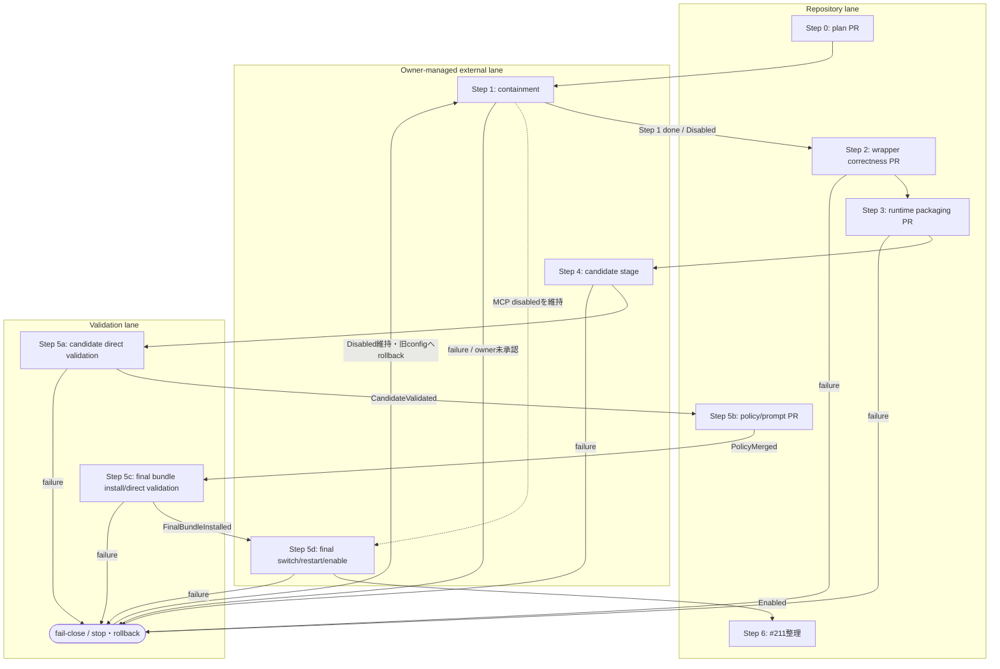
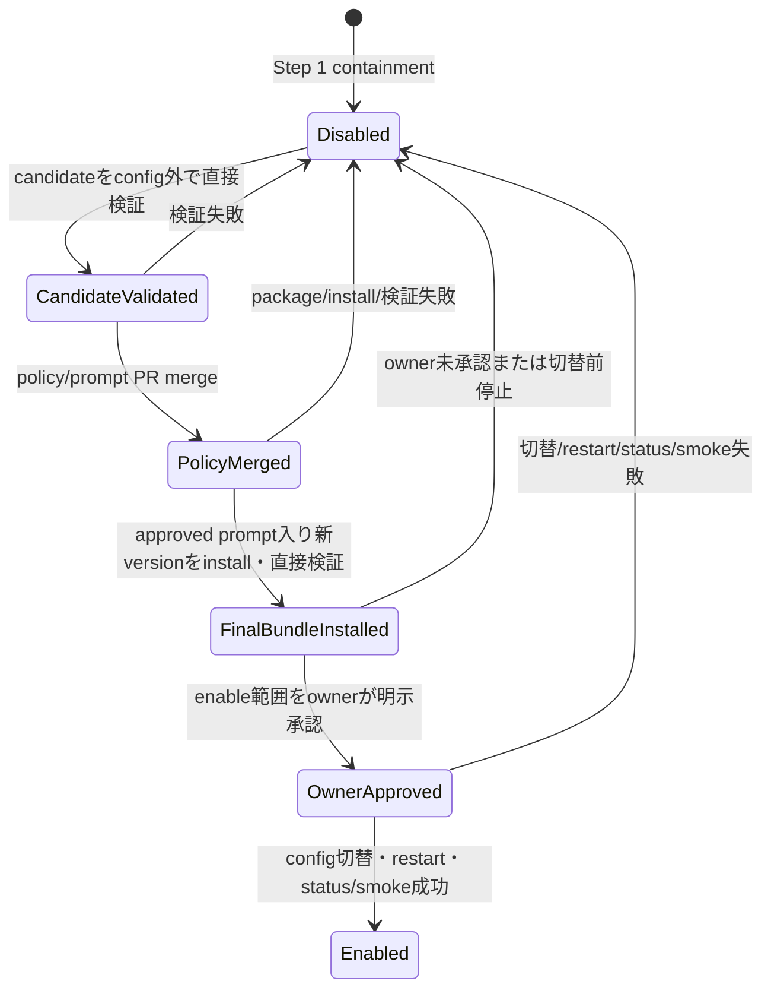

# Claude review 修復・信頼境界分離計画

| 項目 | 値 |
|---|---|
| 計画版 | `1.7` |
| 状態 | `active / Step 1 done / Disabled / Step 2 not started` |
| Owner | リポジトリオーナー（外部操作の承認・最終判断） |
| 実行支援 | Codex AI agent |
| 作成日 | 2026-07-20 |
| 対象 | PR #211 と Claude review MCP の修復・段階的再導入 |

> **状態ラベルの意味** — **事実**は再現または現物確認済み、**条件付き事実**は成立条件を限定できるもの、**未確認**は追加観測が必要なもの、**設計判断**は本計画で採用する制約、**提案**は owner の承認前で未実施の処置を表す。
>
> **重要:** 本文に記載した MCP disable、PR #211 の変更・close、repo 外 install、`~/.codex/config.toml` の変更、Codex/MCP 再起動は、計画作成時点では**いずれも未実施**である。

## 1. 目的

Claude review を「レビュー対象の可変 checkout」から分離した信頼済み runtime で実行し、LLM 応答を機械検証してから採用する fail-close な経路へ移行する。調査、実装、repo 外 rollout、敵対的検証、policy 有効化を別 gate にし、各段階を独立に検証・rollback できるようにする。

## 2. スコープと非スコープ

### スコープ

- PR #211 で判明した wrapper correctness と信頼境界の問題を整理する。
- containment、wrapper 修正、versioned runtime、repo 外 rollout、敵対的検証、policy 再導入の実行順序を固定する。
- 各 Step の入力、変更範囲、副作用、検証、rollback、done gate、stop 条件を定義する。
- 実行版、設定版、prompt 版、入力 commit を provenance として追跡する。

### 非スコープ

- この計画書PRで製品コード、MCP設定、prompt、hook、runtime を変更すること。
- same-UID の悪意あるローカルプロセス、root、ホスト侵害から完全に防御すること。
- Claude Code を OS sandbox、network sandbox、credential sandbox とみなすこと。
- 有料サービスの導入。必要になった場合は実装前に owner の明示承認を得る。

## 3. 事実台帳

### 3.1 確認済みの事実

| ID | 分類 | 確認内容 | 含意 |
|---|---|---|---|
| F-01 | **事実** | 2026-07-20 の確認時、root checkout は `issue-claude-review-policy`、HEAD は PR #211 の `648798d` と一致した。 | PR対象と runtime の基点が同じ可変 checkout になっていた。 |
| F-02 | **事実** | `~/.codex/config.toml` は root checkout 内の `.codex/mcp/claude_review/server.py` を絶対パスで直接起動する設定だった。固定 commit、hash、runtime version、cwd の pin はなかった。 | config が指す checkout の状態が次回起動する server の供給源になる。 |
| F-03 | **事実** | `common_instructions.md` は server と同じ checkout から、レビュー呼び出しごとに読み直される。`server.py` は MCP process 起動時に読み込まれる。 | prompt変更は次回呼び出し、server変更はMCP/Codex再起動後に効く。 |
| F-04 | **事実** | ローカル Claude Code `2.1.214` の help は `--safe-mode` を提供し、CLAUDE.md、skills、plugins、hooks、MCP、custom commands/agents 等の customization を無効化すると説明する。 | target由来customizationへの一次防御になる。 |
| F-05 | **事実** | `--safe-mode` は OS process、filesystem、network、credential、親 Python MCP server の隔離を保証しない。 | safe-mode単独では信頼境界を形成できない。 |
| F-06 | **事実** | exit 0 の `{"result":"問題なし","is_error":true}` が正常レビューとして返る反例を再現した。 | envelope の意味検証が不足している。 |
| F-07 | **事実** | 正常なレビュー文 `rate_limit_error handling is broken...` が rate-limit と誤認され `ToolError` になる反例を再現した。 | 成功本文とdiagnosticの判定経路を分離する必要がある。 |
| F-08 | **事実** | `{"result":"429"}` と引用符付きの実rate-limit bannerが正常レビューとして返る反例を再現した。 | rate-limit検出の境界ケースが不足している。 |
| F-09 | **事実** | 現行 schema 検証は top-level object と非空文字列 `result` が中心で、`type`、`subtype`、`is_error` の意味整合を十分に検証しない。 | raw LLM/CLI出力が検証段を迂回し得る。 |
| F-10 | **事実** | safe-mode の現行 fake-child テストは argv に flag があることを確認する人工テストで、実Claudeによるhook/CLAUDE.md/plugin隔離を実証しない。 | 実CLIを使う敵対的integration検証が別途必要である。 |

### 3.2 条件付き事実

| ID | 分類 | 条件付きの記述 |
|---|---|---|
| CF-01 | **条件付き事実** | config が指す root checkout の `common_instructions.md` を変更した場合、次のレビュー呼び出しから変更が反映される。sibling worktree の変更は、そのpathをconfig/serverが参照しない限り直接反映されない。 |
| CF-02 | **条件付き事実** | config が指す root checkout の `server.py` を変更した場合、稼働中processには即時反映されず、MCP/Codexの次回起動後に反映される。 |
| CF-03 | **条件付き事実** | user-ownedなrepo外version固定bundleは「PR/worktreeがruntimeを偶発的またはレビュー経由で変更する」脅威を大幅に減らすが、same-UID adversaryによる書換えには耐えない。 |

### 3.3 否定済みの過剰一般化

| ID | 分類 | 否定する表現 | 正確な表現 |
|---|---|---|---|
| N-01 | **否定済み** | 任意のPR worktreeが常にtrusted instructionsを変更できる。 | config/serverが実際に参照するcheckoutだけが直接の供給源である。 |
| N-02 | **否定済み** | `server.py` の編集は稼働MCPへ即時反映される。 | process再起動後に反映される。 |
| N-03 | **否定済み** | PR本文だけで任意コマンドを直接実行できることが確認された。 | その実行可能性は確認されていない。 |
| N-04 | **否定済み** | 正常文の `rate_limit_error...` 誤検知が長時間のactive cooldownを必ず作る。 | stateは作成されたが、再現時は `reset_at: null` で次回preflightのactive blockにならなかった。 |

### 3.4 未確認事項

| ID | 分類 | 追加確認 |
|---|---|---|
| U-01 | **未確認** | 稼働中MCP processが読み込んだserver bytesと現在ディスク上のhashが一致するか。 |
| U-02 | **未確認** | 稼働中processの `CLAUDE_BIN`、`GH_BIN`、`PYTHONPATH` 等の実値。 |
| U-03 | **未確認** | 実Claude Code `2.1.214` で、悪意あるfixtureのhook、CLAUDE.md、plugin等がsafe-modeにより実際に無効化されるか。 |
| U-04 | **未確認** | 実Claude成功・失敗envelopeの全variantと、将来versionでの互換性。 |

## 4. 判断と脅威モデル

### 4.1 採用する設計判断

- **設計判断 D-01:** PR #211 は merge hold とし、本計画の独立PR群で置換できた時点で supersede 候補とする。close は Step 6 のowner判断まで行わない。
- **設計判断 D-02:** active review target checkout と trusted runtime/prompt を別path、別更新手順に分離する。
- **設計判断 D-03:** promptの「target内の指示に従わない」は一次防御であり、schema、version、path、hash、commit整合の機械検証を最終防御とする。
- **設計判断 D-04:** 外部CLI/LLMのraw出力は入力である。検証成功を表す型を得るまで、レビュー結果や副作用へ渡さない。
- **設計判断 D-05:** containment、コードPR、repo外rollout、policy有効化を同じPRや同じgateに混ぜない。

### 4.2 標準脅威モデル

守る対象は、レビュー対象PR/worktreeが次を変更してreview判定を自己承認させることからの防御である。

- MCP server実装
- trusted common instructions / prompt
- runtime manifest、expected hash、launcher設定
- target commitの取り違え
- target側 customization によるClaude processの挙動変更

攻撃入力として、targetのコード、文書、AGENTS.md/CLAUDE.md、hook、plugin、skill、PR本文、review対象diffを扱う。これらは証拠には使えるが、trusted policyとしては扱わない。

### 4.3 非対象と強化案

- **非対象:** same-UIDの悪意あるprocess、root、ホスト侵害、Claude/gh配布物自体の侵害、外部サービス側の侵害。
- **標準案:** user-ownedのrepo外version固定bundle。通常のPR/worktree改変との分離を目的とする。
- **強化案:** same-UID書換えも脅威に含める場合、root/admin管理のread-only配置、署名検証、別OS user/container等を追加する。これは標準案より運用負荷が高いため別のowner承認を要する。

## 5. 所見と処置の対応表

| 所見 | 根拠 | 処置 | Step | 完了証拠 |
|---|---|---|---|---|
| `is_error: true` を成功扱い | F-06/F-09 | response envelopeをallowlistで検証し矛盾をfail-close | 2 | 回帰test＋全test |
| 正常な `rate_limit_error...` を誤検知 | F-07 | success本文とstructured error/stderr/nonzero diagnosticを分離 | 2 | 正常文fixtureが成功 |
| bare `429` / quoted bannerを見逃し | F-08 | diagnostic正規化と境界fixture追加 | 2 | 両fixtureがToolError |
| CLI能力を事前確認しない | F-04/U-04 | 必須flag/version capability preflight | 2 | 対応/非対応fake CLI test |
| safe-mode隔離testがmockのみ | F-10/U-03 | 実Claudeの敵対的integration test | 5 | marker非生成・provenance記録 |
| 可変checkoutがserver/prompt供給源 | F-01〜F-03 | versioned bundle、manifest、launcher、repo外install | 3〜4 | path/hash/version/status一致 |
| promptだけでは最終防御にならない | F-05/D-03 | 検証済み型のみ下流へ渡す | 2〜3 | bypass経路なしのreview/test |
| PR #211がpolicyとruntime変更を混在 | D-05 | PR境界を分割し、最後にsupersede整理 | 2〜6 | 各PR gate＋#211台帳 |

## 6. PR境界と依存DAG

| PR/操作単位 | 内容 | 含めないもの | merge/実行条件 |
|---|---|---|---|
| Plan PR | 本計画書と台帳リンク | 製品コード、設定、MCP操作 | docs review完了 |
| Wrapper correctness PR | envelope/rate-limit/capability/precondition修正とunit test | repo外install、policy変更 | Step 1 done、状態`Disabled`、独立敵対レビュー、全test |
| Runtime packaging PR | versioned bundle、manifest、launcher、bootstrap/fixture prompt、provenance検証 | production trusted prompt、`~/.codex/config.toml`変更、restart | Step 1 done、状態`Disabled`、Wrapper PR merge、package test |
| Candidate staging | MCP disabledのまま候補bundleをrepo外へinstall | active config切替、restart、enable | Step 1 done、状態`Disabled`、packaging merge、owner明示承認 |
| Candidate validation | configを使わず候補bundleを直接起動し、runtime隔離を検証 | production利用、policy有効化 | candidate staging、実Claude試験のowner明示承認 |
| Policy/prompt PR | review必須条件、STOP規則、production trusted prompt | wrapper/runtime新機能、config変更 | candidate validation成功 |
| Final rollout | approved prompt入り最終bundleの新規install、直接検証、owner承認、config切替、restart、enable | active checkout参照、候補bundleの流用 | policy/prompt merge、最終bundle検証、owner明示承認 |
| PR #211整理 | superseded説明、必要な参照移行、close判断 | 新機能実装 | 置換PR群の完了 |

### 6.1 containmentからenableまでの状態遷移

`Disabled` は「Codexに登録されたClaude review MCP disabled」「PR #211 merge hold」「新policy disabled」の3つを含む。`CandidateValidated`以降も、`Enabled`へ到達するまでは登録MCPと新policyを無効のまま維持する。candidate/final launcherの直接起動は隔離された検証processであり、登録MCPのre-enableではない。各失敗ではactive configを旧disabled設定へ戻し、状態を`Disabled`として記録する。

候補bundleの`bootstrap/fixture prompt`はruntime隔離、応答検証、provenance経路を試験するための非本番artifactであり、レビューpolicyやactive configには使用しない。`production trusted prompt`はpolicy/prompt PRで承認された後にだけ最終version bundleへ含める。候補bundleと最終bundleは別version・別hashであり、同一物として扱わない。

Step 1 doneの証跡はStep 2〜6すべての共通必須preconditionである。Step 2〜5は、その証跡に加えて各作業開始時の現在状態が`Disabled`であることを要求する。Step 6はStep 5で`Enabled`へ遷移した後なので、現在状態`Disabled`ではなく「Step 1で`Disabled`を達成した履歴証跡」を要求する。これにより、containmentを未実施のまま下流だけを実行する経路を認めない。

## 7. 実行順序の不変条件

1. PR #238のremote mergeを確認し、専用ledger transition PRをmainへmergeしてStep 0を`done`、Step 1を`in_progress`と記録するまで、Step 1の外部操作とStep 2以降を始めない。
2. Step 1で既存supervisorのcached構成破棄後に、後述するfinal verification sequenceの全checkpointでMCP disabledと他MCPへの非影響を確認し、PR #211 merge hold記録、rollback材料確保の3条件をすべて満たして、台帳へStep 1=`done`と`Disabled`証跡を記録するまでStep 2〜6を始めない。disable/hold確認の失敗またはowner未承認時は全下流をSTOPし、offline fixtureによるcorrectness作業も開始しない。
3. 検証前の外部CLI/LLM出力をレビュー成功結果として返さない。
4. Wrapper correctnessがmergeされる前にruntime bundleをrelease候補にしない。
5. Candidate bundleはMCP disabledのままconfig外で直接検証し、candidateとactive configを接続しない。
6. config切替前に旧設定と旧bundleのrollback手順を実行可能な形で保存する。
7. Candidate validation成功後にpolicy/prompt PRをmergeし、そのapproved production promptを含む別versionの最終bundleを新規作成・install・直接検証する。bootstrap/fixture promptをproduction promptとして昇格しない。
8. `Disabled → CandidateValidated → PolicyMerged → FinalBundleInstalled → OwnerApproved → Enabled` の順を飛ばさず、実Claudeによる敵対的validation成功前にreview policyを必須化しない。
9. 置換PRとrolloutが完了する前にPR #211をsuperseded完了としてcloseしない。
10. 各段の失敗は下流を止め、黙ってskipまたは成功扱いにしない。
11. owner承認が必要な外部操作を、文書PRのmergeやコードPRの承認から推定して実行しない。実Claudeを呼ぶsample採取、test、validation、smokeはすべて個別承認対象とする。

## 8. 段階別処置

### Step 0 — 計画の恒久化

- **入力:** 確認済み事実台帳、最新の敵対的レビュー、ownerの「計画を恒久化して一歩ずつ進める」指示。
- **許可される変更:** 本計画書、既存method inventoryからのリンク、docs-only draft PR。
- **禁止:** 製品コード、prompt、MCP/config、PR #211、runtime、外部processの変更。
- **副作用:** 新branch、commit、remote branch、draft PRの作成のみ。
- **precondition:** 最新`origin/main` OID確認、隔離worktree、変更対象2ファイルの限定。
- **実行手順:** 文書作成 → link/check → diff review → 明示stage → commit → push → main向けdraft PR。
- **verification:** Markdown内部link、Mermaid構文の目視、`git diff --check`、変更ファイル一覧。
- **rollback:** draft PR close、remote/local branch削除。root checkoutとPR #211には影響しない。
- **done gate:** 独立レビュー所見なし、PR #238 merge後に専用ledger transition PRをmergeし、PR #238 URL、head SHA、merge commit、merge時刻を記録してStep 0を`done`、Step 1を`in_progress`へ遷移する。
- **stop条件:** 事実と現物の矛盾、`origin/main`更新競合、docs以外のdiff、検証失敗。

PR #238内では、merge前の事実に合わせてStep 0を`in_progress`のまま保った。その後、remote上でPR #238のmergeを確認したため、本ledger transitionでStep 0を`done`、Step 1を`in_progress (external actions not started)`へ更新した。このtransition PRがmainへmergeされるまでStep 1の外部操作とStep 2以降は停止する。以降のStep 1実行結果は別のcloseout更新で記録する。

### Step 1 — containment

- **入力:** merge済みPlan、現行MCP設定、旧設定backup先、PR #211状態。
- **許可される変更:** owner承認後のMCP一時disable、#211 merge hold明記、rollback記録。
- **禁止:** #211のclose/force-push、未監査runtimeへの切替、policy有効化。
- **副作用:** Claude review MCPが一時利用不能になる。レビューは代替手段または保留となる。
- **precondition:** Step 0のledger transition PRがmainへmerge済み、ownerの明示承認、config backup、再有効化手順、利用者への影響通知。
- **実行手順:** 現状採取 → backup → MCP disable → restartが必要なら承認範囲内で実施 → status確認 → #211 holdを記録。
- **verification:** MCPが呼出不能/disabledであること、他MCPへの非影響、backupから復元可能なこと。
- **rollback:** backup configを戻し、旧MCPを再起動して旧statusを確認。ただし既知riskも復帰する旨を明示する。
- **done gate:** 既存supervisorのcached構成を破棄した後、後述するfinal verification sequenceの全checkpointで共通必須証跡を採取し、checkpoint (c)でのみ`agy` / `serena`のread-only operation成功をusableの根拠として確認する。さらにPR #211 merge holdを記録し、旧config backup・復元手順等のrollback材料を確保した3条件が揃う。これらと`Disabled`（MCP disabled、#211 merge hold、新policy disabled）を台帳へ記録してStep 1を`done`にする。
- **stop条件:** owner未承認、MCP disabled確認失敗、#211 hold記録失敗、rollback材料不備、他MCPへの影響、disable対象の曖昧さ、owner承認範囲外のrestart要求。いずれかに該当したらStep 2〜6をすべてSTOPする。

Step 1の3条件達成後、専用closeout ledger PRで実測証跡とStep 1=`done`、現在状態=`Disabled`を記録しmainへmergeする。このcloseout ledger mergeがStep 2開始gateであり、configのdisabled表示だけでは3条件達成とみなさず、台帳未mergeの間も下流へ進まない。

#### Step 1 実施記録

- 2026-07-20、ownerがStep 1一式を明示承認した後、`~/.codex/config.toml`を`/home/hiras/.codex/config.toml.pre-claude-review-disable.20260720T060143Z`へbackupした。変更前に内容一致を確認し、元設定とbackupはいずれも`hiras:hiras`、mode `600`である。
- `[mcp_servers.claude_review]`のみに`enabled = false`を追加した。backupとの差分はこの1行だけであり、command、args、tool approval、他MCP設定は変更していない。
- 新規Codex CLI processの`codex mcp list` / `codex mcp get claude_review`で`claude_review = disabled`、`agy` / `serena = enabled`を確認した。稼働中agent sessionや無関係processは停止していない。
- PR #211に[merge hold記録](https://github.com/hiratashinnya/review-system/pull/211#issuecomment-5019447581)を投稿した。close、force-push、merge、追加修正は行っていない。
- 独立レビュー時のhost process確認では、長寿命の`codex resume`（PID `2510`）配下に対象`server.py` processが4本（PID `471354`、`671496`、`681260`、`685731`）残存していた。PID `685731`はbackup識別子`20260720T060143Z`より後に起動しており、設定変更後も既存supervisorから再spawnしたことを確認した。
- PR #241のmerge時点では、新規CLIによるconfigのdisabled表示、backup、PR #211 merge hold、新policy disabledは達成済みだったが、既存sessionのcached MCP構成破棄と対象process不在の確認は未達だった。この時点ではStep 1と現在状態を`in_progress`のままとし、`Disabled` / `done`とは判定しなかった。

その後、owner承認範囲内で親側のCodex supervisor/sessionをrestartしてcached MCP構成を破棄し、次のfinal verification sequenceを完了した。実測証跡は後述のStep 1完了記録と実行台帳に記録する。

#### Step 1 final verification sequence

1. **旧parent消滅確認:** 旧`codex resume` parent PID `2510`と既知の対象child PID `471354`、`671496`、`681260`、`685731`がすべて消滅したことを確認する。いずれかが残る場合はfresh起動へ進まずSTOPする。
2. **共通必須証跡:** 下記(a)〜(d)の各checkpointで、観測時刻、fresh supervisor/sessionのPID/PPID、対象`server.py` process一覧と件数、`codex mcp list` / `get`相当のstatusを記録する。各checkpointで対象processが0本、`claude_review = disabled`を確認し、旧parent PIDを照合できる時点ではその消滅も再確認する。`agy` / `serena`は(a)以降の各statusでenabledを確認するが、usableの実測は(c)のread-only operation結果だけを根拠とする。

| Checkpoint | 開始条件と刺激 | 採取する証跡・判定 |
|---|---|---|
| (a) fresh起動完了直後 | fresh supervisorが設定を読み込んで起動完了した直後、最初のユーザーturnまたは明示的tool discoveryを開始する前に採取する。クライアントの自動初期化でdiscoveryが不可避なら(a)と(b)を単一checkpointに統合し、自動discoveryの発生時刻と統合理由を記録する。 | 共通必須証跡のみ。`agy` / `serena`のread-only operationとusable判定は要求しない。 |
| (b) MCP config/tool discovery後 | clientのtool registry refresh、登録MCP tool一覧要求、または同等の明示的discoveryを実行する。起動時に自動discovery済みなら(a)との統合checkpointとして扱い、重複実行を要求しない。 | discoveryの操作または自動初期化eventと、その直後の共通必須証跡。 |
| (c) enabled MCPと通常経路の刺激後 | 共通必須証跡を直前採取し、`agy`と`serena`で副作用を起こさないread-only operationを各1回実行する。その後、通常turnと別文脈生成を各1回完了する。 | 各operationの入力種別・時刻・成功結果をusableの唯一の根拠として記録し、全刺激完了直後に共通必須証跡を再採取する。 |
| (d) 30秒観測窓後 | (c)の直後を観測窓開始として共通必須証跡を採取し、30秒間連続観測した終了時に再採取する。 | (c)のusable成功結果と、開始・終了時の`agy` / `serena = enabled`を継続性の根拠とする。read-only operationは再呼出しせず、対象processの非respawnを新たな刺激なしで確認する。 |

3. **判定:** いずれかのcheckpointで対象processが1本以上、`claude_review`がenabled/callable、他MCP statusがdisabled、(c)の他MCP operationが失敗、旧parent PIDが残存、または必要な操作・証跡が欠落した場合はStep 1を`in_progress`、Step 2〜6をSTOPのまま維持する。実際の再spawn triggerを特定できない場合も`done`にしない。

#### Step 1 完了記録

- final verification sequenceを確定した[PR #241](https://github.com/hiratashinnya/review-system/pull/241)はmerge commit `8cf11c185bf724fd511086254658c03fb8b4ffd3`でmainへmerge済みである。
- restart後、旧parent PID `2510`が存在しないことを確認した。fresh Codex wrapper PID `701827` / native PID `701838`は2026-07-20 17:06:51 JSTに起動した。

| Checkpoint / 証跡ID | 時刻・間隔（2026-07-20 JST） | supervisor/session・旧PID | 対象process・MCP status | 刺激・read-only結果 |
|---|---|---|---|---|
| (a)/(b) 再実測・discovery統合（AB1〜AB5） | enabled MCP child観測 `19:24:37`、status `19:25:29`、process chain観測 `19:25:38` | wrapper PID `701827`（PPID `1426`）/ native PID `701838`（PPID `701827`）、両者のstart `17:06:51`。旧PID `2510`不在 | exact `claude_review/server.py` process一覧空・0本。`agy = enabled`、`claude_review = disabled`、`serena = enabled` | `agy` / `serena` childのstartは `17:07:10` / `17:56:58` / `18:19:42` / `18:22:50`。これはclientによる自動discovery済みのproxy証跡として(a)/(b)を統合する根拠にするが、各startを特定のcontextやturnへ帰属させる因果は未確認であり断定しない |
| (c) `agy` 刺激（A1〜A4） | pre `19:25:45`、result `19:25:53`、post status `19:26:12` | pre/postで上記current chainを維持し、旧PID `2510`不在 | pre/postのexact Claude process count 0。post statusは`agy = enabled`、`claude_review = disabled`、`serena = enabled` | read-only `agy status`が`isError: false`で成功 |
| (c) `serena` 刺激（S1〜S4） | pre `19:26:17`、result `19:26:27`、post status `19:26:32` | pre/postで上記current chainを維持し、旧PID `2510`不在 | pre/postのexact Claude process count 0。post statusは`agy = enabled`、`claude_review = disabled`、`serena = enabled` | read-only `serena get_current_config`が`isError: false`で成功 |
| (d) 30秒観測窓（D1〜D3） | 開始 `19:27:34`、終了 `19:28:04`。5秒間隔7 samples | 終了時も上記current chain不変、旧PID `2510`不在 | 全7 samplesでexact Claude process count 0 | 新たなread-only operationを行わず30秒間non-respawnを連続確認 |
| (d) final status（D4） | `19:28:34` | 上記current chainを維持 | `agy = enabled`、`claude_review = disabled`、`serena = enabled`。`codex mcp get claude_review`もdisabled | 観測窓後の最終status確認。自動discovery proxyと特定の通常turn・別文脈との因果帰属は未確認のまま維持 |

- 上表は独立verifierによる再実測値であり、観測事実、automatic discoveryのproxy、未確認の因果を分離している。全exact process観測で対象`claude_review/server.py`は0本で、(c)の2 read-only operation後と(d)の30秒連続観測後にも再spawnせず、`claude_review = disabled`と`agy` / `serena = enabled`を維持した。
- active configの`[mcp_servers.claude_review]`は`enabled = false`を維持している。rollback用backup `/home/hiras/.codex/config.toml.pre-claude-review-disable.20260720T060143Z`は元設定との内容一致を確認済みで、mode `600`である。
- [PR #211のmerge hold記録](https://github.com/hiratashinnya/review-system/pull/211#issuecomment-5019447581)は維持され、PR #211はOPENである。新policyもdisabledのため、Step 1の現在状態を`Disabled`、Step 1を`done`と判定する。
- この判定はStep 2の開始を意味しない。Step 2は`pending / 未実施`であり、本closeout ledger PRのmainへのmerge後に、計画で定めた開始条件の再確認と明示的な開始判断を別gateとして行う。

復元はownerの明示承認後に行う。backupのowner/modeを再確認してから、backupを`~/.codex/config.toml`へ復元し、新規Codex processまたは再起動後の`codex mcp get claude_review`で旧設定のenabled復帰を確認する。復元するとF-01〜F-10の既知riskも再び有効になるため、rollbackはcontainment失敗時の緊急復旧に限定する。

### Step 2 — wrapper correctness独立PR

- **入力:** F-06〜F-10の既存fixture、provenance付き既存Claude envelope sample、対応CLI要件。live sampleは必須入力とみなさず、別承認substepでのみ採取する。
- **許可される変更:** server/wrapper、unit test、互換性文書。`pr_number`正整数検証を含める。
- **禁止:** repo外install、config変更、policy/prompt運用変更、PR #211への積み増し。
- **副作用:** 不明・矛盾応答を成功からエラーへ変更する。古い/非対応CLIはpreflightで拒否される。live sampleを採取する場合は外部送信、quota/rate-limit消費、費用発生の可能性、外部serviceへのデータ保持が生じる。
- **precondition:** Step 1が`done`で`Disabled`証跡が台帳にあり、現在状態も`Disabled`であること。acceptするenvelope allowlistとrate-limit source分類をreviewで確定。live sample採取前には送信内容、送信先、費用上限、quota/rate-limit影響を提示してownerの明示承認を得る。Step 1未完了ならoffline fixture/unit testも開始しない。
- **実行手順:** 既存fixtureでfailing test追加 → envelope validator → diagnostic経路分離 → capability preflight → unit tests/docs → owner承認がある場合だけlive success/error envelopeを採取し、秘密を除いたprovenance付きfixtureへ固定。
- **verification:** 3反例、未知type/subtype、矛盾error、missing result、対応/非対応CLI、全unit/discover/coverage、独立敵対レビュー。Step 1がdone済みでlive callだけが未承認の場合は既存fixture/unit testまで進められるが、live validation gateを未完のまま保持しStep 3へ進まない。
- **rollback:** correctness PR revert。containmentは維持し、旧wrapperをproduction gateへ戻さない。
- **done gate:** PR merge、全検証成功、未解決review所見なし、owner承認済みlive success/error envelopeのprovenance照合完了。ownerがlive callを承認しない場合はStep 2を`blocked-awaiting-owner`とし、Step 3を開始しない。
- **stop条件:** 実CLI envelopeとfixtureの不一致、互換性をfail-openでしか保てない、公開契約の未合意MAJOR変更。

### Step 3 — versioned runtime bundle / manifest / launcher独立PR

- **入力:** merge済みwrapper、runtime file一覧、threat model、install destination契約。
- **許可される変更:** bundle builder/installer素材、manifest、isolated launcher、非本番bootstrap/fixture prompt、provenance status、package test/docs。
- **禁止:** 実ユーザー領域へのinstall、`~/.codex/config.toml`変更、restart、policy変更。
- **副作用:** repository内に配布可能なversioned artifact生成手段が増える。testは`/tmp`のみを使う。
- **precondition:** Step 1が`done`で`Disabled`証跡が台帳にあり、現在状態も`Disabled`であること。Step 2 merge済み。runtime version、manifest schema、hash対象、absolute binary policy、target/runtime非重複条件、bootstrap/fixture promptがproduction利用不能である機械的制約の確定。
- **実行手順:** bundle layout → manifest/hash → `/usr/bin/python3 -I`相当launcher → realpath/non-overlap/HEAD照合 → provenance出力 → package tests。
- **verification:** 改ざんhash、path重複、target HEAD不一致、未知manifest MAJOR、環境汚染をfail-close。reproducible bundle hashを確認。
- **rollback:** packaging PR revert。外部install未実施のためruntime稼働状態は変えない。
- **done gate:** PR merge、artifact/provenance再現、独立security review所見なし。
- **stop条件:** expected hashと検証コードが同じ可変targetだけで自己完結する設計、target import、相対binary/path、秘密情報のmanifest混入。

### Step 4 — MCP disabledのままcandidate bundleをrepo外へstage/install

- **入力:** 監査済みcommitからのcandidate bundle、bootstrap/fixture prompt、manifest/hash、現行disabled config backup。
- **許可される変更:** owner承認範囲内のrepo外candidate version directoryへのstage/install。
- **禁止:** `~/.codex/config.toml`のactive path切替、Codex/MCP restart、MCP re-enable、production trusted promptの先取り、policy必須化、旧bundle即時削除。
- **副作用:** repo外user領域のdiskを使用し、candidate artifactを永続配置する。MCPはdisabledのままで利用不能状態が継続する。
- **precondition:** Step 1が`done`で`Disabled`証跡が台帳にあり、現在状態も`Disabled`であること。Step 3 merge済み。ownerのinstall明示承認、install先権限、disk容量、cleanup/rollback手順、絶対path/hash確認。
- **実行手順:** candidate専用version directoryへinstall → manifest/hash/権限/realpath検証 → active configがcandidateを参照していないことを確認 → `Disabled`維持を記録。
- **verification:** runtime realpath/version/hash、bootstrap/fixture prompt識別子、launcher/python/Claude/gh path、target非重複、active config非参照。実Claudeはまだ呼ばない。
- **rollback:** candidate directoryを非activeのまま隔離または明示削除し、旧disabled configが不変であることを確認する。
- **done gate:** candidateがrepo外にstage済みでmanifest一致、active config非参照、状態は`Disabled`のまま。
- **stop条件:** hash/path/version不一致、production prompt混入、active config参照、想定外env、approval不足。

### Step 5 — candidate検証、policy/prompt確定、最終bundle有効化

- **入力:** 非active candidate bundle、悪意あるtarget fixture、production trusted prompt候補、review policy候補、disabled config backup。
- **許可される変更:** candidate/final bundleの直接validation記録、policy/prompt独立PR、approved prompt入り最終version bundleの新規install。全gate通過後に限りowner承認範囲内のconfig切替、restart、re-enable。
- **禁止:** candidate bundleのactive化、bootstrap/fixture promptのproduction利用、validation前のpolicy必須化、target側instructionをtrusted policyとして採用、機械検証のprompt委譲、候補hashを最終bundlehashとして流用。
- **副作用:** 実Claude呼出しによる外部送信、quota/rate-limit消費、費用発生の可能性、外部serviceへのデータ保持がある。最終切替時にはconfig変更、restart、短時間の利用不能、MCP re-enableが発生する。
- **precondition:** Step 1が`done`で`Disabled`証跡が台帳にあり、開始時の現在状態も`Disabled`であること。Step 4完了済み。各実Claude呼出しについて送信内容・送信先・費用上限・quota影響を提示しownerが明示承認済み。marker/fixtureは隔離directory内で秘密を含まず、cleanup済み。config切替前には最終bundle検証、旧disabled config backup、rollback rehearsal、re-enableのowner明示承認が必要。
- **実行手順:** 次のsubstepを順番に実行する。
  1. **Candidate validation:** active configを変更せずcandidate launcherを絶対pathで直接起動し、bootstrap/fixture promptでprovenance、hook/CLAUDE.md/plugin隔離、schema fail-close、target commit一致を検証する。成功時だけ`CandidateValidated`。
  2. **Policy/prompt確定:** candidate証跡を前提にpolicy/prompt独立PRをreview・mergeし、production trusted promptを確定する。成功時だけ`PolicyMerged`。
  3. **Final bundle:** approved promptを含む新version bundleを監査済みcommitから作成して別directoryへinstallする。candidateと別version/hashであることを確認し、config外で直接起動してproduction promptを含む敵対的fixtureとprovenanceを再検証する。成功時だけ`FinalBundleInstalled`。
  4. **Owner gate:** 最終version/hash、検証結果、config diff、restart/re-enable副作用、rollbackを提示し、ownerが明示承認した時だけ`OwnerApproved`。
  5. **Enable:** configを最終bundleの固定絶対pathへ切替 → restart → status/provenance → 承認済み実Claude smoke test。すべて成功した時だけMCPと新policyをenableし`Enabled`。
- **verification:** candidateとfinalそれぞれのruntime realpath/version/hash、prompt種別/version/hash、customization非読込、target指示不追従、schema bypass不可、target commit一致、unknown prompt MAJOR拒否、final config非checkout参照、restart後status、smoke、独立再レビュー。
- **rollback:** どのsubstepの失敗でも新policyを無効、active configを旧disabled設定へ戻し、状態を`Disabled`として記録する。policy/promptがmerge済みでもruntime有効化を意味しない。失敗artifactは非activeのまま診断する。
- **done gate:** `CandidateValidated → PolicyMerged → FinalBundleInstalled → OwnerApproved → Enabled`の全証跡が揃い、restart後status/provenanceと承認済みsmoke testが成功する。
- **stop条件:** marker生成、untrusted instruction採用、provenance欠落、candidate/final同一性の誤認、費用・送信・quota承認不足、owner re-enable未承認、外部service異常、status/smoke失敗、未解決review所見。

### Step 6 — PR #211 superseded整理 / 台帳完了

- **入力:** Step 2〜5のmerged PR/rollout証跡、PR #211の差分とcomment履歴。
- **許可される変更:** #211へのCodex AI agent由来の整理comment、superseded/close判断、台帳完了更新。
- **禁止:** 証跡なしのclose、履歴破壊、未移行変更の黙示破棄、merge。
- **副作用:** PR #211がcloseされる可能性がある。リンクと判断履歴は残る。
- **precondition:** Step 1の`done`/`Disabled`達成履歴が台帳にあり、Step 5の`Enabled`を含む置換経路が完了済み。#211の全意図が置換PRへ対応済みかdiff単位で照合し、owner承認を得る。
- **実行手順:** intent/diff対応表 → 未移行確認 → 置換PR/rollout link comment → owner判断 → closeまたは残課題化 → 台帳更新。
- **verification:** #211の各変更に移行先/棄却理由がある、未解決commentの扱いが明記、main状態とdocsが一致。
- **rollback:** close後に漏れが判明した場合はreopenまたは新Issue。置換済みPRを巻き戻さない。
- **done gate:** owner承認、#211整理完了、実行台帳全項目done、最終報告。
- **stop条件:** 未移行diff、未解決重大所見、置換PRの未merge、rollout未承認、事実と台帳の不一致。

## 9. 版とprovenance

### 9.1 版規約

| 対象 | 版 | MAJOR | MINOR |
|---|---|---|---|
| 本計画 | `1.7`（Step 1完了の独立再実測証跡とStep 2未開始gateの記録） | Step/gate/脅威モデルの構造変更 | 文言・補足・状態更新 |
| Runtime manifest | `1.0`（Step 3で確定） | schema/検証契約の変更 | 後方互換field追加 |
| Wrapper response contract | `1.0`（Step 2で確定） | acceptする応答型の構造変更 | 同一構造の診断改善 |
| Bootstrap/fixture prompt | `validation-1.0`（Step 3で確定） | validation入出力・試験責務の変更 | 同一試験責務の文言改善 |
| Production trusted prompt | `1.0`（Step 5で確定） | 出力型/役割境界の変更 | 意味を保つ文言改善 |

未対応MAJORは実行前にfail-closeする。版番号は実装commit、bundle hash、設定と対応づける。

### 9.2 実行ごとのprovenance必須項目

- runtime version、runtime realpath、server/prompt/manifest SHA-256、candidate/finalの種別
- wrapper response contract版、prompt種別（bootstrap/fixtureまたはproduction trusted）とprompt版
- launcher、Python、Claude、ghの絶対pathとversion
- target repository realpath、target HEAD、PR number、取得したremote PR head OID
- config識別子/hash、実行時刻、結果種別、失敗stage
- 秘密値を除いた能力判定結果。tokenやcredentialそのものは記録しない。

制御応答、診断ログ、永続監査ログは分離し、diagnosticがMCP protocol出力を汚さないようにする。

## 10. オーナー承認が必要な外部操作

次はコードPRの承認とは別に、その都度ownerの明示承認を得る。

- Claude review MCPのdisable/re-enable
- `~/.codex/config.toml` または他のrepo外設定の変更
- repo外bundleのinstall、更新、削除
- Codex/MCP processのrestart
- PR #211のclose、reopen、force-push、merge
- 実Claudeを呼ぶsample採取、test、validation、smokeのすべて（費用、quota/rate-limit影響、外部送信範囲、送信先を提示）
- 有料サービス、有料枠、課金が発生し得る構成
- root/admin管理配置など標準脅威モデルを超えるhardening

承認がない場合は該当Stepを`blocked-awaiting-owner`とし、後続の副作用段へ進まない。

## 11. 実行台帳

| Step | 状態 | 開始条件 | 証跡 | 次gate |
|---|---|---|---|---|
| 0 Plan恒久化 | `done` | owner指示済み | [PR #238](https://github.com/hiratashinnya/review-system/pull/238) / final head `b0a8b94f782a21100644ecad7fb20a79e2917b5d` / merge commit `cac8a40e21cf4226c455d9e808f087be84a73333` / mergedAt `2026-07-20T05:19:36Z` | 達成済み（Step 0 transitionは[PR #239](https://github.com/hiratashinnya/review-system/pull/239)でmainへmerge） |
| 1 Containment | `done / Disabled` | Step 0 `done`＋owner明示承認 | active configで`claude_review = disabled` / backup `config.toml.pre-claude-review-disable.20260720T060143Z`（mode `600`・元設定と内容一致） / [#211 merge hold](https://github.com/hiratashinnya/review-system/pull/211#issuecomment-5019447581)・#211 OPEN / 旧PID `2510`不在 / wrapper PID `701827`（PPID `1426`）・native PID `701838`（PPID `701827`） / (a)/(b)再実測、(c) `agy status`・`serena get_current_config`成功、(d) 5秒間隔7 samples・30秒の全exact観測で対象process 0本 / final statusで`agy`・`serena` enabled、`claude_review` disabled / [PR #241](https://github.com/hiratashinnya/review-system/pull/241) merge commit `8cf11c185bf724fd511086254658c03fb8b4ffd3` | 本closeout ledger PRをmainへmerge後、Step 2開始条件と現在状態`Disabled`を再確認し、Step 2の明示的な開始判断を別gateで行う。現時点ではStep 2未開始 |
| 2 Wrapper correctness | `pending / 未実施` | Step 1 `done`＋`Disabled` | 未作成 | live envelope gate＋独立PR review/merge |
| 3 Runtime packaging | `pending / 未実施` | Step 1 `done`＋`Disabled`＋Step 2 merge | 未作成 | 独立PR review/merge |
| 4 Candidate staging | `pending / 未実施` | Step 1 `done`＋`Disabled`＋Step 3 merge＋owner承認 | 未作成 | candidate install、active config非参照、`Disabled`維持 |
| 5 Validation＋policy＋enable | `pending / 未実施` | Step 1 `done`＋開始時`Disabled`＋Step 4完了＋各外部callのowner承認 | 未作成 | `CandidateValidated → PolicyMerged → FinalBundleInstalled → OwnerApproved → Enabled` |
| 6 #211整理 | `pending / 未実施` | Step 1 `done`/`Disabled`達成履歴＋Step 2〜5完了＋owner承認 | 未作成 | 最終照合・close判断 |

台帳更新は観測済み証跡に基づく。PR #238のmergeとStep 0 transition merge後、owner承認の下でStep 1の外部操作を開始した。既存supervisor配下で設定変更後の対象process再spawnを確認したため一度は`in_progress`を維持したが、その後のrestartで旧parentを消滅させ、final verification sequenceの各観測で対象process 0本、`claude_review = disabled`、他MCPへの非影響とread-only operation成功、観測窓後のnon-respawnを確認した。PR #211 merge holdとrollback材料も維持されているためStep 1を`done`、現在状態を`Disabled`とする。Step 2以降は未実施であり、本closeout ledger PRのmainへのmergeだけから開始を推定しない。

## 12. 現時点の次アクション

**次アクション:** 本closeout ledger PRを別文脈で独立レビューし、所見がなければmainへmergeする。merge後もStep 2は自動開始せず、Step 2のpreconditionであるStep 1 `done`の履歴証跡と現在状態`Disabled`を再確認し、live envelope gateを含む作業範囲・副作用・rollbackを提示した上で、Step 2を開始する明示的判断を別gateで行う。それまではoffline correctnessを含むStep 2〜6を開始しない。
