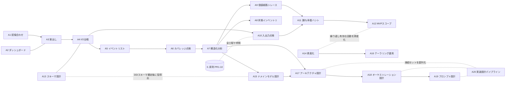

# メソッド棚卸し — これまでの設計プロセスの資産化メモ

> 目的：MVP 開発に着手する前に、ここまでの**やり方（手順・判断基準・点検観点）を再利用可能な形で抽出**する。
> このメモを土台に、[asset-plan.md](asset-plan.md) でスキル/エージェント化を計画する。
> 対象成果物：[dashboard](../dashboard.md) / [requirements/05・06](../requirements/05-io-overview.md) / [process/00–05](../process/00-context.md) / [schema](../schema/README.md) / [12-mvp-scope](../requirements/12-mvp-scope.md)。

---

## 0. 全体を貫く原則（＝再利用資産の核）

スキル/エージェントが共通参照すべき「決めた基準」。

| # | 原則 | 内容 |
|---|---|---|
| PR1 | **分割の原則** | 入出力は「**もの（実体）＋発生源（外部アクター）**」だけで分ける。**使い道**でも**内部の発生プロセス**でも分けない。発生源が **LLM なら入力**（システムは LLM をラップして価値提供）。外から見れば内部プロセス差は同じ「出力」。 |
| PR2 | **2軸（判定の種類を混ぜない）** | **システムの判定基準**（順序ある属性＝機械が自動ゲート）と **運用ルール**（事実性・妥当性＝人が確認）を分ける。運用ルールは設計で詰めず**機構＋デフォルト**に留める。 |
| PR3 | **系外＝非イベント** | システムを介さない変更（テキストファイル直接編集など）は**イベント化・入力化しない**。検査は**処理時に毎回**やって警告すればよい。 |
| PR4 | **観測できないものは持たない** | システムが顛末を観測できない事象（承認待ちの滞留など）に対する機能は作らない。 |
| PR5 | **状態の要否** | 毎回作り直せる → **無状態**。過去を覚えていないと成立しない（取り消し・既出判定・蓄積）→ **状態**。 |
| PR6 | **価値経路を遮断しない** | すべての入力が、プロセスを通って**価値（出力）まで連続**して届くこと。途切れ＝設計の穴。 |
| PR7 | **矛盾は停止して打ち上げ（ただし空で止めない）** | 既存決定と両立しない事実を見つけたら、勝手に解決せず**止めて確認**する。**止めるときも原案・比較・理由付き推奨/非推奨を必ず添える**（意見なき停止は禁止）。**フェーズで対応を変える**：要件定義は暫定で進めず止めて**他の決められる所を進める**／設計は推奨案で**暫定決定し DD# に記録**して前進（[作業規約](../../CLAUDE.md)）。 |
| PR8 | **フル論理設計＋MVP印** | 論理は完全に作り、MVP で削る所は印で区別（消さずに残す）。 |
| PR9 | **DFD レベリング** | 階層をまたぐ時に**上位/下位へ直接繋がない**。外部・ストアは L1 境界に繋ぎ、リーフへは親を経由（`利用者→P1→P1.1`）。出る時も同様。 |
| PR10 | **認識合わせ先行** | 着手前に手順を整理・提案し、不明点を質問してから動く。重い作業ほど先に握る。 |

---

## 1. 活動カード（手順・判断基準・点検観点）

各カード ＝ 1 つの再利用可能な「やり方」。**目的／トリガ／手順／判断基準／点検観点／成果物**で記述。

### A1. 認識合わせ（着手前の段取り）
- **目的**：重い作業の前にゴール・手順・粒度・前提を握る。
- **トリガ**：複数ステップの設計タスクを依頼された時。
- **手順**：①依頼を分解し作業手順を提案 ②不明点・選択肢を質問（[AskUserQuestion]）③確定パラメータを宣言してから着手。
- **判断基準**：PR10。曖昧さが結果を変えるなら聞く／変えないなら既定で進める。
- **点検観点**：合意した手順・スコープ・停止条件（矛盾→打ち上げ）が明文化されているか。
- **成果物**：合意済みの手順メモ（確定パラメータ）。

### A2. 決定ダッシュボードの運用
- **目的**：未決（Q#）・アクション（A#）・決定済みを1か所で運用する。
- **トリガ**：新しい論点・決定が出た時、常時。
- **手順**：論点を Q# 化／状態（未決・方針あり・確定・クローズ）を維持／決定は「決定済み」へ／削除はクローズで理由を残す。
- **判断基準**：PR2（設計 vs 運用ルールで区分し優先度を付ける）。
- **点検観点**：孤児 Q がないか、確定が本文（台帳/設計）に反映済みか。
- **成果物**：[dashboard.md](../dashboard.md)。

### A3. 案出し（論点ごとの選択肢生成と決め）
- **目的**：未決論点に複数案を出し、根拠付きで方針を決める。
- **トリガ**：Q# が未決の時。
- **手順**：①論点を1文化 ②2–4の排他的選択肢＋トレードオフ ③推奨案＋根拠 ④決定を Q# に記録。
- **判断基準**：PR2（機械判定で済むものは機構化、運用は詰めない）／MVP 価値（PR8）。
- **点検観点**：選択肢が排他的・網羅的か。決定が他の決定と矛盾しないか（PR7）。
- **成果物**：Q# の決定欄。

### A4. I/O 台帳（システム入出力一覧）
- **目的**：入力/出力を1か所に集約し抜け漏れを可視化。
- **トリガ**：要求が出揃い始めた時。
- **手順**：①入力を **A評価対象/B観点/Cコンフィグ/D人間FB** に分類 ②各入力に**発生源**を付す ③出力を列挙 ④状態(✅🟡⬜)と関連 Q を付す。
- **判断基準**：PR1（もの＋発生源で分ける／LLM 発生源は入力）。フロントマターに書く属性は親ファイルの中身で**別入力にしない**。
- **点検観点**：A10 の点検（①②③）を必ずかける。
- **成果物**：[05-io-overview.md](../requirements/05-io-overview.md)。

### A5. イベントリスト（event-response 表）
- **目的**：外部の出来事ごとに「**トリガ→反応→出力→価値**」を1行で並べる。
- **トリガ**：I/O 台帳が立った後。
- **手順**：①外部トリガを列挙 ②種別（実/時/例外）③システムの反応 ④出力 O-# ⑤生む価値 ⑥考慮漏れ用に「反応未定義」のイベントも仮置き。
- **判断基準**：PR3（系外の変更はイベントにしない）／PR4（観測不能な事象はイベントにしない）。
- **点検観点**：A6 のカバレッジ点検。
- **成果物**：[06-event-list.md](../requirements/06-event-list.md)。

### A6. イベント/IO カバレッジ点検（孤児・穴の検出）
- **目的**：台帳とイベントの突合で漏れを炙り出す。
- **トリガ**：イベントリスト作成後／変更後。
- **手順**：(a) 各 O-# は何かのイベントから駆動されるか（孤児出力＝穴）(b) 各 I-# はどこかで使われるか (c) 反応未定義のイベント＝穴 → **Q# 起票**。
- **判断基準**：孤児/穴は放置せず Q 化。不要と判断したものは削除（PR3/PR4）。
- **点検観点**：新規 O-#/I-# の発覚（例：I-12 時刻・I-13 参照は本点検で発覚）。
- **成果物**：06 のカバレッジ節。

### A7. 構造化分析（コンテキスト→DFD→単一責務分解）
- **目的**：システムをプロセスに分解し責務・データフローを確定。
- **トリガ**：I/O・イベントが固まった後。
- **手順**：①**コンテキスト図**（外部エンティティ＋純 I/O）②**L1 DFD**を **STS 分割**（Source→Transform→Sink、4–6 プロセス＋データストア）③各プロセスを **STS（フロー）とワーニエ法（構造：順次/繰返し/選択）を交互**に当てて**単一責務**まで分解 ④各プロセスに **DFD＋5列イベントリスト（発生源/情報/受け手 …）＋データディクショナリ＋責務・提供価値**。
- **判断基準**：STS＝「入力整形→中心変換→出力整形」で割れる時。ワーニエ＝データ構造に支配される時。flow と structure が切り替わる節で持ち替える。終端＝それ以上 flow も構造分岐も無い 1 アクション。
- **点検観点**：PR9 レベリング／全プロセスに提供価値があるか／単一責務か。
- **成果物**：[process/00–02](../process/00-context.md)。

### A8. 状態インベントリ（状態が要る所のあぶり出し）
- **目的**：必要な状態（データストア）と無状態で通す所を分ける。
- **トリガ**：DFD でデータストアが見えた時。
- **手順**：①データストアを列挙 ②各々「何の状態か・なぜ要るか・永続性・MVP 要否」 ③無状態で通すものを別表に。
- **判断基準**：PR5（毎回作れる→無状態／過去要る→状態）。
- **点検観点**：導出物を状態化していないか（観点パック等は無状態）。
- **成果物**：[process/03-state-inventory.md](../process/03-state-inventory.md)。

### A9. 価値経路トレース（イベント総点検）
- **目的**：イベント毎に入力→内部プロセス→出力が**連続**しているか確認。
- **トリガ**：分解が単一責務まで終わった後。
- **手順**：各イベントを `|情報の発生源|情報|情報の受け手|` の三つ組で1ホップずつ追う。**外部/ストアは L1 境界にだけ繋ぎ、リーフへは親経由**（PR9）。
- **判断基準**：PR6（遮断があれば穴）／PR1（LLM 生成物は入力として入り加工後に出力）。
- **点検観点**：各入力が消費され、各出力に到達するか。階層スキップが無いか。
- **成果物**：[process/05-event-trace.md](../process/05-event-trace.md)。

### A10. 入出力の点検（分割原則の適用）
- **目的**：入出力の切り方が正しいか点検。
- **トリガ**：台帳/設計の更新時、随時。
- **手順（入力）**：①**分けるべきものが分けられているか**（例 評価対象 vs 参照）②**区別できないものを分けていないか**（例 I-4 と I-8）③**全入力が価値に繋がるか・論理の飛躍がないか**。
- **手順（出力・観点は別）**：(あ)**もの で分ける**（内部発生プロセス違いで割らない）(い)**LLM 生成物は入力、加工後が出力**（ラップ境界）(う)**全出力が外部アクターに価値として届くか**。
- **判断基準**：PR1。発生源が同じで使い道が複数なだけのもの（例 I-6）は**分けない**。
- **点検観点**：二重計上・偽の分割・MVP 価値未接続を洗い出す。
- **成果物**：05 の「入力の点検」「出力の点検」節。

### A11. 漏れ・矛盾ハント（停止・打ち上げ／削除判断）
- **目的**：既存資料を過信せず穴・矛盾・不要物を洗い出す。
- **トリガ**：設計の各節目。
- **手順**：①既存 doc を点検し発見を G# に集約 ②**矛盾は停止して打ち上げ**（PR7）③不要物は理由付きで削除。
- **削除の判断基準**：**系外＝非イベント**（PR3）／**観測不能**（PR4）／**同一物**（I-8＝I-4）／**導出値**（メタ表）。
- **点検観点**：削除後に生きた参照が残っていないか（grep で確認）。
- **成果物**：[process/04-gaps-found.md](../process/04-gaps-found.md)。

### A12. 価値ベースの MVP スコープ
- **目的**：機能を価値で並べ、着手順と MVP ラインを決める。
- **トリガ**：機能が出揃い、開発着手前。
- **手順**：①機能を列挙し各々 **価値（誰に何を）・前提・不可分グループ** を付す ②**依存 DAG**を描く ③価値で着手順を提案 ④MVP ラインを引く。
- **判断基準**：不可分グループは丸ごと1単位。前提が重い/効果が遅延するものは後ろ。価値未接続（MVP 印）は除外。
- **点検観点**：MVP ラインの内側だけで「価値が出る」か。
- **成果物**：[12-mvp-scope.md](../requirements/12-mvp-scope.md)。

### A13. スキーマ設計（読み手から決める／2軸）
- **目的**：構造化ファイル（基準/ポリシー）のスキーマを決める。
- **トリガ**：外部設定ファイルが要ると分かった時。
- **手順**：①**読み手**（人/プログラム/LLM）を列挙し求める形を分ける ②**フロントマター（機械可読）＋本文（人＆LLM）**の二層 ③属性を**2軸**で振り分け（順序ある＝機械ゲート／事実性＝人）④**サンプルで曖昧さを潰す**。
- **判断基準**：PR2。継承は「具体が勝つ」機構＋権威は別レイヤ（方向ゲート）。
- **点検観点**：3段継承サンプルで境界条件（locked/open/本文差し替え）を検証。
- **成果物**：[schema/README.md](../schema/README.md)。

### A15. ドメインモデル設計（データ辞書 → 型安全クラス）
- **目的**：確定したデータディクショナリ／I/O 台帳から、システム内部の**型安全・イミュータブルなドメイン型**（Python dataclass 中心）を導出する。
- **トリガ**：データ辞書／I/O 台帳が固まり、実装用の型/クラス設計に入る時（DD 確定の**後**）。
- **手順**：①閉じた語彙＝Enum 候補／`{…}`複合＝値オブジェクト候補に印 ②基本型・レコード代用タプルを**値オブジェクト**化 ③タイプセーフ化（Enum・失敗は `Result` 型で fail-close）④導出物は frozen（イミュータブル）⑤**生成方法を必ず比較検討**（コンストラクタ/ファクトリ/ビルダー）⑥自己説明的命名 ⑦DD→クラスの対応表。
- **判断基準**：PR1（もので分ける＝責務別の型）／PR5（導出は無状態＝frozen 化しやすい・状態は最小）。生成方法は**機構＋既定**（単純はコンストラクタ／派生・選択隠蔽はファクトリ／段階組立はビルダー）を置き、ケースの最終判断は設計レビュー（PR2）。
- **点検観点**：閉じた語彙が Enum か・生文字列比較が残っていないか・レコード代用タプルが残っていないか・導出物が frozen か・各型の生成方法に根拠があるか・不変条件を**型で**保証できているか。
- **境界**：外部ファイル形式の設計は A13（schema-design）、DD そのものの生成は A7（structured-analysis）。A15 はその下流（内部型設計）だけ。
- **成果物**：[design/00 データ辞書集約](../design/00-data-dictionary.md)（A7 の出力を集約）＋[design/01 クラス設計](../design/01-class-design.md)。対応スキル：`/domain-model`。

### A14. 資産化（メソッド → スキル/エージェント）
- **目的**：確立したやり方を再利用可能なスキル/エージェント/規約にする。
- **トリガ**：ある活動が繰り返し有効と分かり、再利用したくなった時。
- **手順**：
  1. **棚卸し** — 対象活動をカード化。**ユーザーの指摘・質問・課題提起を重点的に拾う**（決定の根拠・転換点がそこに出る）。原則(PR)と活動(A)を分離。
  2. **既存資産調査〔必須・サブエージェント〕** — 棚卸し直後に既存資産との**重複/矛盾/競合**を点検し、**新規作成 or 既存変更**を判断（→ `asset-auditor`）。
  3. **振り分け設計** — スキル / サブエージェント / 共有リファレンス / 作業規約 に割当（対話・判断→スキル／自走・点検→エージェント）。
  4. **形式適合確認** — ターゲット仕様を一次確認（憶測で作らない）。原則を形式制約へ翻訳（例：subagent は `AskUserQuestion` 不可→STOP 報告）。
  5. **提案** — **汎用化前（固有）・汎用化後（抽象）の双方を提示**。
  6. **フェーズ毎の実体化** — 最小・最も再利用される単位から。**各フェーズでチェックポイント**。台帳/プラン/規約を同期更新。
  7. **検証** — 要否と方法を**必ず検討**（登録確認・read-only確認・dry-run）。**実施はユーザー確認を求める**。
- **判断基準**：PR1（責務が違えば別資産・同一なら統合）／PR2（点検と生成を混ぜない）／PR8（消さず印で残す）／PR10（認識合わせ先行）。
- **点検観点**：既存と責務が被らないか・`description` 自動起動が衝突しないか・原則と矛盾しないか・**台帳/プラン/規約が同期**しているか。
- **成果物**：スキル/エージェント実体（`.claude/`）＋ 本台帳(A#)・[asset-plan](asset-plan.md)(振り分け)・[CLAUDE.md](../../CLAUDE.md)(一覧) の同期更新。対応資産：`asset-auditor`・`/asset-pipeline`。

### A16. テーラリング運用（汎用標準 → プロジェクト固有）
- **目的**：プロジェクト非依存の**汎用標準**を、プロジェクト固有の**ノブを埋めた active 版**へ具体化し、対応を追跡可能に保つ。プロセスはスキル等で実現するため**テーラリングの実体は `.claude/` 配下**（docs に置かない）。
- **トリガ**：汎用標準（不変条件＋ノブ）を、あるプロジェクトに当てて運用する時。A14（資産化）の実体化フェーズの下位ステップ。
- **手順**：①標準を棚卸し（不変条件は継承・ノブを洗い出す）②**既存 active 汎用版があれば `git mv` で `.claude/standards/` へ非活性化**（消さない＝PR8）／標準を新規 author する場合は `standards/` に直接置く ③ノブを埋めた版を `.claude/skills/<n>/` に置く（active）④[tailoring-registry](../../.claude/tailoring-registry.md) に `標準源／実体パス／テーラリング内容／由来PJ` を追記。
- **判断基準**：PR2（不変条件＝機構／ノブ＝デフォルトの埋め込み）／PR8（汎用標準を消さず非活性で残す）。配置＝汎用標準は `.claude/standards/`（auto-load させない＝未テーラリングの誤適用防止）、active は `.claude/skills/`。
- **点検観点**：全ノブが埋まったか・3点セット等のテンプレが確定したか・registry に実体パスとテーラリング内容が記録済みか・標準が非活性で残っているか。`asset-auditor` の棚卸しは `.claude/standards/` も対象に含める。
- **成果物**：`.claude/standards/<n>/`（標準）＋ `.claude/skills/<n>/`（active）＋ [tailoring-registry](../../.claude/tailoring-registry.md)。初回適用＝`test-strategy`。

### A17. アーキテクチャ設計（論理 DFD → 物理モジュール/依存・IF・プロトコル・永続）
- **目的**：確定した論理 DFD（A7）と型（A15）を、**物理アーキテクチャ**（ヘキサゴナル＋依存内向き・ports&adapters・合成ルート1つ・外部IF・PFプロトコル・永続 port）へ写す。
- **トリガ**：仕様（A1–A12）と DD・型が固まり、実装の境界設計に入る時。
- **手順**：依存規則を1枚で固定 → DFD→モジュール対応 → 外部IF（シグネチャ/終了コード/I-O対応）→ プロトコル（抽象ポート＋駆動＋公開ツール＋能力宣言）→ 永続（状態→リポジトリ port＋保存形式＋トランザクション）→ 実行/import 規約（`sys.path` ハック不可）。
- **判断基準**：PR1（論理分解と物理写像は別工程）／依存内向き／境界はドメイン型のみ／PR2（機構と運用を混ぜない）。
- **点検観点**：core に具体 import が無い・合成ルート1つ・DFD/状態が漏れなくモジュール/ポートに対応・各 I-O が IF で消費/生成（孤児なし）・外部出力が必ず検証を通る。
- **成果物**：依存規則図＋構成＋対応表／IF 表＋シグネチャ／ポート＋プロトコル／永続設計。対応スキル：`/architecture-design`。

### A18. オーケストレーション設計（制御フロー・fail-close・ログ/版）
- **目的**：モジュール構成（A17）を端から端の**実行**に。誰が何の順で動き、失敗でどう倒れ、何を記録するか。
- **トリガ**：物理アーキテクチャ確定後。
- **手順**：レーン決定 → 段を `Result` で直列（失敗は下流を走らせない）→ 実行順序の不変条件を型で強制 → 良性 no-op と異常を分離 → ログ3チャネル＋版スタンプ（`MAJOR.MINOR`）→ 疑似コードで `match` 分岐。
- **判断基準**：PR6（価値経路を遮断しない・黙って空にしない）／fail-close は横断経路／外部出力は必ず検証段を通る。
- **点検観点**：1枚のスイムレーンで端から端が追える・副作用段が上流成功前提・版スタンプで再現説明可・段境界がログに出る。
- **成果物**：スイムレーン図＋不変条件リスト＋`run_*()` 疑似コード＋ログ/版表。対応スキル：`/orchestration-design`。

### A19. プロンプト設計（LLM への問い方）
- **目的**：LLM をラップする系で、システムプロンプトを**再現可能・役割固定・注入耐性**に設計。
- **トリガ**：LLM 呼び出し箇所が確定し、評価/生成の問いを固める時。
- **手順**：雛形カタログ（版付き）→ 役割制約（やる/やってはいけない）→ ビルダーで順次組立 → 注入対策（系の検証が最終防御）→ 版↔対応ロジック（MAJOR=構造/型、MINOR=文言）。
- **判断基準**：PR1（raw LLM＝入力・加工後＝出力）／役割は狭く・メタを渡さない／二重防御／出力スキーマは schema-design（A13）へ委譲。
- **点検観点**：雛形が版付き・役割が禁止事項を含む・注入対策＋系検証の二重・出力が必ず検証段へ。
- **成果物**：雛形カタログ＋役割制約＋ビルダー＋版管理表。対応スキル：`/prompt-design`。

### A20. 実装設計パイプライン（spec → 実装の橋渡し・凍結セット化）
- **目的**：A17–A19 ＋テスト戦略を**凍結セット**として直列に回し、判断ログ（DD#）と総点検（spec-inspector）まで含めて固める。
- **トリガ**：仕様確定後、実装着手前（spec-pipeline の下流）。明示起動のみ。
- **手順**：凍結セット索引 → A17 → A18 → A19 → test-strategy 適用 → spec-inspector 総点検で G# 反映 → 各段で DD# 記録。
- **判断基準**：着手前に asset-auditor（A14）／フェーズ規律（設計＝暫定で前進・要件＝止めて他を進める・空で止めない＝PR7）。
- **点検観点**：凍結セット全項目が成果物に対応・依存順を守る・DD# に未決/暫定と影響範囲・G# 反映済み。
- **成果物**：設計索引＋各設計＋判断ログ。対応スキル：`/impl-design-pipeline`（オーケストレータ）。

> **8（判断ログ DD#）・9（凍結セット規律）は手法カードでなく作業規約**（[CLAUDE.md](../../CLAUDE.md)）。DD# は A2 ダッシュボード Q# の**設計フェーズ版**（論点→選択肢→推奨→決定→影響）、総点検は spec-inspector を呼ぶ運用。

---

## 2. 依存（どの順で使うか）

> 原則 PR1–10 は全活動が参照する横断資産。A10/A11 が最も繰り返し効く点検ループ。
> A15 は A7（DFD 分解＝データ辞書生成）・A13（スキーマ確定）の**下流**で、実装用の内部型を導出する（DD 確定の後）。

> **横断ツール（パイプライン外）**：ノード検索/読み込み（md2idx 思想）。doc-system の巨大 Markdown から
> 軽量インデックスを作り必要ノードだけ取得する**取得メソッド**。全フェーズで反復利用するが設計フローには
> 乗らないため上図には含めない。資産化＝`/docidx`＋`docidx-lookup`（実体 `docidx/`・[asset-plan](asset-plan.md)）。
