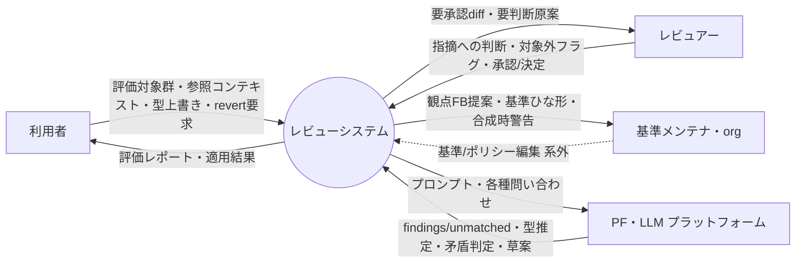

# プロセス設計 00 — コンテキストダイアグラム（Level 0）

> 目次：**00 コンテキスト**（本書）／ [01 DFD Level1](01-dfd-level1.md)／ [02 単一責務まで分解](02-decomposition.md)／ [03 状態インベントリ](03-state-inventory.md)／ [04 発見した漏れ](04-gaps-found.md)／ [05 イベント総点検](05-event-trace.md)

構造化分析でプロセスを分解する作業の起点。**フル論理設計**（MVP に含む部分は `*MVP外` 等で印）。
図は Mermaid（GitHub ブラウザでネイティブ描画）。入力は既存の [05 I/O台帳](../requirements/05-io-overview.md) /
[06 イベントリスト](../requirements/06-event-list.md) / [09 パイプライン](../requirements/09-processing-pipeline.md) /
[10 境界](../requirements/10-llm-system-boundary.md) / [11 アダプタ](../requirements/11-platform-adapter.md)。

> ⚠️ 05/06 は完全ではない前提で、本作業は**漏れ・矛盾の洗い出しも兼ねる**。発見は [04-gaps-found](04-gaps-found.md) に集約。
> 矛盾（既存決定と両立しない事実）を見つけた場合は作業を止めて打ち上げる運用。

## 外部エンティティ

| 記号 | エンティティ | 説明 | MVP |
|---|---|---|---|
| User | 利用者 | 文書を提出しレポートを受ける書き手 | ○ |
| Reviewer | レビュアー | 指摘に対応する人 | ○（User と同一でも可＝アクター非区別） |
| Maintainer | 基準メンテナ / org | 基準・ポリシーファイルを編集する | ○ |
| PF | PF・LLM プラットフォーム | Claude Code 等。判断・生成を担う外部 | ○ |

> MVP は**アクターを区別しない**ので User/Reviewer/Maintainer は実体として1人に collapse し得る（論理的には分離）。

## コンテキスト図

> 基準/ポリシー編集は**系外**（点線）。滞留督促は**削除**（観測不能）。

## 純入出力（台帳との対応）

**入力**：評価対象群(I-1) / 参照コンテキスト(I-13) / 文書タイプ上書き(I-2) / スコープ(I-3) /
基準・ポリシーファイル(I-4,I-5｜**編集は系外＝非入力**) / 指摘への判断(I-6) / 対象外フラグ(I-7) / **revert要求(←台帳に I-# 無し**, [gaps](04-gaps-found.md)) /
PF からの findings 等(PF応答)。

**出力**：評価レポート3区分+未分類(O-1,2,4,5,7) / 自動修正適用+サマリ(O-3) / revert(O-6) /
観点FB提案(O-12) / 基準ひな形(O-11) / **合成時**警告・衝突報告(O-9) / 異常系通知(O-14) /
PF への プロンプト。

> PF は 05 では「内部処理」として外部 I/O に数えていなかったが、本プロセス設計では**外部エンティティ**として扱う（[11](../requirements/11-platform-adapter.md) のアダプタ境界）。矛盾ではなく視点の明示化。

> **基準/ポリシーの編集はシステムを介さない（系外）**。よって提案 `E6`・承認 `I-9`・上書き入力 `I-8`、打ち上げ `O-8`、変遷履歴 `O-10` は**持たない**。
> 方向違反・本文矛盾・衝突・locked の検査は **P2 合成時に毎回**実施し警告（O-9）するだけでよい（[Q15](../dashboard.md)）。

## コンテキストイベントリスト・価値経路トレース

[06 イベントリスト](../requirements/06-event-list.md) の各イベントが、**入口プロセス → 価値を運ぶ経路 → 価値出力**まで
**遮断なく届くか**を突き合わせる。`価値経路` が切れていれば設計の穴。

| E# | 外部トリガ | 入口 | 価値を運ぶ経路（P 連鎖） | 価値出力 | 生む価値 | 経路状態 |
|---|---|---|---|---|---|---|
| E1 | 文書を提出 | P1 | P1→P2→P3→P4→P5 | O-1〜O-5 | レビュー負荷減・均質化 | ✅ 貫通 |
| E2 | ✋ 承認/却下 | P5 | I-6→**P5.2 適用** ＋ P6.1 記録 | O-3 適用 | 人間判断の反映 | ✅ **G8 で接続**（旧：遮断） |
| E3 | 💬 決定 | P5 | I-6→**P5.2 適用** ＋ P6.1 記録 | O-3 適用 | 「考える」を「選ぶ」に | ✅ **G8 で接続**（旧：遮断） |
| E4 | 🤖 対象外フラグ | P6 | I-7→P6.1→P6.2 | O-12 | 流し読みがチューニングデータに | ✅ 貫通 |
| E5 | 一括 revert | P5 | revert要求→P5.4 | O-6 | 安心して自動化を上げる | ✅（入力未台帳 [G4](04-gaps-found.md)） |
| ~~E6~~ | ~~上書き提案(PR)~~ | — | **削除**：基準編集は系外（非イベント）。安全検査は **P2 合成時に毎回**実施し警告 | O-9 | 安全に基準が育つ | ✅ P2 合成に一本化（[G9](04-gaps-found.md)） |
| ~~E7~~ | ~~上書き承認/却下~~ | — | **削除**：承認＝系外の file 編集。育成ループは O-12→系外編集→次回合成で閉じる | — | — | ✅ 不要 |
| E8 | 新型/scope 立ち上げ | P6 | →P6.4 | O-11 | 立ち上げ高速化 | ✅ 貫通 |
| E9 | LLM の id 誤付与/未知指摘 | P4 | →P4.1→❓ | O-7 | 取りこぼし防止 | ✅ 貫通 |
| E10 | フィードバック蓄積 | P6 | I-12→P6.2 | O-12 | 育成ループ完結 | ✅ 貫通 |
| ~~E13~~ | ~~承認待ちが滞留~~ | — | **削除**：片付いたかを**システムが観測できない**（ステートレス・対応は系外）。督促の前提が無い | — | — | 🗑 削除（O-13 も） |
| E14 | 異常系（障害/空文書等） | 各 P | **fail-close→O-14**（空文書のみ benign no-op） | O-14 | 取りこぼし・誤適用防止 | ✅ **Q17 確定**：横断モデル化（下記）→ [G10](04-gaps-found.md) |

**価値経路の結論**：遮断は E2/E3（**本改訂で接続＝G8**）。**E6/E7/I-8/I-9 は削除**し基準ガバナンスを P2 合成時警告に一本化（G9 解消）。
E13 は削除（滞留は観測不能）。**E14 は Q17 確定**（fail-close＋O-14・MVP／degrade は F16）で横断モデル化。E1/E4/E5/E8/E9/E10 は貫通。

### 異常系の横断モデル（Q17 確定）

異常系（E14→O-14）は特定プロセス内の正常データフローではなく、**全段にまたがる横断的エラー経路**。
DFD の通常フローに溶かさず、各 L1 プロセスが**失敗時に O-14 を上げる**監督（supervisor）パターンとして扱う（[04 G7/G10](04-gaps-found.md)・要件は [13 S3](../requirements/13-stabilization.md)）。

| 失敗点 | 段 | 振る舞い | O-14 内容 |
|---|---|---|---|
| 基準パース失敗 | P2 合成 | **fail-close**（全体停止） | ファイル/行/理由（[S5 lint](../requirements/13-stabilization.md) で実行前に倒すのが理想） |
| スコープ未解決（型不明/extends 切れ/基準ゼロ） | P1/P2 | **fail-close**（空既定にフォールバックしない） | 「doc_type=X の基準が無い／extends 先が無い」 |
| LLM 障害（PF 到達不可/timeout） | P3.2 | **bounded retry→fail-close**。⑦自動適用を走らせない | 障害段・リトライ結果 |
| LLM 出力不正（schema/偽 id） | P3.3/P4.1 | **degrade**＝❓未分類へ（[S1](../requirements/13-stabilization.md)・既設） | （未分類として surfacing） |
| 空文書（対象ゼロ） | P1.3 | **fail-open（no-op）**：0件レポート | （O-14 は出さない） |

> **不変条件**：⑦自動適用（P5.2）は **④評価/⑤検証がクリーン完了**を前提とし、上流失敗時は **DS3 に一切コミットしない**（半端を残さない＝[S4](../requirements/13-stabilization.md) トランザクション性）。
> 図上は P3.2 の `失敗→O-14` 枝（[02](02-decomposition.md#p32-pf-呼び出し)）が代表。他段の fail-close も同型で、O-14 は利用者/基準メンテナへ届く。

### I/O カバレッジ（producing/consuming プロセスの有無）

| 入力 | 消費プロセス | 出力 | 生成プロセス |
|---|---|---|---|
| I-1 文書群 | P1.3 | O-1 レポート | P5.3 |
| I-2 型上書き(利用者)＋I-15 型推定(PF) | P1.1（調停） | O-2 指摘 | P3〜P5.3 |
| I-3 スコープ選択(任意・MVP=org) | P1.2 | O-3 自動修正+サマリ | P5.2＋P5.3 |
| I-4 基準ファイル | P2.1 | O-4 ✋diff | P5.3（適用は P5.2） |
| I-5 ポリシー | P4.3 | O-5 💬原案 | P5.3（適用は P5.2） |
| I-6 指摘への判断 | **P5.2 適用 ＋ P6.1 記録** | O-6 revert | P5.4 |
| I-7 対象外フラグ | P6.1 | O-7 未分類 | P4.1→P5.3 |
| ~~I-8 上書き提案~~ | **削除**（系外編集） | ~~O-8 打ち上げ~~ | **削除**（合成時警告 O-9 に統合） |
| ~~I-9 上書き承認~~ | **削除**（系外編集） | O-9 衝突報告 | P2.1/P2.2→P6.5（合成時） |
| I-10 通知設定 | P6.5（既出条件）🟡 | ~~O-10 変遷履歴~~ | **削除**（git 履歴＝系外） |
| ~~I-11~~（scope は I-4 フロントマター） | — | O-11 ひな形 | P6.4 |
| I-12 時間トリガ | P6.2（しきい値）🟡 | O-12 観点FB提案 | P6.2 |
| I-13 参照コンテキスト | P1.3＋P3.1 | ~~O-13 滞留督促~~ | 🗑 削除（観測不能） |
| revert要求（未台帳 G4） | P5.4 | O-14 異常系通知 | P3.2 のみ（G10） |

→ **削除**＝ I-8/I-9/I-11/O-8/O-10/O-13（系外編集 or 観測不能。scope は I-4 フロントマター）。post-MVP＝ I-10/I-12/O-14。詳細は [04](04-gaps-found.md)。
