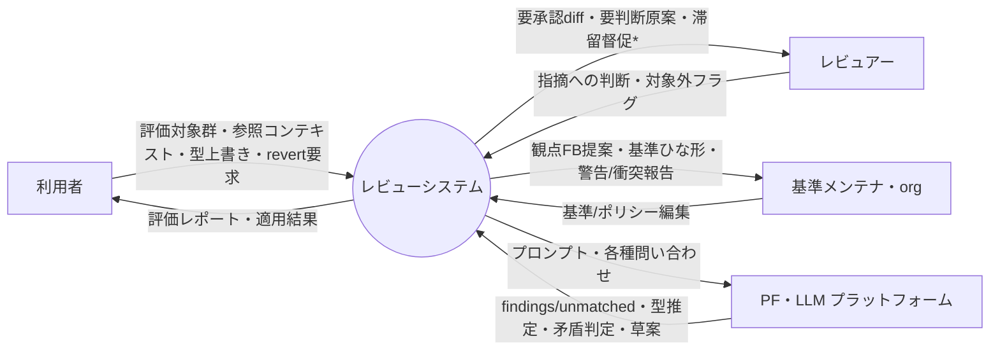

# プロセス設計 00 — コンテキストダイアグラム（Level 0）

> 目次：**00 コンテキスト**（本書）／ [01 DFD Level1](01-dfd-level1.md)／ [02 単一責務まで分解](02-decomposition.md)／ [03 状態インベントリ](03-state-inventory.md)／ [04 発見した漏れ](04-gaps-found.md)

構造化分析でプロセスを分解する作業の起点。**フル論理設計**（MVP に含む部分は `*MVP外` 等で印）。
図は Mermaid（GitHub ブラウザでネイティブ描画）。入力は既存の [05 I/O台帳](../requirements/05-io-overview.md) /
[06 イベントリスト](../requirements/06-event-list.md) / [09 パイプライン](../requirements/09-processing-pipeline.md) /
[10 境界](../requirements/10-llm-system-boundary.md) / [11 アダプタ](../requirements/11-platform-adapter.md)。

> ⚠️ 05/06 は完全ではない前提で、本作業は**漏れ・矛盾の洗い出しも兼ねる**。発見は [04-gaps-found](04-gaps-found.md) に集約。
> 矛盾（既存決定と両立しない事実）を見つけた場合は作業を止めて打ち上げる運用。

## 外部エンティティ

| 記号 | エンティティ | 説明 | MVP |
|---|---|---|---|
| User | 利用者 | 文書を提出しレポートを受ける書き手 | ○ |
| Reviewer | レビュアー | 指摘に対応する人 | ○（User と同一でも可＝アクター非区別） |
| Maintainer | 基準メンテナ / org | 基準・ポリシーファイルを編集する | ○ |
| PF | PF・LLM プラットフォーム | Claude Code 等。判断・生成を担う外部 | ○ |

> MVP は**アクターを区別しない**ので User/Reviewer/Maintainer は実体として1人に collapse し得る（論理的には分離）。

## コンテキスト図

`*` = 滞留督促（時間イベント・Q16）は **MVP外**。

## 純入出力（台帳との対応）

**入力**：評価対象群(I-1) / 参照コンテキスト(I-13) / 文書タイプ上書き(I-2) / スコープ(I-3) /
基準・ポリシー編集(I-4,I-5,I-8,I-9) / 指摘への判断(I-6) / 対象外フラグ(I-7) / **revert要求(←台帳に I-# 無し**, [gaps](04-gaps-found.md)) /
PF からの findings 等(PF応答)。

**出力**：評価レポート3区分+未分類(O-1,2,4,5,7) / 自動修正適用+サマリ(O-3) / revert(O-6) /
観点FB提案(O-12) / 基準ひな形(O-11) / 警告・衝突報告(O-8,O-9) / 変遷履歴(O-10) / 異常系通知(O-14) /
PF への プロンプト。

> PF は 05 では「内部処理」として外部 I/O に数えていなかったが、本プロセス設計では**外部エンティティ**として扱う（[11](../requirements/11-platform-adapter.md) のアダプタ境界）。矛盾ではなく視点の明示化。

## コンテキストイベントリスト・価値経路トレース

[06 イベントリスト](../requirements/06-event-list.md) の各イベントが、**入口プロセス → 価値を運ぶ経路 → 価値出力**まで
**遮断なく届くか**を突き合わせる。`価値経路` が切れていれば設計の穴。

| E# | 外部トリガ | 入口 | 価値を運ぶ経路（P 連鎖） | 価値出力 | 生む価値 | 経路状態 |
|---|---|---|---|---|---|---|
| E1 | 文書を提出 | P1 | P1→P2→P3→P4→P5 | O-1〜O-5 | レビュー負荷減・均質化 | ✅ 貫通 |
| E2 | ✋ 承認/却下 | P5 | I-6→**P5.2 適用** ＋ P6.1 記録 | O-3 適用 | 人間判断の反映 | ✅ **G8 で接続**（旧：遮断） |
| E3 | 💬 決定 | P5 | I-6→**P5.2 適用** ＋ P6.1 記録 | O-3 適用 | 「考える」を「選ぶ」に | ✅ **G8 で接続**（旧：遮断） |
| E4 | 🤖 対象外フラグ | P6 | I-7→P6.1→P6.2 | O-12 | 流し読みがチューニングデータに | ✅ 貫通 |
| E5 | 一括 revert | P5 | revert要求→P5.4 | O-6 | 安心して自動化を上げる | ✅（入力未台帳 [G4](04-gaps-found.md)） |
| E6 | 上書き提案(PR) | P6 | I-8→P6.3→P6.5 ／ 方向・矛盾・衝突・locked 検査は P2 合成時 | O-8,O-9 | 安全に基準が育つ | ⚠ **検査が提案時でなく review 時に寄る** → [G9](04-gaps-found.md) |
| E7 | 上書き承認/却下 | P6 | I-9→（マージ＝DS1 更新）→P6.3 | O-10 | ガバナンス維持 | 🟡 **I-9 の消費が暗黙** → [G11](04-gaps-found.md) |
| E8 | 新型/scope 立ち上げ | P6 | →P6.4 | O-11 | 立ち上げ高速化 | ✅ 貫通 |
| E9 | LLM の id 誤付与/未知指摘 | P4 | →P4.1→❓ | O-7 | 取りこぼし防止 | ✅ 貫通 |
| E10 | フィードバック蓄積 | P6 | I-12→P6.2 | O-12 | 育成ループ完結 | ✅ 貫通 |
| E13 | 承認待ちが滞留 | （無） | — | O-13 | 放置防止 | 🕳 **該当プロセス未モデル**（post-MVP Q16）→ [G10](04-gaps-found.md) |
| E14 | 異常系（障害/空文書等） | 各 P | 失敗→O-14 | O-14 | 取りこぼし・誤適用防止 | 🕳 **P3.2 のみ／横断未モデル**（Q17）→ [G10](04-gaps-found.md) |

**価値経路の結論**：遮断は E2/E3（**本改訂で接続＝G8**）。タイミング不整合 E6（G9）。未モデル E13/E14（post-MVP・G10）。
弱い接続 E7 の I-9（G11）。E1/E4/E5/E8/E9/E10 は貫通。

### I/O カバレッジ（producing/consuming プロセスの有無）

| 入力 | 消費プロセス | 出力 | 生成プロセス |
|---|---|---|---|
| I-1 文書群 | P1.3 | O-1 レポート | P5.3 |
| I-2 型上書き | P1.1 | O-2 指摘 | P3〜P5.3 |
| I-3 スコープ | P1.2 | O-3 自動修正+サマリ | P5.2＋P5.3 |
| I-4 基準ファイル | P2.1 | O-4 ✋diff | P5.3（適用は P5.2） |
| I-5 ポリシー | P4.3 | O-5 💬原案 | P5.3（適用は P5.2） |
| I-6 指摘への判断 | **P5.2 適用 ＋ P6.1 記録** | O-6 revert | P5.4 |
| I-7 対象外フラグ | P6.1 | O-7 未分類 | P4.1→P5.3 |
| I-8 上書き提案 | P6.3 | O-8 打ち上げ | P6.5（時期は G9） |
| I-9 上書き承認 | （暗黙：DS1 更新）→P6.3 🟡 | O-9 衝突報告 | P2.2→P6.5（時期は G9） |
| I-10 通知設定 | P6.5（既出条件）🟡 | O-10 変遷履歴 | P6.3 |
| I-11 スコープ決定ルール | P1.2 | O-11 ひな形 | P6.4 |
| I-12 時間トリガ | P6.2（しきい値）🟡 | O-12 観点FB提案 | P6.2 |
| I-13 参照コンテキスト | P1.3＋P3.1 | O-13 滞留督促 | 🕳 未モデル（G10） |
| revert要求（未台帳 G4） | P5.4 | O-14 異常系通知 | P3.2 のみ（G10） |

→ 孤児出力（生成元なし）＝ O-13。弱い消費（暗黙）＝ I-9/I-10/I-12。詳細は [04](04-gaps-found.md)。
