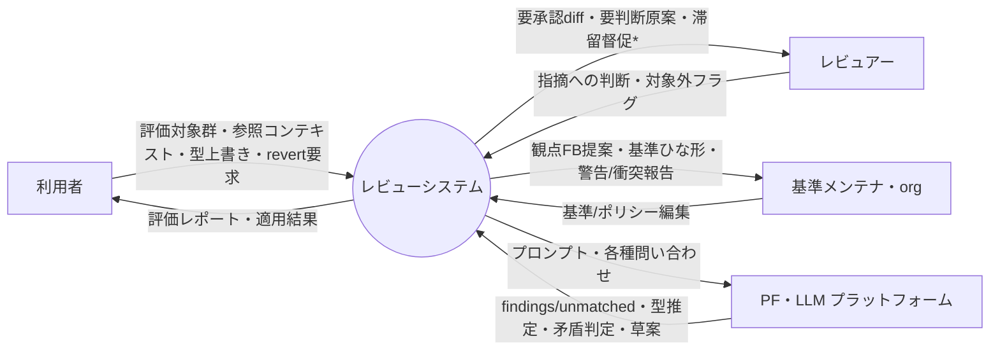

# プロセス設計 00 — コンテキストダイアグラム（Level 0）

> 目次：**00 コンテキスト**（本書）／ [01 DFD Level1](01-dfd-level1.md)／ [02 単一責務まで分解](02-decomposition.md)／ [03 状態インベントリ](03-state-inventory.md)／ [04 発見した漏れ](04-gaps-found.md)

構造化分析でプロセスを分解する作業の起点。**フル論理設計**（MVP に含む部分は `*MVP外` 等で印）。
図は Mermaid（GitHub ブラウザでネイティブ描画）。入力は既存の [05 I/O台帳](../requirements/05-io-overview.md) /
[06 イベントリスト](../requirements/06-event-list.md) / [09 パイプライン](../requirements/09-processing-pipeline.md) /
[10 境界](../requirements/10-llm-system-boundary.md) / [11 アダプタ](../requirements/11-platform-adapter.md)。

> ⚠️ 05/06 は完全ではない前提で、本作業は**漏れ・矛盾の洗い出しも兼ねる**。発見は [04-gaps-found](04-gaps-found.md) に集約。
> 矛盾（既存決定と両立しない事実）を見つけた場合は作業を止めて打ち上げる運用。

## 外部エンティティ

| 記号 | エンティティ | 説明 | MVP |
|---|---|---|---|
| User | 利用者 | 文書を提出しレポートを受ける書き手 | ○ |
| Reviewer | レビュアー | 指摘に対応する人 | ○（User と同一でも可＝アクター非区別） |
| Maintainer | 基準メンテナ / org | 基準・ポリシーファイルを編集する | ○ |
| PF | PF・LLM プラットフォーム | Claude Code 等。判断・生成を担う外部 | ○ |

> MVP は**アクターを区別しない**ので User/Reviewer/Maintainer は実体として1人に collapse し得る（論理的には分離）。

## コンテキスト図

`*` = 滞留督促（時間イベント・Q16）は **MVP外**。

## 純入出力（台帳との対応）

**入力**：評価対象群(I-1) / 参照コンテキスト(I-13) / 文書タイプ上書き(I-2) / スコープ(I-3) /
基準・ポリシー編集(I-4,I-5,I-8,I-9) / 指摘への判断(I-6) / 対象外フラグ(I-7) / **revert要求(←台帳に I-# 無し**, [gaps](04-gaps-found.md)) /
PF からの findings 等(PF応答)。

**出力**：評価レポート3区分+未分類(O-1,2,4,5,7) / 自動修正適用+サマリ(O-3) / revert(O-6) /
観点FB提案(O-12) / 基準ひな形(O-11) / 警告・衝突報告(O-8,O-9) / 変遷履歴(O-10) / 異常系通知(O-14) /
PF への プロンプト。

> PF は 05 では「内部処理」として外部 I/O に数えていなかったが、本プロセス設計では**外部エンティティ**として扱う（[11](../requirements/11-platform-adapter.md) のアダプタ境界）。矛盾ではなく視点の明示化。
