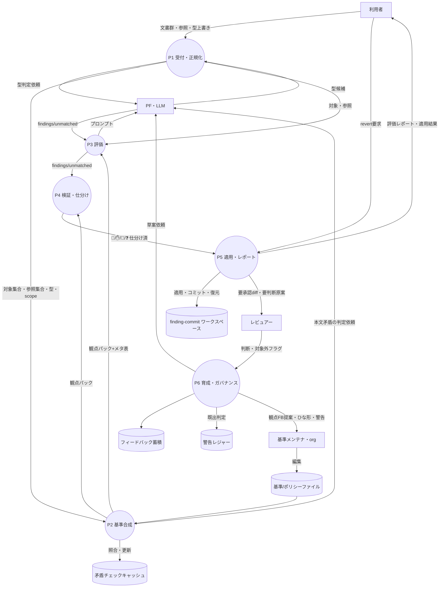

# プロセス設計 01 — DFD Level 1（STS 分割）

コンテキストの単一プロセスを **STS（Source 入力整形 → Transform 中心変換 → Sink 出力）** で割る。
レビュー本線（P1〜P5）＋育成・ガバナンスのループ（P6）。各層 4〜6 プロセス上限 → L1 は 6。

## Level 1 図

## STS の割り当て

| 区分 | プロセス | 役割 |
|---|---|---|
| Source（afferent・入力整形） | P1 受付・正規化 / P2 基準合成 | 生入力を「評価できる形」に整える |
| Transform（central・中心変換） | P3 評価 / P4 検証・仕分け | 観点違反を見つけ、機械的に仕分ける |
| Sink（efferent・出力） | P5 適用・レポート | 自動修正の適用とレポート生成 |
| ループ（育成・ガバナンス） | P6 育成・ガバナンス | フィードバックを基準に還流させる |

## データストア（＝状態）一覧（詳細は [03-state-inventory](03-state-inventory.md)）

| ID | ストア | 内容 | MVP |
|---|---|---|---|
| DS1 | 基準/ポリシーファイル | 観点・メタ・ポリシー（Maintainer が編集） | ○ |
| DS2 | 矛盾チェックキャッシュ | 本文矛盾判定の結果を `content_hash` キーで保持（Q15） | ○ |
| DS3 | finding-commit ワークスペース | 自動適用を finding 単位コミットで保持・revert 源（Q3・内部 git） | ○ |
| DS4 | 警告レジャー | 既出警告の `{rule_id, content_hash, first_seen}`（Q9） | ○ |
| DS5 | フィードバック蓄積 | 却下・対象外・傾向。観点FB提案(O-12)の素材 | △（MVP は最小） |

## プロセス責務（1行）と単一責務性

| P | 責務（1行） | 単一責務か |
|---|---|---|
| P1 | 提出物を「対象集合・参照集合・型・scope」に正規化する | ✕ → L2 分解 |
| P2 | doc_type×scope から観点パック+メタ表を毎回合成する | ✕ → L2 分解 |
| P3 | 観点パックと対象から findings/unmatched を得る | ✕ → L2 分解 |
| P4 | findings を検証・除外し 🤖/✋/💬/❓ に仕分ける | ✕ → L2 分解 |
| P5 | 🤖 を適用し、レポートを組み、revert に応じる | ✕ → L2 分解 |
| P6 | フィードバックを集め、基準変更・ひな形・警告を扱う | ✕ → L2 分解 |

すべて複数責務 → [02-decomposition](02-decomposition.md) で単一責務まで割る。
