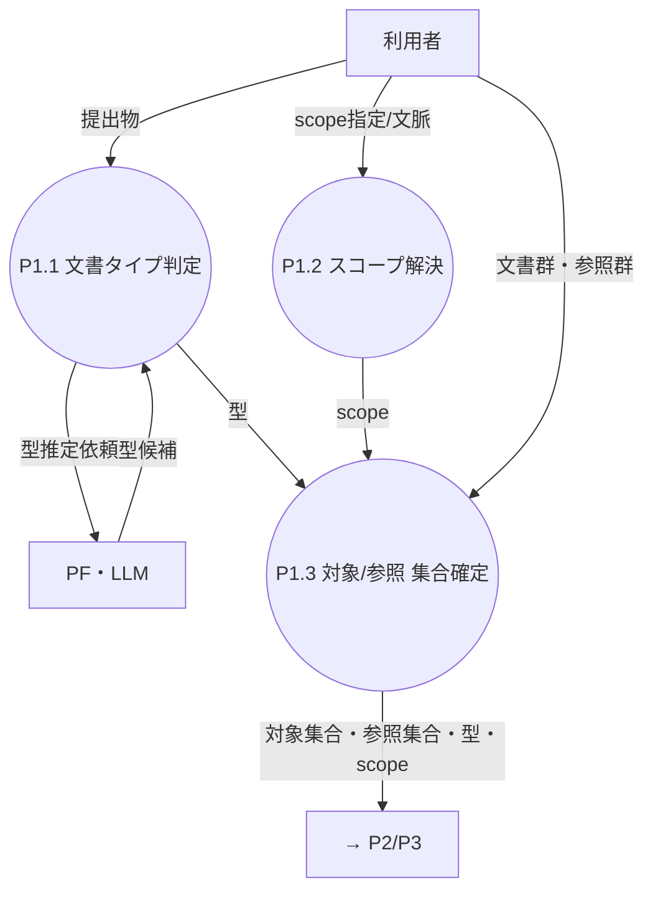
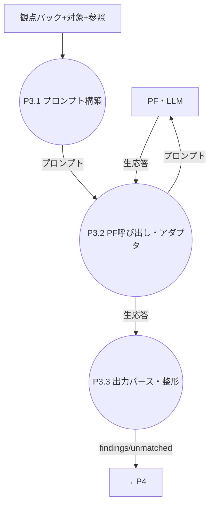
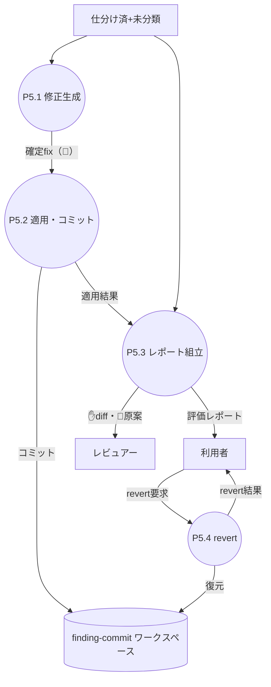
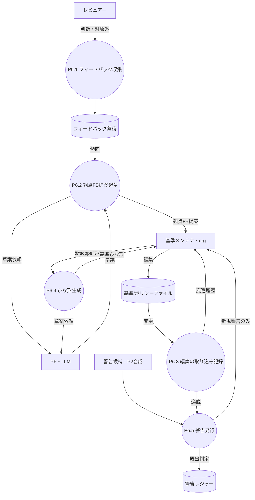

# プロセス設計 02 — 単一責務までの分解（L2）＋プロセス単位の点検

L1 の各プロセスを**単一責務（primitive）**まで割り、各プロセスに**イベントリスト**と**データディクショナリ**を付ける。
データディクショナリ記法：`名前 = { 要素 + 要素 + … }`、`?`=任意、`|`=択一、`{x}`=x の集合。

---

## P1 受付・正規化

| 子 | 単一責務 |
|---|---|
| P1.1 文書タイプ判定 | PF の型推定＋手動上書きで `型` を1つ確定（[Q4](../dashboard.md)） |
| P1.2 スコープ解決 | `scope` を確定（MVP は org 固定） |
| P1.3 集合確定 | 文書を**対象集合**と**参照集合**に振り分ける |

**イベントリスト**

| # | イベント（刺激・入力） | 発生源 | 処理（プロセス） | 出力 → 宛先 |
|---|---|---|---|---|
| P1-1 | 評価対象を提出 | 利用者 | P1.1 文書タイプ判定（PF 推定＋手動上書きを優先） | 型 → P1.3 / P2 / P3 |
| P1-2 | scope 指定 or 文脈 | 利用者 | P1.2 スコープ解決（MVP=org 固定） | scope → P1.3 / P2 |
| P1-3 | 型・scope 確定 | P1.1 / P1.2 | P1.3 集合確定（対象/参照へ振り分け） | 対象集合・参照集合 → P2 / P3 |

**データディクショナリ**

- `提出物 = { 文書群 + 参照群? + 型上書き? + scope指定? }`
- `文書群 = { ファイル }` / `参照群 = { ファイル }`
- `型 = code | spec | minutes | …`
- `scope = org`（MVP） `| team:<名> | project:<名>`
- `対象集合 = { ファイル }` / `参照集合 = { ファイル }`

> 🔎 発見：L1 図に **P1→PF（型判定）** の線が無かった（[04](04-gaps-found.md) G1）。型判定も PF 呼び出し。

---

## P2 基準合成

| 子 | 単一責務 |
|---|---|
| P2.1 継承マージ＋方向ゲート | org→team→project を union し、**緩め/`locked` 違反を機械拒否**（org 権威）。拒否は警告候補へ |
| P2.2 本文矛盾チェック | 兄弟同 id の本文矛盾を PF で判定（`content_hash` で DS2 キャッシュ照合）。矛盾は親フォールバック＋警告候補 |
| P2.3 パック+メタ表 組立 | LLM 入力用**観点パック**（メタ抜き）と内部**メタ表**を作る |

**イベントリスト**

| # | イベント（刺激・入力） | 発生源 | 処理（プロセス） | 出力 → 宛先 |
|---|---|---|---|---|
| P2-1 | 対象集合・型・scope 確定 | P1 | P2.1 継承マージ＋方向ゲート（緩め/`locked` 違反を機械拒否） | マージ済ルール → P2.2 ／ 警告候補 → P6.5 |
| P2-2 | マージ済に同 id 兄弟本文あり | P2.1 | P2.2 本文矛盾チェック（DS2 照合→未ヒット時のみ PF 判定） | 確定ルール → P2.3 ／ 矛盾＝親フォールバック＋警告候補 → P6.5 |
| P2-3 | 確定ルール受領 | P2.2 | P2.3 観点パック＋メタ表 組立 | 観点パック → P3 / P4 ／ メタ表 → P4 |

**データディクショナリ**

- `合成ルール = { id + title + 本文 + 例 + メタ + provenance }`
- `メタ = { determinism + severity + override + enabled }`
- `観点パック = { (id + title + 本文 + 例) }`（メタ抜き＝PF へ渡す）
- `メタ表 = { id → (determinism + severity + override + provenance) }`
- `警告候補 = { 種別(緩め拒否|矛盾|衝突) + rule_id + content_hash + provenance }`

> 🔎 発見：**方向ゲート判定は合成時（P2）**が正（[schema](../schema/README.md) のマージ時 reject と一致）。育成側 P6 に置くと二重化（[04](04-gaps-found.md) G2）。
> 🔎 発見：**警告候補→既出判定→発行**は P2 と P6 で共通の cross-cutting（[04](04-gaps-found.md) G3）。下記「警告発行」に集約。

---

## P3 評価

| 子 | 単一責務 |
|---|---|
| P3.1 プロンプト構築 | 役割制約＋観点パック＋対象＋参照＋出力スキーマを1プロンプトに |
| P3.2 PF 呼び出し | アダプタ経由で PF を実行（[11](../requirements/11-platform-adapter.md)） |
| P3.3 出力パース | structured 化。`location.file` 必須を検証（無ければ補正/未分類化） |

**イベントリスト**

| # | イベント（刺激・入力） | 発生源 | 処理（プロセス） | 出力 → 宛先 |
|---|---|---|---|---|
| P3-1 | 観点パック＋対象/参照 受領 | P2 / P1 | P3.1 プロンプト構築（役割制約＋パック＋対象＋参照＋スキーマ） | プロンプト → P3.2 |
| P3-2 | プロンプト受領 | P3.1 | P3.2 PF 呼び出し（アダプタ経由） | 生応答 → P3.3 |
| P3-3 | 生応答受領 | PF | P3.3 出力パース・整形（`location.file` 必須を検証） | findings[] / unmatched[] → P4 |

**データディクショナリ**

- `プロンプト = { 役割制約 + 観点パック + 対象 + 参照 + 出力スキーマ }`
- `finding = { rule_id + location + quote? + rationale + suggested_fix? }`
- `location = { file + line_range? }`（**file 必須**）
- `unmatched = { description + location + suggested_fix? }`

---

## P4 検証・仕分け（順序固定：4.1→4.2→4.3）

| 子 | 単一責務 |
|---|---|
| P4.1 rule_id 検証 | finding.rule_id がパックに在るか検証。外れ＋元 unmatched → ❓未分類 |
| P4.2 参照除外 | `location.file ∈ 参照集合` の finding を破棄 |
| P4.3 仕分け | `rule_id→メタ→determinism×severity→ポリシー→mode` で 🤖/✋/💬 |

**イベントリスト**

| # | イベント（刺激・入力） | 発生源 | 処理（プロセス） | 出力 → 宛先 |
|---|---|---|---|---|
| P4-1 | findings/unmatched 受領 | P3 | P4.1 rule_id 検証（パック照合） | 有効findings → P4.2 ／ ❓未分類（id 外れ＋unmatched）→ P5 |
| P4-2 | 有効findings 受領 | P4.1 | P4.2 参照除外（`location.file ∈ 参照集合` を破棄） | 対象内findings → P4.3 |
| P4-3 | 対象内findings 受領 | P4.2 | P4.3 仕分け（メタ表 × ポリシー → mode） | 🤖/✋/💬 仕分け済 → P5 |

**データディクショナリ**

- `mode = auto_log_only | auto_suggest | human_only`
- `仕分け済指摘 = finding + mode`
- `❓未分類 = { description + location + suggested_fix? + 由来(id外れ|自己申告) }`

---

## P5 適用・レポート

| 子 | 単一責務 |
|---|---|
| P5.1 修正生成 | 🤖 の確定 fix を用意：**決定的ツールがあればツール生成**、無ければ LLM 原案を採用（[Q21](../dashboard.md)） |
| P5.2 適用・コミット | 🤖 を対象へ書込み、**finding 単位でコミット**（DS3）。同一箇所に重なる fix は**衝突解決**（[Q20](../dashboard.md) 2段構え：LLM マージ→迷いは人） |
| P5.3 レポート組立 | 3区分＋未分類＋サマリ＋diff＋原案を組む |
| P5.4 revert | 要求された finding／実行単位の commit を戻す |

**イベントリスト**

| # | イベント（刺激・入力） | 発生源 | 処理（プロセス） | 出力 → 宛先 |
|---|---|---|---|---|
| P5-1 | 仕分け済（🤖 を含む）受領 | P4 | P5.1 修正生成（決定的ツール優先／無ければ LLM 原案） | 確定fix → P5.2 |
| P5-2 | 確定fix 受領 | P5.1 | P5.2 適用・コミット＋衝突解決（Q20 2段構え） | DS3 コミット ／ 適用結果 → P5.3 |
| P5-3 | 仕分け済＋適用結果 受領 | P4 / P5.2 | P5.3 レポート組立（3区分＋未分類＋サマリ） | 評価レポート → 利用者 ／ ✋diff・💬原案 → レビュアー |
| P5-4 | revert 要求 | 利用者 | P5.4 revert（DS3 の commit を戻す） | DS3 復元 ／ revert 結果 → 利用者 |

**データディクショナリ**

- `確定fix = { finding_id + 生成元(tool|llm) + diff }`
- `finding_id = rule_id + location`
- `評価レポート = { 🤖済[] + ✋diff[] + 💬原案[] + ❓未分類[] + サマリ }`
- `revert要求 = { 対象: finding_id | 実行ID | all }`

> 🔎 発見：**revert 要求は 05 の入力(I-#)に無い**（O-6 だけ）。入力として未台帳（[04](04-gaps-found.md) G4）。

---

## P6 育成・ガバナンス

| 子 | 単一責務 |
|---|---|
| P6.1 フィードバック収集 | 判断・対象外フラグを DS5 に蓄積 |
| P6.2 観点FB提案起草 | DS5 傾向から PF で変更原案を起草（O-12） |
| P6.3 編集の取り込み記録 | DS1 変更を記録し変遷履歴に（O-10） |
| P6.4 ひな形生成 | 新 doc_type/scope に PF で基準草案（O-11） |
| P6.5 警告発行 | **警告候補（P2 合成＋P6.3）を DS4 で既出判定し、新規のみ発行**（既出はレポートに混ぜるだけ・Q9） |

**イベントリスト**

| # | イベント（刺激・入力） | 発生源 | 処理（プロセス） | 出力 → 宛先 |
|---|---|---|---|---|
| P6-1 | 指摘への判断・対象外フラグ | レビュアー | P6.1 フィードバック収集 | DS5 へ蓄積 |
| P6-2 | DS5 しきい値到達 or オンデマンド | DS5 / 利用者 | P6.2 観点FB提案起草（PF で草案） | 観点FB提案 → 基準メンテナ |
| P6-3 | 基準/ポリシー編集 | 基準メンテナ | P6.3 編集の取り込み記録 | 変遷履歴 → メンテナ ／ 逸脱 → P6.5 |
| P6-4 | 新 doc_type/scope 立ち上げ | 基準メンテナ | P6.4 ひな形生成（PF で草案） | 基準ひな形 → メンテナ |
| P6-5 | 警告候補 受領 | P2.1 / P2.2 / P6.3 | P6.5 警告発行（DS4 で既出判定） | 新規警告 → メンテナ（既出は抑制） |

**データディクショナリ**

- `フィードバック = { finding_id + 判断(承認|却下|対象外) + 時刻 }`
- `観点FB提案 = { 対象rule_id + 変更案 + 根拠 }`
- `警告レジャー項 = { rule_id + content_hash + first_seen }`
- `警告 = { 種別 + rule_id + content_hash + provenance }`

> 🔎 発見：**P6.5 警告発行**は P2 合成からも P6.3 からも警告候補を受ける cross-cutting プロセス。
> 単一責務（既出判定＋発行）として切り出した（[04](04-gaps-found.md) G3）。

---

## 単一責務の確認

L2 の各子プロセス（P1.1〜P6.5）はいずれも 1 動詞 1 対象＝**単一責務**。これ以上の分解は不要と判断。
（決定的ツール実行など実装詳細は子プロセス内の手段であって別プロセスにはしない。）
