# プロセス設計 02 — 単一責務までの分解（L2）＋プロセス単位の点検

L1 の各プロセスを**単一責務（primitive）**まで割り、各プロセスに**イベントリスト**と**データディクショナリ**を付ける。
データディクショナリ記法：`名前 = { 要素 + 要素 + … }`、`?`=任意、`|`=択一、`{x}`=x の集合。

---

## P1 受付・正規化

**責務**：雑多な提出物を「対象集合・参照集合・型・scope」に正規化する。 **提供価値**：後段すべてが前提にできる土台を作る＝**価値経路の入口**（ここが詰まると全工程が止まる）。

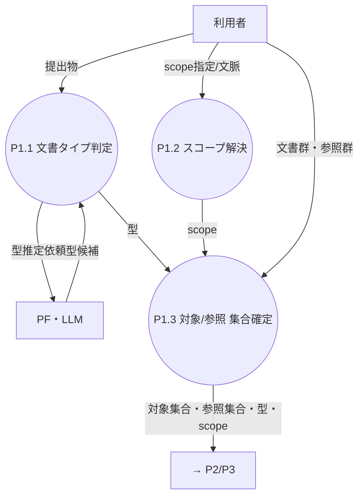

| 子 | 単一責務 |
|---|---|
| P1.1 文書タイプ判定 | PF の型推定＋手動上書きで `型` を1つ確定（[Q4](../dashboard.md)） |
| P1.2 スコープ解決 | `scope` を確定（MVP は org 固定） |
| P1.3 集合確定 | 文書を**対象集合**と**参照集合**に振り分ける |

**イベントリスト**

| # | イベント（刺激・入力） | 発生源 | 処理（プロセス） | 出力 → 宛先 |
|---|---|---|---|---|
| P1-1 | 評価対象を提出 | 利用者 | P1.1 文書タイプ判定（PF 推定＋手動上書きを優先） | 型 → P1.3 / P2 / P3 |
| P1-2 | scope 指定 or 文脈 | 利用者 | P1.2 スコープ解決（MVP=org 固定） | scope → P1.3 / P2 |
| P1-3 | 型・scope 確定 | P1.1 / P1.2 | P1.3 集合確定（対象/参照へ振り分け） | 対象集合・参照集合 → P2 / P3 |

**データディクショナリ**

- `提出物 = { 文書群 + 参照群? + 型上書き? + scope指定? }`
- `文書群 = { ファイル }` / `参照群 = { ファイル }`
- `型 = code | spec | minutes | …`
- `scope = org`（MVP） `| team:<名> | project:<名>`
- `対象集合 = { ファイル }` / `参照集合 = { ファイル }`

> 🔎 発見：L1 図に **P1→PF（型判定）** の線が無かった（[04](04-gaps-found.md) G1）。型判定も PF 呼び出し。

---

## P2 基準合成

**責務**：doc_type×scope の観点を毎回1つに合成する。 **提供価値**：いつ誰がやっても**ぶれない一貫した評価基準**を供給（属人性排除・org 権威の担保）。

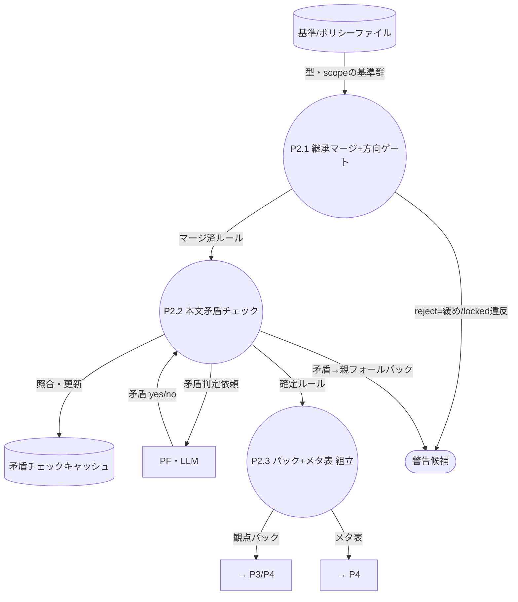

| 子 | 単一責務 |
|---|---|
| P2.1 継承マージ＋方向ゲート | org→team→project を union し、**緩め/`locked` 違反を機械拒否**（org 権威）。拒否は警告候補へ |
| P2.2 本文矛盾チェック | 兄弟同 id の本文矛盾を PF で判定（`content_hash` で DS2 キャッシュ照合）。矛盾は親フォールバック＋警告候補 |
| P2.3 パック+メタ表 組立 | LLM 入力用**観点パック**（メタ抜き）と内部**メタ表**を作る |

**イベントリスト**

| # | イベント（刺激・入力） | 発生源 | 処理（プロセス） | 出力 → 宛先 |
|---|---|---|---|---|
| P2-1 | 対象集合・型・scope 確定 | P1 | P2.1 継承マージ＋方向ゲート（緩め/`locked` 違反を機械拒否） | マージ済ルール → P2.2 ／ 警告候補 → P6.5 |
| P2-2 | マージ済に同 id 兄弟本文あり | P2.1 | P2.2 本文矛盾チェック（DS2 照合→未ヒット時のみ PF 判定） | 確定ルール → P2.3 ／ 矛盾＝親フォールバック＋警告候補 → P6.5 |
| P2-3 | 確定ルール受領 | P2.2 | P2.3 観点パック＋メタ表 組立 | 観点パック → P3 / P4 ／ メタ表 → P4 |

**データディクショナリ**

- `合成ルール = { id + title + 本文 + 例 + メタ + provenance }`
- `メタ = { determinism + severity + override + enabled }`
- `観点パック = { (id + title + 本文 + 例) }`（メタ抜き＝PF へ渡す）
- `メタ表 = { id → (determinism + severity + override + provenance) }`
- `警告候補 = { 種別(緩め拒否|矛盾|衝突) + rule_id + content_hash + provenance }`

> 🔎 発見：**方向ゲート判定は合成時（P2）**が正（[schema](../schema/README.md) のマージ時 reject と一致）。育成側 P6 に置くと二重化（[04](04-gaps-found.md) G2）。
> 🔎 発見：**警告候補→既出判定→発行**は P2 と P6 で共通の cross-cutting（[04](04-gaps-found.md) G3）。下記「警告発行」に集約。

---

## P3 評価

**責務**：観点パックに照らして違反を抽出する。 **提供価値**：**レビューの中核価値（観点に基づく指摘）**を生成する点。

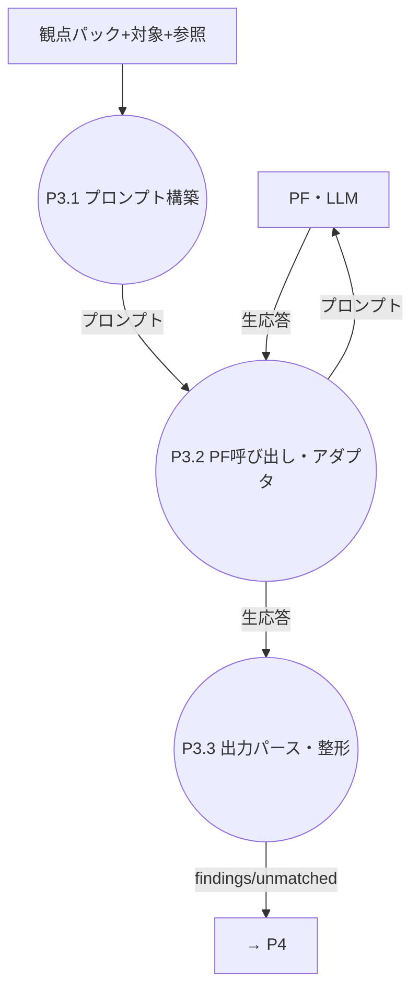

| 子 | 単一責務 |
|---|---|
| P3.1 プロンプト構築 | 役割制約＋観点パック＋対象＋参照＋出力スキーマを1プロンプトに |
| P3.2 PF 呼び出し | アダプタ経由で PF を実行（[11](../requirements/11-platform-adapter.md)） |
| P3.3 出力パース | structured 化。`location.file` 必須を検証（無ければ補正/未分類化） |

**イベントリスト**

| # | イベント（刺激・入力） | 発生源 | 処理（プロセス） | 出力 → 宛先 |
|---|---|---|---|---|
| P3-1 | 観点パック＋対象/参照 受領 | P2 / P1 | P3.1 プロンプト構築（役割制約＋パック＋対象＋参照＋スキーマ） | プロンプト → P3.2 |
| P3-2 | プロンプト受領 | P3.1 | P3.2 PF 呼び出し（アダプタ経由） | 生応答 → P3.3 |
| P3-3 | 生応答受領 | PF | P3.3 出力パース・整形（`location.file` 必須を検証） | findings[] / unmatched[] → P4 |

**データディクショナリ**

- `プロンプト = { 役割制約 + 観点パック + 対象 + 参照 + 出力スキーマ }`
- `finding = { rule_id + location + quote? + rationale + suggested_fix? }`
- `location = { file + line_range? }`（**file 必須**）
- `unmatched = { description + location + suggested_fix? }`

---

## P4 検証・仕分け（順序固定：4.1→4.2→4.3）

**責務**：指摘を検証・除外し 🤖/✋/💬/❓ に仕分ける。 **提供価値**：信頼できる指摘だけに絞り、**自動/承認/判断を割り当てて人の負荷を最小化**。

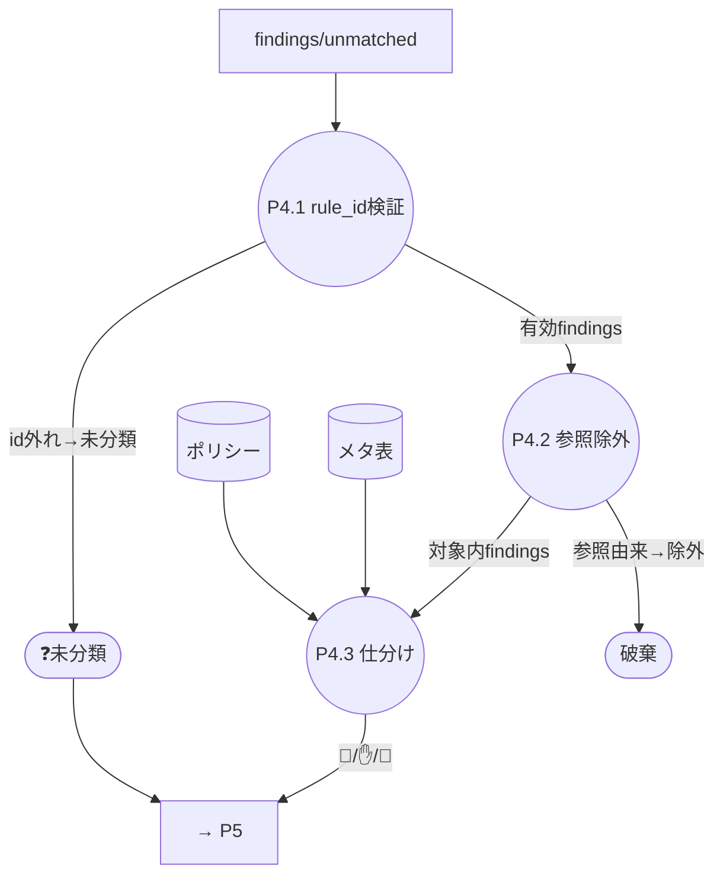

| 子 | 単一責務 |
|---|---|
| P4.1 rule_id 検証 | finding.rule_id がパックに在るか検証。外れ＋元 unmatched → ❓未分類 |
| P4.2 参照除外 | `location.file ∈ 参照集合` の finding を破棄 |
| P4.3 仕分け | `rule_id→メタ→determinism×severity→ポリシー→mode` で 🤖/✋/💬 |

**イベントリスト**

| # | イベント（刺激・入力） | 発生源 | 処理（プロセス） | 出力 → 宛先 |
|---|---|---|---|---|
| P4-1 | findings/unmatched 受領 | P3 | P4.1 rule_id 検証（パック照合） | 有効findings → P4.2 ／ ❓未分類（id 外れ＋unmatched）→ P5 |
| P4-2 | 有効findings 受領 | P4.1 | P4.2 参照除外（`location.file ∈ 参照集合` を破棄） | 対象内findings → P4.3 |
| P4-3 | 対象内findings 受領 | P4.2 | P4.3 仕分け（メタ表 × ポリシー → mode） | 🤖/✋/💬 仕分け済 → P5 |

**データディクショナリ**

- `mode = auto_log_only | auto_suggest | human_only`
- `仕分け済指摘 = finding + mode`
- `❓未分類 = { description + location + suggested_fix? + 由来(id外れ|自己申告) }`

---

## P5 適用・レポート

**責務**：直せる物を適用し、結果を3区分＋未分類のレポートで届け、revert に応じる。 **提供価値**：価値の出口＝**直す/見せる/取り消す**を実行。🤖 の自動適用だけでなく、**人が承認/決定した修正がコードに反映される経路もここ**。

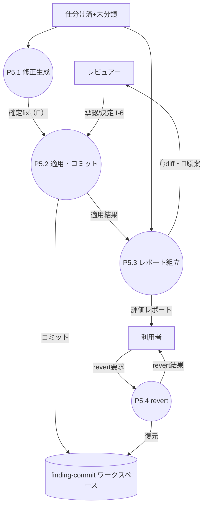

> 🔎 発見：旧モデルは `🤖` だけ P5.2 に流れ、**✋承認/💬決定された修正の適用経路が無かった**＝価値経路の遮断（[04](04-gaps-found.md) G8）。`Reviewer →(I-6) P5.2` を追加。

| 子 | 単一責務 |
|---|---|
| P5.1 修正生成 | 🤖 の確定 fix を用意：**決定的ツールがあればツール生成**、無ければ LLM 原案を採用（[Q21](../dashboard.md)） |
| P5.2 適用・コミット | 🤖（自動）と**承認済✋・決定済💬**（I-6）を対象へ書込み、**finding 単位でコミット**（DS3）。同一箇所に重なる fix は**衝突解決**（[Q20](../dashboard.md) 2段構え：LLM マージ→迷いは人） |
| P5.3 レポート組立 | 3区分＋未分類＋サマリ＋diff＋原案を組む |
| P5.4 revert | 要求された finding／実行単位の commit を戻す |

**イベントリスト**

| # | イベント（刺激・入力） | 発生源 | 処理（プロセス） | 出力 → 宛先 |
|---|---|---|---|---|
| P5-1 | 仕分け済（🤖 を含む）受領 | P4 | P5.1 修正生成（決定的ツール優先／無ければ LLM 原案） | 確定fix → P5.2 |
| P5-2 | 確定fix 受領 | P5.1 | P5.2 適用・コミット＋衝突解決（Q20 2段構え） | DS3 コミット ／ 適用結果 → P5.3 |
| P5-3 | 仕分け済＋適用結果 受領 | P4 / P5.2 | P5.3 レポート組立（3区分＋未分類＋サマリ） | 評価レポート → 利用者 ／ ✋diff・💬原案 → レビュアー |
| P5-4 | revert 要求 | 利用者 | P5.4 revert（DS3 の commit を戻す） | DS3 復元 ／ revert 結果 → 利用者 |
| P5-5 | ✋承認 / 💬決定（I-6） | レビュアー | P5.2 適用・コミット（承認/決定された diff を適用） | DS3 コミット ／ 適用結果 → P5.3 |

**データディクショナリ**

- `確定fix = { finding_id + 生成元(tool|llm) + diff }`
- `finding_id = rule_id + location`
- `評価レポート = { 🤖済[] + ✋diff[] + 💬原案[] + ❓未分類[] + サマリ }`
- `revert要求 = { 対象: finding_id | 実行ID | all }`

> 🔎 発見：**revert 要求は 05 の入力(I-#)に無い**（O-6 だけ）。入力として未台帳（[04](04-gaps-found.md) G4）。

---

## P6 育成・ガバナンス

**責務**：判断・基準編集を集約し、基準へ安全に還流する。 **提供価値**：現場の声を基準に取り込み、**逸脱を止めつつシステムを育てる**（自己改善ループの完結点）。

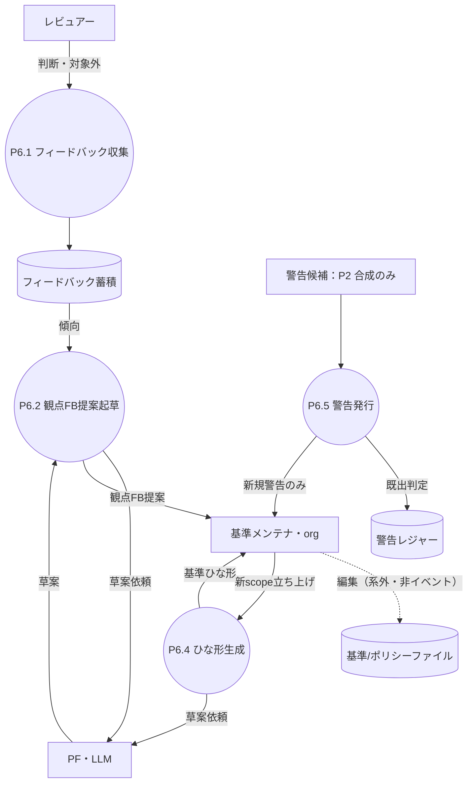

| 子 | 単一責務 |
|---|---|
| P6.1 フィードバック収集 | 判断・対象外フラグを DS5 に蓄積 |
| P6.2 観点FB提案起草 | DS5 傾向から PF で変更原案を起草（O-12） |
| P6.4 ひな形生成 | 新 doc_type/scope に PF で基準草案（O-11） |
| P6.5 警告発行 | **警告候補（P2 合成のみ）を DS4 で既出判定し、新規のみ発行**（既出はレポートに混ぜるだけ・Q9） |

> 基準/ポリシーの**編集は系外（エディタ/git で直接）**で起こり得るため、システムはこれを**イベント化・入力化しない**（[Q15](../dashboard.md)）。
> 方向違反・矛盾・衝突・locked の検査は **P2 合成時に毎回**実施し警告するだけでよい。よって旧「P6.3 編集の取り込み記録」と入力 I-8/I-9・イベント E6/E7 は**不要**として削除。

**イベントリスト**

| # | イベント（刺激・入力） | 発生源 | 処理（プロセス） | 出力 → 宛先 |
|---|---|---|---|---|
| P6-1 | 指摘への判断・対象外フラグ | レビュアー | P6.1 フィードバック収集 | DS5 へ蓄積 |
| P6-2 | DS5 しきい値到達 or オンデマンド | DS5 / 利用者 | P6.2 観点FB提案起草（PF で草案） | 観点FB提案 → 基準メンテナ |
| P6-4 | 新 doc_type/scope 立ち上げ | 基準メンテナ | P6.4 ひな形生成（PF で草案） | 基準ひな形 → メンテナ |
| P6-5 | 警告候補 受領 | P2.1 / P2.2（合成時のみ） | P6.5 警告発行（DS4 で既出判定） | 新規警告 → メンテナ（既出は抑制） |

**データディクショナリ**

- `フィードバック = { finding_id + 判断(承認|却下|対象外) + 時刻 }`
- `観点FB提案 = { 対象rule_id + 変更案 + 根拠 }`
- `警告レジャー項 = { rule_id + content_hash + first_seen }`
- `警告 = { 種別 + rule_id + content_hash + provenance }`

> 🔎 **P6.5 警告発行**は **P2 合成時の警告候補のみ**を受ける（基準編集は系外＝非イベントなので、編集起点の警告は無い）。
> 単一責務（既出判定＋発行）として切り出し（[04](04-gaps-found.md) G3）。

---

## L3：各 L2 プロセスのサブ DFD ＋イベントリスト

L2（P1.1〜P6.5）は**まだ primitive ではない**（「仕分け」「マージ」等が内部に繰返し・選択を抱える）。
**STS とワーニエ法を交互に当てて**割り、結果は他レベルと同じく **サブ DFD ＋ イベントリスト（5列）＋ 責務/提供価値** で表す。

### 分割手法の使い分け

- **STS（変換中心分割）**：ノードが「入力整形 → 中心変換 → 出力整形」の**データフロー**で割れるとき（`[入] [変] [出]`）。
- **ワーニエ法（データ構造分割）**：ノードが**データ構造に支配される**とき（`順次` / `繰返し〔1..N〕` / `選択`）。
- **交互の原則**：STS で出た「集合を回す・場合分けする」子は次に**ワーニエ**へ、ワーニエで出た「小さなパイプライン」子は次に**STS**へ。flow と structure が切り替わる節で持ち替える。

### ワーニエ構造 → DFD の対応

| ワーニエ構成子 | DFD 表現 |
|---|---|
| 順次 | プロセスの直列連鎖 |
| 繰返し〔1..N〕 | 集合データフロー（1 本の矢印が集合、イベントは `〔各〕` と明記） |
| 選択 | 1 プロセスからの**複数出力フロー**（条件はフローのラベル） |

---

### P1 系

#### P1.1 文書タイプ判定
**責務**：提出物の文書タイプを1つ確定する。 **提供価値**：以降の基準合成・評価の前提を与える（型が決まらないと観点が選べない）。 **手法**：STS → 末端ワーニエ。

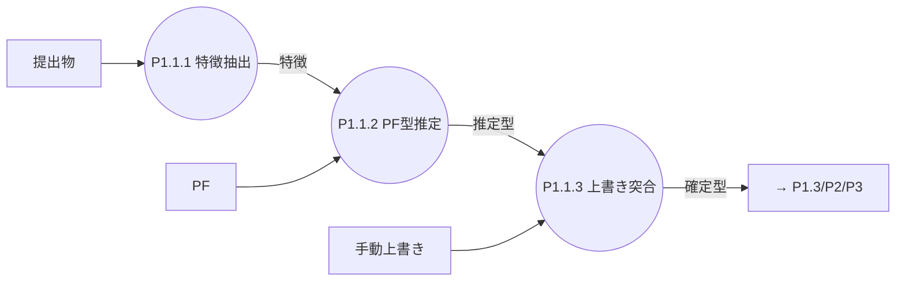

| # | イベント | 発生源 | 処理 | 出力 → 宛先 |
|---|---|---|---|---|
| P1.1-1 | 提出物 受領 | 利用者 | P1.1.1 特徴抽出（拡張子・パス・先頭内容） | 特徴 → P1.1.2 |
| P1.1-2 | 特徴 受領 | P1.1.1 | P1.1.2 PF 型推定 | 推定型 → P1.1.3 |
| P1.1-3 | 推定型＋上書き有無 | P1.1.2 / 利用者 | P1.1.3 上書き突合（あれば優先） | 確定型 → P1.3/P2/P3 |

#### P1.2 スコープ解決
**責務**：scope を1つ確定する。 **提供価値**：どの階層の基準を効かせるか決める分岐点（MVP=org 固定でも論理的に必須）。 **手法**：ワーニエ・選択。

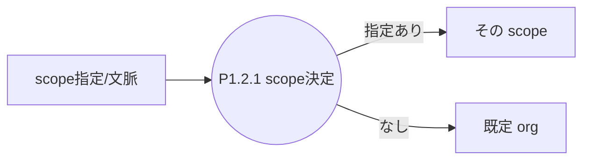

| # | イベント | 発生源 | 処理 | 出力 → 宛先 |
|---|---|---|---|---|
| P1.2-1 | scope 指定 or 文脈 | 利用者 | P1.2.1 scope 決定（指定優先・既定 org） | scope → P1.3/P2 |

#### P1.3 対象/参照 集合確定
**責務**：提出ファイルを対象集合と参照集合に分ける。 **提供価値**：「評価する物／文脈として読む物」を分離（参照を評価しない不変条件の土台）。 **手法**：STS → ワーニエ。

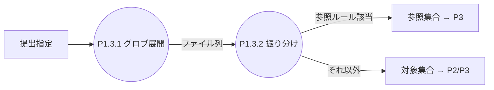

| # | イベント | 発生源 | 処理 | 出力 → 宛先 |
|---|---|---|---|---|
| P1.3-1 | 提出指定 受領 | 利用者 | P1.3.1 グロブ展開 | ファイル列 → P1.3.2 |
| P1.3-2 | ファイル列〔各〕 | P1.3.1 | P1.3.2 振り分け（参照ルール判定） | 対象集合・参照集合 → P2/P3 |

---

### P2 系

#### P2.1 継承マージ＋方向ゲート
**責務**：型×scope の基準を1つに合成し、緩め違反を機械拒否する。 **提供価値**：毎回ぶれない基準と org 権威の担保。 **手法**：STS → 各変換でワーニエ。

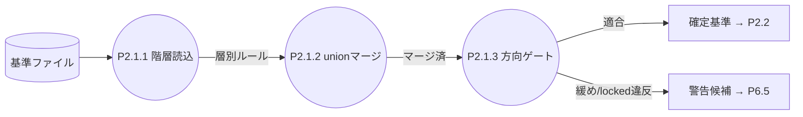

| # | イベント | 発生源 | 処理 | 出力 → 宛先 |
|---|---|---|---|---|
| P2.1-1 | 型・scope 確定 | P1 | P2.1.1 階層読込（org→team→project） | 層別ルール → P2.1.2 |
| P2.1-2 | 層別ルール〔各 id〕 | P2.1.1 | P2.1.2 union マージ（同 id 継承解決） | マージ済 → P2.1.3 |
| P2.1-3 | マージ済〔各上書き〕 | P2.1.2 | P2.1.3 方向ゲート（緩め/locked 拒否） | 確定基準 → P2.2 ／ 警告候補 → P6.5 |

#### P2.2 本文矛盾チェック
**責務**：同 id 兄弟本文の矛盾を検出し共存可否を決める。 **提供価値**：継承で矛盾した基準のまま評価する事故を防ぐ。 **手法**：ワーニエ・繰返し × 内部 STS。

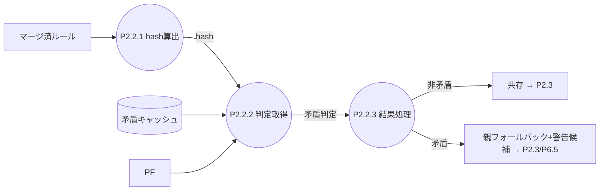

| # | イベント | 発生源 | 処理 | 出力 → 宛先 |
|---|---|---|---|---|
| P2.2-1 | 同 id 兄弟ペア〔各〕 | P2.1 | P2.2.1 content_hash 算出 | hash → P2.2.2 |
| P2.2-2 | hash 受領 | P2.2.1 | P2.2.2 判定取得（DS2 ヒット→流用／ミス→PF→DS2 追記） | 矛盾判定 → P2.2.3 |
| P2.2-3 | 矛盾判定 受領 | P2.2.2 | P2.2.3 結果処理 | 共存 → P2.3 ／ 親フォールバック＋警告候補 → P2.3/P6.5 |

#### P2.3 観点パック＋メタ表 組立
**責務**：LLM 入力用パックと内部メタ表を生成する。 **提供価値**：「PF に渡す物（メタ抜き）」と「機械が使う物（メタ）」を分離。 **手法**：ワーニエ・繰返し（2 出力）。

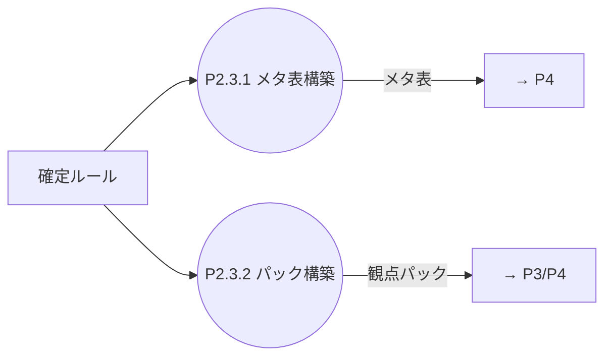

| # | イベント | 発生源 | 処理 | 出力 → 宛先 |
|---|---|---|---|---|
| P2.3-1 | 確定ルール〔各〕 | P2.2 | P2.3.1 メタ表へ (id→メタ) 追記 | メタ表 → P4 |
| P2.3-2 | 確定ルール〔各〕 | P2.2 | P2.3.2 パックへ公開項 (id/title/本文/例) 追記 | 観点パック → P3/P4 |

---

### P3 系

#### P3.1 プロンプト構築
**責務**：1 回の評価に要る材料を1プロンプトに組む。 **提供価値**：評価の再現性と役割逸脱の防止。 **手法**：ワーニエ・順次（一部 繰返し/選択）。

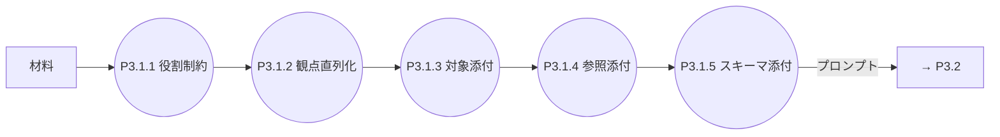

| # | イベント | 発生源 | 処理 | 出力 → 宛先 |
|---|---|---|---|---|
| P3.1-1 | 構築開始 | P2 / P1 | P3.1.1 役割制約ブロック付与 | +制約 → P3.1.2 |
| P3.1-2 | 観点パック〔各 rule〕 | P2.3 | P3.1.2 観点直列化 | +観点 → P3.1.3 |
| P3.1-3 | 対象本文 | P1.3 | P3.1.3 対象添付 | +対象 → P3.1.4 |
| P3.1-4 | 参照（有無） | P1.3 | P3.1.4 参照添付（あれば） | +参照 → P3.1.5 |
| P3.1-5 | 出力スキーマ | 固定 | P3.1.5 スキーマ添付 | プロンプト → P3.2 |

#### P3.2 PF 呼び出し
**責務**：アダプタ経由で PF を実行し生応答を得る。 **提供価値**：PF 差し替え可能性と障害時 degrade の境界。 **手法**：STS → 末端ワーニエ。

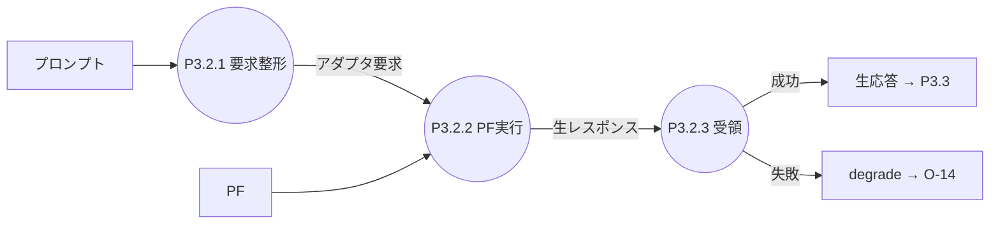

| # | イベント | 発生源 | 処理 | 出力 → 宛先 |
|---|---|---|---|---|
| P3.2-1 | プロンプト 受領 | P3.1 | P3.2.1 アダプタ要求整形 | アダプタ要求 → P3.2.2 |
| P3.2-2 | アダプタ要求 | P3.2.1 | P3.2.2 PF 実行 | 生レスポンス → P3.2.3 |
| P3.2-3 | 生レスポンス／失敗 | PF | P3.2.3 受領（リトライ→なお失敗で degrade） | 生応答 → P3.3 ／ degrade → O-14 |

#### P3.3 出力パース・整形
**責務**：生応答を検証済 findings/unmatched に整える。 **提供価値**：`location.file` 必須など下流の不変条件を保証。 **手法**：STS → ワーニエ。

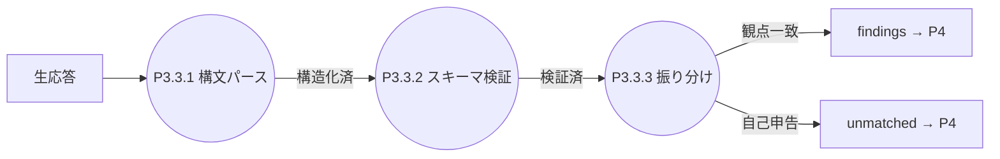

| # | イベント | 発生源 | 処理 | 出力 → 宛先 |
|---|---|---|---|---|
| P3.3-1 | 生応答 受領 | P3.2 | P3.3.1 構文パース（structured 化） | 構造化済 → P3.3.2 |
| P3.3-2 | 構造化済〔各 item〕 | P3.3.1 | P3.3.2 スキーマ検証（`file` 欠落→補正/未分類化） | 検証済 → P3.3.3 |
| P3.3-3 | 検証済 受領 | P3.3.2 | P3.3.3 findings/unmatched 振り分け | findings / unmatched → P4 |

---

### P4 系

#### P4.1 rule_id 検証
**責務**：finding の rule_id がパックに在るか検証。 **提供価値**：幻の観点 ID を下流に流さない。 **手法**：ワーニエ・繰返し＋選択。

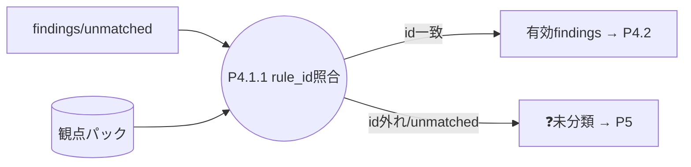

| # | イベント | 発生源 | 処理 | 出力 → 宛先 |
|---|---|---|---|---|
| P4.1-1 | finding〔各〕 | P3 | P4.1.1 rule_id 照合（観点パック） | 有効findings → P4.2 ／ ❓未分類 → P5 |

#### P4.2 参照除外
**責務**：参照集合に属する指摘を破棄する。 **提供価値**：「参照は評価しない」不変条件の実行点。 **手法**：ワーニエ・繰返し＋選択。

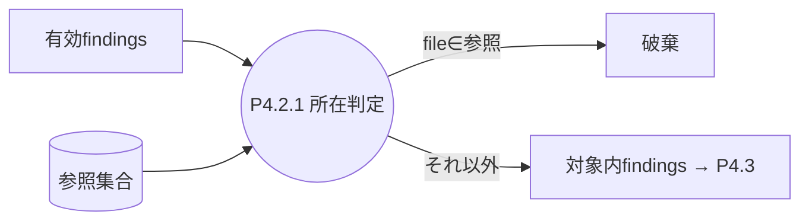

| # | イベント | 発生源 | 処理 | 出力 → 宛先 |
|---|---|---|---|---|
| P4.2-1 | 有効finding〔各〕 | P4.1 | P4.2.1 所在判定（`file ∈ 参照集合`？） | 対象内findings → P4.3 ／ 参照由来→破棄 |

#### P4.3 仕分け
**責務**：対象内 finding を 🤖/✋/💬 へ機械的に振り分ける。 **提供価値**：人が見る前に「自動でやる/承認だけ/人が判断」を確定しレビュー負荷を最小化。 **手法**：ワーニエ・繰返し＋順次＋選択。

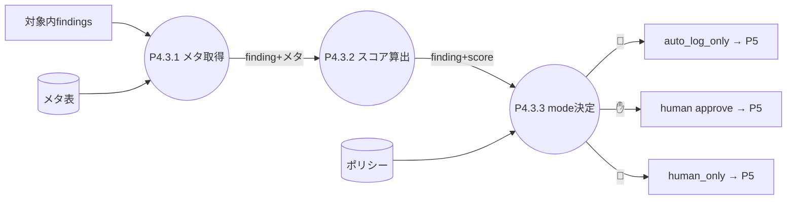

| # | イベント | 発生源 | 処理 | 出力 → 宛先 |
|---|---|---|---|---|
| P4.3-1 | 対象内finding〔各〕 | P4.2 | P4.3.1 メタ取得（rule_id→メタ表） | finding+メタ → P4.3.2 |
| P4.3-2 | finding+メタ | P4.3.1 | P4.3.2 スコア算出（determinism×severity） | finding+score → P4.3.3 |
| P4.3-3 | finding+score | P4.3.2 | P4.3.3 mode 決定（ポリシー適用） | 🤖/✋/💬 → P5 |

---

### P5 系

#### P5.1 修正生成
**責務**：🤖 指摘の確定 fix を用意する。 **提供価値**：決定的に直せる物はツールで安全に、それ以外は LLM 原案で補完。 **手法**：ワーニエ・繰返し＋選択 × 内部 STS。

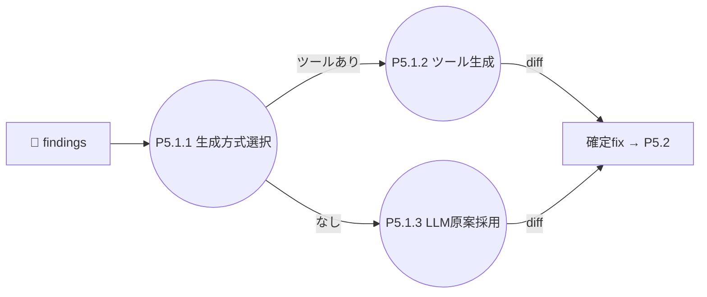

| # | イベント | 発生源 | 処理 | 出力 → 宛先 |
|---|---|---|---|---|
| P5.1-1 | 🤖 finding〔各〕 | P4.3 | P5.1.1 生成方式選択（決定的ツール有無） | 分岐 → P5.1.2 / P5.1.3 |
| P5.1-2 | ツール対象 | P5.1.1 | P5.1.2 決定的ツール生成（内部 STS：選択→実行→diff 抽出） | 確定fix → P5.2 |
| P5.1-3 | ツール無 | P5.1.1 | P5.1.3 LLM 原案を fix として採用 | 確定fix → P5.2 |

#### P5.2 適用・コミット＋衝突解決
**責務**：fix を適用し finding 単位でコミット、衝突を解決する（対象＝🤖 自動 ＋ 人が承認/決定した✋/💬）。 **提供価値**：取り消し可能性（revert 単位）と同一箇所衝突の安全処理。 **手法**：STS → 各段でワーニエ。

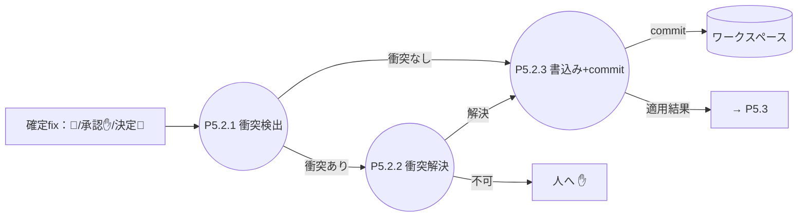

| # | イベント | 発生源 | 処理 | 出力 → 宛先 |
|---|---|---|---|---|
| P5.2-1 | 確定fix〔各〕（🤖＝P5.1 ／ 承認✋・決定💬＝I-6） | P5.1 / レビュアー | P5.2.1 衝突検出（同 location グルーピング） | 単独 → P5.2.3 ／ 衝突 → P5.2.2 |
| P5.2-2 | 衝突群 | P5.2.1 | P5.2.2 衝突解決（Q20 2段：LLM マージ→不可は人） | 解決 → P5.2.3 ／ 不可 → ✋ |
| P5.2-3 | 適用可 fix | P5.2.1 / P5.2.2 | P5.2.3 書込み＋finding 単位 commit | DS3 コミット ／ 適用結果 → P5.3 |

#### P5.3 レポート組立
**責務**：3区分＋未分類＋サマリのレポートを組む。 **提供価値**：人が一目で「やった／見て／判断して」を把握できる。 **手法**：ワーニエ・順次＋繰返し＋選択。

```mermaid
flowchart LR
  IN[仕分け済+適用結果] --> p531((P5.3.1 サマリ集計))
  IN --> p532((P5.3.2 区分振り分け))
  p532 --> p533((P5.3.3 提示物添付))
  p531 -->|サマリ| R[評価レポート]
  p533 -->|区分+diff/原案| R
  R -->|レポート| O1[→ 利用者]
  R -->|✋diff/💬原案| O2[→ レビュアー]
```

| # | イベント | 発生源 | 処理 | 出力 → 宛先 |
|---|---|---|---|---|
| P5.3-1 | 仕分け済＋適用結果 | P4 / P5.2 | P5.3.1 サマリ集計 | サマリ → レポート |
| P5.3-2 | 各指摘 | P4 / P5.2 | P5.3.2 区分振り分け（🤖済/✋/💬/❓） | 区分済 → P5.3.3 |
| P5.3-3 | 区分済 | P5.3.2 | P5.3.3 提示物添付（diff/原案） | 評価レポート → 利用者 ／ ✋diff・💬原案 → レビュアー |

#### P5.4 revert
**責務**：適用済 fix を戻す。 **提供価値**：自動修正への信頼（いつでも取り消せる）。 **手法**：STS → 入口でワーニエ。

```mermaid
flowchart LR
  IN[revert要求] --> p541((P5.4.1 対象特定))
  p541 -->|commit群| p542((P5.4.2 git revert))
  DS3[(ワークスペース)] --> p542
  p542 -->|復元| DS3
  p542 -->|結果| OUT[→ 利用者]
```

| # | イベント | 発生源 | 処理 | 出力 → 宛先 |
|---|---|---|---|---|
| P5.4-1 | revert 要求 | 利用者 | P5.4.1 対象特定（finding_id / 実行ID / all） | commit 群 → P5.4.2 |
| P5.4-2 | commit 群 | P5.4.1 | P5.4.2 git revert | DS3 復元 ／ revert 結果 → 利用者 |

---

### P6 系

#### P6.1 フィードバック収集
**責務**：人の判断・対象外フラグを蓄積する。 **提供価値**：育成（観点改善）の一次データ源。 **手法**：ワーニエ・選択＋順次。

```mermaid
flowchart LR
  IN[判断/対象外] --> p611((P6.1.1 種別判定))
  p611 -->|承認/却下/対象外| p612((P6.1.2 DS5追記))
  p612 --> DS5[(フィードバック蓄積)]
```

| # | イベント | 発生源 | 処理 | 出力 → 宛先 |
|---|---|---|---|---|
| P6.1-1 | 指摘への判断・対象外 | レビュアー | P6.1.1 種別判定（承認/却下/対象外） | 種別付き → P6.1.2 |
| P6.1-2 | 種別付き判断 | P6.1.1 | P6.1.2 DS5 追記 | DS5 蓄積 |

#### P6.2 観点FB提案起草
**責務**：傾向から観点改善案を起草する。 **提供価値**：現場の却下傾向を基準に還流させる自己改善ループ。 **手法**：STS。

```mermaid
flowchart LR
  DS5[(フィードバック蓄積)] --> p621((P6.2.1 傾向抽出))
  p621 -->|傾向| p622((P6.2.2 PF草案))
  PF[PF] --> p622
  p622 -->|草案| p623((P6.2.3 提案整形))
  p623 -->|観点FB提案| OUT[→ メンテナ]
```

| # | イベント | 発生源 | 処理 | 出力 → 宛先 |
|---|---|---|---|---|
| P6.2-1 | しきい値到達/オンデマンド | DS5 / 利用者 | P6.2.1 傾向抽出（rule_id 別 却下/対象外率） | 傾向 → P6.2.2 |
| P6.2-2 | 傾向 | P6.2.1 | P6.2.2 PF 草案 | 草案 → P6.2.3 |
| P6.2-3 | 草案 | P6.2.2 | P6.2.3 提案整形（対象 rule_id＋変更案＋根拠） | 観点FB提案 → メンテナ |

#### P6.4 ひな形生成
**責務**：新型/新 scope の基準ひな形を生成する。 **提供価値**：立ち上げコスト削減（白紙でなく草案から）。 **手法**：STS。

```mermaid
flowchart LR
  IN[新型/新scope] --> p641((P6.4.1 近傍基準収集))
  DS1[(基準ファイル)] --> p641
  p641 -->|参考基準| p642((P6.4.2 PF草案))
  PF[PF] --> p642
  p642 -->|草案| p643((P6.4.3 ひな形整形))
  p643 -->|基準ひな形| OUT[→ メンテナ]
```

| # | イベント | 発生源 | 処理 | 出力 → 宛先 |
|---|---|---|---|---|
| P6.4-1 | 新 doc_type/scope 立ち上げ | メンテナ | P6.4.1 近傍基準収集（同型/上位 scope） | 参考基準 → P6.4.2 |
| P6.4-2 | 参考基準 | P6.4.1 | P6.4.2 PF 草案 | 草案 → P6.4.3 |
| P6.4-3 | 草案 | P6.4.2 | P6.4.3 ひな形整形 | 基準ひな形 → メンテナ |

#### P6.5 警告発行
**責務**：警告候補を既出判定し新規のみ発行する。 **提供価値**：「一度示せば足りる」によるノイズ抑制。 **手法**：ワーニエ・繰返し＋選択。

```mermaid
flowchart LR
  IN[警告候補] --> p651((P6.5.1 hash算出))
  p651 -->|hash| p652((P6.5.2 既出判定))
  DS4[(警告レジャー)] --> p652
  p652 -->|既出| O1[抑制]
  p652 -->|新規| O2[DS4追記+発行 → メンテナ]
```

| # | イベント | 発生源 | 処理 | 出力 → 宛先 |
|---|---|---|---|---|
| P6.5-1 | 警告候補〔各〕 | P2.1 / P2.2（合成時） | P6.5.1 content_hash 算出 | hash → P6.5.2 |
| P6.5-2 | hash | P6.5.1 | P6.5.2 既出判定（DS4 照合） | 新規→DS4 追記＋発行→メンテナ ／ 既出→抑制 |

---

## 終端（primitive）の確認

- 階層は **L1 → L2 → L3（→ 一部 L4：選択肢内・STS-in-ワーニエ）**。2 段では終わらない。
- 各 L3 プロセスを **DFD ＋ イベントリスト ＋ 責務/提供価値** で表現（手法 STS/ワーニエは持ち替えながら適用）。
- L3〜L4 の各葉は flow も構造分岐も持たない 1 アクション＝**primitive**。実装はこの粒度を関数/ステップに対応させる。
