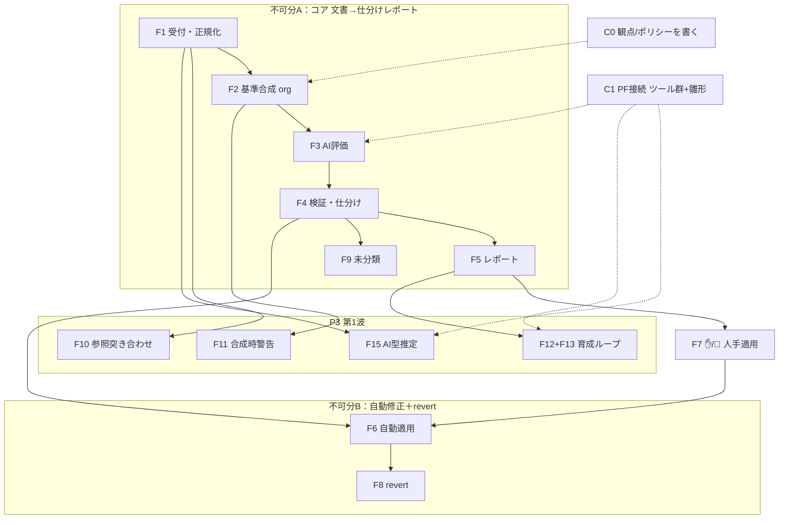

# 12. MVP スコープ（価値ベースの線引き）

> A3「MVP の線引き」の成果物。**価値で機能を並べ、前提と不可分グループを明示**して「どれから作るか」を提案する。
> 出典：[05 I/O台帳](05-io-overview.md) / [06 イベント](06-event-list.md) / [process 02 分解](../process/02-decomposition.md) / [process 05 総点検](../process/05-event-trace.md) / [schema](../schema/README.md) / [11 アダプタ](11-platform-adapter.md)。

## 読み方

- **価値**＝外部アクター（利用者/レビュアー/基準メンテナ）に届く便益。内部処理だけのものは単独では価値ゼロ。
- **前提**＝これが無いと動かない先行物。**不可分**＝単独では価値が出ず、必ずセットで出すべき機能群。
- **段階**＝提案する着手順（P0 前提 → P1 コア → P2 差別化 → P3 → 将来）。

---

## 機能一覧（価値・前提・不可分）

| ID | 機能 | 価値（誰に何を） | 前提 | 不可分 | 段階 |
|---|---|---|---|---|---|
| C0 | 観点ファイル＋ポリシーを書く（[I-4](05-io-overview.md)/I-5） | 評価の中身そのもの。無ければ何も評価できない | [schema](../schema/README.md) | — | **P0 前提** |
| C1 | PF 接続（**決定的ツール群＋プロンプト雛形**、Claude が LLM 役） | LLM をラップする土台。評価/推定/草案の実行口 | [11](11-platform-adapter.md) | — | **P0 前提** |
| F1 | 受付・正規化（[P1](../process/02-decomposition.md)） | 提出物を対象/参照・型に整える＝価値経路の入口 | — | A | **P1 コア** |
| F2 | 基準合成（org・[P2](../process/02-decomposition.md)） | doc_type に合う観点パックを供給 | C0 | A | **P1 コア** |
| F3 | AI 評価（[P3](../process/02-decomposition.md)） | 観点に沿った指摘の生成＝中核価値 | C1, F2 | A | **P1 コア** |
| F4 | 検証・仕分け（[P4](../process/02-decomposition.md)） | 信頼できる指摘に絞り 🤖/✋/💬 に振り分け＝人の負荷を最小化 | F3, C0(ポリシー) | A | **P1 コア** |
| F5 | レポート（O-1・3区分＋未分類） | 「やった/見て/判断して」を一目で届ける | F4 | A | **P1 コア** |
| F9 | 未分類バケツ（O-7） | rule_id 外れ/自己申告を捨てず surfacing＝取りこぼし防止（低コスト） | F4 | A | **P1 コア** |
| F7 | ✋/💬 人手適用（[I-6→P5.2](../process/04-gaps-found.md)） | 承認/決定した修正がコードに反映される | F5, 適用機構 | — | **P2 差別化** |
| F6 | 🤖 自動修正の適用（O-3・決定的ツール [Q21](dashboard.md)） | 「直してくれる」＝raw LLM に無い差別化 | F4, DS3(内部git), 決定的ツール | B | **P2 差別化** |
| F8 | revert（O-6） | 安心して自動化を上げられる | F6 | B | **P2 差別化** |
| F10 | 参照コンテキスト突き合わせ（[I-13](05-io-overview.md)） | 仕様vs実装の齟齬・網羅性を検出＝独自価値 | F1, F3, 観点が参照を要求 | — | P3 |
| F15 | AI 文書タイプ推定（[I-15](05-io-overview.md)） | 手動入力を省く利便。誤判定は手動上書きで救済 | F1, C1 | — | P3 |
| F11 | 合成時警告（O-9・矛盾/方向/衝突/locked・DS4） | 基準が複数化/編集された時の安全網 | F2, DS4(+矛盾はDS2/PF) | — | P3 |
| F12+F13 | 育成ループ（FB収集→観点FB提案・O-12・DS5） | 現場の却下傾向を基準へ還流＝自己改善 | F5, DS5, C1 | C | P3 |
| F14 | 基準ひな形生成（O-11） | 新 doc_type/scope 立ち上げの高速化（コアに非依存・独立） | C1, schema | — | 将来 |
| F16 | 異常系 degrade（O-14・[Q17](dashboard.md)） | 障害/空文書での堅牢性。MVP は「落ちたら明示エラー」で代替可 | 各プロセス | — | 将来 |
| F17 | team/project スコープ（3段継承） | 組織階層ごとの基準。MVP は org 固定で価値未接続 | F2, 継承 | — | 将来 |

**不可分グループ**：
- **A＝F1〜F5(+F9)**：1つ欠けるとレポートが出ない＝価値ゼロ。**コアは丸ごと1単位**。
- **B＝F6＋F8**：自動適用と revert はセット（戻せない自動修正は出さない）。
- **C＝F12＋F13**：収集だけでは価値ゼロ、提案まででループが閉じる。

---

## 依存グラフ（前提＝矢印・点線が前提層）

---

## 提案：着手順と MVP ライン

1. **P0 前提**：C0（少数 doc_type の観点＋ポリシーを実際に書く）／ C1（決定的ツール群＋プロンプト雛形＝[11](11-platform-adapter.md) の方向）。
2. **P1 コア（不可分A）**：F1→F2→F3→F4→F5(+F9)。
   → ここで初めて価値が出る：**「文書を出すと観点に沿った指摘が 🤖/✋/💬/❓ で仕分けられたレポートが返る」**。
   - F1 は **手動 doc_type のみ**で開始（AI型推定 F15 は後）。scope は **org 固定**。F2 の継承/union/矛盾は org 単一なら最小。
3. **P2 差別化**：F7（承認付き適用＝低リスクで適用機構を作る）→ **F6＋F8**（決定的ツール範囲だけ自動適用＋revert）。
   → **「直してくれて、いつでも戻せる」**＝このシステムの中核差別化。

> ### 🎯 提案 MVP ライン ＝ P1 ＋ P2
> 「**仕分けレビュー＋（戻せる）自動修正**」まで。LLM ラッパーとしての固有価値がここで完成する。

4. **P3 第1波（MVP 後すぐ）**：価値はあるが前提が重い/効果が遅延するもの。
   - **F15 AI型推定**（手間削減・C1 があれば軽い）
   - **F10 参照突き合わせ**（独自価値だが、参照を要求する観点の整備とセット）
   - **F11 合成時警告**（基準が複数ファイル/編集され始めてから効く）
   - **F12+F13 育成ループ**（却下データが溜まってから効く＝最後でよい）
5. **将来**：F14 ひな形（独立・任意の時点で）／ F16 異常系 degrade（MVP は明示エラーで代替）／ F17 team/project scope。

---

## 価値で落とした/後ろにした根拠

- **F11 合成時警告**：MVP は org 単一・少数ファイルなので衝突/矛盾がほぼ起きない＝価値が出るのは基準が育ってから。機構は P2 合成の中にあるので後付けも安い。
- **F12/F13 育成**：フィードバックが一定量たまるまで提案の質が出ない（[O-12](05-io-overview.md) の性質）。最後で困らない。
- **F15 AI型推定**：手動 doc_type で完全に代替できる利便機能。誤判定リスクもあるので急がない。
- **F16 異常系**：MVP は「落ちたら明示エラー」で実害を防げる。fail-close/open の作り込みは後（[Q17](dashboard.md)）。
- **F17 scope**：[Q13](dashboard.md) で MVP=org 固定確定。team/project は価値が階層運用に入ってから。
- **削除済みで MVP に存在しない**：基準編集の提案/承認（系外＝[Q15](dashboard.md)）・滞留督促（観測不能）。
